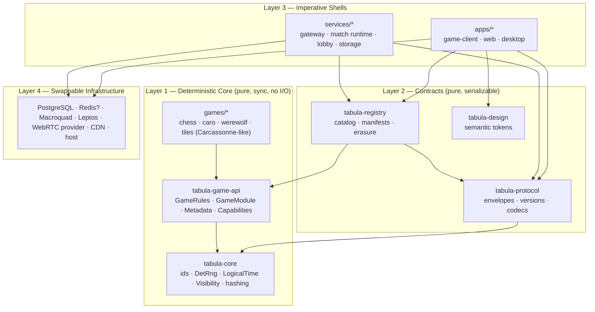
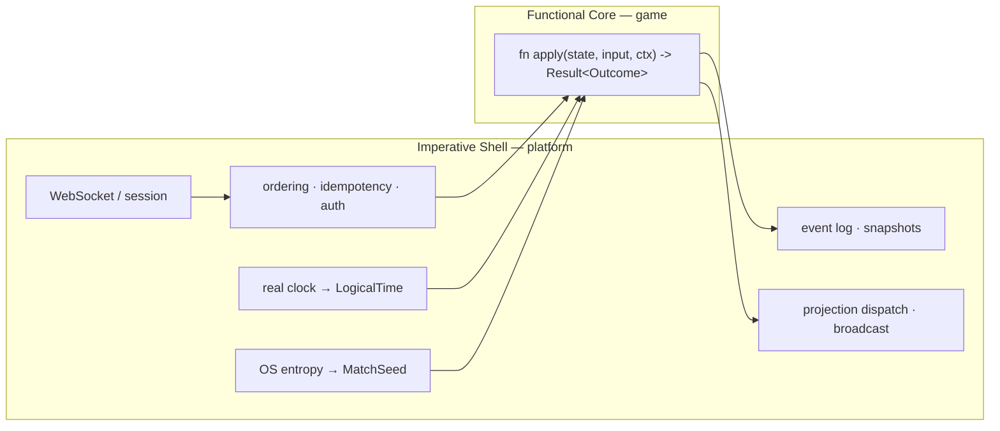
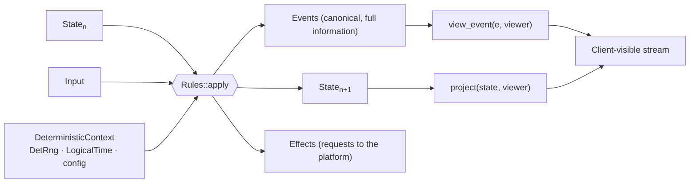
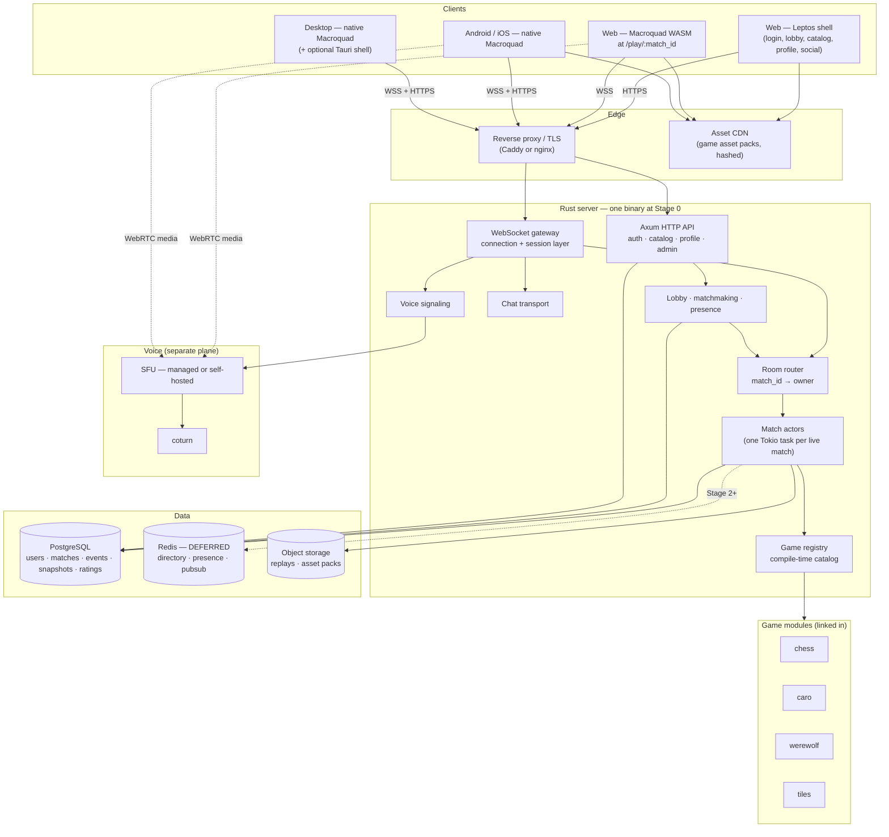
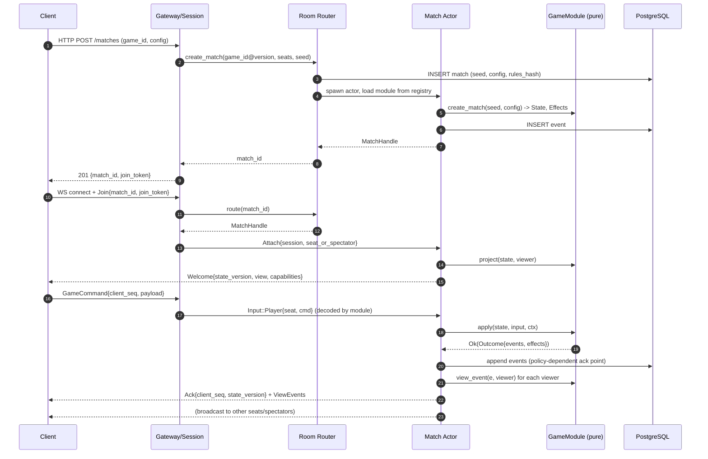
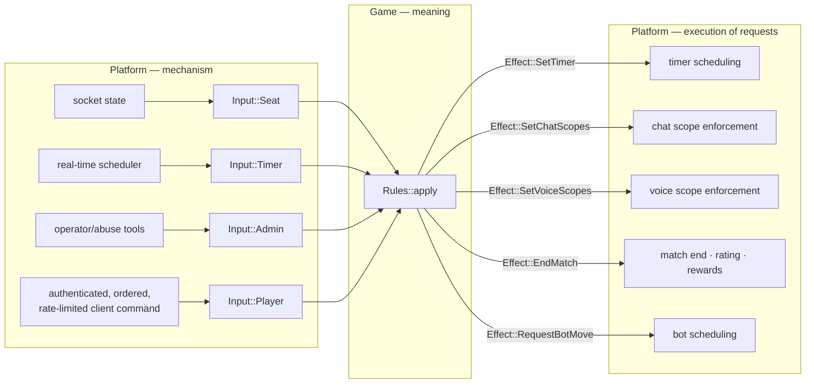
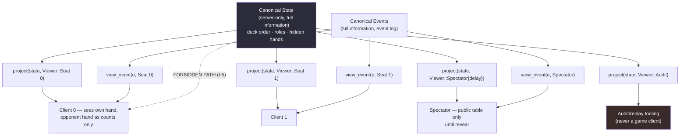

# 00 — Architecture Principles

> **Read this document first.** Everything else in `docs/architecture/` is downstream of it.
> When another document and this one disagree, this one wins and the other is a bug.

---

## 1. Product thesis

**Tabula is not a game. Tabula is a deterministic, server-authoritative runtime for board games,
plus the SDK, protocol, and clients that make adding a game cheap.**

The commercial and engineering value is in the *repeatability*: the tenth game must cost a
fraction of the first. Everything in this architecture is chosen to make the marginal cost of
game number *n* approach "implement rules + implement presentation + write tests".

Three sentences that should survive contact with reality:

1. A game is a **pure function** from `(state, input, deterministic context)` to
   `(state', events)`. Nothing else.
2. The platform is an **imperative shell** that decides *which* inputs reach that function, in
   *what order*, *who is allowed to see* the results, and how it all survives a crash.
3. Everything that renders, transports, stores, or scales is **replaceable infrastructure**
   around those two facts.

### 1.1 What the reusable product actually is

Ranked by how much value it carries and how expensive it would be to rebuild:

```text
1. Deterministic rules runtime + replay          (the moat)
2. Game module SDK / contract                    (the leverage)
3. Authoritative multiplayer match runtime       (the hard engineering)
4. Player projection / hidden-information model  (the security product)
5. Cross-platform presentation primitives        (the reach)
6. Platform services: identity, lobby, social    (the table stakes)
7. Renderer                                      (a detail, deliberately)
```

The renderer is #7. If someone describes Tabula as "the Macroquad thing", the architecture has
been misunderstood. See doc 09 §1.

### 1.2 Non-goals

Explicitly **not** what we are building:

| Non-goal | Why not |
|---|---|
| A real-time action-game netcode stack | No client prediction, rollback, or interpolation of authoritative state. Board games are low-rate and turn-structured. Commands are tens per minute, not per frame. |
| A general-purpose game engine | No ECS-by-default, no scene graph, no editor, no physics. See ADR-012. |
| A general-purpose UI framework | We build the smallest render-command set that ships four games. See doc 04 §5. |
| A custom WebRTC SFU | Buy or self-host proven software. See doc 04 §11. |
| An untrusted third-party plugin marketplace (now) | Phase C only. See doc 02 §9. |
| A distributed system (now) | Modular monolith with preserved seams. See ADR-015 and doc 06. |
| Cross-game shared game state | Games are isolated by construction. Cross-game features live in platform services (ratings, currency, achievements) and talk to games only via published events. |
| Server-side rendering of gameplay | The server never rasterizes. It emits projections. |

---

## 2. The four layers



**Dependency arrows only ever point down.** Layer 1 knows nothing about Layer 3 or 4. This is
not a style preference; it is enforced in CI (§8.2).

---

## 3. Functional core, imperative shell



The shell does all the lying, guessing, waiting, retrying, and failing. The core does none of it.

| Property | Functional core | Imperative shell |
|---|---|---|
| Deterministic | Required | Not required |
| `async` | Forbidden | Expected |
| Allocations | Allowed, but no I/O | Anything |
| Time source | `LogicalTime` argument only | `tokio::time`, `SystemTime` |
| Randomness | `DetRng` argument only | `OsRng` (to make seeds) |
| Failure mode | `Result<_, RuleError>` — total function, never panics on hostile input | May return 5xx, may retry, may drop |
| Testability | Unit + property + replay, no runtime | Integration tests, needs Postgres |

### 3.1 The single-input-stream principle

The most important structural decision in the whole platform (ADR-003):

> **Everything that can change a match is one input, in one totally ordered stream, appended to
> one log.** Player commands, timer expiries, seat lifecycle changes, and admin actions are all
> `Input` variants. There is no second channel by which state mutates.

```rust
pub enum Input<C> {
    /// A player (or bot occupying a seat) issued a game command.
    Player { seat: SeatId, command: C },
    /// A timer the game itself requested has expired.
    Timer { timer: TimerId },
    /// The platform observed a seat lifecycle change and is informing the game.
    Seat { seat: SeatId, change: SeatChange },
    /// Operator/system action (cancel, force-end, pause, resume).
    Admin(AdminInput),
}
```

Consequences, all of which we want:

- **Replay is trivial and total.** Replaying the input stream from a snapshot reproduces state
  exactly, including timeouts and disconnect handling. Nothing "happened outside the log".
- **Disconnect/AFK/pause ownership becomes clean.** The platform decides *when* a seat is
  considered disconnected (it owns sockets). The game decides *what that means* (chess starts
  burning the clock; werewolf auto-abstains; Carcassonne does nothing because turns are async).
  See §6.3.
- **Timers are deterministic.** The game asks for a timer at logical time *T*; the shell fires it
  by wall clock but records it as an input at *T*. Replay uses the recorded *T*.
- **Bots need no special path.** A bot is a seat whose commands are produced by a function of the
  seat's *projection*. It enters through `Input::Player` like anyone else (§6.5).

### 3.2 What the shell must never do

- Never mutate game state directly. Only `apply` mutates state.
- Never read game state to make a platform decision. It reads *projections* and *capabilities*.
- Never branch on `game_id`. See I-9.

---

## 4. Server-authoritative philosophy

**Assume every client is hostile, including the official one.** A client is a rendering surface
and an input device. It has no authority.

The server is the sole authority for:

```text
legality of every command      deck shuffles and draws        dice / any RNG
hidden roles and hidden hands  clock/timer expiry             match outcome
rating changes                 turn order and phase           who may spectate
who may speak to whom          seat ownership                 rewards / currency
```

The client is authoritative for exactly one thing: **its own presentation.** Animation
progress, camera position, hover state, local sound volume, and drag-in-flight are client-local
and never travel upstream as state.

### 4.1 Optimistic local echo is allowed; local authority is not

Clients may run a *preview* of a command to make the UI feel instant (e.g. show the piece on the
target square before the ack). Rules for this:

- The preview is computed from the **projection**, never from canonical state (the client does
  not have canonical state).
- The preview is a separate, clearly-typed value (`PendingCommand`), never written into the
  authoritative view struct.
- On ack, the projection replaces the preview. On rejection, the preview is discarded and the
  UI plays the `invalid-action` motion token (doc 04 §9.4).
- If a game's rules cannot be safely previewed client-side (hidden information affects legality),
  the game declares `capabilities.client_preview = false` and the client shows a spinner instead.

### 4.2 The projection is a security boundary, not a bandwidth optimization

`project(state, viewer) -> View` is the single place where a player's *authorized* view of the
world is computed. If a secret can be derived from what a client receives, the projection is
broken and that is a **security defect**, not a gameplay bug. It gets its own test category
(doc 02 §7, doc 05 §9.3) and its own diagram (§9.4 below).

---

## 5. The deterministic game model



### 5.1 Determinism contract

The canonical invariant:

```text
same initial state (from the same MatchSeed and MatchConfig)
+ same ordered input sequence
+ same rules version
=================================================================
byte-identical final state, identical event sequence, identical state hashes
```

This must hold **across**: process restarts, machines, OS, architecture (x86-64 and aarch64),
native and WASM, debug and release builds.

Practical consequences that must be respected by every game crate:

| Hazard | Rule |
|---|---|
| `HashMap` iteration order | Forbidden in rules where order is observable. Use `BTreeMap`/`Vec`, or sort before iterating. Enforced by lint + review. |
| Floating point | Avoid in canonical state and in any comparison that determines outcome. Use integers/fixed-point. If unavoidable, document and pin the operation order; never use `f32::sin`/transcendentals (platform-dependent). |
| Wall clock | Forbidden. `LogicalTime` only (I-3). |
| `rand::thread_rng`, `getrandom` | Forbidden in rules. `DetRng` only (I-4). |
| `std::collections::hash_map::RandomState` | Forbidden. |
| Pointer/address-derived values | Forbidden in state or hashing. |
| Iteration over `HashSet` | Forbidden as above. |
| Parallelism inside rules | Forbidden unless the reduction is order-independent and proven so by test. |
| Serialization instability | State hash is computed over a **canonical encoding** (doc 05 §7), not over `Debug` or `serde_json`. |

### 5.2 Deterministic RNG

- One `MatchSeed` (32 bytes) is generated **server-side** from OS entropy at match creation and
  stored in the match record. It is never sent to any client while it could reveal future
  hidden information.
- `DetRng` is a counter-based/stream cipher PRNG (ChaCha8) seeded by
  `derive(MatchSeed, domain, input_index)`, so a given input always draws from the same stream
  position regardless of how many draws earlier inputs made.
- Rules receive `&mut DetRng` inside the context and may draw freely. The **number** of draws is
  part of determinism only within one input's application, not across the match — this is why
  per-input domain separation matters.
- Games must never derive randomness from state hashes, time, or player input entropy.

### 5.3 Replay is a first-class product feature, not a debugging tool

Replay powers: spectator catch-up, reconnect, anti-cheat audit, bug reproduction, game-balance
analytics, "watch your last match", and migration validation. It is therefore load-bearing and
tested continuously (doc 05 §8).

---

## 6. Platform vs game ownership

This section exists to make ownership arguments impossible. If a concern is not listed, add it
here in a PR before implementing it.

### 6.1 Platform owns

```text
identity · accounts · auth · sessions · tokens
WebSocket connection lifecycle · heartbeat · backpressure · rate limiting
match creation authorization · seat assignment · seat ownership
match discovery · room directory · matchmaking · queues
connection→match routing · match placement · ownership leases
command ordering · sequence validation · idempotency · state versioning
event log persistence · snapshot scheduling · recovery
projection dispatch · broadcast fan-out
presence · friends · party/lobby · invitations
chat transport · chat moderation · profanity/abuse tooling
voice signaling · voice room lifecycle (not audio mixing)
asset delivery · asset manifests · CDN · client cache
game package registry · version resolution · enable/disable · rollout
telemetry · tracing · metrics · audit logs
ratings/ladder computation (from game-published outcome events)
```

### 6.2 Game module owns

```text
initial state construction (from MatchSeed + MatchConfig)
which commands exist and what they mean
legality of every command
turn order · phases · phase transitions
which timers exist, their durations, and what expiry does
scoring · win/loss/draw determination
what information is secret and to whom  (the projection)
what each event looks like to each viewer (the redaction)
RNG usage (deck shuffles, dice, role assignment)
game-specific chat scoping rules (e.g. dead players see but do not speak)
whether a seat may be replaced by a bot mid-match, and by what bot
whether the match can continue with a seat absent
```

### 6.3 The contested list — resolved

Every one of these is a **split**: the platform owns the *mechanism*, the game owns the *meaning*.
The mechanism reaches the game as an `Input`, and the game responds through `Effect`s.

| Concern | Platform decides | Game decides | Contract carrier |
|---|---|---|---|
| **Time limits** | Real-time scheduling; converting wall clock to `LogicalTime`; firing at the right moment; surviving restart | That a timer exists, its id, duration, and consequence of expiry | `Effect::SetTimer{id, delay}` / `Input::Timer` |
| **AFK** | Detecting no-input-for-*N*, no-socket-traffic-for-*N*; emitting the signal | Whether AFK forfeits, auto-passes, auto-abstains, or is ignored | `Input::Seat{change: Idle}` |
| **Disconnect** | Socket state, grace window length policy per capability, reconnect token validity | Whether the match pauses, the clock keeps running, a bot takes over, or nothing happens | `Input::Seat{change: Disconnected/Reconnected}` |
| **Player replacement / bot takeover** | Authorization, who may substitute, seat re-binding, bot process/task | Whether substitution is legal at this point, and which bot difficulty is acceptable | `capabilities.substitution` + `Input::Seat{change: OccupantChanged}` |
| **Spectator rules** | Who is allowed to attach as spectator (friends-only, ranked embargo, muting) | What a spectator can *see* — `Viewer::Spectator` projection, including delay | `project(state, Viewer::Spectator{..})` + `capabilities.spectators` |
| **Bots** | Scheduling bot turns, resource limits, bot identity/labeling, rate | Bot policy implementation; that it consumes only a projection | `GameBot` trait (doc 02 §6) |
| **Match cancellation** | Operator/abuse cancellation, infra-failure cancellation, refunding | Rules-driven cancellation (e.g. "not enough players joined by phase start") | `Input::Admin(Cancel)` inbound / `Effect::EndMatch{reason}` outbound |
| **Forfeit** | Recording the outcome, rating effects, penalty policy | Whether forfeit is legal now and its effect on the game state/score | `Input::Player{command: <game's own resign>}` or `Input::Seat{change: Forfeited}` |
| **Pause** | Whether pausing is permitted at all (ranked: no), authorization, real-time clock suspension | What pausing does to game timers and legality | `Input::Admin(Pause/Resume)` + `capabilities.pausable` |
| **Async turns** | Long-lived match storage, push notifications, TTL/expiry policy | Whether the game is playable asynchronously; per-turn deadlines | `capabilities.async_turns` + `Effect::SetTimer` |
| **Ranked validation** | Rating math, ladder integrity, anti-boost heuristics, seat eligibility | Emitting a trustworthy, structured `Outcome` event | `capabilities.ranked` + `Event → MatchOutcome` |
| **Chat** | Transport, storage, moderation, rate limits, mute | Channel *scoping* (who may read/write which channel in this phase) | `Effect::SetChatScopes(..)` |
| **Voice** | Signaling, rooms, TURN/SFU, mute enforcement | Which voice channels exist per phase and who is in them | `capabilities.voice` + `Effect::SetVoiceScopes(..)` |
| **Rewards/currency** | All of it | Nothing. Games never grant currency. They emit outcome events. | `Event → analytics/economy consumers` |

**Rule of thumb for future arguments:** if answering the question requires a clock, a socket, a
database, or a user account, it is platform. If answering it requires knowing the rules of the
game, it is the game. If it requires both, it is a split with the mechanism on the platform side
and the meaning behind an `Input`/`Effect` pair.

### 6.4 Effects — the game's only way to ask for something

Games cannot call the platform. They *return requests*:

```rust
pub enum Effect {
    SetTimer { id: TimerId, delay: Duration, },
    CancelTimer { id: TimerId },
    EndMatch { outcome: MatchOutcome },
    SetChatScopes(ChatScopes),
    SetVoiceScopes(VoiceScopes),
    RequestBotMove { seat: SeatId, deadline: Duration },
    Notify { audience: Audience, notice: Notice },
    /// Persist an extra durable marker (e.g. "hand 7 complete") for analytics/resume UX.
    Checkpoint { label: CheckpointLabel },
}
```

Effects are returned from `apply`, applied by the shell **after** the state transition is
persisted, and are **idempotent** (re-applying after crash recovery must be safe). See doc 03 §7.

### 6.5 Bots use the projection, always

A bot is not privileged. `GameBot::choose(&View, &mut DetRng) -> Command`. It receives exactly
what a human in that seat receives. Consequences:

- A bot that plays well proves the projection contains enough information to play.
- A bot cannot accidentally become a cheating oracle.
- Bots are testable without a server, and are excellent fuzz drivers (doc 02 §11.3).

---

## 7. Architecture invariants

These are **normative**. Each has an enforcement mechanism. A PR that violates one is rejected
regardless of how convenient it is.

| ID | Invariant | Enforcement |
|---|---|---|
| **I-1** | `tabula-core`, `tabula-game-api`, and every `games/*` crate must not depend (transitively) on `tokio`, `axum`, `sqlx`, `macroquad`, `miniquad`, `wgpu`, `leptos`, `tauri`, `reqwest`, `getrandom`, or `std::time`. | `cargo deny` ban list + `xtask check-deps` walking the resolved graph per crate; CI job `deps` |
| **I-2** | Rules are pure: identical `(state, input, ctx)` yields identical `(state', events, effects)`. | `proptest` determinism harness in `tabula-testkit`, run for every game crate |
| **I-3** | No wall-clock access in rules. Time enters only as `LogicalTime`. | I-1 dep ban (`std::time` via clippy `disallowed_types`), plus review |
| **I-4** | All randomness in rules comes from the `DetRng` in the context. | I-1 dep ban + clippy `disallowed_methods` |
| **I-5** | Clients never receive canonical state. Only `View` (projection) and `ViewEvent`. | Type-level: the broadcast path only accepts `ViewEvent`/`View`; canonical `State` is not `Serialize`-exposed on the wire. Protocol test asserts no `State` type appears in `ServerMessage`. |
| **I-6** | Every client-visible event passes through `view_event(event, viewer, state_after)`. | Single code path in `tabula-match`; test `no_event_bypasses_redaction` |
| **I-7** | `state_version` increases by exactly 1 per successfully applied input, and never otherwise. | Assertion in the match actor + property test |
| **I-8** | Replaying the event log from any snapshot reproduces the same `state_hash` at every recorded checkpoint. | `tabula-testkit` replay runner; nightly job over sampled production replays |
| **I-9** | No platform crate or service contains a branch on a specific `game_id`. | `xtask check-no-game-ids` (grep for known ids + `#[deny]` lint on a marker); registry is the only lookup mechanism |
| **I-10** | Presentation/animation state never flows back into canonical state. | Dependency direction (`tabula-presentation` depends on view types, never the reverse) + no client→server message carries animation state |
| **I-11** | Game modules never perform I/O, spawn tasks, or hold handles to platform services. | I-1 + `#![forbid(unsafe_code)]` + no `async fn` in `GameRules` (trait is sync) |
| **I-12** | Client-side rule evaluation exists only as non-authoritative preview and is structurally separated (`PendingCommand`). | Review + client architecture test (doc 04 §4.3) |
| **I-13** | Any change to a wire type requires a protocol version bump and a compatibility test. | `tabula-protocol` golden-vector tests; CI fails if vectors change without a version bump |
| **I-14** | One match has exactly one owning task/process at any instant (single-writer). | Match actor design + ownership lease (doc 03 §20) |
| **I-15** | `leptos` never appears in the dependency tree of `apps/game-client` (native or WASM). | `xtask check-deps` |
| **I-16** | Game state and events are versioned and migratable; a stored replay from version *v* is either replayable or explicitly marked unreplayable. | `GameModule::migrate` + replay compatibility matrix (doc 05 §10) |

### 7.1 On breaking an invariant

If an invariant genuinely blocks the product, the process is: write an ADR that supersedes the
relevant one, state what enforcement changes, update this table, and update the enforcement code
**in the same PR**. Silent exceptions are how platforms rot.

---

## 8. Dependency rules

### 8.1 The matrix

Rows are consumers, columns are what they are permitted to depend on.
`Y` = allowed, `—` = forbidden, `f` = allowed only behind a non-default cargo feature.

| Consumer ↓ / Dependency → | tabula-core | game-api | protocol | registry | design | presentation | assets | match | storage | tokio | axum | sqlx | macroquad | leptos |
|---|---|---|---|---|---|---|---|---|---|---|---|---|---|---|
| `tabula-core` | – | — | — | — | — | — | — | — | — | — | — | — | — | — |
| `tabula-game-api` | Y | – | — | — | — | — | — | — | — | — | — | — | — | — |
| `tabula-protocol` | Y | — | – | — | — | — | — | — | — | — | — | — | — | — |
| `tabula-registry` | Y | Y | Y | – | — | — | — | — | — | — | — | — | — | — |
| `games/*` (rules half) | Y | Y | — | — | — | — | — | — | — | — | — | — | — | — |
| `games/*` (presentation half) | Y | Y | — | — | Y | Y | Y | — | — | — | — | — | — | — |
| `tabula-design` | Y | — | — | — | – | — | — | — | — | — | — | — | — | f |
| `tabula-presentation` | Y | Y | — | — | Y | – | Y | — | — | — | — | — | — | — |
| `tabula-assets` | Y | — | Y | — | — | — | – | — | — | f | — | — | — | — |
| `renderer-macroquad` | Y | — | — | — | Y | Y | Y | — | — | — | — | — | Y | — |
| `tabula-net-client` | Y | — | Y | Y | — | — | — | — | — | Y | — | — | — | — |
| `tabula-match` | Y | Y | Y | Y | — | — | — | – | — | Y | — | — | — | — |
| `tabula-lobby` | Y | — | Y | Y | — | — | — | Y | — | Y | — | — | — | — |
| `tabula-storage` | Y | Y | Y | — | — | — | — | — | – | Y | — | Y | — | — |
| `services/tabula-server` | Y | — | Y | Y | — | — | — | Y | Y | Y | Y | Y | — | — |
| `apps/game-client` | Y | Y | Y | Y | Y | Y | Y | — | — | f | — | — | Y | — |
| `apps/web` (Leptos) | Y | — | Y | Y | Y | — | Y | — | — | — | — | — | — | Y |
| `apps/desktop` (Tauri) | Y | — | Y | Y | Y | — | Y | — | — | Y | — | — | — | — |

Notes on the interesting cells:

- **`games/*` split in two.** A game crate has a rules half and a presentation half. They are
  separated by cargo features within one crate (`default = ["rules"]`, `presentation = [...]`) or,
  if a game's presentation grows large, by two crates (`tabula-game-chess`,
  `tabula-game-chess-ui`). The rules half must be buildable with zero presentation deps — the
  server compiles it that way. **LOCK NOW.**
- **`tabula-design` may touch Leptos only behind a feature** — and only for the CSS-variable
  emitter/adapter, never for token definitions.
- **`apps/game-client` may use tokio only behind a feature**, for the native build's networking;
  the WASM build uses browser WebSocket via `tabula-net-client`'s wasm backend.
- **`tabula-storage` is the only crate allowed to know SQL exists.** Ports (traits) live in
  `tabula-match`/`tabula-lobby`; the implementations live here. This is the seam that makes
  "swap Postgres deployment model" and "add a read replica" non-invasive.
- **Nothing depends on `services/*`.** Services are leaves (binaries).

### 8.2 CI enforcement

```text
xtask check-deps        → parses cargo metadata, asserts the matrix above (table is codegen'd
                          from a single deps.toml so docs and CI cannot drift)
cargo deny check bans   → global ban list (openssl, chrono default features, duplicate versions)
xtask check-no-game-ids → forbids known game id literals in crates/ and services/
cargo clippy -D warnings with workspace lints:
      disallowed_types   = [std::time::SystemTime, std::time::Instant,
                            std::collections::HashMap (in rules crates), HashSet (ditto)]
      disallowed_methods = [rand::thread_rng, rand::random, std::time::*]
cargo nextest run       → unit + property + replay
xtask check-protocol    → golden wire vectors, version-bump gate
```

The `deps.toml` → matrix codegen matters: an architecture rule that lives only in prose is a rule
that will be broken within two months.

---

## 9. Key diagrams

### 9.1 Overall system architecture



### 9.2 Match lifecycle and who owns each step



### 9.3 The Input / Effect boundary



### 9.4 Player projection / security model



Rules for this boundary:

1. `Viewer::Audit` exists for replay/support tooling and is **never** reachable from a game client
   session. It is authorized by an internal role, and access is logged.
2. `Viewer::Spectator` may carry a delay for ranked/tournament play; the game decides what a
   delayed spectator sees, the platform enforces the delay by buffering.
3. If a projection needs to hide something *and* prove something later (e.g. "the shuffle really
   was fair"), a commitment technique is available: publish `hash(secret || salt)` at match start
   and reveal at match end. Verifiable, no secret leaked. **Not an active experiment** — it was
   scoped for the now-removed Tiến Lên reference game (doc 09 §3.2); no game in the current
   portfolio (chess, caro, tiles, werewolf) needs it. The technique remains available if a future
   game's threat model requires it.

---

## 10. ADR register

Short-form ADRs. Each: decision, status, why, and the trigger that would make us revisit.
Longer discussion lives in the linked document.

| ADR | Decision | Status | Why | Reconsider when |
|---|---|---|---|---|
| **001** | Rust for the deterministic core, protocol, server, and clients. JS/Kotlin/Swift only for platform glue. | LOCK NOW | One language for rules shared between server, client, bots, and tests is the single largest cost saving in the design. | Never for the core. Glue languages are already permitted. |
| **002** | Game rules are a pure, sync, deterministic function; canonical state depends on nothing but `tabula-core`. | LOCK NOW | Enables replay, server validation, bots, audit, property testing — all from one property. | Never. This is the product. |
| **003** | A single totally-ordered `Input` stream per match (player/timer/seat/admin), appended to one event log. | LOCK NOW | Makes replay total, disconnect/AFK ownership clean, and timers deterministic. See §3.1. | Never; extending `Input` with new variants is normal evolution. |
| **004** | Server-authoritative. Clients get projections, never canonical state. | LOCK NOW | Anti-cheat is not retrofittable. | Never. |
| **005** | `project()` and `view_event()` are the security boundary and are the only paths to a client. | LOCK NOW | Concentrates all information-leak risk in two reviewable functions per game. | Never. |
| **006** | One Tokio task + `mpsc` mailbox per live match. No actor framework. | LOCK NOW (mechanism) / EXPERIMENT (sharded executor at scale) | Gives single-writer ordering with ~zero abstraction cost; frameworks add supervision we do not yet need. | If live-match count per process exceeds ~50k tasks, or we need cross-node supervision — then evaluate a sharded executor (doc 03 §13). |
| **007** | Games are compile-time-registered Rust crates (Phase A). No dynamic loading initially. | LOCK NOW for Phase A | Type safety, one build, no ABI, no sandbox. Dynamic loading is a distribution problem we do not have yet. | Phase B when first-party games need independent deploy cadence; Phase C when third parties exist. Doc 02 §9. |
| **008** | Wire payloads for game commands/events are **opaque bytes tagged by `(game_id, game_version)`**, decoded to concrete Rust types inside the module. | LOCK NOW | Platform routes without knowing games (I-9); games stay strongly typed. Avoids a mega-enum (§12). | Never; the encoding inside the bytes may change. |
| **009** | Dual codec: **Postcard** on the wire in production, **JSON** for debug/dev, chosen by WebSocket subprotocol negotiation. | LOCK NOW (dual-codec design) / EXPERIMENT (Postcard vs alternatives) | Postcard is compact, fast, `serde`-native, no schema compiler. JSON keeps traffic inspectable, which materially affects developer velocity. | If we need cross-language third-party game servers, or schema evolution pain exceeds the tooling cost — then reconsider Protobuf/flatbuffers for the *game payload only*. Doc 05 §3. |
| **010** | Macroquad is the first renderer, behind a `Renderer` trait fed by a `RenderList`. | LOCK NOW (abstraction) / EXPERIMENT (Macroquad's ceiling) | Fastest path to all four platforms with one Rust codebase. | Move to Miniquad when Macroquad blocks needed control (custom pipelines, render targets, text shaping); wgpu only when Miniquad blocks us. Doc 04 §6. |
| **011** | Leptos for application UI; Macroquad WASM for gameplay; **separate WASM binaries**, shared Rust crates, not shared WASM memory. | LOCK NOW | Avoids fighting two runtimes for the canvas/DOM/event loop; keeps the app shell fast and the game binary small. | If a game must be embedded inside a DOM-heavy page with tight interleaving — then experiment with a single-binary integration. Doc 04 §3. |
| **012** | No ECS as the primary architecture. Deterministic state machine + presentation layer. | LOCK NOW | Board-game state is small, highly structured, and rule-heavy; ECS optimizes for the wrong thing and harms determinism/readability. | If a game legitimately needs thousands of independently-simulated entities, that single game may use an ECS *internally* in its presentation half. |
| **013** | PostgreSQL as the only datastore at Stage 0; event log + periodic snapshots as the durability model. | LOCK NOW | One store, transactional, well understood, replay-friendly. | Doc 06 gives the measurable triggers for adding Redis/object storage/read replicas. |
| **014** | Redis is not in the MVP. | DEFER | Nothing needs cross-process coordination yet; adding it early creates a second source of truth. | Introduce when >1 match-owning process exists AND directory lookup p95 > 5 ms or presence fan-out saturates Postgres. Doc 06 §4.3. |
| **015** | Modular monolith: one repo, one workspace, few binaries, strong crate boundaries. | LOCK NOW | A solo/small team cannot afford distributed-systems overhead; crate boundaries preserve the split seams. | Split a service out when its scaling curve or deploy cadence genuinely diverges. Doc 06 §7. |
| **016** | Voice is a separate plane: WebRTC + Opus, coturn, managed/proven SFU behind a `VoiceService` trait. | LOCK NOW (separation + trait) / EXPERIMENT (provider) | Media traffic must never share the game WebSocket's ordering or backpressure characteristics. | Provider choice is measured in Phase 8. Never write our own SFU for MVP. |
| **017** | Assets ship as versioned, hashed **asset packs** per game, delivered from CDN and cached locally; not bundled into app releases. | LOCK NOW | Otherwise every app release grows with every game — fatal for mobile. Doc 04 §12. | Small games may inline a tiny pack; the mechanism stays. |
| **018** | Design tokens are defined once in Rust (`tabula-design`) and adapted to CSS variables (Leptos) and a `Theme` struct (Macroquad). | SUPERSEDED by ADR-027 (representation only) | One semantic language across DOM and canvas is the only way the product feels like one product. | See ADR-027; the semantic-authority intent remains locked. |
| **019** | Tauri is optional and never required for gameplay on any platform. | LOCK NOW | Gameplay must not depend on a WebView. Tauri earns its place only for launcher/updater/native integration. | Evaluate Tauri desktop in Phase 5, Tauri mobile shell no earlier than Phase 6 exit. |
| **020** | No Kubernetes, Kafka, NATS, service mesh, or microservices before a measured need. | LOCK NOW | Each adds an operational tax that a small team pays daily and benefits from rarely. | Doc 06 lists the specific symptom for each. |
| **021** | Rules crates are `#![forbid(unsafe_code)]`; state hashing uses a canonical encoding, not `serde_json`. | LOCK NOW | Determinism and audit integrity. Doc 05 §7. | Never. |
| **022** | The chat *transport* is platform; chat *scoping* is game-driven via `Effect::SetChatScopes`. | LOCK NOW | Werewolf makes scoping a core rule; chess makes it trivial. One mechanism serves both. | Never. |
| **023** | Matchmaking is a platform service consuming only `GameCapabilities` + seat requirements; it never reads game state. | LOCK NOW | Keeps matchmaking generic across all games. Doc 03 §15. | Game-specific matchmaking hints may be added as declarative capability fields, never as code. |
| **024** | Ratings are computed by the platform from game-emitted `MatchOutcome` events. Games never compute ratings. | LOCK NOW | Ladder integrity must be uniform across games. | Never. |
| **025** | `tabula-testkit` is a first-class crate; every game crate must pass its conformance suite. | LOCK NOW | Determinism and projection safety cannot be checked by review alone. Doc 02 §11. | Never. |
| **026** | The deterministic rules kernel: `&mut State` reducer kept; `state_hash` takes a typed `RulesVersion`, not a `&str` tag; `DetRng` derivation pinned with committed stability vectors; a rejected input is a total no-op (R8). Long form: [`docs/adr/0026-deterministic-rules-kernel.md`](../adr/0026-deterministic-rules-kernel.md). | LOCK NOW | Resolves three places where docs 02 and 05 specified the state hash differently, and pins the algorithms doc 09 §4 freezes forever. | The `&mut` reducer is revisited only if the mechanical R2 check proves insufficient in practice; the frozen algorithms need a superseding ADR plus an `ENCODING_VERSION` bump. |
| **027** | One semantic design-token authority: `tokens.toml` is authored; `tabula-design` is the generated typed Rust runtime; CSS and JSON are generated adapters. Long form: [`docs/adr/0027-authored-design-token-source.md`](../adr/0027-authored-design-token-source.md). | LOCK NOW | Resolves ADR-018's source-of-truth ambiguity without weakening the shared DOM/canvas semantic contract. | A different authored format requires a new superseding ADR preserving typed validation and deterministic adapters. |

---

## 11. Decision classification

The master register with rationale lives in [doc 09 §3](./09-synthesis-and-decision-register.md).
Summary:

### LOCK NOW — structural, code may depend on these

```text
deterministic pure-function game rules (tabula-core / tabula-game-api)
single ordered Input stream + append-only event log
server-authoritative validation
project() / view_event() as the security boundary
renderer-independent canonical state and presentation contract
platform never branches on game_id (registry-only dispatch)
opaque tagged game payloads on the wire
one Tokio task per match, single-writer
PostgreSQL as the only Stage-0 datastore
one repo / one workspace / modular monolith
one authored design-token contract (`tokens.toml`), generated into a typed Rust runtime and adapters (ADR-027)
voice on a separate plane behind a trait
asset packs are per-game, versioned, hashed
Rust-first
```

### EXPERIMENT — direction chosen, details to be measured

```text
Postcard vs alternative game-payload encodings (measure size/CPU in Phase 4)
Macroquad's practical ceiling for text, layout, and input (Phase 2–3)
Macroquad UI vs a thin custom widget layer on RenderList (Phase 2)
Leptos + Macroquad navigation/handoff UX at /play/:id (Phase 5)
Tauri desktop shell value (Phase 5); Tauri mobile (post-Phase 6)
voice provider: self-hosted SFU vs managed (Phase 8)
snapshot cadence and event-log compaction policy (Phase 4, tune with data)
sharded match executor vs task-per-match at high CCU (Phase 10)
accessibility mirror ("Board Reader") depth (Phase 5)
```

### DEFER — preserve the seam, write no code

```text
Redis                                 wgpu renderer
Kubernetes                            multi-region deployment
Kafka / NATS                          third-party sandboxed WASM game modules
microservice decomposition            cross-game economy / marketplace
custom SFU                            mobile Tauri gameplay
dynamic native plugin loading         gRPC between internal services
ECS-based architecture                server-side ML bots
```

---

## 12. Failure modes we are structurally preventing

Each row names a way this project could fail, and the *mechanism* (not the intention) that stops it.

| Failure mode | Why it is fatal | Mechanical prevention |
|---|---|---|
| Game rules importing Macroquad | Rules become unrunnable on the server, in tests, and in bots. Determinism dies. | I-1 dependency ban, checked in CI per crate |
| Server importing chess-specific logic | Every new game then requires editing the server. Marginal cost never drops. | I-9 + registry-only dispatch + `xtask check-no-game-ids` |
| One universal `GameState` mega-enum | Every game change recompiles and re-versions every other game; the enum becomes a merge-conflict monument and leaks all games into all crates. | ADR-008: opaque tagged payloads; the platform holds `Box<dyn ErasedGame>`, never a state enum |
| Broadcasting canonical state | Instant total loss of hidden information; unfixable after launch. | I-5: the broadcast API accepts only `ViewEvent`/`View`; canonical `State` has no wire representation |
| Animation state treated as authoritative | Desyncs, cheats via slow clients, non-replayable matches. | I-10: dependency direction + no upstream message carries presentation state |
| Client determining RNG results | Trivial cheating in every card/dice game. | I-4 + server-only `MatchSeed`; clients receive results, never seeds |
| Leptos required inside the native game runtime | Native/mobile builds break or bloat; two UI paradigms fight. | I-15 dependency check on `apps/game-client` |
| Tauri mandatory for mobile | WebView performance and input latency become the gameplay ceiling. | ADR-019 + mobile target is native Macroquad from Phase 6 |
| Redis before horizontal coordination exists | A second source of truth with no consistency story, plus an ops burden. | ADR-014 + a written numeric trigger (doc 06 §4.3) |
| Kafka/NATS with no measured need | Weeks of plumbing for a problem we do not have. | ADR-020 + trigger list |
| Kubernetes for initial deployment | Days of yak-shaving per week for a single-binary product. | ADR-020; Stage 0–1 is systemd/containers on one or two VPS (doc 06 §3) |
| Microservice-per-feature | N deploys, N failure modes, distributed transactions, for one developer. | ADR-015 + services are added only with a written scaling trigger |
| Premature dynamic plugin system | ABI/versioning/sandbox complexity before we have a single shipped game. | ADR-007 phased A→B→C, with Phase C explicitly forbidden from influencing Phase A APIs |
| Building a custom rendering engine during MVP | Six months of engine work, zero games shipped. | `RenderList` is deliberately minimal (doc 04 §5.3 lists what stays Macroquad-specific) |
| Building a custom WebRTC SFU during MVP | Media engineering is a company, not a feature. | ADR-016 + `VoiceService` trait |
| Building a giant generic UI framework before one game ships | The classic Rust-gamedev death spiral. | Doc 04 §5.4: the MVP render-command set is capped; additions require a shipped-game justification |
| Determinism rot (silent) | Replays fail months later; anti-cheat evidence becomes worthless. | I-2/I-8 + nightly replay job over sampled real matches + state hashes in the log |
| Protocol drift between client and server | Users on old clients get silent corruption. | I-13 golden vectors + handshake version negotiation (doc 05 §5) |
| The docs drifting from the code | Future agents re-derive the architecture and diverge. | `deps.toml` codegen for §8.1; ADR supersession process (§7.1); doc 07 phase exit criteria include doc updates |

---

## 13. Glossary

| Term | Meaning |
|---|---|
| **Match** | One instance of one game being played. The unit of ownership, ordering, and persistence. |
| **Room** | The lobby-level container that may create or hold matches (a rematch series lives in one room). |
| **Seat** | An addressable participant slot in a match (`SeatId`). Occupied by a human, a bot, or empty. Seats are stable; occupants are not. |
| **Occupant** | The user or bot currently bound to a seat. |
| **Viewer** | Who is looking: `Seat(id)`, `Spectator{delay}`, or `Audit`. Input to `project()`. |
| **Input** | The only thing that can change match state. See §3.1. |
| **Command** | A game-defined player intent; one `Input` variant carries it. |
| **Event** | A game-defined, canonical, full-information record of what happened. Stored in the log. |
| **ViewEvent** | The redacted, per-viewer form of an event. The only event form clients receive. |
| **View** | The redacted, per-viewer form of state. The only state form clients receive. |
| **Effect** | A request from the game to the platform (set a timer, end the match, set chat scopes). |
| **Projection** | `project(state, viewer) -> View`. The security boundary. |
| **`state_version`** | Monotonic per-match counter, +1 per applied input. Used for reconnect, idempotency, and ordering. |
| **`MatchSeed`** | 32 server-generated bytes; the root of all match randomness. |
| **`LogicalTime`** | Milliseconds since match start, as recorded in the log. The only time rules can see. |
| **`DetRng`** | Deterministic, domain-separated PRNG derived from `MatchSeed`. |
| **Snapshot** | A serialized canonical state at a known `state_version`, used to bound replay cost. |
| **Rules hash** | Hash identifying the exact rules build that produced a match, stored per match for replay validity. |
| **Game module** | A crate implementing `GameModule`: metadata, capabilities, rules, projection, presentation, bots, tests. |
| **Asset pack** | Versioned, hashed bundle of a game's textures/audio/fonts, delivered separately from app binaries. |
| **Projection test** | A test asserting no secret appears in any non-authorized viewer's `View`/`ViewEvent`. |

---

**Next:** [`01-stack-and-repository-plan.md`](./01-stack-and-repository-plan.md)
