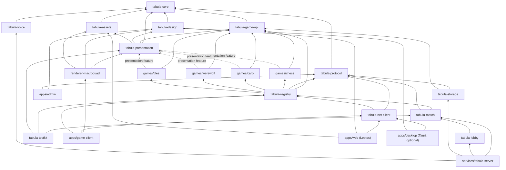
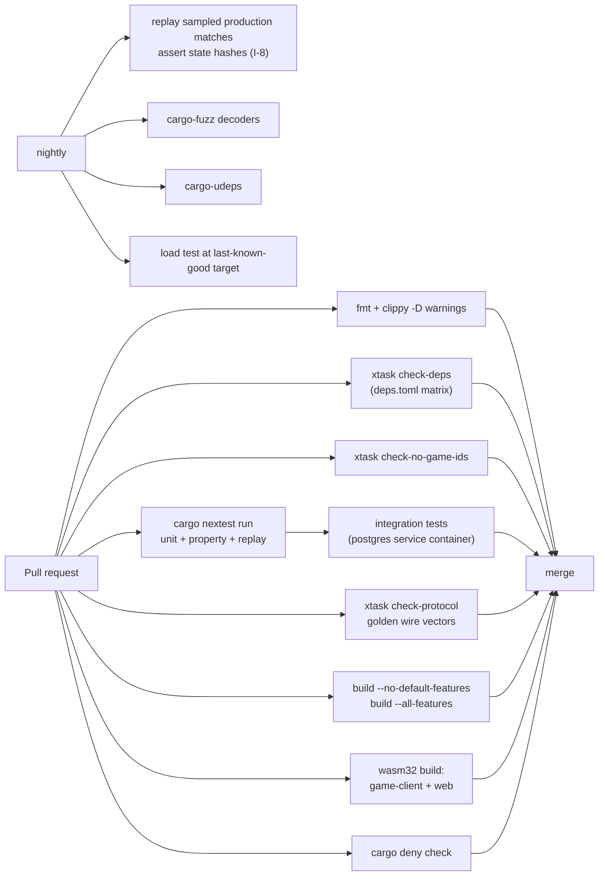

# 01 — Stack and Repository Plan

> Prerequisite: [`00-architecture-principles.md`](./00-architecture-principles.md).
> This document is normative for **what may be added to `Cargo.toml`** and **where code lives**.

---

## 1. Stack decisions

Format for every row: **Recommended** / Alternative / Why recommended / Reconsider when.
Status markers per [doc 00 §11](./00-architecture-principles.md#11-decision-classification).

### 1.1 Deterministic core

| Concern | Recommended | Alternative | Why | Reconsider when | Status |
|---|---|---|---|---|---|
| Language | Rust 2021 edition, stable toolchain, pinned via `rust-toolchain.toml` | — | Shared rules across server/client/bots/tests | Never | LOCK NOW |
| Serialization traits | `serde` (derive) | `rkyv`, hand-written | Universal, works with Postcard + JSON + everything else | If zero-copy state loading becomes a snapshot bottleneck (unlikely at board-game sizes) | LOCK NOW |
| Deterministic RNG | `rand_chacha::ChaCha8Rng` seeded from `MatchSeed`, wrapped in `DetRng` | `rand_pcg`, custom xoshiro | Cryptographic-quality stream, stable algorithm across versions and platforms, cheap; ChaCha8 is fast enough for board games | If profiling shows RNG cost material (it will not) | LOCK NOW |
| Canonical hashing | `blake3` over canonical Postcard encoding | SHA-256, xxHash | Fast, stable, 32-byte output, no platform variance | Never for correctness; algorithm change requires a hash-version field | LOCK NOW |
| Ordered collections in rules | `BTreeMap` / `BTreeSet` / `Vec` | `IndexMap` | Deterministic iteration by construction | `IndexMap` is acceptable if insertion-order semantics are explicitly the rule; must be documented per use | LOCK NOW |
| Small ids | `newtype`s over `u32`/`u16` + `Copy` | `Uuid` everywhere | Compact state, fast comparison, deterministic; `Uuid` only at platform boundaries | Never | LOCK NOW |
| Fixed-point math | `i32`/`i64` scaled integers where fractional scoring is needed | `f64` | Float determinism across arch/WASM is not guaranteed for all ops | Never in canonical state | LOCK NOW |
| Error handling in rules | `thiserror` enums, total functions, no panics on hostile input | `anyhow` | Rejections are data the protocol must carry to the client | Never — `anyhow` is fine in shells | LOCK NOW |

### 1.2 Backend

| Concern | Recommended | Alternative | Why | Reconsider when | Status |
|---|---|---|---|---|---|
| Async runtime | `tokio` (multi-thread) | `async-std`, `smol` | Ecosystem gravity: axum, sqlx, tonic, tracing all assume it | Never | LOCK NOW |
| HTTP + WS server | `axum` + `tower` (+ `tower-http` for tracing/CORS/compression) | `actix-web`, `poem` | Tower middleware model, tokio-native, `axum::extract::ws` is adequate; minimal magic | If we need HTTP/3 or per-connection tuning axum blocks | LOCK NOW |
| WebSocket framing | `axum`'s `WebSocketUpgrade` (tungstenite under the hood), binary frames | raw `tokio-tungstenite`, WebTransport | Simplest path; binary frames carry Postcard | WebTransport/QUIC when browser support and measured head-of-line-blocking pain justify it (DEFER) | LOCK NOW |
| Database | PostgreSQL 16+ | SQLite (dev only), MySQL, CockroachDB | Transactions, `JSONB`, partitioning, `LISTEN/NOTIFY`, excellent Rust support | Doc 06 covers replicas/partitioning; engine change is not anticipated | LOCK NOW |
| DB access | `sqlx` with **compile-time-checked queries** (offline mode, committed `.sqlx/`) | `diesel`, `sea-orm` | Async-native, plain SQL (important for the event-log access patterns), no ORM abstraction to fight | If macro compile times become painful, fall back to `sqlx::query` with hand-mapped rows in hot files | LOCK NOW |
| Migrations | `sqlx migrate` (plain SQL files in `migrations/`) | refinery, atlas | One tool, versioned in repo, runs in CI and at boot behind a flag | Never | LOCK NOW |
| Connection pooling | `sqlx::PgPool`, size tuned per doc 06 §6 | pgbouncer | Sufficient until multiple processes multiply pools; then add pgbouncer in transaction mode | When total app connections approach Postgres `max_connections` (doc 06 §4.3) | LOCK NOW |
| Wire codec (prod) | `postcard` | `bincode`, `rmp-serde`, Protobuf | Compact, `serde`-native, no schema compiler, `no_std`-friendly | See ADR-009 trigger | LOCK NOW (dual codec) / EXPERIMENT (choice) |
| Wire codec (debug) | `serde_json` | CBOR diagnostic | Human-inspectable in browser devtools and `websocat` | Never remove; it is a developer-experience requirement | LOCK NOW |
| Auth | Own email+password (`argon2id`) and OAuth (Google/Apple) via `openidconnect`; sessions as opaque server-side tokens; short-lived signed match tokens (`jsonwebtoken`, HS256 → later EdDSA) | Auth0/Clerk, pure JWT sessions | Opaque sessions are revocable; signed match tokens are stateless where statelessness matters (the WS join path) | If self-hosting OAuth becomes a burden, a managed IdP fits behind the same `IdentityProvider` port | LOCK NOW |
| Rate limiting | `tower-governor` for HTTP; per-session token bucket in the gateway for WS | Redis-backed limiter | In-process is correct at Stage 0–1; the interface allows a shared backend later | When multiple gateway processes need shared limits (doc 06 §4.3) | LOCK NOW |
| Background jobs | Postgres-backed queue (`SELECT ... FOR UPDATE SKIP LOCKED`) inside the server binary | `apalis`, sidekiq-style, Kafka | We have Postgres and few jobs (rating recompute, replay compaction, asset GC) | When job volume or isolation demands a separate worker binary — a small step, seam preserved | LOCK NOW |
| Observability | `tracing` + `tracing-subscriber` + `opentelemetry` (OTLP) + `metrics` exposed as Prometheus | Datadog agent, raw logs | Span-per-command tracing is the debugging tool for a match runtime | Doc 06 §9 | LOCK NOW |
| Config | `figment` or `config` reading TOML + env overrides; typed struct; fail fast at boot | env-only | Typed config with one boot-time validation prevents whole classes of production surprises | Never | LOCK NOW |

### 1.3 Client, renderer, and web

| Concern | Recommended | Alternative | Why | Reconsider when | Status |
|---|---|---|---|---|---|
| Game renderer | `macroquad` | `miniquad` (one layer down), `winit`+`wgpu` | Single Rust codebase to web/desktop/Android/iOS with the least ceremony; good enough 2D | Miniquad when Macroquad blocks needed control (render targets, custom pipelines, text shaping, input edge cases); wgpu only when Miniquad blocks us. Doc 04 §6.3 | LOCK NOW (first renderer) |
| Renderer abstraction | `RenderList` command buffer + `Renderer` trait in `tabula-presentation` | Direct Macroquad calls in game code | Keeps games renderer-independent at a cost of one indirection per frame | Never remove; the command set may grow (doc 04 §5.4) | LOCK NOW |
| Web app UI | `leptos` (CSR first; SSR/islands later if SEO matters) | Yew, Dioxus, plain TS+React | Fine-grained reactivity, mature-enough, shares Rust types with the server; avoids a second language for the shell | If Leptos churn or WASM bundle size becomes a real user-facing problem, a small TS shell is a legitimate fallback — the protocol crate makes it cheap | LOCK NOW |
| Web routing/build | `leptos_router`, `trunk` for the shell; `wasm-bindgen` + `wasm-opt` for the game binary | vite plugin, custom | Two independent bundles, two independent caches | See doc 04 §3.4 for the handoff | LOCK NOW |
| Web gameplay | Macroquad WASM on its own route (`/play/:match_id`), separate `.wasm` | Same-binary integration | ADR-011 | If interleaved DOM overlays become a hard requirement | LOCK NOW / EXPERIMENT (UX of handoff) |
| Desktop | Native Macroquad binary; **optional** Tauri shell for launcher/updater/notifications | Tauri-only, Electron | Gameplay must not sit inside a WebView (ADR-019) | Add Tauri in Phase 5 if updater/launcher value is real | LOCK NOW (optional) |
| Desktop updater | `cargo-dist` + GitHub Releases; Tauri updater if Tauri lands | Sparkle/WinSparkle | Least infra for a small team | When we need staged rollouts/percentage deploys | EXPERIMENT |
| Mobile | Native Macroquad via `cargo-apk`/`cargo-ndk` (Android) and a thin Xcode wrapper (iOS) | Tauri mobile, Flutter host | Direct GPU/input path, no WebView | Tauri mobile only for shell screens, post-Phase 6 | LOCK NOW |
| Client networking | `tabula-net-client`: one API, two backends — `tokio-tungstenite` (native), browser `WebSocket` via `web-sys` (WASM) | separate ad-hoc code per target | The reconnect/sequence/idempotency logic is subtle and must exist once | Never | LOCK NOW |
| Client local storage | Trait `KvStore` with backends: `web-sys` `localStorage`/IndexedDB (web), platform dirs + file (desktop, via `directories`), `SharedPreferences`/`UserDefaults` bridge (mobile) | sled, rusqlite everywhere | Only small data needs persisting (settings, tokens, cached manifests, replay cache index) | If offline replay libraries grow, add a `rusqlite`/IndexedDB-backed blob store behind the same trait | LOCK NOW |
| Audio (SFX/music) | Macroquad's audio for MVP; abstract behind `AudioSink` in `tabula-presentation` | `kira`, `rodio` | Ships fastest; abstraction lets us move to `kira` for mixing/ducking | Move to `kira` when we need buses, ducking under voice chat, or precise scheduling | EXPERIMENT |
| Voice | WebRTC + Opus; `coturn` for TURN; SFU = **managed or proven self-hosted** (LiveKit self-host is the reference candidate) behind `VoiceService` | Custom SFU, mesh-only | Mesh is fine for ≤4; werewolf needs 6–20, which needs an SFU | Provider decided in Phase 8 by measurement | LOCK NOW (separation) / EXPERIMENT (provider) |
| Text rendering | Macroquad's font rendering for MVP; keep all text behind `RenderCmd::Text` with a `TextStyle` token | `fontdue`/`cosmic-text` in a custom path | Text shaping is the most likely Macroquad ceiling; the indirection means we can swap to `cosmic-text` without touching games | When we need complex scripts (Arabic/Devanagari), rich text, or precise line-breaking | EXPERIMENT |

### 1.4 Testing and tooling

| Concern | Recommended | Alternative | Why | Status |
|---|---|---|---|---|
| Test runner | `cargo-nextest` | `cargo test` | Parallelism, per-test isolation, better output, retries for flaky integration tests | LOCK NOW |
| Property testing | `proptest` | `quickcheck` | Shrinking quality; strategy composition suits game state generators | LOCK NOW |
| Replay/conformance harness | `tabula-testkit` (ours) | ad-hoc per game | The determinism invariant must be tested identically for every game | LOCK NOW |
| Snapshot/golden tests | `insta` | hand-rolled | Protocol vectors, projection outputs, `RenderList` goldens | LOCK NOW |
| Integration DB | `sqlx::test` with per-test transactional databases; `testcontainers` in CI | shared dev DB | Deterministic, parallel-safe | LOCK NOW |
| Load testing | Custom Rust load generator in `tests/load/` driving real WS sessions with scripted games | k6, Gatling | Must speak our binary protocol and our game commands; a Rust harness reuses the client crate | LOCK NOW |
| Browser smoke tests | `wasm-bindgen-test` for unit-level; Playwright for the shell + a scripted match | Selenium | Catches WASM-only breakage (panics, missing features) | LOCK NOW |
| Fuzzing | `cargo-fuzz` on protocol decoders and command decoders | AFL | Decoders face hostile input directly | LOCK NOW (from Phase 4) |
| Lint/format | `rustfmt` (default + `imports_granularity=Crate`), `clippy -D warnings`, workspace `[lints]` | — | Consistency without debate | LOCK NOW |
| Dep hygiene | `cargo-deny` (bans, licenses, advisories), `cargo-udeps` in nightly CI | manual review | Enforces I-1 and license posture | LOCK NOW |
| Repo automation | `xtask` crate (pure Rust, no `make`) + optional `just` for humans | Makefile, shell scripts | Cross-platform, typed, testable | LOCK NOW |
| CI | GitHub Actions with a matrix: `check-deps`, `fmt+clippy`, `nextest`, `wasm-build`, `protocol-vectors`, `replay-nightly` | — | Cheap to start, adequate for years | LOCK NOW |

---

## 2. Repository structure

One repository. One Cargo workspace. Few binaries. Strong crate boundaries. (ADR-015)

### 2.1 Name mapping from the source research

| Research name | This repo |
|---|---|
| `boardgame-core` | `tabula-core` |
| `boardgame-protocol` | `tabula-protocol` |
| `boardgame-presentation` | `tabula-presentation` |
| `boardgame-design` / `boardgame-design-tokens` | `tabula-design` |
| `boardgame-assets` | `tabula-assets` |
| `boardgame-storage` | `tabula-storage` |
| `boardgame-game-api` | `tabula-game-api` |
| `renderer-macroquad` | `renderer-macroquad` (unchanged) |
| `voice-api` | `tabula-voice` |
| *(new)* | `tabula-registry`, `tabula-match`, `tabula-lobby`, `tabula-net-client`, `tabula-testkit` |

### 2.2 Target tree

```text
tabula/
├── Cargo.toml                     # workspace root: members, shared deps, lints, profiles
├── rust-toolchain.toml
├── deny.toml                      # cargo-deny bans (enforces I-1 partially)
├── deps.toml                      # SOURCE OF TRUTH for the dependency matrix (doc 00 §8.1)
├── justfile
├── .sqlx/                         # committed offline query metadata
├── docs/
│   ├── architecture/              # these documents
│   ├── adr/                       # long-form ADRs when a short-form row is insufficient
│   └── games/                     # per-game design notes (rules, balance, art direction)
│
├── crates/
│   ├── tabula-core/               # deterministic kernel — no deps beyond serde/rand_chacha/blake3
│   ├── tabula-game-api/           # GameRules, GameModule, Metadata, Capabilities, Effect, Viewer
│   ├── tabula-protocol/           # wire envelopes, versions, codecs, error codes
│   ├── tabula-registry/           # compile-time catalog, manifests, ErasedGame, version resolution
│   ├── tabula-match/              # match actor, mailbox, command pipeline, snapshot policy, ports
│   ├── tabula-lobby/              # rooms, matchmaking, presence (domain + ports)
│   ├── tabula-storage/            # sqlx/Postgres implementations of the ports; migrations
│   ├── tabula-presentation/       # View → RenderList, input model, animation, layout
│   ├── tabula-design/             # semantic tokens + theme; css/macroquad adapters (features)
│   ├── renderer-macroquad/        # Renderer impl for RenderList
│   ├── tabula-assets/             # asset manifests, resolution, cache, loader ports
│   ├── tabula-net-client/         # client session: connect, resume, sequence, codec negotiation
│   ├── tabula-voice/              # VoiceService trait + provider adapters (features)
│   └── tabula-testkit/            # determinism/replay/projection conformance harness, fakes
│
├── games/
│   ├── chess/                     # tabula-game-chess      (Game A — doc 08)
│   ├── caro/                      # tabula-game-caro       (Game B — doc 08)
│   ├── tiles/                     # tabula-game-tiles      (Game C — Carcassonne-like)
│   ├── werewolf/                  # tabula-game-werewolf   (Game D)
│   └── tictactoe/                 # tabula-game-tictactoe  (internal SDK smoke test / template — not a reference game)
│
├── apps/
│   ├── game-client/               # Macroquad binary: native (desktop/mobile) + wasm target
│   ├── web/                       # Leptos application shell (CSR)
│   ├── desktop/                   # OPTIONAL Tauri shell (Phase 5+); not required for gameplay
│   └── admin/                     # operator UI (Leptos, reuses design tokens) — Phase 5+
│
├── services/
│   └── tabula-server/             # THE binary at Stage 0: HTTP + WS + match runtime + lobby
│                                  # Splits later into gateway / match-worker (doc 06 §7)
│
├── mobile/
│   ├── android/                   # gradle wrapper around the cdylib
│   └── ios/                       # Xcode project wrapping the staticlib
│
├── xtask/                         # check-deps, check-no-game-ids, gen-tokens, gen-protocol-vectors
├── deploy/
│   ├── compose/                   # docker-compose for local dev (postgres, coturn, otel-collector)
│   ├── systemd/                   # Stage 0–1 unit files
│   └── terraform/                 # optional, Stage 2+
├── assets/
│   ├── brand/                     # logo, shared fonts, shared icons
│   └── packs/                     # per-game source assets + pack build scripts
└── tests/
    ├── integration/               # server + Postgres + real WS, multi-client scenarios
    ├── load/                      # Rust load generator
    └── replays/                   # committed golden replays per game (determinism regression)
```

### 2.3 Challenges to the structure proposed in the brief

The source outline listed `services/{gateway, game-server, matchmaking, ...}` as separate
services from day one. **Rejected for Stage 0.** Reasons:

1. Matchmaking, lobby, and match runtime all need the same room directory. As separate processes
   at Stage 0 that directory becomes a distributed-consensus problem for zero benefit.
2. Three binaries triple deploy, config, tracing-context, and local-dev complexity for one
   developer.
3. The split we will actually want later is **gateway ↔ match-worker** (connection fan-out scales
   differently from CPU-bound match application). Matchmaking as a separate service is a much later
   need. Doc 06 §7 specifies both splits and their triggers.

So: **one `tabula-server` binary composed of library crates that already have the right seams.**
The crates are the boundary; the process count is a deployment decision.

Also rejected: a separate `boardgame-game-api` **and** `boardgame-core` **and** a registry crate
being three crates was questioned — but kept, because `tabula-core` is depended on by the protocol
and presentation layers which must *not* see the `GameModule` trait, and the registry pulls in
concrete game crates which `tabula-game-api` must never do (it would create a cycle: games depend
on game-api).

---

## 3. Crate catalog

For each crate: responsibility, allowed deps, forbidden deps, why separate, when it could merge.

### `tabula-core` — the deterministic kernel

- **Responsibility:** `MatchId`, `SeatId`, `UserId`, `Viewer`, `LogicalTime`, `Duration` (logical),
  `MatchSeed`, `DetRng`, `StateHash`, canonical encoding helpers, `Audience`, `Visibility`,
  small deterministic containers, `SeatChange`, `MatchOutcome`, `RuleError`.
- **Allowed:** `serde`, `rand_chacha`, `blake3`, `postcard` (for canonical encoding only),
  `thiserror`, `smallvec`. Nothing else without an ADR.
- **Forbidden:** everything in I-1. No `std::time`, no `HashMap` in public API.
- **Why separate:** it is the one crate the entire product depends on; keeping it tiny and
  dependency-free is what makes rules portable to WASM, mobile, tests, and bots.
- **Merge:** never.

### `tabula-game-api` — the game contract

- **Responsibility:** `GameRules`, `GameModule`, `GameMetadata`, `GameCapabilities`, `Input`,
  `Outcome`, `Effect`, `Snapshot`, `ProjectionError`, `GameBot`, `GameDescriptor` (a11y),
  `MatchConfig` schema types. No implementations.
- **Allowed:** `tabula-core`, `serde`, `thiserror`.
- **Forbidden:** any concrete game; any runtime; `tabula-protocol` (the contract must not know the
  wire format — the registry bridges them).
- **Why separate:** games depend on it; the registry depends on it; the runtime depends on it.
  If it also depended on the protocol, a protocol change would recompile and re-version every game.
- **Merge:** could merge into `tabula-core` if the trait set stabilizes and the split stops
  earning its keep. Trigger to merge: zero changes to either crate for two consecutive phases and
  no third-party game authors. Low priority.

### `tabula-protocol` — the wire

- **Responsibility:** `ClientMessage`/`ServerMessage` envelopes, `ProtocolVersion`, handshake types,
  `Codec` (postcard/json), error codes, `CorrelationId`, golden vectors.
- **Allowed:** `tabula-core`, `serde`, `postcard`, `serde_json`, `thiserror`.
- **Forbidden:** `tabula-game-api`, any game, `tokio`, `axum`.
- **Why separate:** shared verbatim by server, native client, WASM client, load generator, and any
  future non-Rust client. It must compile on WASM with no runtime.
- **Merge:** never.

### `tabula-registry` — the catalog

- **Responsibility:** the list of built-in games; `ErasedGame` (object-safe adapter over the typed
  `GameModule`); manifest parsing/validation; `game_id@version` resolution; enable/disable flags;
  capability queries for lobby/matchmaking; codec bridging between `tabula-protocol` bytes and
  typed game commands.
- **Allowed:** `tabula-core`, `tabula-game-api`, `tabula-protocol`, every `games/*` rules crate,
  `serde`, `toml`.
- **Forbidden:** `tokio`, `axum`, `sqlx`, any renderer.
- **Why separate:** it is the **only** crate that knows the set of games. That containment is what
  makes I-9 checkable: platform crates depend on the registry's *interface*, not on games.
- **Merge:** never (merging it into the server binary would let services see game crates directly).

### `tabula-match` — the authoritative match runtime

- **Responsibility:** `MatchActor` (mailbox loop), command pipeline (auth → seq → decode → apply →
  persist → project → broadcast), `state_version`, idempotency cache, timer wheel driver, snapshot
  policy, reconnect/resume, spectator attach, effect execution, ports:
  `EventLog`, `SnapshotStore`, `MatchRepo`, `Clock`, `BotRunner`, `Broadcast`.
- **Allowed:** `tabula-core`, `tabula-game-api`, `tabula-protocol`, `tabula-registry`, `tokio`,
  `tracing`, `async-trait` (or AFIT), `futures`.
- **Forbidden:** `sqlx`, `axum`, any game crate directly, any renderer.
- **Why separate:** this is the hardest, most correctness-critical async code in the product; it
  must be testable with in-memory fakes and no database and no HTTP server.
- **Merge:** never.

### `tabula-lobby` — rooms, matchmaking, presence

- **Responsibility:** room lifecycle, invitations, seat reservation, queue management, rating-band
  matching, presence tracking, match creation orchestration. Ports: `RoomRepo`, `QueueStore`,
  `PresenceStore`, `RatingRepo`, `MatchLauncher`.
- **Allowed:** `tabula-core`, `tabula-protocol`, `tabula-registry`, `tabula-match` (for
  `MatchLauncher` types), `tokio`, `tracing`.
- **Forbidden:** `sqlx`, `axum`, game crates, `tabula-game-api` (it must reason about
  *capabilities*, not rules).
- **Why separate:** different change cadence and different scaling profile from the match runtime;
  it is also where most product/business logic will accrete, and it must not be able to touch game
  state.
- **Merge:** could start life as a module inside `tabula-match` in Phase 0–1 and be extracted in
  Phase 4. Recommended: create it in Phase 4, not before.

### `tabula-storage` — persistence implementations

- **Responsibility:** `sqlx` implementations of all ports; `migrations/`; batching for event
  appends; snapshot (de)serialization to Postgres or object storage; query modules per aggregate.
- **Allowed:** `sqlx`, `tokio`, `tabula-core`, `tabula-game-api` (for snapshot/event byte types),
  `tabula-protocol`, `tracing`, `uuid`, `time`.
- **Forbidden:** `axum`, game crates, renderers, `tabula-registry`.
- **Why separate:** the only crate allowed to know SQL. Everything above it is testable with
  in-memory fakes, which keeps the test suite fast and the design honest.
- **Merge:** never.

### `tabula-presentation` — renderer-independent presentation

- **Responsibility:** `Presenter` trait, `RenderList`/`RenderCmd`, layout primitives, `InputEvent`
  model (pointer/touch/key/gesture), animation clocks and springs, `Camera`, hit-testing,
  `AudioSink`/`AudioCue`, view-model state machines (selection, drag, hover), a11y mirror
  generation.
- **Allowed:** `tabula-core`, `tabula-game-api` (view types only), `tabula-design`,
  `tabula-assets`, `glam`, `serde`.
- **Forbidden:** `macroquad`, `miniquad`, `wgpu`, `leptos`, `tokio`, anything I/O.
- **Why separate:** this is the crate that makes renderer replacement possible (ADR-010). If games
  drew directly with Macroquad, the renderer decision would be irreversible.
- **Merge:** never.

### `tabula-design` — semantic tokens

- **Responsibility:** the single definition of color/type/shape/space/elevation/motion/state-layer
  tokens; light/dark and high-contrast schemes; `Theme` struct; adapters: CSS custom-property
  emitter (feature `css`), Macroquad-friendly resolved theme (feature `runtime`).
- **Allowed:** `serde`, `palette` (color math) — optional.
- **Forbidden:** `macroquad`, `tokio`; `leptos` only behind feature `leptos-adapter`.
- **Why separate:** consumed by Leptos (web), presentation (canvas), and admin UI; must not drag
  any of them into the others.
- **Merge:** never.

### `renderer-macroquad` — the first backend

- **Responsibility:** execute a `RenderList` with Macroquad; texture/font/atlas management; map
  Macroquad input to `InputEvent`; window/canvas lifecycle; frame pacing; implement `AudioSink`.
- **Allowed:** `macroquad`, `tabula-presentation`, `tabula-design`, `tabula-assets`, `tabula-core`.
- **Forbidden:** any game crate, `tabula-protocol`, `tokio`.
- **Why separate:** it is the designated *replaceable* component. A future `renderer-wgpu` slots in
  with no changes above it.
- **Merge:** never.

### `tabula-assets` — asset packs

- **Responsibility:** pack manifest schema, content hashing, resolution (`AssetRef` → URL/path),
  local cache with integrity check, loader ports (`AssetSource`: HTTP, filesystem, embedded),
  progressive/priority loading, `AssetHandle` lifetimes.
- **Allowed:** `tabula-core`, `serde`, `blake3`, `toml`; `reqwest`/`web-sys` only behind
  per-target features in the *client* feature set.
- **Forbidden:** renderers, game crates, `axum`.
- **Why separate:** shared by client, server (manifest validation, CDN URL signing), and pack build
  tooling in `xtask`.
- **Merge:** never.

### `tabula-net-client` — the client session

- **Responsibility:** connect/handshake/codec negotiation, auth token attach, `client_seq`
  assignment, pending-command tracking, ack/rejection correlation, resume-on-reconnect with
  exponential backoff and jitter, heartbeat, offline queueing policy, event stream to the UI.
  Two transport backends behind one API (native `tokio-tungstenite`, WASM `web-sys::WebSocket`).
- **Allowed:** `tabula-core`, `tabula-protocol`, `tabula-registry` (to decode typed game events),
  `futures`; `tokio` (feature `native`), `web-sys`/`wasm-bindgen`/`gloo-timers` (feature `web`).
- **Forbidden:** renderers, `leptos`, `macroquad`, `sqlx`.
- **Why separate:** reconnect/idempotency logic is subtle, security-relevant, and needed by the
  Leptos shell, the Macroquad client, the load generator, and integration tests.
- **Merge:** never.

### `tabula-voice` — voice abstraction

- **Responsibility:** `VoiceService` trait (`join`, `leave`, `mute`, `set_scopes`, `stats`),
  room/participant identifiers, scope model (who hears whom), provider adapters behind features,
  signaling message types (carried over the platform WS as `PlatformCommand::Voice*`).
- **Allowed:** `tabula-core`, `serde`, `async-trait`; provider SDKs behind features.
- **Forbidden:** game crates, renderers.
- **Why separate:** provider replaceability (ADR-016) and to keep voice out of the game protocol.
- **Merge:** never.

### `tabula-testkit` — conformance harness

- **Responsibility:** determinism harness, replay runner, projection-leak checker, `proptest`
  strategies for `Input` sequences, in-memory `EventLog`/`SnapshotStore`/`Clock` fakes, golden
  replay format reader/writer, bot-driven self-play fuzzer, `RenderList` golden comparison.
- **Allowed:** everything except `axum`/`sqlx` (dev-dependency of game crates and `tabula-match`).
- **Why separate:** so every game crate can `dev-dependencies` it and get the whole invariant suite
  for free — the single biggest DX lever we have (ADR-025).
- **Merge:** never.

### 3.1 Phase-0 minimum vs target

Do **not** create all fifteen crates on day one. Create them when a phase needs them
(doc 07 has the same table keyed by phase):

| Crate | Created in |
|---|---|
| `tabula-core`, `tabula-game-api`, `tabula-testkit` | Phase 0 |
| `games/tictactoe` | Phase 0 |
| `games/chess` | Phase 1 |
| `tabula-design`, `tabula-presentation`, `renderer-macroquad`, `apps/game-client` | Phase 2 |
| `tabula-assets`, `games/caro` | Phase 3 |
| `tabula-protocol`, `tabula-registry`, `tabula-match`, `tabula-storage`, `tabula-net-client`, `services/tabula-server` | Phase 4 |
| `tabula-lobby`, `apps/web`, `apps/admin` | Phase 5 |
| `games/werewolf` | Phase 7 |
| `tabula-voice` | Phase 8 |
| `games/tiles` | Phase 3 (rules) → Phase 9 (full) |
| `apps/desktop` (Tauri) | Phase 5, optional |

Phase 0–3 therefore has **no server, no protocol, no database** — and four crates. That is
deliberate: the determinism and presentation contracts must be right before networking exists,
because networking is much harder to change than to add.

---

## 4. Dependency graph



Read the two important facts off this graph:

1. **Games sit at the bottom-left, touching only `tabula-game-api`.** They cannot reach the
   network, the database, or the renderer. That is I-1 and I-11 made structural.
2. **Everything game-specific funnels through `tabula-registry`.** `tabula-match`,
   `tabula-net-client`, and the server see games only through erased interfaces. That is I-9 made
   structural.

---

## 5. Workspace configuration sketch

```toml
# Cargo.toml (root)
[workspace]
resolver = "2"
members = ["crates/*", "games/*", "apps/*", "services/*", "xtask"]

[workspace.package]
edition      = "2021"
rust-version = "1.82"          # bump deliberately; MSRV is a compatibility promise for game authors
license      = "AGPL-3.0-or-later OR LicenseRef-Commercial"   # decide before first release
repository   = "https://github.com/<org>/tabula"

[workspace.dependencies]
# --- deterministic core tier (allowed in rules crates) ---
serde        = { version = "1", features = ["derive"], default-features = false }
postcard     = { version = "1", features = ["alloc"], default-features = false }
rand_chacha  = { version = "0.3", default-features = false }
rand_core    = { version = "0.6", default-features = false }
blake3       = { version = "1", default-features = false }
thiserror    = "1"
smallvec     = { version = "1", features = ["serde", "union"] }
glam         = { version = "0.29", features = ["serde"] }

# --- shell tier (forbidden in rules crates) ---
tokio        = { version = "1", features = ["rt-multi-thread", "macros", "sync", "time", "signal"] }
axum         = { version = "0.7", features = ["ws", "macros"] }
tower        = "0.5"
tower-http   = { version = "0.6", features = ["trace", "cors", "compression-gzip"] }
sqlx         = { version = "0.8", features = ["runtime-tokio", "postgres", "uuid", "time", "json", "macros", "migrate"] }
tracing      = "0.1"
tracing-subscriber = { version = "0.3", features = ["env-filter", "json"] }
opentelemetry = "0.27"
serde_json   = "1"
uuid         = { version = "1", features = ["v7", "serde"] }

# --- client tier ---
macroquad    = "0.4"
leptos       = { version = "0.7", features = ["csr"] }

[workspace.lints.rust]
unsafe_code           = "forbid"
missing_debug_implementations = "warn"

[workspace.lints.clippy]
all                   = { level = "deny", priority = -1 }
pedantic              = "warn"
# Determinism guards. The rules crates additionally set disallowed_types/methods
# via clippy.toml; see §6.2.
float_arithmetic      = "warn"      # denied in rules crates via crate-level attribute

[profile.release]
lto           = "thin"
codegen-units = 1
panic         = "abort"        # server overrides to "unwind"; see note below
strip         = "debuginfo"

[profile.release.package."tabula-server"]
# Server keeps unwinding so a single panicking match actor cannot kill the process.
# (Set via a dedicated profile or a separate release-server profile; see §5.2.)

[profile.wasm-release]
inherits      = "release"
opt-level     = "z"
lto           = "fat"
```

### 5.1 Feature policy

Rules that keep features from becoming a combinatorial nightmare:

1. **Every crate must build with `--no-default-features` and with `--all-features`.** CI checks both
   for `crates/*` and `games/*`.
2. **Features never change behavior, only availability.** A feature may add an adapter, a backend,
   or an emitter. A feature must never alter game rules, projections, or the wire format.
3. **Game crates use exactly this shape:**
   ```toml
   [features]
   default      = ["rules"]
   rules        = []                                    # pure, server-compatible
   presentation = ["dep:tabula-presentation", "dep:tabula-design", "dep:tabula-assets"]
   bots         = []                                    # bot policies (may be server-side too)
   testkit      = ["dep:tabula-testkit"]
   ```
   The server builds games with `default-features = false, features = ["rules", "bots"]`.
   The client builds them with `features = ["rules", "presentation"]`.
4. **Target-specific deps use `[target.'cfg(...)'.dependencies]`, not features**, wherever the
   choice is determined by the target rather than by the consumer.

### 5.2 Panic policy

- Rules crates: `panic = "abort"` is fine in the client; on the **server** the runtime uses
  `unwind` and each match actor's `apply` call is wrapped in `catch_unwind`. A panicking game
  aborts *that match* with a `MatchFailed` outcome and a captured backtrace, not the process.
  Any such panic is a Sev-2 bug (it violates I-2's totality expectation) and files an alert.
- The wrap boundary lives in `tabula-match`, once. Games never see it.

---

## 6. Toolchain, CI, and enforcement

### 6.1 Pipeline



Target PR wall-clock: **under 10 minutes.** If it grows past that, split the WASM and integration
jobs into a merge-queue-only stage rather than weakening the checks.

### 6.2 `clippy.toml` in rules crates

```toml
# games/*/clippy.toml and crates/tabula-core/clippy.toml
disallowed-types = [
  { path = "std::time::SystemTime",  reason = "I-3: use LogicalTime" },
  { path = "std::time::Instant",     reason = "I-3: use LogicalTime" },
  { path = "std::collections::HashMap", reason = "I-2: nondeterministic iteration; use BTreeMap" },
  { path = "std::collections::HashSet", reason = "I-2: nondeterministic iteration; use BTreeSet" },
]
disallowed-methods = [
  { path = "rand::thread_rng", reason = "I-4: use DetRng from the context" },
  { path = "rand::random",     reason = "I-4: use DetRng from the context" },
]
```

### 6.3 `xtask` commands

| Command | Purpose |
|---|---|
| `xtask check-deps` | Resolve cargo metadata, assert the `deps.toml` matrix, regenerate doc 00 §8.1 table and fail if it differs |
| `xtask check-no-game-ids` | Grep `crates/` + `services/` for game id literals and for `games::` imports outside the registry |
| `xtask gen-tokens` | Emit `apps/web/style/tokens.css` and `crates/tabula-design/src/generated.rs` from the token source |
| `xtask gen-protocol-vectors` | Regenerate golden wire vectors (requires an explicit `--bump` with a version) |
| `xtask pack-assets <game>` | Build, hash, and manifest a game's asset pack |
| `xtask new-game <slug>` | Scaffold a game crate from the template (doc 02 §10) |
| `xtask replay <file> [--diagnose]` | Replay a golden or production replay locally; optionally print evidence-strength diagnostics |
| `xtask db reset` / `db migrate` | Local Postgres lifecycle |

---

## 7. Platform targets

| Target | Triple | Built from | Notes |
|---|---|---|---|
| Web app shell | `wasm32-unknown-unknown` | `apps/web` via `trunk` | CSR; hosted as static files behind the CDN |
| Web gameplay | `wasm32-unknown-unknown` | `apps/game-client` (feature `web`) | Separate bundle, loaded at `/play/:id`; `wasm-opt -Oz` |
| Linux desktop | `x86_64-unknown-linux-gnu`, `aarch64-…` | `apps/game-client` (feature `native`) | AppImage or tarball via `cargo-dist` |
| macOS desktop | `aarch64-apple-darwin`, `x86_64-…` | same | Universal binary; notarization needed for distribution |
| Windows desktop | `x86_64-pc-windows-msvc` | same | Code-signing needed |
| Android | `aarch64-linux-android` (+ `armv7`, `x86_64` for emulators) | `apps/game-client` as `cdylib` → `mobile/android` | `cargo-apk` initially; graduate to `cargo-ndk` + Gradle when we need Play Billing, notifications, or custom `Activity` behavior |
| iOS | `aarch64-apple-ios`, `aarch64-apple-ios-sim` | `apps/game-client` as `staticlib` → `mobile/ios` | Thin Xcode wrapper; `cargo-lipo`-style packaging |
| Server | `x86_64-unknown-linux-gnu` (musl optional) | `services/tabula-server` | Container image; also runs natively via systemd at Stage 0–1 |

**WASM constraints that shape the client design** (do not rediscover these in Phase 5):

- No threads by default; do not depend on `std::thread` in shared client code.
- No blocking I/O; all network access is event-driven (hence `tabula-net-client`'s two backends).
- `Instant::now()` works in browsers via `performance.now()` shims, but it is banned in rules
  anyway (I-3); presentation may use the renderer's frame time.
- Binary size matters: target **< 6 MB gzipped** for the game bundle including one game's code,
  excluding assets. Enforce with a CI size check that fails on a >10% regression.

---

## 8. What NOT to add yet

Adding any of these requires an ADR that names the measurable symptom that forced it.

| Not now | Because | The trigger is documented in |
|---|---|---|
| Redis | No cross-process coordination exists yet | doc 06 §4.3 |
| Kubernetes / Nomad | One or two binaries on one or two hosts | doc 06 §3, §4 |
| Kafka / NATS / RabbitMQ | The event log is Postgres; fan-out is in-process | doc 06 §5.4 |
| gRPC / `tonic` | No internal service-to-service calls exist | doc 06 §7.2 |
| GraphQL | The HTTP API surface is small and shaped by screens | — |
| An ECS (`bevy_ecs`, `hecs`) | ADR-012 | doc 04 §5.5 |
| `bevy` as the engine | Too large a bet; determinism and small-binary goals conflict | ADR-010 |
| `wgpu` / custom renderer | Macroquad → Miniquad escape hatch first | doc 04 §6.3 |
| Dynamic plugin loading (`libloading`) | Phase B/C only | doc 02 §9 |
| WASM sandbox for game modules (`wasmtime`) | Phase C only | doc 02 §9.3 |
| Custom SFU | ADR-016 | doc 04 §11 |
| A second database (Mongo/Cassandra/ClickHouse) | Postgres covers OLTP; analytics goes to object storage + a query engine later | doc 06 §8.3 |
| Multi-region | Single region until measured RTT complaints | doc 06 §5 |
| Server-side rendering of the Leptos app | CSR is fine for an authenticated app; SEO need is limited to marketing pages | doc 04 §3.5 |
| Client-side ML / heavy bots | Simple heuristic bots first | doc 02 §6 |
| Feature-flag service (LaunchDarkly etc.) | A Postgres table plus a cached read is enough | — |
| Microservice split of lobby/matchmaking | ADR-015 | doc 06 §7 |

---

**Next:** [`02-game-module-and-sdk-design.md`](./02-game-module-and-sdk-design.md)
