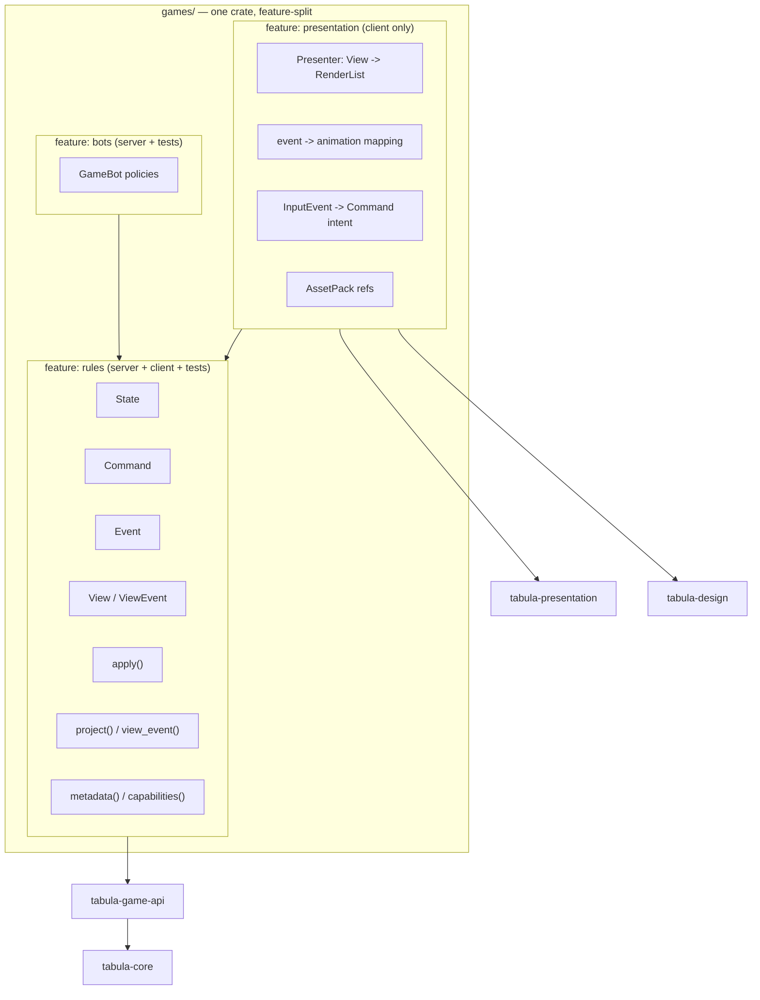
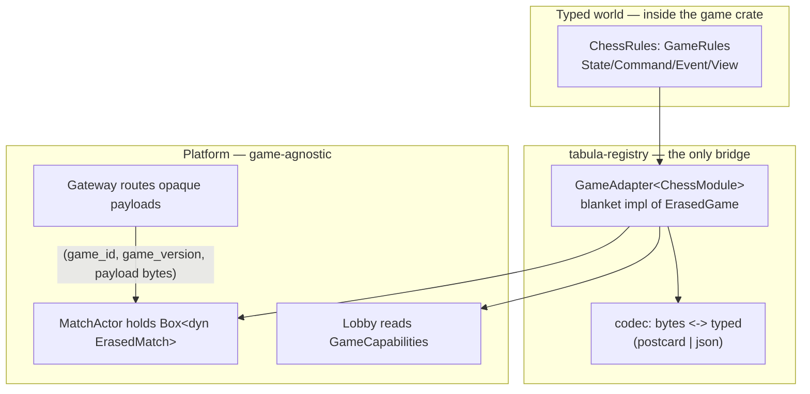
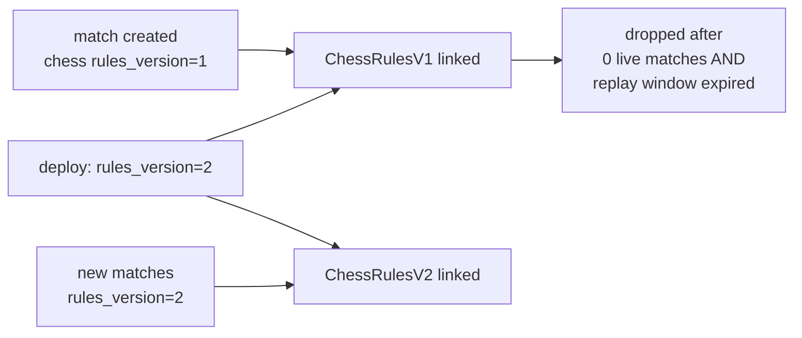
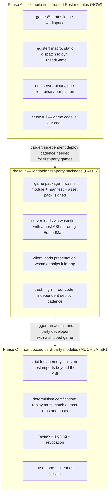

# 02 — Game Module and SDK Design

> Prerequisite: [`00-architecture-principles.md`](./00-architecture-principles.md).
> This is the most important contract in the platform. Changing it changes every game.
> **Status: LOCK NOW** for the shape below; individual field additions are normal evolution.

---

## 1. What a game module is

A game module is a Rust crate that supplies:

```text
GameMetadata      — identity, name, version, players, art direction hooks
GameCapabilities  — declarative facts the platform needs to run it safely
GameRules         — the pure deterministic core (State, Command, Event, View, apply, project)
GameBot           — optional AI policies, consuming projections only
GamePresentation  — optional, client-only: View -> RenderList
AssetPack         — optional, versioned art/audio
Tests             — the tabula-testkit conformance suite (mandatory)
```

It supplies **nothing else**. It has no access to the network, the database, the clock, the OS, or
the renderer's internals.



The feature split is what lets the **server compile a game without a renderer** and the **client
compile a game without a database**. It is not cosmetic; it is I-1 in practice.

---

## 2. Core types (from `tabula-core`)

```rust
// crates/tabula-core/src/ids.rs
#[derive(Copy, Clone, PartialEq, Eq, PartialOrd, Ord, Hash, Debug, Serialize, Deserialize)]
pub struct SeatId(pub u8);           // up to 256 seats; werewolf needs ~20
#[derive(Copy, Clone, PartialEq, Eq, PartialOrd, Ord, Hash, Debug, Serialize, Deserialize)]
pub struct UserId(pub u128);         // UUIDv7 bytes; uuid conversion lives in storage/protocol
#[derive(Copy, Clone, PartialEq, Eq, PartialOrd, Ord, Hash, Debug, Serialize, Deserialize)]
pub struct MatchId(pub u128);
#[derive(Copy, Clone, PartialEq, Eq, PartialOrd, Ord, Debug, Serialize, Deserialize)]
pub struct TimerId(pub u16);         // game-scoped
#[derive(Copy, Clone, PartialEq, Eq, PartialOrd, Ord, Debug, Serialize, Deserialize)]
pub struct StateVersion(pub u64);
#[derive(Copy, Clone, PartialEq, Eq, PartialOrd, Ord, Debug, Serialize, Deserialize)]
pub struct InputIndex(pub u64);      // == position in the input/event log

// crates/tabula-core/src/time.rs
/// Milliseconds since match start, as recorded in the log. The ONLY time rules can see. (I-3)
#[derive(Copy, Clone, PartialEq, Eq, PartialOrd, Ord, Debug, Serialize, Deserialize)]
pub struct LogicalTime(pub u64);
#[derive(Copy, Clone, PartialEq, Eq, PartialOrd, Ord, Debug, Serialize, Deserialize)]
pub struct Millis(pub u64);

// crates/tabula-core/src/rng.rs
#[derive(Clone, Serialize, Deserialize)]
pub struct MatchSeed([u8; 32]);      // server-generated; never sent to clients (I-4)

/// Deterministic RNG. Domain-separated substreams so that adding a draw in one place
/// cannot shift results elsewhere.
pub struct DetRng { inner: rand_chacha::ChaCha8Rng }

impl DetRng {
    /// Root stream for one input application: blake3(seed || b"input" || input_index).
    pub fn for_input(seed: &MatchSeed, index: InputIndex) -> Self;
    /// Independent substream for a named purpose, e.g. DOMAIN_SHUFFLE, DOMAIN_ROLES.
    pub fn stream(&self, domain: u32) -> DetRng;
    pub fn next_u32(&mut self) -> u32;
    pub fn next_u64(&mut self) -> u64;
    /// Uniform in [0, n) with rejection sampling — stable algorithm, do not change.
    pub fn below(&mut self, n: u32) -> u32;
    /// Fisher-Yates, implemented HERE (not via rand::SliceRandom) so the algorithm is pinned.
    pub fn shuffle<T>(&mut self, slice: &mut [T]);
}

// crates/tabula-core/src/viewer.rs
#[derive(Copy, Clone, PartialEq, Eq, Debug, Serialize, Deserialize)]
pub enum Viewer {
    Seat(SeatId),
    Spectator(SpectatorTier),
    /// Support/replay/audit tooling. NEVER reachable from a game client session. (doc 00 §9.4)
    Audit,
}
#[derive(Copy, Clone, PartialEq, Eq, Debug, Serialize, Deserialize)]
pub enum SpectatorTier { Live, Delayed { by: Millis } }

#[derive(Clone, Debug, Serialize, Deserialize)]
pub enum Audience {
    Everyone,
    Seat(SeatId),
    Seats(SmallVec<[SeatId; 8]>),
    Spectators,
    /// Recorded in the log, shown to nobody until a later event reveals it.
    ServerOnly,
}

// crates/tabula-core/src/seat.rs
#[derive(Clone, Debug, Serialize, Deserialize)]
pub struct SeatRoster { pub seats: SmallVec<[SeatEntry; 8]> }
#[derive(Clone, Debug, Serialize, Deserialize)]
pub struct SeatEntry { pub seat: SeatId, pub occupant: Occupant, pub team: Option<u8> }
#[derive(Clone, Debug, Serialize, Deserialize)]
pub enum Occupant { Human(UserId), Bot { level: BotLevel }, Empty }

/// Platform-observed seat lifecycle. The platform decides WHEN; the game decides WHAT IT MEANS.
#[derive(Clone, Debug, Serialize, Deserialize)]
pub enum SeatChange {
    Occupied { by: Occupant },
    Vacated,
    Disconnected,
    Reconnected,
    /// No input for the platform's idle threshold.
    WentIdle,
    BecameActive,
    /// Operator or user-initiated abandonment.
    Abandoned,
    /// Seat handed to a bot (substitution) or from a bot back to a human.
    OccupantChanged { from: Occupant, to: Occupant },
}

// crates/tabula-core/src/outcome.rs
#[derive(Clone, Debug, PartialEq, Eq, Serialize, Deserialize)]
pub struct MatchOutcome {
    pub kind: OutcomeKind,
    /// Full ordering, needed by the rating system. rank 0 = winner; ties share a rank.
    pub standings: SmallVec<[Standing; 8]>,
    /// Free-form, game-defined summary for UI ("checkmate", "3 wolves remain").
    pub summary: CompactString,
}
#[derive(Clone, Debug, PartialEq, Eq, Serialize, Deserialize)]
pub struct Standing { pub seat: SeatId, pub rank: u8, pub score: i64 }
#[derive(Copy, Clone, Debug, PartialEq, Eq, Serialize, Deserialize)]
pub enum OutcomeKind {
    Decisive,
    Draw,
    /// Match ended early and should not count for ratings.
    Aborted { reason: AbortReason },
}
#[derive(Copy, Clone, Debug, PartialEq, Eq, Serialize, Deserialize)]
pub enum AbortReason { NotEnoughPlayers, OperatorCancelled, PlatformFailure, RulesPanic, TimedOutIdle }

// crates/tabula-core/src/hash.rs
#[derive(Copy, Clone, PartialEq, Eq, Debug, Serialize, Deserialize)]
pub struct StateHash(pub [u8; 32]);
/// Canonical encoding = postcard over the type's derived Serialize, with a 2-byte
/// little-endian ENCODING_VERSION prefix.
/// NEVER serde_json (key order, float formatting) and never Debug. (ADR-021)
pub const ENCODING_VERSION: u16 = 1;
pub fn canonical_encode<T: Serialize>(value: &T)  -> Result<Vec<u8>, CanonicalError>;
pub fn canonical_decode<T: DeserializeOwned>(bytes: &[u8]) -> Result<T, CanonicalError>;
/// The rules version is a TYPED parameter, not a free-form &str tag: it is what
/// separates two rules versions of one game, so it must not be omissible. (ADR-026 §2)
pub fn state_hash<T: Serialize>(rules_version: RulesVersion, value: &T) -> StateHash;
```

---

## 3. `GameRules` — the functional core

```rust
// crates/tabula-game-api/src/rules.rs

/// The deterministic heart of a game. Pure, synchronous, total.
///
/// CONTRACT (tested by tabula-testkit, see §11):
///  R1. apply() is deterministic: same (state, input, ctx inputs) => same (state', events, effects).
///  R2. apply() is TRANSACTIONAL: if it returns Err, `state` MUST be byte-identical to before.
///  R3. apply() never panics on any input, including hostile/nonsensical commands.
///  R4. apply() never reads wall-clock time, OS randomness, environment, or files.
///  R5. project() never returns information the viewer is not authorized to know.
///  R6. view_event() is the only path from Event to a client.
///  R7. All iteration that affects output is over ordered collections.
///  R8. A rejected input is a TOTAL no-op: state, state_version, and the RNG stream
///      are all unaffected. Free, because DetRng::for_input(seed, index) derives each
///      input's stream independently — nothing to rewind. (ADR-026 §5)
pub trait GameRules: Sized + Send + Sync + 'static {
    /// Canonical, full-information state. Server-only. Never serialized to a client. (I-5)
    type State: Clone + Serialize + DeserializeOwned + Send + Sync + 'static;
    /// Player intent. Decoded from opaque wire bytes by the module, never by the platform.
    type Command: Clone + Serialize + DeserializeOwned + Send + Sync + 'static;
    /// Canonical record of what happened. Full information. Written to the event log.
    type Event: Clone + Serialize + DeserializeOwned + Send + Sync + 'static;
    /// Per-viewer redacted state. The ONLY state form a client ever sees.
    type View: Clone + Serialize + Send + Sync + 'static;
    /// Per-viewer redacted event.
    type ViewEvent: Clone + Serialize + Send + Sync + 'static;
    /// Match creation options chosen in the lobby (time control, variant, role set...).
    type Config: Clone + Serialize + DeserializeOwned + Default + Send + Sync + 'static;

    /// Bumped whenever State/Event encoding or rule behavior changes. Stored per match.
    const RULES_VERSION: RulesVersion;

    /// Build the initial state. May draw randomness (shuffle, role assignment).
    fn create(
        config: &Self::Config,
        roster: &SeatRoster,
        ctx: &mut Ctx<'_>,
    ) -> Result<Init<Self>, InitError>;

    /// The single mutation entry point for the entire platform.
    fn apply(
        state: &mut Self::State,
        input: Input<Self::Command>,
        ctx: &mut Ctx<'_>,
    ) -> Result<Outcome<Self>, RuleError>;

    /// THE SECURITY BOUNDARY. (doc 00 §4.2)
    fn project(state: &Self::State, viewer: Viewer) -> Self::View;

    /// THE OTHER HALF OF THE SECURITY BOUNDARY.
    /// `None` means this viewer must not learn that this event happened at all.
    fn view_event(
        state_after: &Self::State,
        event: &Self::Event,
        viewer: Viewer,
    ) -> Option<Self::ViewEvent>;

    // ---------- provided methods: override only when useful ----------

    /// Hints for UI affordances and bots. Cheap approximations are fine; legality is still
    /// decided by apply(). Returning Unknown is legal and safe.
    fn legal_commands(_state: &Self::State, _seat: SeatId) -> LegalCommands<Self::Command> {
        LegalCommands::Unknown
    }

    /// Default supplies RULES_VERSION itself, so a game cannot forget the version
    /// separation. Override only for huge states where a structural incremental hash
    /// is worth it — and then the incremental structure must be in the hash too.
    fn state_hash(state: &Self::State) -> StateHash {
        tabula_core::state_hash(Self::RULES_VERSION, state)
    }

    /// Accessibility mirror: a text/tree description of the view for screen readers and
    /// the "Board Reader" fallback. (doc 04 §10.4)
    fn describe(_state: &Self::State, _viewer: Viewer) -> A11yDescription {
        A11yDescription::unsupported()
    }

    /// Load a snapshot written by an older RULES_VERSION. Return
    /// Err(MigrateError::Unsupported) to mark old replays unreplayable rather than lie. (I-16)
    fn migrate(_from: RulesVersion, _bytes: &[u8]) -> Result<Self::State, MigrateError> {
        Err(MigrateError::Unsupported)
    }
}
```

### 3.1 Supporting types

```rust
/// Everything nondeterministic that rules are allowed to see — all of it recorded in the log.
pub struct Ctx<'a> {
    /// Logical time of THIS input, from the log. (I-3)
    pub now: LogicalTime,
    /// Index of this input in the log; also the RNG domain root.
    pub index: InputIndex,
    /// Deterministic randomness. (I-4)
    pub rng: &'a mut DetRng,
    /// Soft budget the runtime will complain about if exceeded (observability, not enforcement).
    pub budget: Budget,
}

/// The single ordered input stream. (doc 00 §3.1, ADR-003)
#[derive(Clone, Debug, Serialize, Deserialize)]
pub enum Input<C> {
    Player { seat: SeatId, command: C },
    Timer { timer: TimerId },
    Seat { seat: SeatId, change: SeatChange },
    Admin(AdminInput),
}

#[derive(Clone, Debug, Serialize, Deserialize)]
pub enum AdminInput { Cancel { reason: AbortReason }, Pause, Resume, ForceEnd { outcome: MatchOutcome } }

pub struct Init<R: GameRules> {
    pub state: R::State,
    pub events: SmallVec<[R::Event; 4]>,
    pub effects: SmallVec<[Effect; 4]>,
}

pub struct Outcome<R: GameRules> {
    /// Canonical events, in order. Appended to the log verbatim.
    pub events: SmallVec<[R::Event; 4]>,
    /// Requests to the platform, executed after persistence. Must be idempotent.
    pub effects: SmallVec<[Effect; 2]>,
}

/// A rejection. Carries a stable code the client can localize, plus optional detail.
#[derive(Clone, Debug, thiserror::Error, Serialize, Deserialize)]
#[error("{code}: {detail}")]
pub struct RuleError {
    pub code: RuleErrorCode,      // NotYourTurn, IllegalMove, WrongPhase, UnknownCommand, ...
    pub detail: CompactString,    // developer-facing; never leaks hidden information
}

pub enum LegalCommands<C> {
    Unknown,
    /// Fully enumerated (chess: all legal moves). Enables UI highlighting and simple bots.
    Enumerated(Vec<C>),
    /// Structured hints when enumeration is too large (tiles: legal positions per rotation).
    Hints(Vec<CommandHint>),
    /// This seat cannot act right now.
    None,
}
```

### 3.2 Why validation is not a separate trait method

The brief's sketch had `validate_command` and `apply_command`. **Rejected.** Two functions that
must agree about legality is a permanent source of divergence bugs: the server validates with one
and mutates with the other, and eventually they disagree — which is exactly the class of bug that
becomes an exploit.

Instead:

- `apply` is the single authority and returns `Result`. Rejection is data (`RuleError`), not a
  panic and not a silent no-op.
- `apply` must be **transactional on error** (contract R2). Enforced by a testkit harness that
  hashes state before/after every rejected input.
- `legal_commands` exists for *UI affordances and bots*, is explicitly allowed to be approximate
  or absent, and is never consulted for authority.

This also makes the client's optional preview honest: it calls the same `apply` against its
projection-derived local model and knows the answer may differ.

### 3.3 Why `apply` takes `&mut State` rather than returning a new state

Carcassonne-style boards and 20-player werewolf states are large enough that
clone-per-command is wasteful, and `&mut` lets games use incremental structures (score graphs,
zobrist hashes). Purity is preserved by contract + tests rather than by types. The runtime keeps
the *previous snapshot* for recovery, not a per-command copy.

In debug/test builds `tabula-testkit` wraps `apply` with a clone-and-compare so a violation of R2
fails loudly. In release, the match actor relies on the invariant and, if `apply` returns `Err`,
marks the match state "suspect" only if a cheap sentinel (state_version + a fast hash in debug)
indicates mutation.

---

## 4. `GameModule`, metadata, and capabilities

`GameRules` is the maths. `GameModule` is the package.

```rust
// crates/tabula-game-api/src/module.rs

pub trait GameModule: Send + Sync + 'static {
    type Rules: GameRules;

    fn metadata() -> &'static GameMetadata;
    fn capabilities() -> &'static GameCapabilities;

    /// Optional bot policies. Server-side; consumes projections only. (§6)
    fn bot(_level: BotLevel) -> Option<Box<dyn GameBot<Self::Rules>>> { None }

    /// Validate and normalize a lobby-supplied config before match creation.
    /// The platform calls this so bad configs fail at creation, not mid-match.
    fn validate_config(
        cfg: &<Self::Rules as GameRules>::Config,
        roster: &SeatRoster,
    ) -> Result<(), ConfigError>;
}
```

Client-side presentation is a **separate trait in a separate crate** so the server never links it:

```rust
// crates/tabula-presentation/src/game.rs   (client only)
pub trait GamePresentation: Send + 'static {
    type Rules: GameRules;
    type Local: Default;                                   // selection, drag, camera, animations

    fn asset_pack() -> AssetPackRef;
    fn present(view: &<Self::Rules as GameRules>::View, local: &Self::Local, frame: &FrameCtx)
        -> RenderList;
    fn on_view_event(ev: &<Self::Rules as GameRules>::ViewEvent, local: &mut Self::Local,
        frame: &FrameCtx);
    fn on_input(input: &InputEvent, view: &<Self::Rules as GameRules>::View,
        local: &mut Self::Local) -> Option<Intent<<Self::Rules as GameRules>::Command>>;
    fn a11y(view: &<Self::Rules as GameRules>::View) -> A11yDescription;
}
```

### 4.1 `GameMetadata`

Identity and presentation-neutral description. Everything here is safe to show in a catalog.

```rust
pub struct GameMetadata {
    pub id: GameId,                       // reverse-DNS: "com.tabula.chess"
    pub version: GameVersion,             // semver of the module
    pub rules_version: RulesVersion,      // bumped on any state/behavior change
    /// i18n keys, not literals — the catalog is localized by the shell.
    pub name_key: &'static str,
    pub tagline_key: &'static str,
    pub description_key: &'static str,
    pub categories: &'static [Category],  // Abstract, Cards, SocialDeduction, TilePlacement, Party
    pub tags: &'static [&'static str],
    pub estimated_minutes: (u16, u16),
    pub complexity: Complexity,           // Light, Medium, Heavy
    pub content_rating: ContentRating,    // drives voice/chat defaults and age gating
    pub icon: AssetRef,
    pub hero: AssetRef,
    pub rules_url_key: Option<&'static str>,
}
```

### 4.2 `GameCapabilities`

**This is the most over-designable type in the platform.** The discipline: *every field must be
consumed by a named platform subsystem, today or in a named phase.* If nothing consumes it, it does
not exist. §5 is the table that enforces this.

```rust
pub struct GameCapabilities {
    pub seats: SeatSpec,
    pub turn_model: TurnModel,
    pub hidden_information: bool,
    pub spectators: SpectatorPolicy,
    pub chat: ChatPolicy,
    pub voice: VoiceRequirement,
    pub ranked: RankedSupport,
    pub async_turns: AsyncTurnPolicy,
    pub reconnect: ReconnectPolicy,
    pub substitution: SubstitutionPolicy,
    pub pausable: bool,
    pub durability: Durability,
    pub client_preview: bool,
    pub state_size: StateSizeClass,
    pub apply_budget: Budget,
    pub max_match_duration: Option<Millis>,
}

pub struct SeatSpec {
    pub min: u8,
    pub max: u8,
    /// Some counts may be illegal in between (werewolf role sets).
    pub allowed: SeatCounts,          // Range | Exact(&[u8])
    pub teams: Option<TeamSpec>,
    pub fill_with_bots: bool,
    /// Seats are symmetric (cards) or asymmetric (chess white/black) — affects matchmaking fairness.
    pub symmetric: bool,
}

pub enum TurnModel {
    /// Exactly one seat may act at a time; the platform can show a clear "your turn" affordance.
    StrictSequential,
    /// Many seats act in the same window (werewolf night, simultaneous bidding).
    Simultaneous,
    /// Phase-driven; who may act depends on the phase.
    Phased,
    /// Anyone may act any time (party games).
    FreeForm,
}

pub enum SpectatorPolicy {
    Forbidden,
    Live,
    Delayed { by: Millis },
    /// The game's project(Spectator) decides; platform allows attach.
    GameControlled,
}

pub struct ChatPolicy {
    /// Channels the game knows about. Platform creates transport for these.
    pub channels: &'static [ChatChannelSpec],
    /// If true, the game will send Effect::SetChatScopes and the platform must enforce it.
    pub game_scoped: bool,
}
pub struct ChatChannelSpec { pub key: &'static str, pub kind: ChatKind }  // Table, Team, Dead, Whisper

pub enum VoiceRequirement { No, Optional, Recommended }

pub enum RankedSupport { No, Yes { rating: RatingKind } }
pub enum RatingKind { Elo, Glicko2, TeamElo, Placement }   // platform-implemented, game-selected

pub struct AsyncTurnPolicy {
    pub supported: bool,
    /// If async, how long a seat may sit on a turn before the platform emits WentIdle.
    pub turn_deadline: Option<Millis>,
    /// Total match TTL for async matches.
    pub match_ttl: Option<Millis>,
}

pub struct ReconnectPolicy {
    /// How long the platform holds the seat before emitting Abandoned.
    pub grace: Millis,
    /// Does the game want Disconnected/Reconnected inputs at all?
    pub notify_rules: bool,
}

pub enum SubstitutionPolicy { Forbidden, BotOnly { levels: &'static [BotLevel] }, HumanOrBot }

/// When does the server ack the player's command?
pub enum Durability {
    /// Ack after apply; events persisted asynchronously. Lower latency, tiny loss window.
    AckAfterApply,
    /// Ack only after the event log commit. Required for ranked and for anything with stakes.
    AckAfterPersist,
}

pub enum StateSizeClass { Tiny, Small, Medium, Large }  // drives snapshot cadence (doc 03 §9)

pub struct Budget { pub max_apply_micros: u32, pub max_events_per_input: u16 }
```

### 4.3 Manifest file

Every game crate carries `game.toml`, which is the catalog manifest. Today
`xtask check-manifests` validates its schema independently from compiled
`GameMetadata`/`GameCapabilities`; it does **not** cross-check the two forms yet. Two
representations exist because ops needs to read and diff capabilities without compiling, and
because Phase B/C packages ship a manifest without our source. A generated manifest boundary is
the deferred mechanism for making the manifest the single source of truth.

```toml
# games/chess/game.toml
id            = "com.tabula.chess"
version       = "1.0.0"
rules_version = 1
name_key      = "game.chess.name"
categories    = ["abstract"]
complexity    = "medium"
estimated_minutes = [5, 40]

[seats]
min = 2
max = 2
symmetric = false          # white has an advantage; matchmaking must alternate colors

[capabilities]
turn_model         = "strict_sequential"
hidden_information = false
spectators         = "live"
voice              = "no"
ranked             = { rating = "elo" }
pausable           = false
client_preview     = true
durability         = "ack_after_persist"
state_size         = "tiny"

[capabilities.chat]
channels    = [{ key = "table", kind = "table" }]
game_scoped = false

[capabilities.async_turns]
supported     = true
turn_deadline = 86400000        # 24h correspondence chess

[capabilities.reconnect]
grace         = 120000
notify_rules  = true            # chess keeps burning the clock, and wants to know

[assets]
pack    = "chess@1.0.0"
size_kb = 1800

[rollout]
enabled  = true
audience = "everyone"           # everyone | beta | staff | percentage:<n>
```

---

## 5. Capability field → consuming subsystem

The anti-bloat contract. A field with no consumer is deleted at review.

| Field | Consumed by | Used for |
|---|---|---|
| `seats.min/max/allowed` | lobby, matchmaking, room UI | Room creation validation, queue bucketing |
| `seats.teams` | lobby, ratings | Team formation, TeamElo |
| `seats.symmetric` | matchmaking | Side alternation / fairness |
| `seats.fill_with_bots` | lobby, match runtime | Auto-fill on queue timeout |
| `turn_model` | client shell, presence, idle detection | "Your turn" badges, notification policy, AFK thresholds |
| `hidden_information` | match runtime, ops tooling | Enables strict projection auditing; forbids naive "send state to all" debug paths |
| `spectators` | gateway (attach authorization), match runtime (buffering) | Spectator attach + delay |
| `chat.channels` / `game_scoped` | chat service | Which channels to create; whether to await `SetChatScopes` |
| `voice` | voice service, client UI | Whether to provision a voice room; whether to prompt for mic |
| `ranked` | rating service, matchmaking | Whether outcomes affect ladder; which algorithm |
| `async_turns` | match runtime (hibernation), notifications | Whether to evict the actor and push notifications instead of holding a socket |
| `reconnect.grace` / `notify_rules` | gateway, match runtime | Grace timers; whether to inject `Input::Seat` |
| `substitution` | lobby, bot runner | Whether bot takeover is offered |
| `pausable` | match runtime, admin | Whether `Admin(Pause)` is accepted |
| `durability` | match runtime | Ack point relative to log commit (doc 03 §8) |
| `client_preview` | client | Whether to render optimistic previews |
| `state_size` | snapshot policy | Snapshot cadence and storage target |
| `apply_budget` | match runtime observability | Warn/alert when a game's apply is slow; protects the shared executor |
| `max_match_duration` | match runtime | Hard stop for runaway matches |
| `content_rating` | catalog, age gating, chat/voice defaults | Compliance |

---

## 6. Bots

```rust
pub trait GameBot<R: GameRules>: Send + Sync {
    fn level(&self) -> BotLevel;
    /// Sees exactly what a human in that seat sees. (doc 00 §6.5)
    fn choose(&self, view: &R::View, seat: SeatId, rng: &mut DetRng) -> Option<R::Command>;
    /// Optional pacing so bots do not feel robotic. Platform honors it as a delay, not a rule.
    fn think_time(&self, _view: &R::View) -> Millis { Millis(600) }
}
pub enum BotLevel { Trivial, Easy, Medium, Hard }
```

Rules for bots:

1. **Projection-only.** A bot never receives `State`. Structurally enforced: `choose` takes `View`.
2. **Deterministic given the same view + rng.** This makes bot-vs-bot self-play reproducible, which
   is how we fuzz games (§11.3).
3. **Bots are inputs, not authorities.** `Effect::RequestBotMove` → bot runner → `Input::Player`.
   The command goes through the same `apply` and can be rejected like any other.
4. **Bots are optional.** `Trivial` (random legal move via `legal_commands`) is free for any game
   that implements `legal_commands`; that alone unlocks auto-fill and fuzzing.
5. **No ML in MVP** (doc 01 §8). Heuristics + shallow search where the game warrants it (chess gets
   a small alpha-beta as a *separate optional crate feature*, not in the rules half).

---

## 7. The projection contract in detail

```rust
fn project(state: &State, viewer: Viewer) -> View;
fn view_event(state_after: &State, event: &Event, viewer: Viewer) -> Option<ViewEvent>;
```

### 7.1 Design rules for `View`

- **`View` must not be `State` with fields blanked.** It must be a *different type* whose shape
  makes leaks hard: `opponent_hand: HandSummary { count: u8 }` rather than
  `opponent_hand: Option<Vec<Card>>` set to `None`. Optional-secret fields eventually get filled in
  by a careless refactor; absent fields cannot.
- **No `Option<Secret>` for hidden data.** Model the *knowledge*, not the value.
- **Counts, shapes, and commitments are fine.** "Opponent has 5 cards", "the deck has 21 cards
  left", "hash of the shuffled deck" are all legitimate public facts.
- **Derived-secret audit.** If a value is public but combined with another public value reveals a
  secret (e.g. exact deck count + all discards + your hand = opponent's hand in a 52-card game),
  that is a leak. Games with hidden information must document their *information model* in
  `docs/games/<slug>.md` and list what is intentionally derivable.
- **Spectators are a separate viewer, not "player 0".** The most common projection bug in board
  game platforms is spectators seeing hidden hands. Testkit checks spectator views explicitly.

### 7.2 Design rules for `view_event`

- Returning `None` hides the *existence* of the event. Use it when even the fact of an action is
  secret (werewolf night kills before dawn).
- Returning a *degraded* event is often better than `None`, because clients need something to
  animate: `Event::Drew { seat, card: Card }` becomes `ViewEvent::Drew { seat, card: Hidden }`
  for other seats. The card back still flies across the table.
- `view_event` receives `state_after` so it can decide based on the post-event world (e.g. after a
  reveal, the same event becomes fully visible in a later replay pass).
- `view_event` must be **consistent with `project`**: applying the stream of `ViewEvent`s to a
  previous `View` must land on the same `View` that `project` returns at the new version. Testkit
  asserts this (`view_event_replay_matches_projection`) for games that opt into client-side view
  folding. Games that do not opt in must set `capabilities.client_preview = false` and the client
  re-projects from the server on every update.

### 7.3 Mandatory projection tests

Every game with `hidden_information = true` must provide a `SecretSet` describing what is secret
and to whom:

```rust
impl SecretModel for CardsRules {
    fn secrets(state: &State) -> Vec<Secret> {
        let mut v = vec![Secret::deck_order(&state.deck)];
        for (seat, hand) in state.hands.iter() {
            v.push(Secret::authorized(hand.tokens(), Viewer::Seat(*seat)));
        }
        v
    }
}
```

`tabula-testkit` then runs, for random states from random self-play games:

```text
for every secret S, for every viewer V not authorized for S:
    assert!( !encode(project(state, V)).contains_tokens(S) )
    assert!( events.all(|e| !encode(view_event(state, e, V)).contains_tokens(S)) )
```

Token-level containment scanning is coarse but catches the real bugs (a whole card list leaking,
a role map serialized wholesale). It runs on every PR for every hidden-information game.

---

## 8. Registry and type erasure

The platform holds games as `dyn` objects. Concretely:



```rust
// crates/tabula-registry/src/erased.rs

/// Object-safe façade over a GameModule. One implementation, generic over M.
pub trait ErasedGame: Send + Sync {
    fn metadata(&self) -> &'static GameMetadata;
    fn capabilities(&self) -> &'static GameCapabilities;
    fn validate_config(&self, cfg: &RawValue, codec: Codec) -> Result<(), ConfigError>;
    fn create_match(
        &self,
        cfg: &RawValue,
        codec: Codec,
        roster: &SeatRoster,
        seed: &MatchSeed,
    ) -> Result<(Box<dyn ErasedMatch>, ErasedInit), CreateError>;
    /// Rehydrate from a snapshot (+ optional migration).
    fn restore_match(
        &self,
        snapshot: &[u8],
        from: RulesVersion,
    ) -> Result<Box<dyn ErasedMatch>, RestoreError>;
    fn bot(&self, level: BotLevel) -> Option<Box<dyn ErasedBot>>;
}

/// One live match's state, type-erased. Owned exclusively by one match actor. (I-14)
pub trait ErasedMatch: Send {
    /// Decode a client payload into the game's Command type. Errors are protocol errors,
    /// not rule errors — the platform can distinguish "malformed" from "illegal".
    fn decode_command(&self, payload: &[u8], codec: Codec) -> Result<ErasedCommand, DecodeError>;

    /// Apply one input. On Ok, canonical events are retained internally for redaction
    /// and returned in canonical encoding for the log.
    fn apply(&mut self, input: ErasedInput, ctx: &mut Ctx<'_>)
        -> Result<ErasedOutcome, RuleError>;

    /// Per-viewer redactions of the events produced by the LAST successful apply.
    fn view_events(&self, viewer: Viewer, codec: Codec) -> Result<Vec<Bytes>, CodecError>;

    fn project(&self, viewer: Viewer, codec: Codec) -> Result<Bytes, CodecError>;
    fn snapshot(&self) -> Result<Bytes, CodecError>;
    fn state_hash(&self) -> StateHash;
    fn rules_version(&self) -> RulesVersion;
    fn describe(&self, viewer: Viewer) -> A11yDescription;
    fn legal_commands(&self, seat: SeatId, codec: Codec) -> Option<Bytes>;
}

pub struct ErasedOutcome {
    /// Canonically encoded events, in order, for the append-only log.
    pub canonical_events: Vec<Bytes>,
    pub effects: SmallVec<[Effect; 2]>,
    pub state_version: StateVersion,
    pub state_hash: Option<StateHash>,   // Some at checkpoint intervals
}
```

Notes on this design:

- **Why not one big `GameState` enum?** Because it makes every game a compile-time dependency of
  every other game and of the platform, re-versions everything on any change, and creates a merge
  hotspot. Erasure costs one vtable call per input — irrelevant at board-game rates.
- **Why does `ErasedMatch` own the state?** So the actor never has to name the state type, and so
  the "one owner" invariant (I-14) is expressed by Rust ownership rather than by convention.
- **Why keep the last events inside?** Redaction needs typed events. Re-decoding canonical bytes per
  viewer would be wasteful and would risk decode/encode asymmetry.
- **Codec is a parameter, not a global.** The same match may serve a Postcard production client and
  a JSON debugging client simultaneously (doc 05 §4).

### 8.1 The static registry

```rust
// crates/tabula-registry/src/lib.rs
tabula_registry::register! {
    tabula_game_chess::ChessModule,
    tabula_game_cards::CardsModule,
    tabula_game_werewolf::WerewolfModule,
    tabula_game_tiles::TilesModule,
    tabula_game_tictactoe::TicTacToeModule,
}
```

The macro generates:

```rust
pub fn all() -> &'static [&'static dyn ErasedGame];
pub fn get(id: &GameId, version: Option<&GameVersion>) -> Option<&'static dyn ErasedGame>;
pub fn catalog(audience: Audience_) -> Vec<&'static GameMetadata>;   // rollout-filtered
```

plus a compile-time uniqueness check on `GameId`, and a client-side twin registry for
`GamePresentation` behind the `presentation` feature.

`register!` is also where **build-time exclusion** happens: a cargo feature per game
(`game-chess`, `game-werewolf`, …) allows building a server or client with a subset of games —
useful for a small mobile bundle or a dedicated tournament server.

---

## 9. Game lifecycle: add, remove, version, disable, upgrade, deploy

### 9.1 The operations

| Operation | What happens | Live matches | Requires deploy? |
|---|---|---|---|
| **Add** | New crate under `games/`, added to `register!`, manifest validated, asset pack published | n/a | Yes (Phase A) |
| **Disable** | `rollout.enabled = false` in the DB-backed rollout table (manifest is the default, DB overrides) | Continue to completion; no new matches | **No** |
| **Restrict audience** | `rollout.audience = beta \| staff \| percentage:10` | Unaffected | No |
| **Remove from catalog** | Disable + hide from catalog; code stays linked so replays still work | Continue | No |
| **Delete** | Remove from `register!`. Replays and stored matches for it become unreplayable and are marked so | Must be zero | Yes |
| **Patch (no rules change)** | Presentation/asset/bot fix; `version` bumped, `rules_version` unchanged | Continue safely | Yes (client and/or server) |
| **Rules change** | `rules_version` bumped; old matches keep running on the old code path only if both versions are linked | See §9.2 | Yes |
| **Upgrade a running match's rules** | **Not supported. Ever.** | A match runs one `rules_version` for its whole life | — |

### 9.2 Versioning model

Two numbers, deliberately:

```text
version        — semver of the module package (presentation, bots, assets, docs, fixes)
rules_version  — monotonic integer, bumped on ANY change to State/Command/Event encoding
                 or to apply/project behavior
```

- A match records `(game_id, game_version, rules_version, rules_hash)` at creation.
- The server may link **multiple `rules_version`s of the same game simultaneously** when a rules
  change lands while matches are live. Mechanism: the game crate exposes
  `ChessModuleV1`, `ChessModuleV2`, both registered under the same `GameId` with different
  `rules_version`; the registry resolves by the match's recorded version. Old versions are dropped
  once no live matches and no replay-support window (default 180 days) reference them.
- `rules_hash` = blake3 over the canonical `RULES_VERSION` tag plus a build-time hash of the rules
  source (computed by `xtask`). It catches the failure where someone changes behavior *without*
  bumping `rules_version` — replay of an affected match then fails loudly instead of silently
  diverging.



### 9.3 Plugin evolution: Phase A → B → C



**Phase A must not be shaped by Phase C.** Concretely, the following Phase C concerns are
explicitly *not* allowed to influence the current design:

- No fuel metering, no memory caps in the trait signatures (`Budget` is *observability only*).
- No `Result` on `project`/`view_event` for sandbox faults.
- No serialization of `Ctx` across an ABI boundary.
- No restriction of `State` to `#[repr(C)]` or to WASM-friendly types.

What we *do* preserve so that Phase B/C stay possible:

1. `ErasedMatch` is already the ABI shape: bytes in, bytes out, no borrowed host types.
2. Rules already have no I/O, no time, no OS randomness — so a sandbox adds nothing they must lose.
3. Canonical encodings and `state_hash` already exist, so determinism certification is a test-runner
   change rather than a design change.
4. Asset packs are already separate from binaries.
5. `rules_hash` already ties a match to an exact rules build.

That is the whole cost of keeping the door open: five properties we want anyway.

---

## 10. Developer experience: the hello-world game

Goal: a working, networked, playable game in **one crate, under 300 lines**, with the platform
providing lobby, matchmaking, reconnect, spectators, replay, and chat for free.

### 10.1 The command

```bash
cargo xtask new-game tictactoe --seats 2 --category abstract
```

Scaffolds:

```text
games/tictactoe/
├── Cargo.toml            # features: rules (default), presentation, bots, testkit
├── game.toml             # manifest
├── src/
│   ├── lib.rs            # module + registration glue
│   ├── state.rs          # State, Command, Event, View, ViewEvent, Config
│   ├── rules.rs          # impl GameRules
│   ├── bot.rs            # #[cfg(feature = "bots")]  trivial bot
│   └── ui.rs             # #[cfg(feature = "presentation")]  impl GamePresentation
├── assets/               # optional pack sources
└── tests/
    └── conformance.rs    # tabula_testkit::conformance!(TicTacToeModule);
```

### 10.2 The rules (complete, real code shape)

```rust
// games/tictactoe/src/state.rs
use tabula_core::*;
use serde::{Serialize, Deserialize};

#[derive(Clone, Serialize, Deserialize)]
pub struct State {
    pub board: [Option<Mark>; 9],
    pub turn: SeatId,
    pub status: Status,
    pub moves: u8,
}

#[derive(Copy, Clone, PartialEq, Eq, Serialize, Deserialize)] pub enum Mark { X, O }
#[derive(Copy, Clone, PartialEq, Eq, Serialize, Deserialize)]
pub enum Status { Playing, Won(SeatId), Drawn }

#[derive(Clone, Serialize, Deserialize)]
pub enum Command { Place { cell: u8 }, Resign }

#[derive(Clone, Serialize, Deserialize)]
pub enum Event {
    Placed { seat: SeatId, cell: u8, mark: Mark },
    Ended  { outcome: MatchOutcome },
}

/// No hidden information: View == the board. Still a distinct type (§7.1).
#[derive(Clone, Serialize)]
pub struct View {
    pub board: [Option<Mark>; 9],
    pub turn: SeatId,
    pub status: Status,
    pub you: Option<SeatId>,
}
pub type ViewEvent = Event;

#[derive(Clone, Default, Serialize, Deserialize)]
pub struct Config { pub move_timeout_ms: u64 }
```

```rust
// games/tictactoe/src/rules.rs
use tabula_game_api::*;
use crate::state::*;

pub struct TicTacToeRules;

const TIMER_MOVE: TimerId = TimerId(1);
const LINES: [[usize; 3]; 8] = [[0,1,2],[3,4,5],[6,7,8],[0,3,6],[1,4,7],[2,5,8],[0,4,8],[2,4,6]];

impl GameRules for TicTacToeRules {
    type State = State;      type Command = Command;   type Event = Event;
    type View  = View;       type ViewEvent = Event;   type Config = Config;
    const RULES_VERSION: RulesVersion = RulesVersion(1);

    fn create(cfg: &Config, roster: &SeatRoster, _ctx: &mut Ctx<'_>)
        -> Result<Init<Self>, InitError>
    {
        let first = roster.seats.first().ok_or(InitError::NoSeats)?.seat;
        Ok(Init {
            state: State { board: [None; 9], turn: first, status: Status::Playing, moves: 0 },
            events: smallvec![],
            effects: smallvec![Effect::SetTimer {
                id: TIMER_MOVE, delay: Millis(cfg.move_timeout_ms.max(5_000)),
            }],
        })
    }

    fn apply(state: &mut State, input: Input<Command>, _ctx: &mut Ctx<'_>)
        -> Result<Outcome<Self>, RuleError>
    {
        if !matches!(state.status, Status::Playing) {
            return Err(RuleError::code(RuleErrorCode::MatchOver));
        }
        match input {
            Input::Player { seat, command: Command::Place { cell } } => {
                // ---- validate fully BEFORE mutating (contract R2) ----
                if seat != state.turn { return Err(RuleError::code(RuleErrorCode::NotYourTurn)); }
                let idx = cell as usize;
                if idx >= 9 || state.board[idx].is_some() {
                    return Err(RuleError::code(RuleErrorCode::IllegalMove));
                }
                // ---- mutate ----
                let mark = if seat.0 % 2 == 0 { Mark::X } else { Mark::O };
                state.board[idx] = Some(mark);
                state.moves += 1;
                let mut events = smallvec![Event::Placed { seat, cell, mark }];
                let mut effects = smallvec![];
                if let Some(outcome) = check_end(state, seat) {
                    state.status = status_of(&outcome, seat);
                    events.push(Event::Ended { outcome: outcome.clone() });
                    effects.push(Effect::CancelTimer { id: TIMER_MOVE });
                    effects.push(Effect::EndMatch { outcome });
                } else {
                    state.turn = other(state.turn);
                    effects.push(Effect::SetTimer { id: TIMER_MOVE, delay: Millis(30_000) });
                }
                Ok(Outcome { events, effects })
            }
            Input::Player { seat, command: Command::Resign } => Ok(end_by_resign(state, seat)),
            // The platform fired our timer: the player on turn loses on time.
            Input::Timer { timer } if timer == TIMER_MOVE => {
                Ok(end_by_resign(state, state.turn))
            }
            // We asked for these (capabilities.reconnect.notify_rules); we do not care.
            Input::Seat { .. } | Input::Timer { .. } => Ok(Outcome::empty()),
            Input::Admin(AdminInput::Cancel { reason }) => Ok(end_aborted(state, reason)),
            Input::Admin(_) => Err(RuleError::code(RuleErrorCode::Unsupported)),
        }
    }

    fn project(state: &State, viewer: Viewer) -> View {
        View {
            board: state.board, turn: state.turn, status: state.status,
            you: match viewer { Viewer::Seat(s) => Some(s), _ => None },
        }
    }

    fn view_event(_after: &State, event: &Event, _viewer: Viewer) -> Option<Event> {
        Some(event.clone())          // nothing is secret
    }

    fn legal_commands(state: &State, seat: SeatId) -> LegalCommands<Command> {
        if seat != state.turn || !matches!(state.status, Status::Playing) {
            return LegalCommands::None;
        }
        LegalCommands::Enumerated(
            (0..9u8).filter(|c| state.board[*c as usize].is_none())
                    .map(|cell| Command::Place { cell }).collect()
        )
    }
}
```

```rust
// games/tictactoe/src/lib.rs
pub struct TicTacToeModule;

impl GameModule for TicTacToeModule {
    type Rules = TicTacToeRules;
    fn metadata() -> &'static GameMetadata { &METADATA }
    fn capabilities() -> &'static GameCapabilities { &CAPABILITIES }
    #[cfg(feature = "bots")]
    fn bot(level: BotLevel) -> Option<Box<dyn GameBot<TicTacToeRules>>> {
        Some(Box::new(crate::bot::Perfect::new(level)))
    }
    fn validate_config(cfg: &Config, roster: &SeatRoster) -> Result<(), ConfigError> {
        if roster.seats.len() != 2 { return Err(ConfigError::SeatCount); }
        if cfg.move_timeout_ms < 5_000 { return Err(ConfigError::field("move_timeout_ms")); }
        Ok(())
    }
}

// Generated from game.toml by xtask, checked against it in CI.
static METADATA: GameMetadata = tabula_game_api::metadata_from_manifest!("game.toml");
static CAPABILITIES: GameCapabilities = tabula_game_api::capabilities_from_manifest!("game.toml");
```

```rust
// games/tictactoe/tests/conformance.rs
tabula_testkit::conformance!(tabula_game_tictactoe::TicTacToeModule);
```

### 10.3 What the developer did NOT write

Adding the module to `register!` (one line) yields, with **zero platform changes**:

```text
catalog entry, localized                    replay recording + playback
room creation UI with config form            spectator support
matchmaking queue                            reconnect + resume
seat assignment + bot auto-fill              chat (table channel)
WebSocket protocol + codec negotiation       rate limiting + idempotency
authoritative validation                     event log + snapshots
per-viewer projection dispatch               tracing spans + metrics per command
timer scheduling that survives restart       ranked ratings (if enabled)
push notifications for async turns           admin cancel/inspect tooling
```

The config form is generated from `Config`'s schema (via a `#[derive(ConfigForm)]` emitting
field kind + range + i18n key), not hand-written per game. **EXPERIMENT** for Phase 5; the fallback
is a small hand-written form per game, which is acceptable.

### 10.4 What is realistically automatic vs. what a game author must still do

| Automatic | Author still does |
|---|---|
| Networking, ordering, persistence, replay, reconnect | Rules, and the information model for hidden state |
| Lobby/catalog/queue plumbing | Manifest fields (a dozen lines of TOML) |
| Projection *dispatch* | Projection *content* — the security-critical part |
| Timer scheduling and durability | Deciding which timers exist and what expiry means |
| Chat/voice transport | Chat/voice **scopes** per phase, if the game is scoped |
| Design tokens, theme, motion tokens | Board layout, piece art, animation choreography |
| Conformance test harness | Game-specific rule tests and a `SecretModel` if hidden info |
| Bot scheduling, auto-fill | Bot policy (or accept `Trivial` via `legal_commands`) |
| Asset pack build, hashing, CDN upload, cache | The art itself and its `AssetRef` names |
| A11y mirror plumbing | `describe()` text for the game's concepts |

---

## 11. Testing requirements for every game crate

`tabula_testkit::conformance!(Module)` expands to the suite below. **A game may not be registered
until it passes.** This is the single mechanism that keeps determinism from rotting (ADR-025).

### 11.1 The mandatory suite

| Test | What it asserts | Invariant |
|---|---|---|
| `determinism_same_inputs` | Two runs of a random input sequence produce identical state hash, events, effects | I-2 |
| `determinism_across_snapshot` | Snapshot at a random point, restore, continue → same final hash as an uninterrupted run | I-8 |
| `error_is_transactional` | Every rejected input leaves state hash unchanged | R2 |
| `no_panic_on_hostile_input` | Fuzzed/arbitrary commands, out-of-range seats, wrong phase, timers that do not exist | R3 |
| `state_roundtrip` | `snapshot` → `restore` → identical hash, for random states | I-8 |
| `version_monotonic` | `state_version` +1 per accepted input, unchanged on rejection | I-7 |
| `projection_hides_secrets` | The `SecretModel` scan for all unauthorized viewers, incl. spectators | I-5 |
| `view_event_never_bypasses` | Every canonical event maps through `view_event` for every viewer | I-6 |
| `view_event_consistency` | Folding `ViewEvent`s onto a `View` equals `project` at the new version (opt-in) | — |
| `bot_self_play_terminates` | 1000 bot-vs-bot matches all reach a terminal state within `max_match_duration` | — |
| `outcome_wellformed` | Standings cover all seats exactly once; ranks are contiguous from 0 | — |
| `manifest_schema_valid` | `game.toml` has the required, internally coherent schema; compiled cross-check is deferred | — |
| `golden_replays` | Committed replays in `tests/replays/<game>/*.tbr` still reproduce their recorded hashes | I-8, I-16 |
| `no_forbidden_deps` | The rules feature set builds with no banned crate in the tree | I-1 |
| `apply_within_budget` | p99 `apply` time under `capabilities.apply_budget` on the CI machine class | — |

### 11.2 Property-test strategies the testkit provides

```rust
// Random but *legal-ish* input sequences: mostly legal moves (via legal_commands),
// with a configurable fraction of hostile/garbage inputs mixed in.
pub fn input_sequence<M: GameModule>(cfg: SeqCfg) -> impl Strategy<Value = Vec<Input<Cmd<M>>>>;

// Random rosters, including bot occupants, mid-match disconnects, and idle transitions.
pub fn roster(min: u8, max: u8) -> impl Strategy<Value = SeatRoster>;

// Random but valid Configs, derived from the Config type's declared ranges.
pub fn config<M: GameModule>() -> impl Strategy<Value = Cfg<M>>;
```

### 11.3 Self-play as the primary fuzzer

The highest-value test in the suite is cheap: bots play each other thousands of times with
random seeds, and every match is checked for determinism, projection safety, and termination. It
finds rule bugs, infinite phases, and projection leaks better than hand-written tests, and it costs
a game author nothing beyond implementing `legal_commands`.

Nightly, this runs at higher volume (100k matches per game) and any failing seed is auto-committed
to `tests/replays/<game>/regressions/`.

### 11.4 Golden replay format

`tests/replays/<game>/*.tbr` files are the replay format from
[doc 05 §8](./05-data-protocol-and-replay.md#8-replay-format). Committing them means a rules change
that alters historical behavior fails CI with a precise diff, forcing an explicit
`rules_version` bump and a migration decision.

---

## 12. Four games, one contract

This section shows the *contract usage* for four structurally different games. The gameplay/
validation rationale is in [doc 08](./08-first-games-validation-plan.md).

### 12.0 Comparison at a glance

| | **Chess** | **Tiến Lên (cards)** | **Werewolf** | **Tiles (Carcassonne-like)** |
|---|---|---|---|---|
| Seats | 2, asymmetric | 4, symmetric | 6–20, role-asymmetric | 2–5, symmetric |
| `turn_model` | `StrictSequential` | `StrictSequential` | `Phased` | `StrictSequential` |
| `hidden_information` | false | **true** (hands, deck) | **true** (roles, night actions) | partial (bag order) |
| RNG usage | none | deck shuffle | role assignment | tile bag shuffle |
| Timers | per-move clock (Fischer/Bronstein) | per-turn 20 s | per-phase, long | per-turn 60 s, or 24 h async |
| `spectators` | `Live` | `Delayed{30s}` | `GameControlled` (dead see all) | `Live` |
| `voice` | `No` | `Optional` | **`Recommended`** | `Optional` |
| `chat.game_scoped` | false | false | **true** | false |
| `async_turns` | true (correspondence) | false | false | **true** |
| `ranked` | `Elo` | `Placement` | `No` (social) | `Placement` |
| `durability` | `AckAfterPersist` | `AckAfterPersist` | `AckAfterApply` | `AckAfterPersist` |
| `state_size` | `Tiny` | `Small` | `Small` | **`Medium`** |
| `substitution` | `BotOnly` | `BotOnly` | **`Forbidden`** | `BotOnly` |
| `pausable` | false | false | false | true (async) |
| Hardest contract stressed | clocks + `legal_commands` enumeration | projection + RNG secrecy | `view_event → None` + scopes | state size + snapshot cost + camera |

### 12.1 Chess — the simple case that must be perfect

```rust
struct State {
    board: [Option<Piece>; 64],      // fixed-size, tiny
    side: Color,
    castling: CastlingRights,
    ep: Option<Square>,
    halfmove: u8, fullmove: u16,
    clocks: [Millis; 2],
    last_move_at: LogicalTime,
    repetition: SmallVec<[u64; 16]>, // zobrist history for threefold
    status: Status,
    draw_offer: Option<SeatId>,
}
enum Command { Move { from: Square, to: Square, promo: Option<PieceKind> },
               Resign, OfferDraw, AcceptDraw, DeclineDraw, ClaimDraw(DrawClaim) }
enum Event   { Moved { .. }, Captured { .. }, Castled { .. }, Promoted { .. },
               ClockUpdated { seat, remaining }, DrawOffered { seat }, Ended { outcome } }
```

Contract lessons:

- **`View` ≈ `State`** because nothing is hidden. It is still a separate type: `View` omits
  `repetition` (an implementation detail) and adds `legal_moves` for the seat on turn.
- **Clocks are the interesting part.** Chess decrements the mover's clock by
  `ctx.now - state.last_move_at` inside `apply`. It never reads a real clock. `Effect::SetTimer`
  is re-armed on every move for the *remaining* time of the player now on turn. Restart-safety
  falls out of the log: on recovery, timers are re-derived from the state, not from memory.
- **Disconnect keeps the clock running** (`notify_rules = true`, and `apply` for
  `Input::Seat{Disconnected}` returns `Outcome::empty()` — the clock burns via the existing timer).
  That is a *rules decision* expressed by doing nothing.
- **`legal_commands` fully enumerates** (~30 moves), which powers move highlighting, drag-drop
  legality, and a `Trivial` bot for free.

### 12.2 Tiến Lên — hidden hands and server RNG

(Chosen over poker deliberately: 4 players, hidden hands, trick-taking, no betting. Big Two, Tiến
Lên Miền Nam, and simple poker variants reuse the same primitives.)

```rust
struct State {
    hands: [SmallVec<[Card; 13]>; 4],     // SECRET, per seat
    deck_commit: [u8; 32],                // blake3(shuffled order || salt), published at start
    salt: [u8; 16],                       // SECRET until match end
    table: Option<Play>,                  // current trick requirement
    lead: SeatId, turn: SeatId,
    passed: [bool; 4],
    finished: SmallVec<[SeatId; 4]>,      // finishing order = standings
    scores: [i64; 4],
}
enum Command { Play { cards: SmallVec<[Card; 5]> }, Pass }
enum Event {
    Dealt { seat: SeatId, cards: SmallVec<[Card; 13]> },   // canonical: full info
    Played { seat: SeatId, cards: SmallVec<[Card; 5]> },
    Passed { seat: SeatId },
    TrickWon { seat: SeatId },
    Finished { seat: SeatId, place: u8 },
    DeckRevealed { salt: [u8; 16] },                       // at match end, proves the shuffle
    Ended { outcome: MatchOutcome },
}
#[derive(Serialize)]
struct View {
    your_hand: SmallVec<[Card; 13]>,       // only ever your own
    hand_counts: [u8; 4],                  // public
    table: Option<Play>,
    turn: SeatId, lead: SeatId,
    passed: [bool; 4],
    finished: SmallVec<[SeatId; 4]>,
    deck_commit: [u8; 32],
    you: Option<SeatId>,
}
enum ViewEvent {
    DealtToYou { cards: SmallVec<[Card; 13]> },
    DealtToOther { seat: SeatId, count: u8 },   // degraded, not hidden — the client animates backs
    Played { seat, cards }, Passed { seat }, TrickWon { seat },
    Finished { seat, place }, DeckRevealed { salt }, Ended { outcome },
}
```

Contract lessons:

- **`view_event` degrades rather than hides**: `Dealt` → `DealtToOther{count}` for other seats. The
  card-back animation is possible without leaking anything.
- **RNG is drawn once, in `create`**, from `ctx.rng.stream(DOMAIN_SHUFFLE)`. The shuffle
  algorithm is `DetRng::shuffle` (pinned Fisher-Yates), so a replay in two years reproduces the
  same deal.
- **The commitment scheme** (`deck_commit` published at start, `salt` revealed at end) lets any
  player verify after the fact that the deck was not manipulated mid-match. **EXPERIMENT** — build
  it here first because cards is where players suspect cheating.
- **Spectators are delayed 30 s** so that a spectator cannot relay information to a player in real
  time. The delay is enforced by the platform (buffering), declared by the capability.
- **`SecretModel`** declares: deck order (nobody until end), each hand (its own seat only), salt
  (nobody until end). The projection scanner then does the work.

### 12.3 Werewolf — phases, scoped chat, and event non-existence

```rust
struct State {
    phase: Phase,                  // Lobby, Night{n}, Dawn{n}, Day{n}, Vote{n}, Dusk{n}, Ended
    phase_ends_at: LogicalTime,
    roles: BTreeMap<SeatId, Role>,             // SECRET
    alive: BTreeSet<SeatId>,
    night_actions: BTreeMap<SeatId, NightAction>,   // SECRET until resolution
    votes: BTreeMap<SeatId, SeatId>,                // public in most variants
    revealed: BTreeMap<SeatId, Role>,               // becomes public on death
    speech: Option<SpeechToken>,                    // whose turn to speak, if moderated
    config: Ruleset,
}
enum Command { NightAction(NightAction), Vote { target: SeatId }, Unvote,
               ClaimSpeech, YieldSpeech, Ready }
enum Event {
    RolesAssigned { assignment: BTreeMap<SeatId, Role> },  // ServerOnly audience
    PhaseChanged { phase: Phase, ends_at: LogicalTime },
    NightActionSubmitted { seat: SeatId, action: NightAction },   // secret
    Killed { seat: SeatId, by: Cause, role: Role },
    Saved { seat: SeatId },                                       // secret (doctor)
    Investigated { seat: SeatId, target: SeatId, result: Alignment }, // secret to the seer
    VoteCast { seat: SeatId, target: SeatId },
    Lynched { seat: SeatId, role: Role },
    Ended { outcome: MatchOutcome },
}
```

Contract lessons:

- **`view_event` returns `None` for real.** `NightActionSubmitted` must not even be *known to
  exist* by other players — otherwise timing analysis reveals who acted. Similarly `Saved` is
  invisible to everyone but the doctor until dawn.
- **`RolesAssigned` uses `Audience::ServerOnly`** — it is in the canonical log (needed for replay
  and audit) and reaches no client until deaths reveal roles.
- **Phases are timers.** Each phase transition emits
  `Effect::SetTimer{ id: PHASE, delay }` plus `Effect::SetChatScopes(..)` and
  `Effect::SetVoiceScopes(..)`. Example day → night transition:

  ```rust
  effects.push(Effect::SetChatScopes(ChatScopes::new()
      .allow("table",  Speak::None,                 Listen::None)
      .allow("wolves", Speak::Seats(&wolves_alive), Listen::Seats(&wolves_alive))
      .allow("dead",   Speak::Seats(&dead),         Listen::Seats(&dead))));
  effects.push(Effect::SetVoiceScopes(VoiceScopes::rooms(&[
      ("wolves", &wolves_alive), ("dead", &dead),
  ])));
  ```

  The platform enforces this: the chat service refuses a message from a seat without `Speak`
  permission, and the voice service moves participants between SFU rooms. **The game never touches
  a socket or an SFU.**
- **`substitution = Forbidden`.** A werewolf seat carries secret knowledge; handing it to a bot or
  another human would leak or destroy the social game. A disconnected player is handled by rules
  (auto-abstain, or death at dawn per the ruleset).
- **`spectators = GameControlled`**: dead players are spectators who see everything;
  never-joined spectators see only public information. `project` distinguishes them because dead
  players are still `Viewer::Seat(_)` (they hold a seat), while outsiders are
  `Viewer::Spectator(_)`. This is exactly why `Viewer` is an enum with a seat variant rather than
  an `Option<SeatId>`.
- **`durability = AckAfterApply`**: werewolf has no ranked stakes and benefits from snappy voting;
  losing the last few events in a crash is acceptable and the phase timer recovers.

### 12.4 Tiles (Carcassonne-like) — large dynamic state

```rust
struct State {
    placed: BTreeMap<Coord, PlacedTile>,       // grows to ~72+ entries
    bag: SmallVec<[TileKind; 72]>,             // SECRET order
    drawn: Option<TileKind>,                   // public once drawn
    meeples: BTreeMap<SeatId, u8>,
    features: FeatureGraph,                    // incremental union-find for scoring
    scores: BTreeMap<SeatId, i64>,
    turn: SeatId, phase: TurnPhase,            // Draw | Place | Meeple | Score
}
enum Command { PlaceTile { at: Coord, rot: Rotation }, SkipMeeple,
               PlaceMeeple { on: FeatureSlot }, EndTurn }
```

Contract lessons:

- **`state_size = Medium`** changes snapshot policy: snapshot every 50 inputs instead of every 200,
  and store snapshots as compressed blobs (doc 03 §9).
- **`legal_commands` returns `Hints`, not `Enumerated`** — legal (position × rotation) pairs are
  numerous; the hint form gives the client enough to highlight without enumerating commands.
- **`FeatureGraph` is an incremental structure**, which is why `apply` takes `&mut State`
  (§3.3). Recomputing scoring from scratch each turn would be simpler but 100× slower on a large
  board; the incremental structure must be included in the state hash so a divergence is caught.
- **Async turns are the natural mode.** `async_turns.supported = true` with a 24 h deadline; the
  match actor hibernates (doc 03 §11) and the platform sends push notifications. The rules are
  unchanged between live and async play — that is the payoff of `LogicalTime`.
- **The bag is secret but its count is public.** `View` carries `bag_remaining: u8` and the drawn
  tile, never the order.

### 12.5 What this comparison proves about the contract

| Dimension of variation | Absorbed by |
|---|---|
| 2 vs 20 players | `SeatSpec`, `SeatId` |
| Public vs hidden state | `project` / `view_event`, `SecretModel` |
| Strict turns vs phases vs simultaneous | `TurnModel` + game-owned phase state; platform only reads the capability for UI/idle policy |
| Clocks vs phase timers vs 24 h deadlines | one mechanism: `Effect::SetTimer` + `Input::Timer` |
| Chat trivial vs chat as a core rule | `ChatPolicy` + `Effect::SetChatScopes` |
| Voice irrelevant vs voice essential | `VoiceRequirement` + `Effect::SetVoiceScopes` |
| Ranked vs social | `RankedSupport` + platform rating service |
| Tiny vs medium state | `StateSizeClass` → snapshot policy |
| Disconnect fatal vs irrelevant | `Input::Seat` + game's own handling |
| Bot substitution fine vs forbidden | `SubstitutionPolicy` |

**No platform code branches on which game it is running.** Every difference above is either a
declarative capability the platform reads, or a behavior the game implements behind the same
five functions.

---

## 13. Anti-patterns for game authors

| Anti-pattern | Why it is wrong | Do this instead |
|---|---|---|
| `use std::time::Instant` in rules | Breaks replay; different results on every run | `ctx.now` |
| `rand::thread_rng()` for a shuffle | Unreplayable, and a client could not verify it | `ctx.rng.stream(DOMAIN)` |
| `HashMap` in `State` | Nondeterministic iteration leaks into events | `BTreeMap` |
| `View { hand: Option<Vec<Card>> }` set to `None` | One careless refactor fills it in | `HandSummary { count }` for others; a distinct field for your own |
| Returning `Ok` with no events for an illegal command | Client hangs waiting for feedback; anti-cheat cannot count violations | `Err(RuleError)` |
| Mutating then validating | Violates R2; a rejection corrupts the match | Validate fully, then mutate |
| Storing animation/tween state in `State` | Makes presentation authoritative (I-10) | Keep it in `GamePresentation::Local` |
| Putting the whole rulebook in one `apply` match arm | Untestable | Sub-functions per phase; `apply` dispatches |
| Reading the wall clock to detect timeouts | Not deterministic, not restart-safe | `Effect::SetTimer` + `Input::Timer` |
| Encoding secrets in `RuleError::detail` | Error text goes to the client | Codes only; keep detail public-safe |
| A `Command::Debug*` variant | Ships an exploit | Test-only commands behind `#[cfg(test)]` and excluded from the decoder |
| Emitting one event per pixel of feedback | Bloats the log and replay cost | Emit *semantic* events; let presentation elaborate |
| Calling `legal_commands` inside `apply` for authority | Doubles the cost and re-creates the validate/apply split | `apply` decides for itself |
| A game-side "player index" separate from `SeatId` | Two identity systems drift | Use `SeatId` throughout |

---

## 14. New-game checklist

```text
[ ] game.toml complete; xtask check-manifests passes
[ ] State/Command/Event/View/ViewEvent/Config defined; View is a DISTINCT type
[ ] RULES_VERSION set; migrate() implemented or explicitly Unsupported
[ ] apply(): validate-then-mutate; every Input variant handled (including Timer/Seat/Admin)
[ ] Effects: timers set and cancelled symmetrically; EndMatch emitted exactly once
[ ] project(): all four Viewer cases considered, spectators explicitly
[ ] view_event(): every Event variant decided per viewer (Some / degraded / None)
[ ] SecretModel implemented if hidden_information = true
[ ] legal_commands(): Enumerated or Hints (unlocks bots, UI hints, fuzzing)
[ ] describe(): a11y text for the board and for the current turn/phase
[ ] Bot: at least Trivial (free via legal_commands)
[ ] tests/conformance.rs present; suite green
[ ] At least 3 golden replays committed (a normal game, an edge case, a timeout)
[ ] docs/games/<slug>.md: rules summary + INFORMATION MODEL (what is secret, what is derivable)
[ ] Presentation: RenderList only; no direct renderer calls; motion tokens used
[ ] Asset pack built and hashed; no assets in the binary beyond a placeholder
[ ] Registered in register! behind a per-game cargo feature
```

---

**Next:** [`03-backend-and-multiplayer-plan.md`](./03-backend-and-multiplayer-plan.md)
