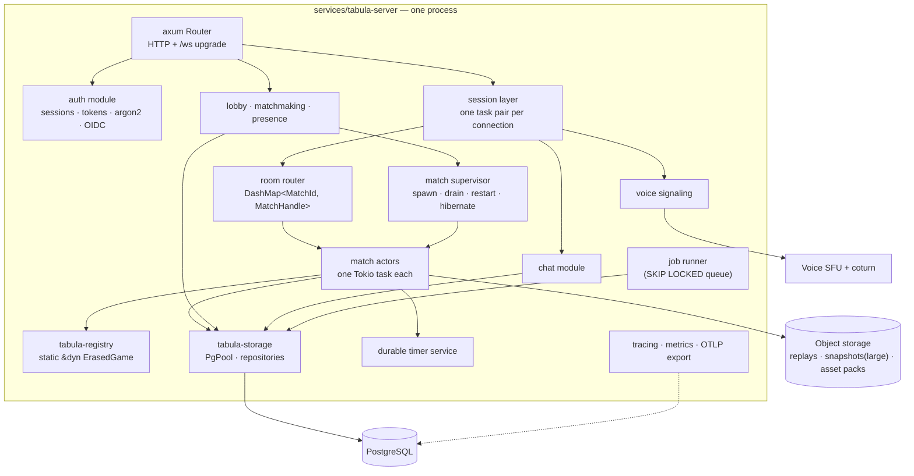
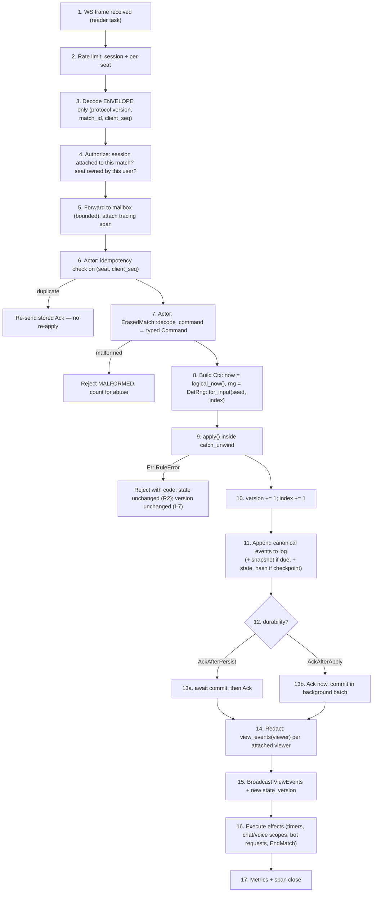
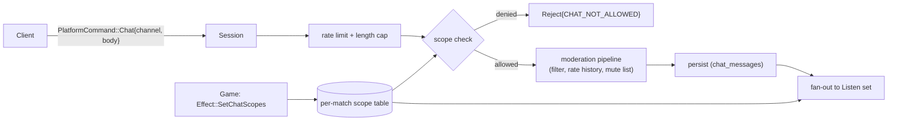
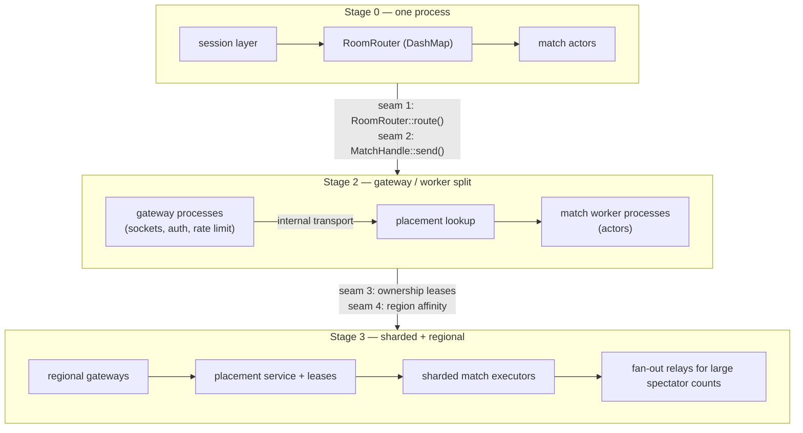

# 03 — Backend and Multiplayer Plan

> Prerequisites: [`00`](./00-architecture-principles.md), [`02`](./02-game-module-and-sdk-design.md).
> Wire format details are in [`05`](./05-data-protocol-and-replay.md); topology evolution and
> operational triggers are in [`06`](./06-scaling-deployment-and-observability.md).

---

## 1. Stage-0 topology

One binary. Inside it, clearly separated modules that map 1:1 to crates, so that the later
process split (doc 06 §7) is a wiring change and not a rewrite.



### 1.1 Task inventory

Knowing exactly which tasks exist prevents accidental task explosion.

| Task | Count | Lifetime | Owns |
|---|---|---|---|
| axum accept loop | 1 | process | listener |
| connection **reader** | 1 per WS | connection | decode, rate-limit, forward to router/actor |
| connection **writer** | 1 per WS | connection | bounded outbound queue → socket, heartbeat |
| match actor | 1 per **live** match | match (or until hibernation) | `Box<dyn ErasedMatch>`, version, timers, sessions |
| match supervisor | 1 | process | spawn/drain/hibernate, panic capture |
| timer service | 1 | process | wall-clock wheel → `Input::Timer` into mailboxes |
| bot runner | 1 (+ `spawn_blocking` for heavy search) | process | bot policies, think-time pacing |
| job runner | 1 | process | ratings, compaction, asset GC, notification fan-out |
| persistence batcher | 1 per shard (default 4) | process | groups event appends into multi-row inserts |
| presence broadcaster | 1 | process | coalesced presence diffs |
| metrics/otel exporter | 1 | process | flush |

Two tasks per connection (reader + writer) is deliberate: a slow client must never block the match
actor. The writer owns a **bounded** channel; when it fills, the connection is closed with
`SLOW_CONSUMER` rather than allowing unbounded memory growth. This is the single most important
backpressure decision in the server.

---

## 2. HTTP API surface

Small on purpose — screens drive it. Everything real-time goes over the WebSocket.

| Method | Path | Purpose |
|---|---|---|
| `POST` | `/api/v1/auth/register` / `login` / `logout` / `refresh` | Opaque session tokens |
| `GET` | `/api/v1/auth/oidc/:provider` + `/callback` | OAuth |
| `GET` | `/api/v1/me` | Profile, settings, entitlements |
| `GET` | `/api/v1/games` | Catalog (rollout-filtered, localized keys) |
| `GET` | `/api/v1/games/:id` | Metadata + capabilities + config schema + asset pack ref |
| `POST` | `/api/v1/rooms` | Create room (private/public, game, config) |
| `GET` | `/api/v1/rooms` | Browse rooms (paginated, filtered) |
| `POST` | `/api/v1/rooms/:id/join` | Reserve a seat → returns `join_token` |
| `POST` | `/api/v1/queue` / `DELETE` | Enter/leave matchmaking |
| `POST` | `/api/v1/matches` | Direct match creation (friendly/testing) |
| `GET` | `/api/v1/matches/:id` | Match summary (for resume/spectate discovery) |
| `GET` | `/api/v1/matches/:id/replay` | Replay download (signed URL) |
| `GET` | `/api/v1/users/:id/matches` | History |
| `GET` | `/api/v1/assets/manifest/:pack` | Asset manifest (long-cache, hashed) |
| `GET` | `/healthz` `/readyz` `/metrics` | Ops |
| `*` | `/api/v1/admin/*` | Operator endpoints, separate authz role |

Conventions: `Authorization: Bearer <session>`; UUIDv7 ids; RFC 9457 problem+json errors;
cursor pagination; `Idempotency-Key` honored on all `POST`s that create resources.

---

## 3. WebSocket lifecycle

```mermaid
sequenceDiagram
    participant C as Client
    participant GW as Gateway (axum)
    participant S as Session
    participant R as Router
    participant M as Match Actor

    C->>GW: GET /ws  Upgrade + Sec-WebSocket-Protocol: tabula.v1.postcard
    GW-->>C: 101 Switching Protocols (selected subprotocol)
    C->>S: Hello { protocol_version, client_build, auth: Bearer, codec }
    S->>S: authenticate; load user; create SessionId
    S-->>C: HelloAck { session_id, server_time, features, limits }
    Note over C,S: Session is now authenticated but attached to nothing.

    C->>S: Attach { match_id, join_token?, as: Seat|Spectator, resume_from? }
    S->>R: lookup(match_id)  → spawn/rehydrate if needed
    R-->>S: MatchHandle
    S->>M: Attach { session, viewer, resume_from }
    M-->>C: Welcome { state_version, view, capabilities, seat, event_cursor }
    loop gameplay
        C->>S: GameCommand { client_seq, payload }
        S->>M: mailbox: Command
        M-->>C: Ack { client_seq, state_version } / Reject { client_seq, code }
        M-->>C: ViewEvent stream (broadcast to all attached viewers)
    end
    C->>S: Detach / socket close
    S->>M: Detach { session }
    M->>M: start reconnect grace timer for that seat
```

### 3.1 Handshake details

- **Subprotocol negotiation carries the codec**: `tabula.v1.postcard` (production) or
  `tabula.v1.json` (dev/debug). The server refuses JSON in production for non-staff accounts —
  it is a debugging aid, not a supported client path. Doc 05 §4.
- **`Hello` is an application-level frame**, not HTTP headers, so browsers (which cannot set
  arbitrary WS headers) and native clients use the same path. Auth token travels in `Hello`.
- **Version mismatch** → `Close(4400, "protocol_version_unsupported")` with the supported range in
  the body so the client can prompt for an update.
- **One session may attach to at most one match** plus any number of *lobby* subscriptions.
  Spectating a second match requires a second session. This keeps the routing table simple.

### 3.2 Frames, heartbeat, and limits

| Control | Value (Stage 0) | Rationale |
|---|---|---|
| Frame type | Binary (Postcard) or Text (JSON debug) | — |
| Max inbound frame | 64 KiB | Commands are tiny; anything larger is abuse |
| Max outbound frame | 1 MiB | A large `Welcome` for a tiles match with a big board |
| Ping interval | 20 s server → client | Detect half-open sockets |
| Pong timeout | 30 s | Then `Close(4408)` and begin reconnect grace |
| Outbound queue | 256 messages, bounded | Overflow → `Close(4409, "slow_consumer")` |
| Inbound rate | 20 msg/s burst 40, per session; 5 commands/s per match seat | Token bucket; excess → `Reject{RATE_LIMITED}`, repeated → close |
| Idle (no attach) | 60 s | Close unattached sessions |
| Max sessions per user | 4 | Prevent socket farming |

### 3.3 Close codes

```text
4400 protocol_version_unsupported     4404 match_not_found
4401 unauthenticated                  4408 heartbeat_timeout
4403 unauthorized (seat/spectate)      4409 slow_consumer
4405 already_attached                  4429 rate_limited
4410 match_ended                      4500 internal
4411 server_draining (reconnect elsewhere)
```

`4411` is important for deploys: the client treats it as "reconnect immediately, do not back off".

---

## 4. Connection and session layer

```rust
// crates/tabula-match/src/session.rs
pub struct SessionId(pub u64);            // process-local, cheap

pub struct Session {
    pub id: SessionId,
    pub user: UserId,
    pub codec: Codec,
    pub protocol: ProtocolVersion,
    pub client_build: CompactString,
    /// Bounded sender to this connection's writer task.
    pub out: mpsc::Sender<ServerMessage>,
    pub limits: RateLimiter,
    pub attached: Option<Attachment>,
}

pub struct Attachment {
    pub match_id: MatchId,
    pub viewer: Viewer,
    /// Only set for seated players; spectators have None.
    pub seat: Option<SeatId>,
    /// Last state_version delivered, for resume.
    pub cursor: StateVersion,
}
```

**The session layer knows nothing about games.** It authenticates, rate-limits, decodes the
*envelope* (never the game payload), and forwards. The game payload stays opaque bytes until it
reaches `ErasedMatch::decode_command` inside the actor. That is I-9 at the network edge.

### 4.1 Why decode game payloads inside the actor, not at the edge

1. The edge would need the registry *and* per-game types to decode — pushing game knowledge into
   the connection layer.
2. Decoding is cheap; doing it in the actor keeps the "one owner of typed state" property.
3. A malformed payload becomes a `Reject{MALFORMED}` from the actor, counted per session for abuse
   detection, with the match's tracing span attached.

Cost: a malicious client can make the actor do decode work. Mitigated by the per-seat command rate
limit at the edge (5/s), which is enforced *before* forwarding.

---

## 5. Room router and match directory

```rust
pub struct RoomRouter {
    live: DashMap<MatchId, MatchHandle>,
    supervisor: SupervisorHandle,
    repo: Arc<dyn MatchRepo>,
    registry: &'static Registry,
}

#[derive(Clone)]
pub struct MatchHandle {
    pub match_id: MatchId,
    tx: mpsc::Sender<Envelope>,     // the mailbox (bounded, 1024)
    pub game: GameId,
    pub generation: u32,            // bumped on rehydrate; stale handles are rejected
}

impl RoomRouter {
    /// Returns a handle, spawning or rehydrating the actor if needed.
    pub async fn route(&self, id: MatchId) -> Result<MatchHandle, RouteError> {
        if let Some(h) = self.live.get(&id) { return Ok(h.clone()); }
        // Not live here. At Stage 0 that means "not live anywhere" → rehydrate.
        // At Stage 2+, consult the placement table first (doc 06 §4.4).
        self.supervisor.rehydrate(id).await
    }
}
```

At Stage 0 the directory is a single in-process `DashMap` and is authoritative because there is
exactly one process. **This is the seam** where Redis or a placement table enters later; the
`route()` signature does not change (doc 06 §4.4).

---

## 6. The match actor

### 6.1 Why one Tokio task per match, and not the alternatives

| Option | Verdict |
|---|---|
| **Tokio task + bounded mpsc mailbox (chosen)** | Single-writer ordering for free; ~few KiB overhead per task; no framework; trivially testable by sending envelopes; supervision is a `JoinSet` plus a restart policy we write in ~80 lines. |
| Actor framework (`actix`, `ractor`, `kameo`, `xtra`) | Buys supervision trees, ask/tell ergonomics, and (in some) clustering. Costs a large dependency, its own scheduling model, and its own failure semantics layered on tokio's. We need exactly one supervision policy; that is cheaper to write than to learn. Revisit only if we need cross-node actor addressing. |
| `Mutex<MatchState>` per match, no task | Simpler at first, but ordering becomes "whoever grabs the lock", and `await` inside the critical section (persistence) either blocks other commands on a std mutex or invites reentrancy bugs on an async mutex. Also loses the natural home for timers. **Rejected.** |
| Sharded executor: N worker tasks each owning M matches in a map | Fewer tasks, better cache locality, cheaper hibernation. Costs a hand-written scheduler and per-match fairness logic. **This is the documented Stage-3 evolution** (doc 06 §5.3) — the actor's *interface* is identical, so the migration is contained. |
| Thread-per-match | Wasteful at 10k matches. **Rejected.** |

**Decision: task-per-match now (ADR-006), sharded executor as a measured, contained upgrade.**

### 6.2 Actor structure

```rust
// crates/tabula-match/src/actor.rs
pub struct MatchActor {
    // identity & rules
    id: MatchId,
    game: &'static dyn ErasedGame,
    rules_version: RulesVersion,
    state: Box<dyn ErasedMatch>,            // sole owner (I-14)
    seed: MatchSeed,

    // ordering
    version: StateVersion,
    index: InputIndex,

    // logical time
    anchor: Instant,                        // wall-clock anchor for LogicalTime
    paused_for: Duration,                   // accumulated pause, subtracted from logical time
    paused_since: Option<Instant>,

    // participants
    seats: SeatTable,                       // seat -> occupant, connection state, idle state
    viewers: Vec<AttachedViewer>,           // sessions attached (players + spectators)
    idem: IdempotencyCache,                 // per-seat last_seq + small result ring

    // scheduling
    timers: TimerSet,                       // game timers + platform timers (grace, idle)
    hibernate_after: Duration,

    // ports (all trait objects; fakes in tests)
    log: Arc<dyn EventLog>,
    snaps: Arc<dyn SnapshotStore>,
    repo: Arc<dyn MatchRepo>,
    bots: BotRunnerHandle,
    chat: ChatHandle,
    voice: VoiceHandle,

    mailbox: mpsc::Receiver<Envelope>,
    metrics: MatchMetrics,
}

pub enum Envelope {
    Command { session: SessionId, seat: SeatId, client_seq: u32,
              payload: Bytes, correlation: CorrelationId, span: tracing::Span },
    Attach  { session: Arc<SessionRef>, viewer: Viewer, resume_from: Option<StateVersion>,
              reply: oneshot::Sender<Result<Welcome, AttachError>> },
    Detach  { session: SessionId },
    Timer   { timer: TimerId, fire_index: u64 },     // fire_index guards stale fires
    Seat    { seat: SeatId, change: SeatChange },
    Admin   { input: AdminInput, actor: OperatorId, reply: oneshot::Sender<AdminResult> },
    BotMove { seat: SeatId, payload: Bytes },
    Drain   { deadline: Instant, reply: oneshot::Sender<()> },
    Inspect { reply: oneshot::Sender<MatchDebugDump> },   // Audit viewer only
}
```

### 6.3 The loop

```rust
impl MatchActor {
    pub async fn run(mut self) -> MatchExit {
        // Timers are re-derived from state on start, never carried in memory across restarts.
        self.rearm_timers_from_state();

        loop {
            let next_timer = self.timers.next_deadline();
            tokio::select! {
                biased;

                // 1. Drain/admin get priority so deploys are fast.
                Some(env @ Envelope::Drain { .. }) = self.mailbox.recv() => {
                    return self.handle_drain(env).await;
                }

                // 2. Timer expiry.
                _ = sleep_until_opt(next_timer), if next_timer.is_some() => {
                    let fired = self.timers.take_expired(Instant::now());
                    for t in fired { self.step(Input::Timer { timer: t.id }).await; }
                }

                // 3. Normal traffic.
                maybe = self.mailbox.recv() => {
                    match maybe {
                        Some(env) => self.handle(env).await,
                        None => return MatchExit::AllSendersDropped,
                    }
                }

                // 4. Hibernation for async-turn games with nobody attached.
                _ = sleep(self.hibernate_after), if self.can_hibernate() => {
                    return self.hibernate().await;
                }
            }
            if self.ended { return self.finish().await; }
        }
    }
}
```

Notes:

- `biased;` makes ordering explicit rather than random, which matters for reproducible tests.
- **Timers are re-derived from state at start** (`rearm_timers_from_state`). This is what makes
  restarts safe without a separate durable timer table for game timers: the state already encodes
  "black has 3:12 left and it is black's turn", so the deadline is recomputable. Platform timers
  (reconnect grace, idle) are also recomputed from persisted seat state. Doc §12 covers the case
  where a timer must survive a *long* outage.
- `fire_index` on `Envelope::Timer` prevents a stale wall-clock fire (e.g. after a pause) from
  being applied.

### 6.4 Supervision

```text
panic inside apply()      → caught by catch_unwind in step(); match ends with
                            OutcomeKind::Aborted{RulesPanic}; backtrace + input logged; alert.
                            The process survives. The bug is Sev-2.
panic elsewhere in actor  → supervisor observes JoinError; match rehydrated from the last
                            snapshot + log (at most one input lost, and only for AckAfterApply
                            games); attached sessions receive Resync.
mailbox full (1024)       → sender gets Err; the session layer replies Reject{BUSY} and counts it.
                            Sustained fullness is an alert: the actor is CPU-starved or blocked.
actor stuck > 5 s         → watchdog metric + alert; the actor is not killed automatically
                            (killing loses ordering guarantees); operator decides.
process shutdown          → supervisor broadcasts Drain with a 15 s deadline; actors flush events,
                            write a final snapshot, send Close(4411) to sessions, exit.
```

**No unbounded channels anywhere.** A full mailbox must be visible as a rejection, not as memory
growth.

---

## 7. The command pipeline

Every player command traverses exactly these steps, in this order, once.



### 7.1 Why effects run after persistence

If `Effect::EndMatch` ran before the log commit and the process died, the match would be recorded
as ended in one place and unfinished in another. Running effects after commit means every effect is
**replayable**: on recovery, the actor re-derives outstanding effects from state (timers) or from a
small `pending_effects` row (external ones: ratings, notifications), and re-executes them
idempotently.

Effect idempotency rules:

| Effect | Idempotency mechanism |
|---|---|
| `SetTimer` / `CancelTimer` | Timers are re-derived from state; re-running is harmless |
| `SetChatScopes` / `SetVoiceScopes` | Absolute (not delta) — re-applying sets the same scopes |
| `EndMatch` | Guarded by `matches.ended_at IS NULL` in a single UPDATE; rating job keyed by `match_id` |
| `RequestBotMove` | Keyed by `(match_id, seat, state_version)`; a duplicate request for a version already advanced is dropped |
| `Notify` | Keyed by `(match_id, audience, notice_id)` with a dedupe window |
| `Checkpoint` | Upsert by `(match_id, label)` |

### 7.2 Logical time

```rust
fn logical_now(&self) -> LogicalTime {
    let elapsed = self.anchor.elapsed()
        - self.paused_for
        - self.paused_since.map(|t| t.elapsed()).unwrap_or_default();
    LogicalTime(elapsed.as_millis() as u64)
}
```

- `anchor` is persisted (`matches.started_at`) so it survives rehydration; on rehydrate,
  `anchor = now - (last_logical_time + paused_for)` reconstructs continuity.
- **Logical time is recorded in the log with every input.** Replay uses the recorded value, not a
  recomputation. This is what makes replays exact even though wall clocks are not.
- Monotonicity is enforced: `logical_now()` is clamped to `>= last_input_time`. `Instant` is
  monotonic within a process; across rehydration the clamp handles clock adjustment.

---

## 8. Ordering, idempotency, and versioning

### 8.1 The three counters

| Counter | Scope | Purpose |
|---|---|---|
| `client_seq` | per (session, match) | Client-assigned, monotonic. Lets the client correlate acks and detect gaps. Reset only on a new session. |
| `state_version` | per match | Server-assigned, +1 per applied input (I-7). The client's "where am I" cursor. |
| `input_index` | per match | Equals the event-log row ordinal; the RNG domain root. Usually equal to `state_version`, but kept separate so a future "input applied with zero state change" case cannot break either meaning. |

### 8.2 Idempotency

```rust
struct IdempotencyCache {
    /// Highest accepted client_seq per seat, plus the last N results for replay of acks.
    per_seat: BTreeMap<SeatId, SeatSeqState>,
}
struct SeatSeqState {
    highest: u32,
    recent: ArrayVec<(u32, AckOrReject), 16>,
}
```

Rules:

- `client_seq <= highest` and present in `recent` → **re-send the stored result, do not re-apply.**
  This is the reconnect/retry safety net.
- `client_seq <= highest` and evicted from `recent` → `Reject{STALE_SEQ}`; the client resyncs.
- `client_seq > highest + 64` → `Reject{SEQ_TOO_FAR}` (protects against a confused or hostile
  client racing ahead).
- The cache is **in memory only**. After a crash, a duplicate command from a client could
  re-apply. Mitigation: for `AckAfterPersist` games, the client's resume flow reports its last
  known `state_version`, and the server tells it which of its commands landed; the client then only
  retries commands after that point. Games whose commands are naturally idempotent
  (place at cell X) are additionally safe by construction.

### 8.3 Ack policy per durability class

```text
AckAfterPersist  (chess, Caro, tiles — anything ranked or with stakes)
    apply → append → fsync-level commit → Ack → broadcast
    p95 target: 25 ms same-region (dominated by one Postgres round trip)
    loss window: none

AckAfterApply    (werewolf, party games, casual)
    apply → Ack + broadcast → append (batched, ≤50 ms or 64 events)
    p95 target: 5 ms
    loss window: up to 50 ms of events on a hard process kill; recovery replays from the
                 last committed input, and attached clients receive Resync
```

The choice is a **capability**, not a global setting, because the tradeoff is genuinely
game-dependent (doc 02 §4.2).

---

## 9. Event persistence and snapshots

### 9.1 The model

```text
input 0   MatchCreated + Init events        ← snapshot S0 always written here
input 1   events...
input 2   events...
...
input 50  events...                          ← snapshot S1 (Medium state class)
...
input 200 events...                          ← snapshot S2 (Tiny/Small state class)
```

Recovery = load newest snapshot ≤ target version, replay inputs after it. Bounded by the snapshot
interval, so worst-case recovery is a fixed small number of `apply` calls (microseconds each).

### 9.2 Snapshot policy by state size class

| Class | Interval | Storage | Example |
|---|---|---|---|
| `Tiny` (< 1 KiB) | every 200 inputs + on end | Postgres `BYTEA` | chess, tictactoe |
| `Small` (< 16 KiB) | every 100 inputs + on end | Postgres `BYTEA` | Caro, werewolf |
| `Medium` (< 256 KiB) | every 50 inputs + on end + on hibernate | Postgres `BYTEA`, zstd | tiles |
| `Large` (≥ 256 KiB) | every 25 inputs + on hibernate | Object storage, pointer row in PG | future |

Additional triggers: before drain, before hibernation, on `rules_version` boundary, and whenever
`apply` exceeded its budget (so a slow match is cheap to recover).

### 9.3 State hashes

Every snapshot stores a `state_hash`. Additionally, a hash is stored every *N*-th input
(default 20) in the event row. This makes divergence detection cheap and gives replay tests precise
failure points (doc 05 §7).

### 9.4 Schema sketch

Conceptual, not final DDL. Indexes listed where they are load-bearing.

```sql
-- identity ---------------------------------------------------------------
users (
  id            uuid primary key,            -- v7
  handle        citext unique not null,
  email         citext unique,
  password_hash text,                        -- null for OAuth-only
  created_at    timestamptz not null default now(),
  status        text not null,               -- active | suspended | deleted
  flags         jsonb not null default '{}'
);
user_identities ( user_id, provider, subject, primary key (provider, subject) );
sessions ( id uuid primary key, user_id uuid, created_at, last_seen_at, expires_at,
           device jsonb, revoked_at );

-- catalog ----------------------------------------------------------------
games (
  id          text primary key,              -- "com.tabula.chess"
  latest_version text not null,
  enabled     boolean not null default true,
  audience    text not null default 'everyone',
  updated_at  timestamptz not null default now()
);
game_versions (
  game_id       text references games(id),
  version       text,                        -- semver
  rules_version int  not null,
  rules_hash    bytea not null,
  manifest      jsonb not null,              -- capabilities + metadata snapshot
  asset_pack    text,
  released_at   timestamptz not null default now(),
  retired_at    timestamptz,
  primary key (game_id, version)
);

-- rooms & matches --------------------------------------------------------
rooms (
  id uuid primary key, owner_id uuid, game_id text, visibility text,
  config jsonb, created_at timestamptz, closed_at timestamptz
);
matches (
  id             uuid primary key,           -- v7 → time-ordered, good for partitioning
  room_id        uuid,
  game_id        text not null,
  game_version   text not null,
  rules_version  int  not null,
  rules_hash     bytea not null,
  seed           bytea not null,             -- ENCRYPTED AT REST; never leaves the server
  config         jsonb not null,
  state_version  bigint not null default 0,
  status         text not null,              -- created | live | hibernating | ended | aborted
  started_at     timestamptz not null,
  ended_at       timestamptz,
  outcome        jsonb,
  paused_for_ms  bigint not null default 0,
  last_logical_ms bigint not null default 0,
  durability     text not null
);
create index on matches (status, game_id) where status in ('live','hibernating');
create index on matches (room_id);

match_players (
  match_id uuid references matches(id),
  seat     smallint,
  user_id  uuid,                             -- null for bots/empty
  bot_level text,
  team     smallint,
  joined_at timestamptz, left_at timestamptz,
  connection_state text,                     -- connected | disconnected | idle | abandoned
  primary key (match_id, seat)
);
create index on match_players (user_id, match_id);

-- the log ---------------------------------------------------------------
-- PARTITIONED BY RANGE (match_id) or by created_at month; see doc 06 §6.3.
match_inputs (
  match_id     uuid  not null,
  input_index  bigint not null,
  kind         smallint not null,            -- 0 player, 1 timer, 2 seat, 3 admin
  seat         smallint,
  logical_ms   bigint not null,
  payload      bytea  not null,              -- canonical postcard of Input<Command>
  created_at   timestamptz not null default now(),
  primary key (match_id, input_index)
);
match_events (
  match_id      uuid  not null,
  input_index   bigint not null,
  event_ordinal smallint not null,           -- events within one input
  payload       bytea not null,              -- canonical postcard of the game's Event
  state_hash    bytea,                       -- non-null every N inputs
  primary key (match_id, input_index, event_ordinal)
);
match_snapshots (
  match_id      uuid not null,
  state_version bigint not null,
  rules_version int not null,
  encoding      smallint not null,           -- 0 raw postcard, 1 zstd, 2 external pointer
  payload       bytea,                       -- null when external
  external_url  text,
  state_hash    bytea not null,
  created_at    timestamptz not null default now(),
  primary key (match_id, state_version)
);
pending_effects (
  match_id uuid, effect_id bigserial, kind text, payload jsonb,
  created_at timestamptz, done_at timestamptz,
  primary key (match_id, effect_id)
);

-- social / progression ---------------------------------------------------
ratings ( user_id uuid, game_id text, rating int, rd int, games int,
          updated_at timestamptz, primary key (user_id, game_id) );
replays ( match_id uuid primary key, format smallint, size_bytes bigint,
          url text, expires_at timestamptz );
chat_messages ( id bigserial primary key, scope text, scope_id uuid, match_id uuid,
                seat smallint, user_id uuid, body text, created_at timestamptz,
                moderation jsonb );
create index on chat_messages (scope, scope_id, created_at desc);
presence ( user_id uuid primary key, status text, match_id uuid, updated_at timestamptz );
queue_entries ( user_id uuid, game_id text, config_key text, rating int,
                enqueued_at timestamptz, primary key (user_id, game_id) );
```

### 9.5 Why `match_inputs` **and** `match_events`

- **Inputs** are what replay needs (ADR-003). They are the minimal, authoritative record.
- **Events** are what clients, analytics, and audit need, and they let us serve spectator catch-up
  and "what happened" queries without running `apply`.

Events are strictly derivable from inputs, so this is a deliberate, controlled denormalization.
The tradeoff: ~2× log volume. It is worth it because (a) reading events is far more frequent than
replaying, and (b) storing events makes divergence detectable — if replay of inputs produces
different events than were stored, we have found a determinism bug in production.

**Compaction:** for matches older than the replay window, `match_events` rows may be dropped and
the replay file (doc 05 §8) in object storage becomes the archival form. `match_inputs` +
final snapshot are retained longer, being much smaller.

### 9.6 Write path efficiency

- Events for one input are inserted in **one multi-row `INSERT`**; inputs and events for one
  command go in **one transaction** with the `matches.state_version` update.
- `AckAfterApply` games use a batcher: up to 64 events or 50 ms across matches, one `COPY`-style
  multi-row insert per flush.
- Target: **one Postgres round trip per command** for `AckAfterPersist`, well under one per command
  for `AckAfterApply`.
- `synchronous_commit = on` for the match transaction (we are claiming durability); consider
  `remote_write` only if a replica setup makes it meaningful.

---

## 10. Reconnect and resume

```mermaid
sequenceDiagram
    participant C as Client
    participant GW as Gateway
    participant M as Match Actor
    participant DB as PostgreSQL

    Note over C: network drops
    M->>M: Detach(session); start reconnect grace (capabilities.reconnect.grace)
    M->>M: if notify_rules: step(Input::Seat{seat, Disconnected})
    M-->>GW: broadcast ViewEvent(seat disconnected) to others

    C->>GW: WS connect + Hello + Attach { match_id, resume_from: v=418, last_client_seq: 57 }
    GW->>M: Attach { viewer: Seat(1), resume_from: 418 }

    alt gap is small and events are in memory/log
        M->>DB: SELECT events WHERE input_index > 418 (redacted per viewer)
        M-->>C: ResumeOk { from: 418, to: 431, view_events: [...], acked_through: 57 }
    else gap is large, or rules_version changed, or events compacted
        M-->>C: Resync { state_version: 431, view: project(state, Seat(1)) }
    end

    M->>M: cancel grace timer
    M->>M: if notify_rules: step(Input::Seat{seat, Reconnected})
    M-->>GW: broadcast ViewEvent(seat reconnected)

    Note over C,M: If grace expires first:
    M->>M: step(Input::Seat{seat, Abandoned}) — the GAME decides the consequence
```

### 10.1 Rules

- **Resume threshold:** if `state_version - resume_from <= 200` and all needed events are
  retrievable, send incremental `ResumeOk`. Otherwise send a full `Resync`. The threshold is a
  tuning constant, not a contract; clients must handle both.
- **`acked_through`** tells the client which of its commands the server applied, so it can decide
  what to retry (§8.2).
- **Reconnect tokens:** the `join_token` is short-lived (10 min) but *re-issuable* from the session;
  resume is authorized by (session, user) owning the seat in `match_players`, not by the original
  token. This survives long outages.
- **Spectators always get `Resync`** — they have no commands and no seat, so incremental replay is
  not worth the complexity.
- **Grace expiry is the platform's decision; its consequence is the game's.** The actor sends
  `Input::Seat{Abandoned}` and the rules decide: chess forfeits on flag anyway, werewolf may
  auto-abstain, tiles (async) does nothing.

### 10.2 Client-side responsibilities

Implemented once in `tabula-net-client` (doc 04 §4.4): exponential backoff with full jitter
(base 500 ms, cap 30 s), immediate retry on close code 4411, a bounded outbound queue of
un-acked commands with their `client_seq`, and a UI state machine
(`Connected → Reconnecting → Resyncing → Connected | Failed`).

---

## 11. Spectators, hibernation, and async matches

### 11.1 Spectators

- Attach requires: match is live, `capabilities.spectators != Forbidden`, and platform-level
  authorization (public match, or friend-of-player, or tournament role).
- **Delay is implemented by buffering in the actor**, not by the client: a `Delayed{by}` spectator's
  view events are held in a small per-match ring and released when
  `logical_now() - event_time >= by`. The initial `Resync` for a delayed spectator projects from a
  *past* snapshot + replay to the delayed version — which is exactly what snapshots make cheap.
- Spectator count is capped per match (default 200 at Stage 0); beyond that, spectators are served
  by a **fan-out relay** (doc 06 §5.2) rather than by the actor. Deferred until a real match needs
  it.

### 11.2 Hibernation

For `async_turns.supported = true` games, holding a task and state in memory for a 24-hour turn is
waste. When a match has no attached sessions and no timer within `hibernate_after` (default 60 s):

```text
1. write a snapshot
2. persist seat connection state and next-timer deadline into `matches`
3. deregister the handle from the router
4. exit the task
```

Rehydration on next attach or on the durable timer firing (doc §12.2). Rehydration cost is
`load snapshot + replay ≤ interval inputs` — target under 5 ms for `Small`, under 30 ms for
`Medium`.

### 11.3 Live vs async is not a rules distinction

The same game code runs both. The only differences are platform-side: hibernation, notification
delivery, and the deadline value. This is a direct payoff of `LogicalTime` and `Effect::SetTimer`.

---

## 12. Timers

Two kinds, deliberately handled differently.

### 12.1 In-memory timers (the common case)

Game timers (`Effect::SetTimer`) and platform timers (reconnect grace, idle detection) live in the
actor's `TimerSet` (a small binary heap) and are driven by `tokio::time::sleep_until` in the
`select!`. They are **re-derived from state** on actor start, so a process restart loses nothing.

Re-derivation requires that state encodes enough to recompute deadlines. That is a rules-authoring
requirement, stated in doc 02 §14's checklist: *"timers set and cancelled symmetrically"* and, in
practice, *"state must contain the information needed to recompute any pending deadline"*
(chess: `clocks` + `last_move_at`; werewolf: `phase_ends_at`).

### 12.2 Durable timers (hibernated matches only)

A hibernated match has no task, so its next deadline lives in a table:

```sql
durable_timers (
  match_id uuid primary key,
  fire_at  timestamptz not null,
  timer_id smallint not null,
  state_version bigint not null      -- guards against firing a stale timer
);
create index on durable_timers (fire_at);
```

A single process-wide timer service polls `WHERE fire_at <= now() LIMIT 100 FOR UPDATE SKIP LOCKED`
every second, rehydrates the match, and delivers `Input::Timer`. `state_version` mismatch → the
timer is stale and is dropped.

This is the *only* place a database poll drives gameplay, and it exists solely for hibernation.
Live matches never touch it.

---

## 13. Failure recovery

| Failure | Detection | Recovery | Data loss |
|---|---|---|---|
| Client socket drops | heartbeat / read error | reconnect + resume (§10) | none |
| Slow client | outbound queue full | close 4409; client reconnects | none |
| `apply` panics | `catch_unwind` | match aborted `RulesPanic`, alert, replay attached to the bug | that match only |
| Actor task panics elsewhere | supervisor `JoinError` | rehydrate from snapshot + log; sessions get `Resync` | ≤1 input for `AckAfterApply` |
| Postgres unavailable (brief) | query error | `AckAfterPersist` commands → `Reject{TRY_AGAIN}`; `AckAfterApply` buffers up to a bounded queue then also rejects; matches stay live | none if within buffer |
| Postgres unavailable (long) | circuit breaker | server enters read-only: no new matches; live matches continue but reject state-changing commands; clear user-facing banner | none |
| Process killed (SIGTERM) | drain path | 15 s drain: snapshot + flush + close 4411 | none |
| Process killed (SIGKILL / OOM) | restart | matches rehydrate on next attach or durable timer | ≤ batch window for `AckAfterApply` |
| Disk full on Postgres | alert on `pg_database_size` trend | read-only mode; ops | none |
| Determinism divergence detected | replay job hash mismatch | quarantine the match, alert Sev-2, freeze the affected `rules_version` from new matches | integrity, not data |

### 13.1 Startup recovery

On boot the server does **not** rehydrate all live matches. It:

1. Marks matches whose `status = 'live'` and whose owning process is gone as `'hibernating'`.
2. Rehydrates lazily on attach or durable-timer fire.

This makes restarts O(1) instead of O(live matches) and is only possible because rehydration is
cheap and correct.

---

## 14. Rooms, lobby, and presence

### 14.1 Rooms vs matches

```text
Room   = a social container. Persists across matches. Owns invites, settings, chat history,
         and a seat list. "Play again" reuses the room and creates a new match.
Match  = one instance of play. Owns state, event log, outcome, replay.
```

Keeping these separate avoids the trap of stuffing rematch, invitation, and chat-history logic into
the match actor, which would then have to survive between matches.

```rust
pub struct Room {
    pub id: RoomId,
    pub game: GameId,
    pub config: RawValue,               // validated by the module at creation
    pub visibility: Visibility,         // Public | Unlisted | FriendsOnly | Private(code)
    pub seats: Vec<RoomSeat>,           // reservations, ready flags, teams
    pub owner: UserId,
    pub current_match: Option<MatchId>,
    pub settings: RoomSettings,         // rematch policy, spectators allowed, voice on/off
}
```

### 14.2 Presence

- In-process `presence: DashMap<UserId, PresenceState>` updated by session attach/detach.
- Written through to Postgres on transitions only (not on a timer), with a 5 s debounce.
- Fan-out to friends is **coalesced**: a single broadcaster task flushes diffs every 500 ms.
  Naive per-event fan-out to friend lists is the classic way to melt a social backend; the
  coalescing task is written on day one.
- Presence is explicitly *not* durable truth: on restart it rebuilds from live sessions.

### 14.3 Lobby subscriptions

A session may subscribe to `LobbyTopic::{RoomList{game}, Room{id}, Friends, Queue}`. The lobby
publishes deltas, not snapshots, after an initial snapshot. Room-list subscriptions are
rate-limited and capped, and a room list is capped at 200 entries with server-side filtering — a
browsable list of every public room is not a product requirement and is an easy DoS.

---

## 15. Matchmaking

**The matchmaker never reads game state and never links a game crate.** It consumes:

```text
from GameCapabilities:  seats.min/max/allowed, seats.teams, seats.symmetric,
                        seats.fill_with_bots, ranked.rating, async_turns
from the queue entry:   user, game_id, config_key (a hash of the normalized config),
                        rating, region, latency hint, party members, enqueued_at
```

### 15.1 Algorithm (Stage 0 — deliberately simple)

```text
Buckets keyed by (game_id, config_key, region).
Within a bucket, entries sorted by enqueued_at.
Every 500 ms, for each bucket:
   widen = f(waited)                      # rating window grows with wait time
   greedily form the largest legal seat count from compatible entries
   if a group can be formed:  reserve seats, create match, notify
   if waited > fill_after and seats.fill_with_bots: fill remaining seats with bots
   if waited > give_up: notify "no match found", offer bot game or room browse
```

Parameters (`widen`, `fill_after`, `give_up`) are per-game configuration rows, not code.

### 15.2 Why not something cleverer

At the population sizes we will have for years, wait time is dominated by *there being nobody else
in the queue*, not by matching quality. A rating-window widener plus bot fill solves 95% of the
felt problem. Elo-optimal batch matching, party-vs-party balancing, and role queues are
**DEFER**red with a written trigger: median queue time > 30 s at > 200 concurrent queuers for a
single game.

### 15.3 Party support

A party is a group that must land in the same match (and, for team games, the same team). Parties
are a single queue entry with `size > 1`. Team balance for parties is the first place matchmaking
gets genuinely hard; it is deferred to Phase 7 when werewolf makes it matter.

---

## 16. Chat



- **Transport, storage, moderation: platform.** **Scoping: game-driven** (ADR-022).
- Scopes are absolute state, set by the game, held by the match actor, and consulted by the chat
  module. A game that never sends scopes gets the default: one `table` channel where every
  attached seat may speak and every viewer may listen.
- Spectator chat is a **separate channel** by default (`spectators`), never merged into `table` —
  spectators must not be able to coach players.
- Moderation at Stage 0: length caps, rate limits, a wordlist filter with locale support, per-user
  mute, report → operator queue. ML moderation is deferred.
- Chat history for a room is paginated over HTTP, not the WebSocket.

---

## 17. Voice signaling

The game WebSocket carries **signaling only**; media never touches it (ADR-016).

```mermaid
sequenceDiagram
    participant C as Client
    participant S as Server (signaling)
    participant V as VoiceService impl
    participant SFU as SFU

    Note over S: Game emits Effect::SetVoiceScopes([("wolves", [1,4,7])])
    S->>V: ensure_rooms(match_id, scopes)
    V->>SFU: create/update rooms
    C->>S: PlatformCommand::VoiceJoin { channel: "wolves" }
    S->>S: authorize against current voice scopes (from the match actor)
    S->>V: join(room, participant, permissions{publish, subscribe})
    V-->>S: JoinGrant { url, token, ice_servers }
    S-->>C: PlatformEvent::VoiceGrant { url, token, ice_servers }
    C->>SFU: WebRTC connect with token (media plane, direct)
    Note over S,V: On phase change, the game emits new scopes; the server moves/mutes participants.
```

```rust
// crates/tabula-voice/src/lib.rs
#[async_trait]
pub trait VoiceService: Send + Sync {
    async fn ensure_rooms(&self, m: MatchId, scopes: &VoiceScopes) -> Result<(), VoiceError>;
    async fn join(&self, m: MatchId, room: &str, p: Participant, perms: VoicePerms)
        -> Result<JoinGrant, VoiceError>;
    async fn leave(&self, m: MatchId, room: &str, p: ParticipantId) -> Result<(), VoiceError>;
    async fn set_mute(&self, m: MatchId, p: ParticipantId, muted: bool) -> Result<(), VoiceError>;
    async fn stats(&self, m: MatchId) -> Result<VoiceStats, VoiceError>;
    async fn teardown(&self, m: MatchId) -> Result<(), VoiceError>;
}
```

Key properties:

- **Permissions are enforced at the SFU via tokens**, not by asking clients to behave. A dead
  werewolf player's token grants subscribe-only on the `dead` room and nothing on `table`.
- **Scope changes are pushed**, so a phase transition mutes the right people within one round trip.
- The `VoiceService` trait is the replaceability seam: a self-hosted LiveKit adapter and a managed
  provider adapter both satisfy it, chosen by config.
- **No voice in the MVP.** Phase 8. Werewolf ships playable with text chat first.

---

## 18. Where Redis enters (and not before)

Redis is **DEFER**red (ADR-014). It becomes justified only when there is more than one
match-owning process, and even then only for specific jobs:

| Candidate use | Justified when | Stage-0 alternative in place |
|---|---|---|
| Match placement directory (`match_id → node`) | ≥2 match-owning processes | in-process `DashMap` |
| Presence and friend fan-out | presence writes/reads saturate Postgres, or fan-out crosses processes | in-process map + coalescing |
| Cross-process pub/sub (lobby, room lists) | lobby subscribers are spread across gateways | in-process broadcast |
| Shared rate limits | limits must be global rather than per-process | per-process token buckets |
| Matchmaking queues | matchmaker is replicated | in-process buckets + Postgres persistence |
| Ownership leases | match ownership must be exclusive across nodes | single process = trivially exclusive |

**Trigger, written down:** introduce Redis when *both* (a) more than one process owns matches, and
(b) at least one of: placement lookup p95 > 5 ms, presence-related Postgres load > 15% of
transactions, or cross-process pub/sub is required for a shipped feature. Doc 06 §4.3.

**What Redis must never become:** a source of truth for match state, an event log, or a
substitute for the ownership invariant (I-14). It is a directory and a bus.

---

## 19. PostgreSQL strategy

### 19.1 Separation of concerns within one database

| Data class | Tables | Access pattern | Growth | Notes |
|---|---|---|---|---|
| Canonical durable state | `matches`, `match_players` | small reads/writes per command | linear in matches | hottest small tables |
| Event log | `match_inputs`, `match_events` | append-heavy, read on resume/replay | dominant | partition first |
| Snapshots | `match_snapshots` | write every N inputs, read on rehydrate | moderate | zstd; external for `Large` |
| Ephemeral room state | in-memory + `rooms` | frequent reads | small | do not log every change |
| User/social | `users`, `ratings`, `presence`, `chat_messages` | read-heavy | moderate | replica candidate |
| Analytics | export to object storage | batch | large | never queried from the app path |
| Assets | manifests only (files on CDN) | rare | tiny | — |

### 19.2 Partitioning plan

- `match_inputs` and `match_events`: **range-partition by `created_at` (monthly)** rather than by
  `match_id`. Reason: retention and archival are time-based ("drop events older than the replay
  window"), and dropping a partition is instant, whereas deleting by match id is a vacuum problem.
  Match-scoped reads remain fast because the primary key leads with `match_id` within each
  partition and matches are short-lived (so a match's rows sit in one or two partitions).
- Introduce partitioning **before** the log exceeds ~50 GB; retrofitting is painful. Doc 06 §6.3.

### 19.3 Connection and pool discipline

- One `PgPool` per process, sized `min(4 × cores, 40)` at Stage 0.
- **Match actors must never hold a connection across an `await` that waits on anything else.**
  The persistence port takes owned data and returns, so a connection is held only for the duration
  of the write.
- Long-running analytical queries are banned from the app pool; use a separate pool with a
  statement timeout, or run them against a replica.
- `statement_timeout` = 5 s for the app pool, `idle_in_transaction_session_timeout` = 10 s.

### 19.4 Encryption and secrets

- `matches.seed` is encrypted at rest with an application-level key (envelope encryption; key in
  the secret manager, rotated). Reason: a database dump must not reveal every past deck shuffle,
  which would compromise any *ongoing* match sharing a seed-derived structure and would let a
  determined player reconstruct hidden information from replay data they should not have.
- Replay files served to users are **projected replays** (spectator or own-seat viewpoint), never
  canonical-state replays, unless the match is fully public-information (chess).

---

## 20. Horizontal scaling seams

The seams that let a single process become many. Each is a *named place in the code* today.



| Seam | Where it lives today | What changes at the split |
|---|---|---|
| **1. Match location** | `RoomRouter::route(match_id) -> MatchHandle` | Consults a placement table/Redis; may return a *remote* handle |
| **2. Message delivery** | `MatchHandle::send(Envelope)` — already an async fallible send | Becomes a network send; `Envelope` is already serializable-shaped (payloads are bytes) |
| **3. Ownership** | "one process ⇒ trivially exclusive" | A lease (`Postgres advisory lock` first, Redis/etcd later) with fencing tokens; the actor checks its lease before persisting (I-14) |
| **4. Broadcast** | `Broadcast` port, in-process fan-out | Gateway-side fan-out: the worker sends one redacted stream per *viewer group*, the gateway delivers to sockets |
| **5. Persistence** | `EventLog` / `SnapshotStore` traits | Unchanged; possibly a different pool or a write proxy |
| **6. Presence & lobby** | in-process maps + broadcaster | Redis pub/sub or a lobby service |
| **7. Timers** | in-actor heap + `durable_timers` | Unchanged; the durable table is already cross-process safe |
| **8. Region** | none (single region) | `region` column on matches, region-affine placement, cross-region replay only |

**Redaction placement is the subtle one.** `view_events` must run where the typed state is (the
worker), because redaction needs game types. So the worker produces *per-viewer-group* byte
streams and the gateway fans them out. Grouping viewers by identical projection (all spectators
share one; each seat is its own group) keeps worker cost at O(seats + 1) rather than O(viewers).
That grouping is worth implementing in Stage 0 already — it is also what makes 200 spectators
cheap today.

---

## 21. Security specifics

| Threat | Control |
|---|---|
| Forged commands for another seat | Seat ownership checked at step 4 of the pipeline against `match_players`; sessions cannot self-assign seats |
| Replayed commands | `client_seq` idempotency; `state_version` guards |
| Command flooding | Per-session and per-seat token buckets **before** the mailbox |
| Oversized payloads | 64 KiB frame cap; per-game payload cap from `apply_budget` context |
| Malformed payload fuzzing | Decoders are `cargo-fuzz` targets; decode errors are counted per session and trip a ban threshold |
| Information leaks | `project`/`view_event` + `SecretModel` scans (doc 02 §7.3); `hidden_information` games get stricter CI |
| Spectator coaching | Spectator delay capability; separate spectator chat channel; ranked matches may forbid spectators entirely |
| Bot/automation abuse | Rate limits, behavioral metrics (inter-command timing distribution), reported to the anti-abuse queue. Not solved by client attestation, which is unwinnable. |
| Session theft | Opaque server-side sessions, rotation on privilege change, device list + revoke, `Secure`/`HttpOnly`/`SameSite=Lax` cookies for web, keychain storage for native |
| Seed disclosure | Seeds encrypted at rest, never serialized into any client message, excluded from debug dumps (`MatchDebugDump` redacts it even for `Audit`) |
| Operator abuse | Admin actions are `Input::Admin` — they land in the same immutable log with `OperatorId`, so every intervention is auditable |
| Rating manipulation | Ratings computed server-side from `MatchOutcome`; smurf/boost heuristics in the rating job; `Aborted` outcomes never count |
| Denial via slow reads | Bounded outbound queues + close 4409 |
| Cross-match state confusion | Every envelope carries `match_id`; the actor rejects mismatches; `MatchHandle.generation` rejects stale handles |

### 21.1 What we explicitly do not attempt

- **Client attestation / anti-tamper.** Unwinnable for an open-source-adjacent Rust client and
  unnecessary given server authority. Every rule that matters is enforced server-side.
- **Perfect collusion detection** in social games. Werewolf played with friends on external voice
  is not cheatable-by-design; the product treats social play as the norm.
- **Hiding rules logic.** Rules are public knowledge; secrecy lives in state, not code.

---

## 22. MVP scope for this document

What is built in Phase 4 (see [doc 07](./07-phases-and-implementation-roadmap.md)):

```text
IN  : axum HTTP + WS, sessions, auth, room router, match actor, command pipeline,
      idempotency, state_version, event log, snapshots, reconnect/resume, spectators (live),
      table chat, one Postgres, tracing + metrics, drain/deploy path, load test harness
OUT : Redis, matchmaking (Phase 5), voice (Phase 8), hibernation/async (Phase 9),
      delayed spectators (Phase 9), fan-out relays, multi-process, multi-region,
      moderation tooling beyond filters + reports, party support (Phase 7)
```

---

**Next:** [`04-frontend-and-design-system.md`](./04-frontend-and-design-system.md)
