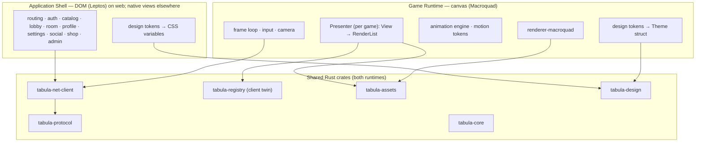
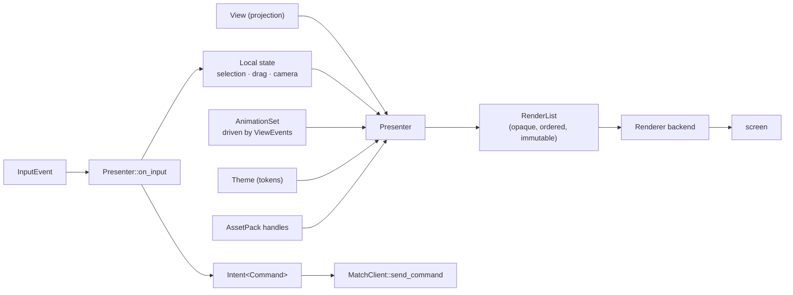
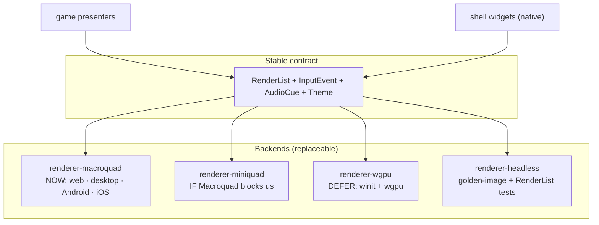
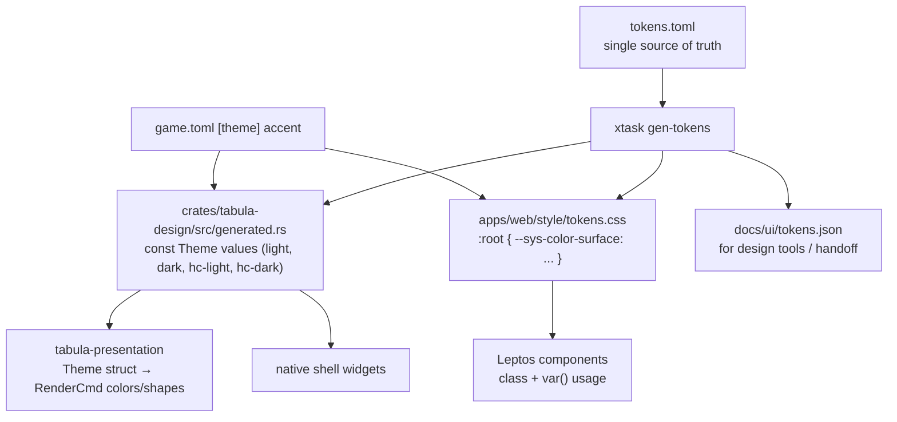
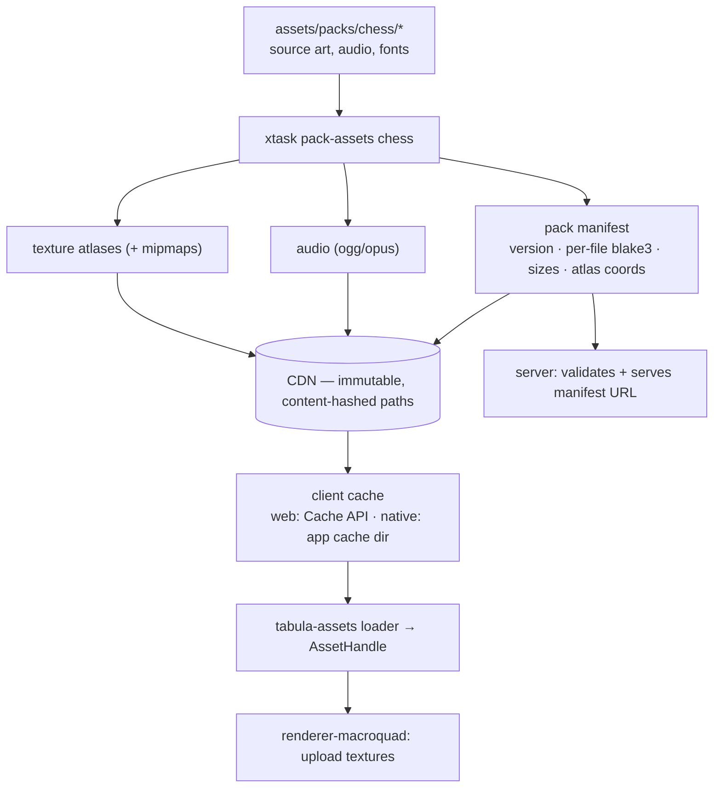

# 04 — Frontend and Design System

> Prerequisites: [`00`](./00-architecture-principles.md), [`02`](./02-game-module-and-sdk-design.md).
> Protocol/client-session details: [`05`](./05-data-protocol-and-replay.md).

---

## 1. Client architecture

Two runtimes, one design language, one set of shared Rust crates.



### 1.1 The separation rule

| Belongs in the shell | Belongs in the game runtime |
|---|---|
| Anything that is a *document*: lists, forms, text, history, settings | Anything that is a *board*: pieces, cards, tiles, tokens, boards |
| Anything needing native text input, IME, screen readers, deep links, SEO | Anything needing 60 fps, gestures, camera, particles, custom hit-testing |
| Long chat/history views, profiles, leaderboards | In-match HUD, in-match chat overlay (short), turn indicator, clocks |

Ambiguous cases and their rulings:

- **In-match chat**: a compact overlay drawn on the canvas for the last N messages; the full
  history is a shell view. Rationale: opening a DOM panel mid-match on mobile fights the canvas
  for input and IME focus. Text *entry* on web uses a hidden DOM input overlaid on the canvas —
  never a hand-rolled canvas text field (IME, autocorrect, and accessibility make that a trap).
- **Match result screen**: shell. It is a document with buttons and links.
- **Lobby "ready" panel while the board is visible**: canvas, because it must be one visual scene.
- **Settings during a match**: a canvas-drawn overlay with only the handful of in-match toggles
  (sound, motion, board theme); the full settings page is shell.

---

## 2. The Leptos application shell

### 2.1 Routes

```text
/                       home · continue playing · featured games
/login  /register       auth
/games                  catalog (filter by category, players, duration, complexity)
/games/:id              game detail · rules · config presets · play buttons
/rooms                  room browser
/rooms/:id              room detail: seats, ready, invite, room chat, settings
/queue                  matchmaking status
/play/:match_id         → HANDS OFF to the game runtime (§3)
/matches/:id            post-match summary · replay viewer · rematch
/u/:handle              profile · stats · history
/friends                social
/settings               account · appearance · motion · accessibility · audio · privacy
/shop                   cosmetics (later)
/admin/*                operator tooling (role-gated, separate bundle)
```

### 2.2 Shell state

```rust
// apps/web/src/state.rs
#[derive(Clone)]
pub struct AppState {
    pub session: RwSignal<Option<SessionInfo>>,     // user, entitlements, flags
    pub catalog: Resource<(), Vec<GameSummary>>,    // cached, ETag-revalidated
    pub presence: RwSignal<PresenceMap>,            // from the lobby WS subscription
    pub room:     RwSignal<Option<RoomView>>,       // live room state
    pub queue:    RwSignal<QueueState>,
    pub prefs:    RwSignal<Preferences>,            // persisted via KvStore
    pub net:      StoredValue<LobbyClient>,         // tabula-net-client, lobby topics only
}
```

Rules:

- The shell holds **one** WebSocket for lobby/social topics. It does **not** hold the match socket;
  the game runtime owns that.
- All server data arrives typed via `tabula-protocol`. No hand-written JSON parsing anywhere.
- CSR only at first (§3.5).

---

## 3. The app / game boundary

### 3.1 Web

Two independent WASM bundles:

```text
/                    → app.wasm    (Leptos shell, ~1.5–2.5 MB gz target)
/play/:match_id      → game.wasm   (Macroquad + registry + presenters, ~4–6 MB gz target)
```

`/play/:match_id` is a **separate document** (a real navigation, not a client-side route into a
canvas), served by a minimal HTML page that boots `game.wasm` with parameters from the URL and a
short-lived join token from `sessionStorage`.

### 3.2 Why separate bundles (ADR-011)

| Concern | Separate bundles (chosen) | Single bundle |
|---|---|---|
| Event loop | Macroquad owns `requestAnimationFrame` and the canvas; Leptos owns the DOM. No contention. | Macroquad's main loop and Leptos's reactive scheduler must cooperate; Macroquad's loop is not designed to yield to a framework. |
| Bundle size | Shell stays small; users who never play a given game never download its presenter | Everyone downloads everything |
| Build/iteration | Two `trunk`/`wasm-bindgen` pipelines, each fast | One slow pipeline |
| Input/IME/a11y | DOM handles text and screen readers; canvas handles pointers | Constant fights over focus and events |
| Crash isolation | A game panic does not take down the shell (the shell is a different document) | One panic kills everything |
| Cost | Handoff must be designed (§3.4); some duplicated code in both bundles | Simpler navigation |

The duplication cost is real but small: `tabula-protocol`, `tabula-core`, `tabula-design` tokens,
and `tabula-net-client` appear in both bundles. They are the *small* crates. The presenters and
Macroquad — the big things — appear only in `game.wasm`.

### 3.3 Native (desktop and mobile)

One binary. The shell screens are drawn by the **same** Macroquad runtime using a small set of
`RenderList`-based UI components from `tabula-presentation`, themed by the same tokens.

This is a real divergence between web and native and it is accepted deliberately:

- Web gets a DOM shell because the web platform's text, forms, accessibility, and deep linking are
  worth using.
- Native gets a canvas shell because shipping a WebView (or a second UI toolkit) into the mobile app
  just to render a lobby list contradicts ADR-019 and doubles the mobile surface.
- **The consequence to manage:** the lobby/catalog UI must be implemented twice (Leptos components
  and `tabula-presentation` widgets). That is bounded (roughly a dozen screens, mostly lists,
  cards, and forms) and both implementations consume the same tokens and the same protocol types,
  so they stay visually and behaviorally consistent. Screen *specifications* live in
  `docs/ui/screens/` and are the shared source of truth.
- **EXPERIMENT** (Phase 6): if native shell screens become a drag, evaluate a Tauri shell for
  desktop only, keeping mobile native.

### 3.4 Handoff: entering and leaving a match

```mermaid
sequenceDiagram
    participant U as User
    participant SH as Shell (/rooms/:id)
    participant SRV as Server
    participant GR as Game runtime (/play/:id)

    U->>SH: click "Start"
    SH->>SRV: POST /matches (or room start)
    SRV-->>SH: { match_id, join_token }
    SH->>SH: sessionStorage.set(match_ctx { match_id, join_token, game_id@version, pack })
    SH->>SH: prefetch asset pack manifest + game.wasm (link rel=prefetch)
    SH->>GR: navigate to /play/:match_id
    GR->>GR: read match_ctx; show branded loader with real progress
    GR->>SRV: WS Hello + Attach (join_token)
    SRV-->>GR: Welcome { view, capabilities }
    Note over GR: play
    GR->>SRV: match ends (ViewEvent Ended)
    GR->>GR: show in-canvas result summary + "Rematch" / "Back to lobby"
    GR->>SH: navigate to /matches/:id (full result screen) or /rooms/:id (rematch)
```

Details that matter:

- **Prefetch during the room screen.** By the time the user clicks start, `game.wasm` and the pack
  manifest should be warm. This is what makes a separate-bundle design feel seamless.
- **The loader is part of the brand**, not a spinner: game hero art, the token palette, real
  byte-level progress from `tabula-assets`, and a cancel that returns to the shell.
- **Back/forward and deep links work** because `/play/:id` is a real URL. Re-entering it resumes
  (doc 03 §10).
- **Native has no navigation**; it swaps a scene. The same `MatchContext` struct is passed
  in-process, so the game runtime code is identical.

### 3.5 SSR: not now

CSR only. Reasons: the app is authenticated (no SEO value behind login), SSR doubles the
deployment story (a Rust server rendering Leptos), and the marketing site is a separate static
site. **Reconsider when** we want public, indexable pages for game catalog entries, profiles, or
tournament results — at that point, add SSR/islands for exactly those routes.

---

## 4. Client networking and local state

### 4.1 One client crate, two transports

```rust
// crates/tabula-net-client/src/lib.rs
pub struct MatchClient {
    conn: Connection,                     // native or web backend
    codec: Codec,
    seq: u32,
    pending: VecDeque<Pending>,           // un-acked commands
    cursor: StateVersion,
    state: ConnState,                     // Connecting | Ready | Reconnecting | Resyncing | Failed
    events: mpsc::UnboundedSender<ClientEvent>,
}

pub enum ClientEvent {
    Welcome { view: Bytes, capabilities: GameCapabilities, seat: Option<SeatId> },
    ViewEvents { to: StateVersion, events: Vec<Bytes> },
    Resync { at: StateVersion, view: Bytes },
    Ack { client_seq: u32, at: StateVersion },
    Reject { client_seq: u32, code: RuleErrorCode, detail: Option<String> },
    Platform(PlatformEvent),              // chat, presence, voice grants, notices
    ConnState(ConnState),
    Fatal(FatalError),
}

impl MatchClient {
    pub fn send_command<C: Serialize>(&mut self, cmd: &C) -> u32;   // returns client_seq
    pub fn poll(&mut self) -> impl Iterator<Item = ClientEvent> + '_;  // called once per frame
}
```

`poll()` returning an iterator drained once per frame is the key ergonomic decision: the game loop
stays synchronous and single-threaded, with no `async` in the presentation path and no locks.

### 4.2 Local (non-authoritative) client state

```rust
pub struct MatchSession<R: GameRules, P: GamePresentation<Rules = R>> {
    view: R::View,                 // authoritative projection, replaced on Resync/folded on events
    pending: Vec<PendingCommand<R::Command>>,  // optimistic previews (I-12)
    local: P::Local,               // selection, drag, camera, animations, tooltips
    anim: AnimationSet,            // driven by ViewEvents, never by state diffs alone
}
```

- `view` is only ever written from the network.
- `pending` is cleared per command on `Ack` or `Reject`.
- `local` never travels upstream (I-10).
- If a game sets `client_preview = false`, `pending` is display-only ("sending…") with no rules
  evaluation client-side.

### 4.3 Structural guard for I-12

`PendingCommand` and `View` are different types and the presenter signature is
`present(view, local, frame)` — the preview is passed inside `local`. A presenter *cannot*
accidentally treat a preview as authoritative because it never receives a merged value; merging is
explicit and visible in the presenter (usually as a ghost/translucent piece).

### 4.4 Reconnect behavior (client side)

```text
close / error → ConnState::Reconnecting
attempt n:  delay = min(30s, 0.5s * 2^n) * rand(0.5..1.0)     [full jitter]
close code 4411 (draining) → immediate retry, no backoff
on connect:  Hello → Attach { resume_from: cursor, last_client_seq }
             ResumeOk → fold events, replay un-acked commands after acked_through
             Resync   → replace view, clear pending, clear animations, show a brief "resynced" cue
after 6 failed attempts → ConnState::Failed, offer "retry" and "leave match"
```

The UI must show connection state honestly and unobtrusively: a small pill near the turn indicator,
plus disabling command affordances while `Reconnecting`. Silent failure is the worst outcome; a
modal on every blip is the second worst.

### 4.5 Local storage

```rust
pub trait KvStore {
    fn get(&self, key: &str) -> Option<Vec<u8>>;
    fn set(&self, key: &str, value: &[u8]) -> Result<(), StoreError>;
    fn remove(&self, key: &str);
}
```

| Data | Key | Backend | Notes |
|---|---|---|---|
| Session token | `auth.session` | web: `localStorage`; native: OS keychain/credential store | Never in plain files on native |
| Preferences (theme, motion, audio, a11y) | `prefs.v1` | KvStore | Synced to the server when logged in, so a new device inherits them |
| Asset cache | content-hash keys | web: Cache API/IndexedDB; native: app cache dir | Managed by `tabula-assets` (§12) |
| Cached catalog | `catalog.v1` | KvStore | ETag revalidated |
| Last match context | `match.ctx` | `sessionStorage` (web) | For handoff + refresh recovery |
| Replay cache | `replay.<id>` | native only | Optional |

**No game state is ever cached locally as authoritative.** On reconnect, the server is the source
of truth; a stale local view is discarded.

---

## 5. The presentation contract

### 5.1 The pipeline



`RenderList` is **immediate-mode and stateless**: rebuilt every frame from
`(View, Local, Animations, Theme)`. No retained widget tree, no diffing, no invalidation logic. For
board games at a few hundred draw items per frame, rebuilding is cheap and eliminates an entire
class of stale-UI bugs.

`InputEvent::Pointer` carries a finite `PointerPosition`. Renderer backends validate framework
coordinates before emitting the backend-neutral event; the presentation contract does not impose a
viewport bound, so an otherwise valid pointer may be outside the viewport.

The public list is opaque and can only be produced by a validating builder. The backend receives a
flat stream, but the builder models every clip, transform, and opacity scope as a tree group before
flattening it. At each tree level, sibling draws and groups are stably ordered by `(layer, z)`;
the opening command, descendants, and closing command of a group stay contiguous. Consequently a
low-layer board group cannot leap over a root HUD draw merely because it contains stateful commands,
and inner draw layers do not escape their parent group. This replaces the earlier, unsound notion of
sorting an already-flat stream containing `Push*`/`Pop*` pairs.

### 5.1.1 Locked rendering semantics

`RenderListBuilder` is a deterministic, pure presentation-description builder: validated commands
become a tree of draws and scope groups, which is stably flattened for a backend. A group is a
**stacking context**. `Layer` and `z` are ordering roles **only among siblings in one stacking
context**; equal sibling keys preserve insertion order. A scope's own `(layer, z)` positions the
whole group, and a child layer never escapes that position. This is deliberately not a global
"higher layer is always on top" rule.

Presenters use finite **local logical units** for every `Rect`, sprite, text point, and path point.
`Viewport` is the finite, positive logical drawing extent. A backend maps logical units to device
pixels; `Dpi` affects that mapping only, never values stored in a `RenderList`. `measure_text`
returns logical-unit metrics for the same reason.

The camera is a local-to-logical mapping applied to draw geometry after active local transforms:
`logical = (local - camera.origin) * camera.zoom`. The default origin `(0, 0)` and zoom `1` are
identity. A `PushTransform` composes with its parent (`parent × child`) before the camera. A camera
origin is the local point mapped to logical origin; it is intentionally named `origin`, rather than
the previously ambiguous `center`.

`PushClip` is an axis-aligned **logical viewport scissor**. Its rectangle is not affected by the
camera or any `PushTransform`, regardless of whether the clip is pushed before or after a transform.
For every draw, the backend transforms local geometry, applies the camera, intersects rasterization
with the active logical scissor, then converts to device pixels. Rotated or transformed clips are
not part of this MVP contract.

`PushOpacity` is inherited **primitive opacity**: each descendant primitive multiplies its alpha by
the active opacity product. It is not render-target-backed composited group opacity, so overlapping
semi-transparent descendants can differ from a true group composite. A shipped need for the latter
is the migration trigger for an explicitly different render-target capability; it must not silently
change this command's semantics.

`renderer-headless` has two roles. Its recorder preserves every valid list verbatim. Its CPU
rasterizer implements only solid, square rectangles (and their borders), scopes, camera, and the
semantics above; it returns a structured unsupported-command diagnostic for sprites, text, paths,
linear gradients, and rounded rectangles rather than producing an incomplete golden image.

### 5.2 The MVP render command set

```rust
// crates/tabula-presentation/src/render.rs
pub struct RenderList { /* private validated command stream + camera */ }
// RenderListBuilder constructs nested stacking contexts, stably sorts sibling
// nodes by (layer, z), checks balanced Push*/Pop* pairs, then flattens for backends.

pub enum RenderCmd {
    /// Textured quad for a logical resource, with tint, rotation, and pivot.
    Sprite { asset: AssetRef, rect: Rect, tint: Color,
             rotation: f32, pivot: Vec2, layer: Layer, z: i16 },
    /// Rounded rectangle with optional per-corner radii and border.
    Rect { rect: Rect, radii: Corners, fill: Option<Paint>, border: Option<Border>,
           layer: Layer, z: i16 },
    /// Single-line or wrapped text with a semantic style token.
    Text { text: String, at: Vec2, style: TextStyleToken, align: Align,
           max_width: Option<Positive>, color: Color, layer: Layer, z: i16 },
    /// Straight or quadratic polyline; used for arrows, connections, highlights.
    Path { points: SmallVec<[Vec2; 8]>, stroke: Border, closed: bool,
           fill: Option<Paint>, layer: Layer, z: i16 },
    /// A logical-viewport scissor group. `layer`/`z` order the whole group.
    PushClip { rect: Rect, layer: Layer, z: i16 }, PopClip { layer: Layer, z: i16 },
    /// A local affine-transform group. `matrix` is finite; singular matrices are legal.
    PushTransform { matrix: Affine2, layer: Layer, z: i16 },
    PopTransform { layer: Layer, z: i16 },
    /// An inherited primitive-opacity group, not true off-screen group compositing.
    PushOpacity { opacity: Opacity, layer: Layer, z: i16 },
    PopOpacity { layer: Layer, z: i16 },
}

pub enum Paint { Solid(Color), LinearGradient(LinearGradient) }
pub struct LinearGradient { /* finite endpoints; at least two ordered GradientStop values */ }
pub struct Layer(pub u8);   // a sibling ordering role: Board=0, Pieces=10, …
```

That is the whole set. Nine command kinds, one paint type with two variants, one layer scheme.

### 5.3 What deliberately stays Macroquad-specific (for now)

Keeping these *outside* the abstraction is what prevents building a UI framework:

| Concern | Where it lives | Why not abstracted yet |
|---|---|---|
| Window/canvas creation, resize, DPI | `renderer-macroquad` | Every backend does this differently; the presenter only needs a logical size |
| Font loading, atlas packing, glyph caching | `renderer-macroquad` | Text is the most backend-specific area; we expose `TextStyleToken` + measured extents only |
| Text *shaping* (bidi, ligatures, complex scripts) | Macroquad's capability today | If we need it, `cosmic-text` lands in the backend, not in the contract |
| Particle systems, shaders, post-processing | Not supported | No game needs it yet. When one does, it arrives as `RenderCmd::Effect { id, params }` with a backend-provided registry (§5.4) |
| Render targets / offscreen passes | Not supported | Needed for real group opacity and blur; deferred until a design requires it |
| Input device details (touch ids, pen pressure, gamepad) | Backend normalizes into `InputEvent` | The normalized set is small and sufficient |
| Frame pacing, vsync | Backend | — |
| Audio playback | Backend implements `AudioSink` | — |

### 5.4 The rule that keeps the command set small

> **A new `RenderCmd` variant requires a shipped game that cannot be built without it, plus an
> implementation in every existing backend.**

Requests that must be refused under this rule (and their workarounds):

- "Blur behind the modal" → use a dimmed `Rect` with the scrim token.
- "Drop shadows on cards" → use a pre-authored shadow sprite in the asset pack (the elevation
  tokens define which sprite).
- "Animated gradient board" → a sprite sequence, or accept a static gradient.
- "Rich text with inline icons" → compose `Text` + `Sprite` at measured offsets; a helper in
  `tabula-presentation` does this for the common "text with inline piece glyph" case.
- "SVG rendering" → bake to sprites at pack build time.

Expected additions after four games ship, in likely order: `Effect { id, params }` (opt-in shader
hooks), `NinePatch` (scalable panels), and a real render-target-backed `PushOpacity`.

### 5.5 Why not an ECS (ADR-012)

For a chess board: 64 squares, ≤32 pieces, ~12 HUD elements. An ECS adds an archetype/query layer
whose benefits (cache-coherent iteration over thousands of homogeneous entities, dynamic
composition) do not apply, while its costs do: state becomes a bag of components (hostile to the
"canonical state is a small typed struct" invariant), determinism becomes dependent on system
ordering and entity id allocation, and reading the code requires reconstructing behavior from
scattered systems.

Where entity-like thinking *is* useful — many transient visual objects (drifting particles, floating
score numbers, dealt cards in flight) — the presenter keeps a plain `Vec<VisualObject>` in
`P::Local`. A game with an unusual need may use an ECS *inside its own presentation half*; that
choice cannot leak into rules or into the platform.

---

## 6. Renderer abstraction and evolution



### 6.1 `renderer-headless` exists from day one

A backend that records the `RenderList` (and optionally rasterizes it with `tiny-skia` for golden
images) is how presentation gets tested in CI without a GPU. It is ~200 lines and it pays for the
whole abstraction immediately, independent of any future renderer swap. **This is the honest
justification for the abstraction existing before we need a second real renderer.**

### 6.2 The `Renderer` trait

```rust
pub trait Renderer {
    fn begin_frame(&mut self, viewport: Viewport, dpi: Dpi, now_ms: u64, theme: Theme) -> FrameCtx;
    fn submit(&mut self, list: &RenderList) -> Result<(), RenderError>;
    fn end_frame(&mut self) -> Result<(), RenderError>;
    fn measure_text(&self, text: &str, style: TextStyleToken, max_width: Option<Positive>) -> Result<TextMetrics, RenderError>;
    fn drain_input(&mut self) -> Vec<InputEvent>;
}
```

`measure_text` is the one place presenters must ask the backend a question mid-layout. It is
synchronous and cached; a backend swap changes metrics slightly, which is acceptable because
layouts are token-driven and flexible rather than pixel-pinned. Its returned extent is in logical
units, never backend device pixels. Asset mapping remains a Phase-3 concern and does not cross this
MVP renderer boundary yet.

### 6.3 Migration triggers

| Move | Trigger (any one) | Cost estimate |
|---|---|---|
| Macroquad → Miniquad | Need custom render targets or shader pipelines Macroquad hides; text shaping requires direct control; input handling bugs we cannot patch around; Macroquad maintenance stalls | Rewrite one crate (`renderer-*`), ~2–4 weeks; games unaffected |
| Miniquad → winit+wgpu | Need compute, modern pipeline features, better multi-window, or a 3D game | 6–10 weeks; games unaffected if the command set held |
| Add `renderer-headless` | Immediately (Phase 2) | ~1 week |

**Anti-trigger:** "wgpu is more modern" is not a trigger. The trigger must be a blocked feature or
a shipped-quality problem.

---

## 7. Design system

### 7.1 Identity: inspired by Material 3 Expressive, not a clone

What we take from M3 Expressive:

- **Token-first architecture** (reference → system → component roles) and its rigor about semantic
  naming.
- **Tonal palettes** derived from a small number of source colors, giving guaranteed contrast
  relationships in light and dark.
- **Shape and motion as expressive dimensions**, not decoration: springy, physical, confident
  motion; larger and more varied corner radii; strong container hierarchy.
- **State layers** as the uniform mechanism for hover/focus/press/drag feedback.
- **Accessibility as a token property** (contrast pairs, minimum target sizes, reduced-motion
  variants), so it cannot be forgotten per component.

What we deliberately do *not* take:

- Google's component library, its exact palettes, its icon set, or its brand feel.
- Android-specific density and navigation conventions.
- The full M3 component taxonomy — we need roughly 20 components, not 100.

**Tabula's own identity** (the thing that must not look like a Google app):

```text
Feel:      "a well-made physical game on a good table"
Surfaces:  warm, tactile, layered — felt/wood/paper textures at low opacity over tonal surfaces
Type:      a high-contrast display face for game titles and results; a clear, wide-aperture
           text face for UI; tabular figures for clocks and scores
Shape:     generous, slightly asymmetric radii; game containers read as physical cards/boards
Color:     a neutral warm chrome so that GAME palettes dominate — the platform is the table,
           the games are the pieces
Motion:    weighty and spring-based; objects have mass; nothing slides linearly
Sound:     short, dry, physical (wood, card, click) — never electronic beeps
```

The single most important identity decision: **the platform chrome is deliberately quiet so that
each game's own palette can own the screen.** Each game declares an accent palette in its manifest,
and the in-match chrome adopts it.

### 7.2 Token architecture

```text
Tier 1 — reference tokens        raw values; nobody uses these directly
         ref.palette.warm.40, ref.type.display.size.3, ref.duration.200

Tier 2 — system (semantic) tokens   what code and design use
         sys.color.surface, sys.color.on-surface, sys.color.primary,
         sys.color.turn-active, sys.color.illegal, sys.shape.card,
         sys.motion.piece-move, sys.space.4, sys.elevation.2

Tier 3 — component tokens        only where a component needs to deviate
         comp.button.container-color, comp.board.grid-line-color
```

Rules: components reference tier 2; tier 3 exists only with a written reason; games reference
tier 2 plus their own game-scoped accent.

### 7.3 The token set

```rust
// crates/tabula-design/src/tokens.rs   (abridged; generated variants elided)
pub struct Theme {
    pub color: ColorTokens,
    pub type_: TypeTokens,
    pub shape: ShapeTokens,
    pub space: SpaceTokens,
    pub elevation: ElevationTokens,
    pub motion: MotionTokens,
    pub state: StateLayerTokens,
    pub density: Density,
    pub focus: FocusTokens,
}

pub struct ColorTokens {
    // surfaces
    pub surface: Color, pub surface_dim: Color, pub surface_bright: Color,
    pub surface_container_lowest: Color, pub surface_container: Color,
    pub surface_container_high: Color, pub surface_container_highest: Color,
    pub on_surface: Color, pub on_surface_variant: Color, pub outline: Color,
    pub outline_variant: Color, pub scrim: Color,
    // brand / accent (game-overridable)
    pub primary: Color, pub on_primary: Color,
    pub primary_container: Color, pub on_primary_container: Color,
    pub secondary: Color, pub on_secondary: Color,
    pub tertiary: Color, pub on_tertiary: Color,
    // semantic feedback
    pub success: Color, pub on_success: Color,
    pub warning: Color, pub on_warning: Color,
    pub danger: Color,  pub on_danger: Color,
    pub info: Color,    pub on_info: Color,
    // GAME semantics — the tokens that make a board legible
    pub turn_active: Color,        // whose turn it is
    pub turn_waiting: Color,
    pub legal_target: Color,       // a legal destination
    pub illegal_target: Color,
    pub selected: Color,
    pub last_action: Color,        // "the opponent just did this"
    pub threat: Color,             // check, danger, being voted
    pub hidden: Color,             // card backs, fog, unknown role
    pub team: [Color; 8],          // team/seat identity; never the sole differentiator
    pub seat_marker: [Color; 8],
}

pub struct MotionTokens {
    pub spring_snappy: Spring,     // UI affordances
    pub spring_standard: Spring,   // most transitions
    pub spring_weighty: Spring,    // pieces, tiles — things with mass
    pub spring_bouncy: Spring,     // celebratory
    pub dur_instant: u16,  // 80 ms  — state layer changes
    pub dur_short: u16,    // 160 ms — small moves, fades
    pub dur_medium: u16,   // 280 ms — piece moves, card deals
    pub dur_long: u16,     // 480 ms — phase changes, reveals
    pub dur_xlong: u16,    // 800 ms — win/loss sequences
    pub ease_standard: Easing, pub ease_emphasized: Easing,
    pub ease_decelerate: Easing, pub ease_accelerate: Easing,
    pub stagger: u16,      // 40 ms  — per-item delay in a sequence
    pub reduced: ReducedMotion,    // see §9.5
}

pub struct Spring { pub stiffness: f32, pub damping: f32, pub mass: f32 }

pub struct ShapeTokens {
    pub none: Corners, pub xs: Corners, pub sm: Corners, pub md: Corners,
    pub lg: Corners, pub xl: Corners, pub full: Corners,
    // semantic
    pub card: Corners, pub board: Corners, pub token: Corners,
    pub sheet: Corners, pub button: Corners, pub chip: Corners,
}

pub struct StateLayerTokens {
    pub hover: Percent,     // 0.08 opacity of on-color over the container
    pub focus: Percent,     // 0.12
    pub press: Percent,     // 0.12
    pub drag: Percent,      // 0.16
    pub disabled_content: Percent,   // 0.38
    pub disabled_container: Percent, // 0.12
}

pub struct SpaceTokens { /* 0,2,4,8,12,16,20,24,32,40,48,64 */ }
pub struct Density { pub scale: f32, pub min_target: f32 }   // min_target ≥ 44 dp touch
```

The generated implementation is intentionally more precise than this abridged
sketch: `Theme` contains all twelve named spacing values; reference and
semantic shape roles; disabled state layers; renderer-neutral role+size
typography; and semantic motion profiles. Bounded values such as exact-whole-percentage opacities,
positive metrics, radii, density, and spring parameters are validated before
generation and represented by refined runtime values. See
[`docs/ui/tokens.md`](../ui/tokens.md) for the authored-token audit and the
executable verification ledger.

### 7.4 Typography

| Role | Use | Notes |
|---|---|---|
| `display.lg/md/sm` | Game titles, win/loss, big numbers | Display face, tight tracking |
| `headline.lg/md/sm` | Screen and section titles | — |
| `title.lg/md/sm` | Card titles, dialog titles, player names | — |
| `body.lg/md/sm` | Prose, rules text, chat | Wide aperture, generous line height |
| `label.lg/md/sm` | Buttons, chips, badges, HUD labels | Slightly tighter, all-caps optional |
| `mono.md/sm` | Clocks, scores, coordinates, ids | **Tabular figures required** — a clock whose digits shift width is unacceptable |

Font loading: the shell uses `font-display: swap` with a system fallback stack; the game bundle
loads exactly two faces (display + text) from the shared brand pack, plus mono. CJK and Vietnamese
coverage is a *requirement* (the first market is Vietnam): the text face must include full
Vietnamese diacritics, and CJK falls back to a system face rather than shipping a 10 MB webfont.

---

## 8. Theme adapters



### 8.1 Generation, not duplication

`tokens.toml` is authored once (ADR-027). `xtask gen-tokens` emits the typed `tabula-design` Rust
runtime plus CSS custom properties and a JSON export. CI fails if generated files are stale. There is **no hand-written color literal**
anywhere in `apps/web`, `tabula-presentation`, or any game presenter — enforced by a lint
(`xtask check-no-raw-colors`) that greps for hex literals and `Color::new(` outside
`tabula-design`.

### 8.2 Leptos usage

```rust
view! {
    <button class="btn btn--filled" data-state=move || state.get().as_str()>
        {move || label.get()}
    </button>
}
```

```css
/* generated tokens.css (excerpt) */
:root {
  --sys-color-primary: #7B4DFF;
  --sys-color-on-primary: #FFFFFF;
  --sys-shape-button: 14px;
  --sys-motion-spring-snappy: 380, 26, 1;   /* stiffness, damping, mass */
  --sys-state-hover: 0.08;
}
/* hand-written component CSS consumes ONLY vars */
.btn--filled {
  background: var(--sys-color-primary);
  color: var(--sys-color-on-primary);
  border-radius: var(--sys-shape-button);
}
.btn--filled[data-state="hover"]::after { opacity: var(--sys-state-hover); }
```

### 8.3 Macroquad usage

```rust
let t: &Theme = theme();               // resolved once per frame, from prefs + game accent
list.push(RenderCmd::Rect {
    rect: card_rect,
    radii: t.shape.card,
    fill: Some(Paint::Solid(t.color.surface_container_high)),
    border: Some(Border { width: 1.0, color: t.color.outline_variant }),
    layer: Layer::HUD, z: 0,
});
```

### 8.4 Per-game accent

```toml
# games/chess/game.toml (future contract; not a Phase-2 pipeline)
[theme]
accent      = "#3E7B5A"      # source color for a build-time resolver
board_light = "sys.surface.container-lowest"
board_dark  = "sys.surface.container-high"
mood        = "calm"          # calm | lively | tense — selects a motion profile
```

`tokens.toml` currently uses **authored resolved schemes**: its reference
palette is design guidance and its resolved semantic scheme values are the
authority. A future game accent resolver may be precomputed at build time (not
runtime) and may accept only a source accent and mood. A game may not override
semantic *roles* such as `danger`, `legal_target`, focus, or accessibility
critical on-colors.

---

## 9. Motion

Motion is not decoration in a board game. It is **how state changes are communicated**. A card that
teleports into a hand is confusing; a card that flies from the deck is self-explanatory.

### 9.1 The hard invariant

> **Animation never affects canonical state, never gates command submission, and never delays
> authority.** (I-10)

Concretely:

- A command is sent the instant the intent is formed. The animation is a consequence of the *event*,
  not a precondition of the command.
- Skipping or interrupting an animation (window blur, reduced motion, fast-forward in replay) must
  produce the same final view.
- If two events arrive faster than their animations, animations **compress or drop**; they never
  queue unboundedly. Rule: an animation whose start is already >600 ms stale snaps to its end state.

### 9.2 Semantic motion tokens

Each maps to a spring/duration and a choreography, so the same action feels the same in every game.

| Token | Used for | Spec |
|---|---|---|
| `motion.piece-move` | chess piece, meeple, pawn moves | `spring_weighty`, path is a slight arc, 0.94→1.0 scale on land, dust/settle sound |
| `motion.card-deal` | dealing to hands | `spring_standard`, `dur_medium`, `stagger` 40 ms per card, arc from deck to fan position |
| `motion.card-play` | playing to the table | `spring_snappy`, flip if revealing, slight overshoot |
| `motion.tile-place` | tile placement | `spring_weighty` scale-in from 1.08 with a 2° rotation settle |
| `motion.token-drop` | meeple/marker placement | `spring_bouncy` short |
| `motion.reveal` | flipping a hidden thing | `dur_long` two-phase: lift + flip, with a highlight sweep |
| `motion.phase-change` | werewolf day/night, round change | `dur_long` full-screen tonal wash + title card; **must be skippable** |
| `motion.turn-change` | active-seat indicator | `dur_short` glow travel between seat markers |
| `motion.vote` | vote cast/retracted | `dur_short` marker fly to target + counter tick |
| `motion.score-update` | score/clock changes | number roll with `ease_decelerate`, `dur_medium`; clocks never animate digits |
| `motion.win` / `motion.lose` | outcome | `dur_xlong` choreographed sequence, always skippable by tap |
| `motion.invalid` | rejected command | 120 ms 3-cycle shake, `danger` state layer flash, short dry sound — **never a modal** |
| `motion.enter` / `motion.exit` | overlays, sheets, toasts | `spring_standard` slide+fade, exit 0.7× duration of enter |
| `motion.drag-lift` / `motion.drag-drop` | picking up / releasing | elevation change + shadow growth + 1.04 scale |

### 9.3 Choreography rules

1. **One focal animation at a time.** If a move causes a capture, a check, and a clock update, the
   move is focal; the others are secondary (smaller, faster, concurrent).
2. **Sequence with stagger, not with waits.** Dealing 13 cards = one animation with a per-item
   delay, not 13 chained animations.
3. **Motion follows causality.** The animation for an event starts from where the player last saw
   the object, which is why animations are driven by `ViewEvent`s (which describe *what happened*)
   rather than by diffing views (which only shows *what changed*).
4. **Opponent actions get 1.15× duration** — the player did not initiate them and needs a moment
   longer to parse.
5. **Replay/spectator fast-forward multiplies all durations by a speed factor** and clamps to
   instant above 4×.

### 9.4 Interaction states

Every interactive element implements the full set. The state layer tokens (§7.3) make this uniform
across DOM and canvas.

| State | DOM | Canvas | Notes |
|---|---|---|---|
| `enabled` | base | base | — |
| `hover` | `:hover` + state layer 0.08 | pointer-inside hit-test + layer | Not applicable on touch; must not be required to discover an affordance |
| `focus-visible` | `:focus-visible` + 3 px ring, `focus` token | 3 px ring drawn as `Path` | Keyboard navigation is mandatory (§10.3) |
| `press` | `:active` + layer 0.12 + 0.97 scale | pointer-down + layer + scale | Immediate, < 80 ms |
| `drag` | layer 0.16 + elevation up | `motion.drag-lift` | Ghost/preview at the source |
| `drop-valid` | target outline `legal_target` + pulse | same | Shown only for legal targets |
| `drop-invalid` | target tint `illegal_target` | same | Passive; no error text |
| `selected` | `selected` token container | ring + fill | Persistent until deselected |
| `disabled` | content 0.38 / container 0.12 | same | Must also be explained (tooltip/aria) |
| `loading` | skeleton or spinner | skeleton | Skeletons for known shapes, spinner only when shape is unknown |
| `success` | `success` flash 240 ms | same | For confirmations, not for every move |
| `invalid` | `motion.invalid` | `motion.invalid` | The rejection feedback path (doc 03 §7 step I2) |

### 9.5 Reduced motion

`prefers-reduced-motion` (web) and an in-app toggle (all platforms), stored in prefs and synced.

```rust
pub struct ReducedMotion {
    /// A validated percentage that multiplies durations (0 = instant).
    pub duration_scale: Percent,    // 0 strict, 50 "less motion"
    /// Replace movement with cross-fade.
    pub prefer_fade: bool,
    /// Disable parallax, camera drift, background motion, particles entirely.
    pub disable_ambient: bool,
    /// Keep motion that carries information (piece moves) even in strict mode, but shorten it.
    pub keep_informative: bool,     // default true
}
```

Motion profiles carry an `Informative` or `Ambient` category in addition to
their resolved duration, spring, and optional stagger. Reduced-motion policy
can therefore preserve/shorten informative movement while disabling ambient
motion; it is not merely a zero-duration switch.

The `keep_informative` default matters: a strict "no animation" mode that teleports pieces makes
board games *less* accessible, not more. The right reduced-motion behavior is short, direct,
fade-assisted movement — plus a persistent "last action" highlight (the `last_action` token) so the
information survives even at zero duration.

---

## 10. Responsive layout, input, and accessibility

### 10.1 Breakpoints and layout

| Breakpoint | Width | Shell layout | Game layout |
|---|---|---|---|
| `compact` | < 600 dp | Single column, bottom nav, sheets instead of dialogs | Board fills width; HUD docked bottom; hands as an arc at the bottom edge |
| `medium` | 600–904 dp | Two-pane where useful (list + detail), rail nav | Board centered with side HUD; larger hand fan |
| `expanded` | 905–1439 dp | Two/three pane, persistent nav rail | Board + right sidebar (chat/history/players) |
| `large` | ≥ 1440 dp | Max content width, centered | Board capped; sidebars both sides; spectator layouts |

Orientation:

- **Portrait** is the primary mobile target for hand-held games (cards, werewolf).
- **Landscape** is primary for wide boards (chess is fine either way; tiles prefers landscape).
- Each game declares `preferred_orientation` and `min_board_aspect` in its manifest; the runtime
  rotates/letterboxes accordingly and never distorts the board's aspect.
- The board's layout is computed from a **logical board rect** plus safe-area insets (notches,
  home indicators, rounded corners). Safe areas are provided by the backend as part of `FrameCtx`.

### 10.2 Touch targets and reachability

- Minimum interactive target: **44 × 44 dp**, enforced by a debug overlay that flags smaller hit
  rects in dev builds.
- Small game elements (a chess square on a phone is ~40 dp) get an **expanded hit rect** larger
  than their visual, with nearest-neighbour disambiguation — plus a magnified "lifted piece"
  preview under the finger during drag so the finger does not occlude the target.
- Primary actions live in the bottom third on `compact` (thumb reach); destructive actions never
  there.
- Two interaction schemes are supported for every board game, and both must work: **tap-tap**
  (select then target) and **drag-drop**. Tap-tap is the accessible default and the only scheme
  that works with switch access and keyboard.

### 10.3 Input matrix

| Input | Support | Notes |
|---|---|---|
| Touch | Full | Tap, long-press (context), drag, pinch-zoom, two-finger pan |
| Mouse | Full | Hover states, right-click context, wheel zoom, middle-drag pan |
| Keyboard | **Full, mandatory** | Tab/arrow navigation of board cells, Enter to select/confirm, Esc to cancel, `?` for shortcuts, digit keys for seat/vote selection |
| Gamepad | Deferred | Normalized into the same `InputEvent` when it arrives (Phase 6+) |
| Switch access / single-switch | Via keyboard path | Tap-tap scheme + focus order makes this work for free |
| Stylus | Treated as mouse with pressure ignored | — |

Keyboard board navigation is a `tabula-presentation` service, not per-game code: a game supplies a
**focus graph** (cells and their neighbours) derived from its view, and the service handles
traversal, focus rendering, and activation.

### 10.4 Accessibility

| Requirement | Shell (DOM) | Game (canvas) |
|---|---|---|
| Screen reader | Native: semantic HTML, ARIA where needed, live regions for turn/chat/notifications | **Board Reader** (below) |
| Text scaling | Respect browser/OS text size up to 200%; layout must reflow, not clip | `Density.scale` multiplies type and spacing tokens; boards scale independently of HUD text |
| Contrast | All token pairs ≥ 4.5:1 for text, ≥ 3:1 for large text and UI outlines — **verified in CI** by a token contrast test | Same tokens, same test |
| High contrast mode | `hc-light` / `hc-dark` themes | Same |
| Color blindness | Never color-only encoding: every team/seat color pairs with a **shape** and a **label**; a "symbols on pieces" preference adds glyphs to game pieces | Same |
| Reduced motion | §9.5 | §9.5 |
| Focus visible | Always, 3 px ring, never removed | Drawn ring |
| Captions / no-audio | All audio cues have visual equivalents | Same |
| Timing | Games with clocks offer, where the game allows, a "no-clock" casual mode; phase timers in werewolf are configurable | — |

#### The Board Reader (canvas accessibility fallback)

A canvas is opaque to assistive technology. Rather than pretend otherwise, every game provides
`describe(view, viewer) -> A11yDescription` (doc 02 §3). The client-side presentation layer derives
its accessibility description from `(View, Local)` so transient controls such as promotion remain
visible, then renders it as a **real DOM mirror** on web (and as a native accessibility tree on
mobile, via a small platform bridge).

```rust
pub struct A11yDescription {
    /// One-line summary, announced on change: "Your turn. White to move. 3:12 remaining."
    pub status: String,
    /// Structured, navigable regions.
    pub regions: Vec<A11yRegion>,
    /// Actions available now, with the keyboard/AT activation path.
    pub actions: Vec<A11yAction>,
}
pub struct A11yRegion {
    pub label: String,                    // "Board", "Your hand", "Players"
    pub items: Vec<A11yItem>,             // each with label, position, state, and an activation id
}
pub struct A11yAction { pub id: ActionId, pub label: String, pub enabled: bool }
```

On web, the game page renders this as a visually-hidden but focusable DOM tree next to the canvas,
updated from the same `(View, Local)` inputs. Activating a DOM item exposes an `ActionId`; mapping
that id to an `Intent` is a Phase 5 residual, not yet an end-to-end path. The target is playability
without the canvas. This is why `describe()` is part of the game contract rather than an afterthought.

Phase plan: `status` + `actions` in Phase 5 (announcements and keyboard play), full `regions`
navigation in Phase 9. Games with no `describe()` implementation are flagged in CI and may not be
marked "accessible" in the catalog.

---

## 11. Voice UI (and why no custom SFU)

Client responsibilities only; the server side is doc 03 §17.

| Element | Behavior |
|---|---|
| Permission | Mic permission requested at the moment of joining voice, never at app start, with a clear reason string |
| Join model | Explicit opt-in per match. `VoiceRequirement::Recommended` (werewolf) shows a prominent prompt; `Optional` shows a quiet button |
| Speaking indicator | Per-seat ring animation driven by local audio levels, `motion.turn-change`-like but continuous; must be visible on the board, not only in a panel |
| Mute | Push-to-talk and toggle, both; the current mode is a preference. Mute state is shown redundantly (icon + ring) |
| Scope changes | When the game changes voice scopes (werewolf night), the UI shows an unmissable transition: "You are now in the Wolves channel" with a distinct color and sound |
| Server-enforced mute | Shown differently from self-mute ("You cannot speak during the night") so users do not think it is a bug |
| Fallback | If WebRTC fails (restrictive network), the UI says so plainly and the match continues with text chat |
| Device selection | Input/output picker on desktop and web; system default on mobile |

**No custom SFU** (ADR-016). An SFU is a full-time media engineering effort: simulcast, bandwidth
estimation, packet loss recovery, jitter buffers, TURN operations, and platform-specific codec
quirks. Werewolf needs 6–20 participants, which is beyond mesh but squarely inside what proven SFUs
handle. We adopt one behind `VoiceService`, measure, and keep the option to change.

---

## 12. Asset system

### 12.1 Target model

The following diagram describes the target asset-delivery system. The pure
manifest, identity, integrity, and source-port boundaries described in §12.2
are implemented today; concrete delivery adapters remain future work.



### 12.2 Target delivery rules

The following rules describe the target Phase-3 delivery system. The pure
manifest, identity, integrity, and source-port boundaries described below are
implemented today; concrete delivery adapters remain future work.

1. **No game's full-resolution assets are in any app binary.** The binary carries only: brand
   assets, UI icons, two fonts, and a tiny placeholder set (so a game is playable-if-ugly when the
   CDN is unreachable).
2. **Content-hashed, immutable URLs** → `Cache-Control: public, max-age=31536000, immutable`. The
   manifest itself is short-cached and ETagged.
3. **Pack version is pinned per game version.** A match records the pack it expects, so a mid-match
   asset update cannot change what players see.
4. **Progressive loading with priorities:** `Critical` (board, pieces, UI needed for the first
   frame) blocks the start; `High` (sounds, secondary art) loads during the first turns;
   `Low` (celebration art, alternative themes) loads lazily. The loader reports real byte progress
   for the branded loader (§3.4).
5. **Integrity check on every cached file** (blake3 vs manifest). A mismatch re-downloads.
6. **Per-density variants**: `@1x/@2x/@3x` atlases, with the manifest listing only what exists.
   `BoundAssetPack::resolve(asset_ref, target_density)` is the pure layer that selects the nearest
   physical `AssetFile`; `AssetSource` and the future loader consume its selected `AssetPath` and
   do not choose density variants.
7. **Cache budget**: 300 MB default on native, 150 MB on web, LRU eviction by pack, never evicting
   the pack of a live match.
8. **Offline target**: a previously-played pack remains cached so local/bot play can use it without
   a server. The rules engine already supports local play; asset-pack caching does not exist yet.

The Phase-3 asset identity is typed and pinned end-to-end. The architecture
enforces a strict separation between logical resource identity and physical pack metadata:

- **`AssetRef`** (`tabula-game-api`): semantic/logical resource identity representing presentation and catalog intent (e.g. `pieces/white-knight`, `catalog/icon`, `board/background`). Presenters and metadata never know physical filenames, atlas coordinates, density variants, hashes, or CDN URLs.
- **`AssetFileName`** (`tabula-assets`): manifest-local identity of a physical file entry (e.g. `pieces@2x.atlas`, `move.ogg`).
- **`AssetPath`** (`tabula-assets`): canonical relative physical pack path (e.g. `chess/1.0.0/pieces@2x.b3-4f8a.png`).
- **`AssetPackRef`** (`tabula-assets`): exact versioned asset pack identity (e.g. `chess@1.0.0`).

```text
GameMetadata / GamePresentation
              │
              ▼
           AssetRef
              │
              │ explicit resource declaration + pure resolution
              ▼
      AssetPackManifest
              │
              ├── AssetResource
              ├── AssetFileName
              ├── AssetPath
              ├── AssetContentHash
              └── AssetDensity
```

The current implementation includes the pure identity, binding, resolution, and byte-integrity layer:

- `AssetPackRef`: the exact pack identity (`AssetPackId`) and version (`AssetPackVersion`), canonically formatted as `pack@version`.
- `AssetPackManifest.game`: the reverse-DNS game ID to which the pack is bound.
- `AssetResource`: one explicit `AssetRef` declaration with one density-independent file variant or one variant per density-aware `AssetFile`.
- `AssetPixelRegion`: structural physical source-pixel metadata, distinct from logical `Rect`; it proves positive extents and non-overflowing endpoints, not decoded-image bounds.
- `AssetPackManifest::validate_binding(...) -> BoundAssetPack`: pure binding evidence for one exact requested `AssetPackRef` and `GameId`.
- `BoundAssetPack::resolve(...) -> ResolvedAsset`: pure deterministic metadata lookup. Exact density wins; otherwise nearest density wins, with equal distances selecting the higher density.
- `AssetSource`: platform-neutral, async-capable port addressed only by a physical `AssetPath`; it returns owned `UnverifiedAssetBytes` and never performs integrity verification.
- `MemoryAssetSource`: deterministic in-memory reference source for tests; it is not a cache and does not know logical `AssetRef` values.
- `VerifiedAssetBytes`: typed proof binding an exact `AssetFile` and verified raw bytes, constructible only by `AssetFile::verify_bytes` after size and BLAKE3 checks succeed.

Implemented now:

- manifest TOML parsing with unknown-field rejection;
- validated pack/file identity, canonical relative paths, hashes, sizes, priorities, and densities;
- duplicate file-name and path rejection;
- explicit logical resource declarations with no filename inference;
- structural atlas-region validation and shared physical atlas files;
- pack-to-game binding witness and deterministic pure resource resolution;
- byte-level integrity verification against manifest-declared size and BLAKE3 hash ([`AssetFile::verify_bytes`] returning [`VerifiedAssetBytes`]).
- platform-neutral `AssetSource` port with explicit `UnverifiedAssetBytes` output;
- deterministic `MemoryAssetSource` reference adapter and source-to-integrity composition.

Not implemented yet:

- filesystem, HTTP, or browser asset-source implementations;
- cache management, CDN URL/signature generation, or retry policy;
- decoding or renderer handles.

The resolution and loading pipeline flow:

```text
GamePresentation::asset_pack()
        ↓
   AssetPackRef
        ↓
  manifest fetch          [future]
        ↓
 parse + validate
        ↓
 validate_binding → BoundAssetPack
        ↓
resource resolution       [implemented / pure]
        ↓
   ResolvedAsset
        ↓
     AssetFile
        ↓
AssetSource::fetch(AssetPath) [port; memory reference implemented]
        ↓
  UnverifiedAssetBytes     [untrusted input]
        ↓
verify size + BLAKE3      [implemented / pure]
        ↓
VerifiedAssetBytes
        ↓
  decode / loader         [future]
        ↓
   loaded handles         [future]
```

The Phase-3 manifest parser proves that each path is a safe, canonical relative
pack path and that the manifest declares a structurally valid content hash. `AssetPath` does not
yet prove that the path embeds that hash. Pure byte-level integrity verification (`AssetFile::verify_bytes`)
enforces that actual bytes match the declared size and BLAKE3 hash before producing `VerifiedAssetBytes`.
Future concrete asset sources will pass all fetched bytes through this verification boundary before
cache persistence or decoding. The current `MemoryAssetSource` exercises the same composition
without performing I/O.

### 12.3 Manifest schema

The parser accepts `pack`, `version`, `game`, `files`, and explicit `resources`; unknown fields
at every level are rejected. A logical resource is never inferred from a filename, path, atlas
name, extension, or density suffix. `RenderCmd::Sprite` carries only `AssetRef` and logical
geometry; physical source-pixel regions belong only to the matching resource variant.

```toml
# generated: assets/packs/chess/pack.toml → served as pack.json
pack    = "chess"
version = "1.0.0"
game    = "com.tabula.chess"

[[files]]
name     = "pieces@1x.atlas"
path     = "chess/1.0.0/pieces@1x.b3-4f8a.png"
hash     = "0123456789abcdef0123456789abcdef0123456789abcdef0123456789abcdef"
bytes    = 412_003
priority = "critical"
density  = 1

[[files]]
name     = "pieces@2x.atlas"
path     = "chess/1.0.0/pieces@2x.b3-9c21.png"
hash     = "0123456789abcdef0123456789abcdef0123456789abcdef0123456789abcdef"
bytes    = 824_006
priority = "critical"
density  = 2

[[resources]]
id = "pieces/white-knight"

[[resources.variants]]
file = "pieces@1x.atlas"
region = { x = 0, y = 0, width = 64, height = 64 }

[[resources.variants]]
file = "pieces@2x.atlas"
region = { x = 0, y = 0, width = 128, height = 128 }
```

---

## 13. Audio

### 13.1 Stable Phase-2 contract

- `tabula-presentation` owns the synchronous, renderer-neutral `AudioCue` / `AudioSink` contract;
  `renderer-macroquad` supplies the MVP sink.
- A presenter derives ordered, pack-local one-shot cue IDs from authoritative projected
  `ViewEvent`s, never canonical `State` or speculative `Intent`. The active
  `GamePresentation::asset_pack()` scopes IDs, so platform code never branches on `game_id`.
- Presentation owns cue semantics; the sink owns playback of already-resolved handles; the asset
  system owns loading and resolution. Asset loading remains Phase 3 work.
- Playback failures (for example, an unavailable loaded handle) are non-authoritative: they cannot
  fail, roll back, or otherwise alter a match, its projection, or input processing.
- Every audio cue has a visual equivalent (§10.4).

### 13.2 Deferred client and backend policy

The following are product/backend policy, not fields or behavior in the stable `AudioCue` API:

- mute and volume preferences;
- voice ducking;
- buses and music;
- browser autoplay policy;
- cooldown and voice-count policy.

They remain deferred until a shipped behavior establishes a concrete requirement. They must not
change the meaning of a pack-local cue identity or affect authoritative match behavior.

---

## 14. Component inventory and MVP scope

### 14.1 Components needed (both DOM and canvas implementations, per §3.3)

```text
Buttons: filled · tonal · outlined · text · icon · fab(mobile)
Inputs:  text · number · select · toggle · checkbox · radio · slider · search
Containers: card · panel · sheet(bottom) · dialog · tooltip · popover · banner · toast
Navigation: top bar · nav rail · bottom nav · tabs · breadcrumb · back
Data: list item · table(compact) · avatar · badge · chip · progress · skeleton · empty state
Game-specific: seat marker · turn indicator · clock · score pill · hand fan · board grid ·
               piece · card · tile · vote marker · phase banner · action bar · log/history strip
Feedback: state layers · focus ring · shake(invalid) · confetti(win, reduced-motion aware)
```

### 14.2 MVP scope by phase

| Phase | Frontend deliverable |
|---|---|
| 2 | `tabula-design` tokens + `xtask gen-tokens`; `tabula-presentation` with the §5.2 command set; `renderer-macroquad`; `renderer-headless`; chess board renders and is playable locally hot-seat |
| 3 | Card fan, tile board with camera/zoom/rotation; animation engine + motion tokens; audio cues; asset packs |
| 4 | `tabula-net-client`; networked play in the native client; reconnect UI; spectator view |
| 5 | Leptos shell (all routes in §2.1); handoff; a11y `status`+`actions`; settings incl. motion/contrast; admin skeleton |
| 6 | Mobile layouts, safe areas, touch tuning, orientation handling, native shell screens |
| 7 | Werewolf UI: phase banners, voting, scoped chat overlay, role reveal choreography |
| 8 | Voice UI |
| 9 | Board Reader full regions; replay viewer with scrub; delayed spectator UI; theming polish |

### 14.3 Frontend non-goals for MVP

```text
no gamepad support                       no user-authored themes
no in-canvas rich text                   no 3D
no custom shaders                        no in-app purchase UI
no video (only static + sprite anim)     no localized voice-over
no SSR                                   no offline multiplayer sync
```

---

**Next:** [`05-data-protocol-and-replay.md`](./05-data-protocol-and-replay.md)
