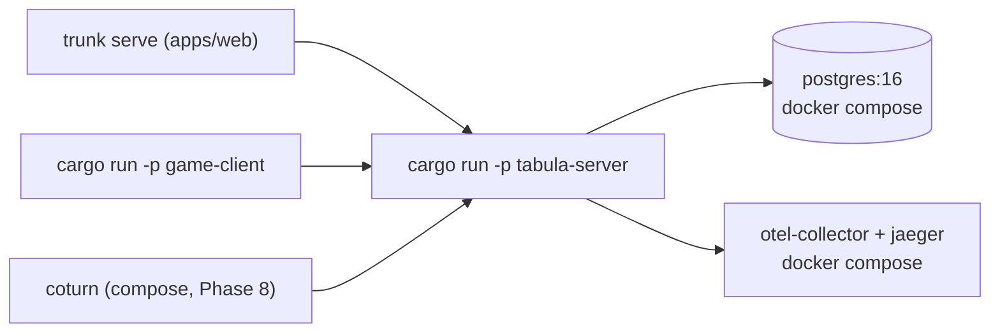
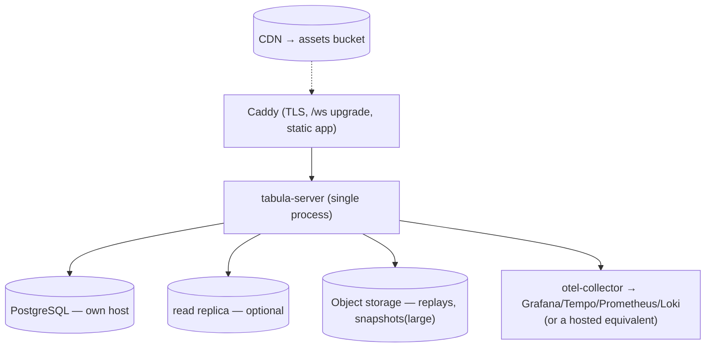
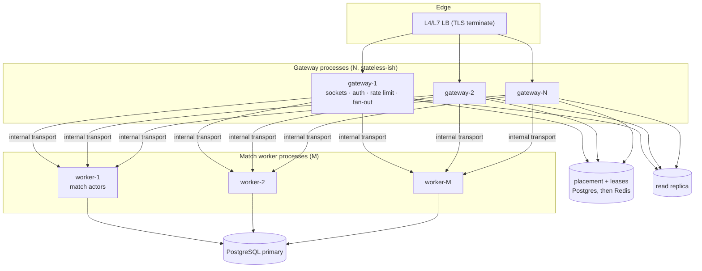
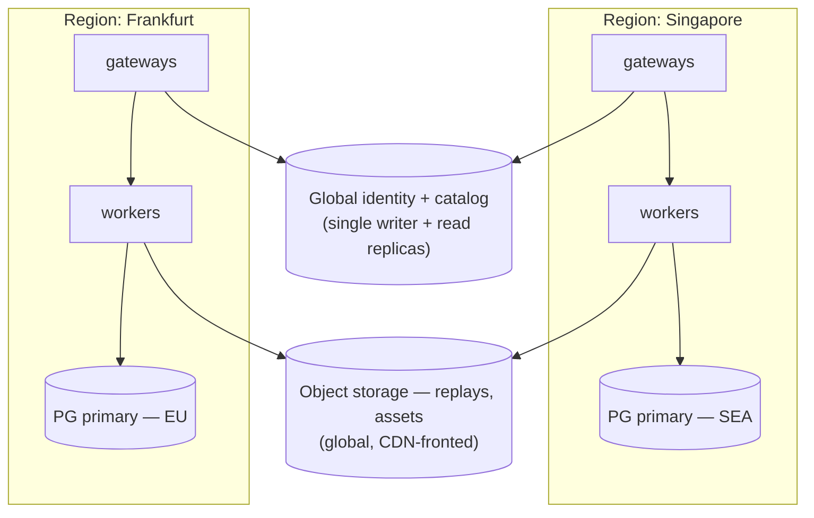
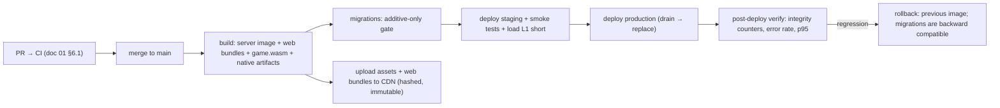

# 06 — Scaling, Deployment, and Observability

> Prerequisites: [`00`](./00-architecture-principles.md), [`03`](./03-backend-and-multiplayer-plan.md).

---

## 1. Philosophy

Three rules govern this document.

1. **CCU numbers are labels, not laws.** A "5k CCU" architecture is shorthand for "the shape you
   need once symptom X appears". Every stage transition below is defined by a **measurable symptom**
   first and a CCU range second. If the symptom is absent, do not do the work.
2. **Add capacity in the cheapest order:** tune → scale up → scale out → decompose. Most teams skip
   to decompose and pay for it forever.
3. **Every stage must be operable by one person at 2 a.m.** If a stage cannot be diagnosed with
   three dashboards and one log query, it is too complex for the team that owns it.

### 1.1 The trigger table (read this first)

| Symptom (measured) | Threshold | Action | Stage |
|---|---|---|---|
| p95 command latency (ack) | > 120 ms sustained 15 min | Investigate: DB commit vs apply vs fan-out (the spans separate them) | any |
| CPU saturation on the server | > 70% of allocated cores, 15 min avg | Scale up first; then Stage 2 split | 1 → 2 |
| Memory | > 70% of host RAM | Check per-match memory metric; tune WS buffers; scale up | 1 |
| WebSocket count per instance | > 15,000 | Stage 2 (gateway replicas) | 1 → 2 |
| Live matches per instance | > 8,000 | Stage 2, then Stage 3 sharding | 1 → 2 → 3 |
| Postgres write TPS | > 4,000 sustained | Batch more aggressively; partition; then read replica for reads | 6.x |
| Postgres CPU | > 65% | Scale up, tune, partition | 6.x |
| Event log table size | > 50 GB | Partition **now** (before it hurts) | 6.3 |
| Match placement lookup p95 | > 5 ms | Redis directory | 4.3 |
| Presence-related DB transactions | > 15% of total | Redis presence | 4.3 |
| Match migration/rehydration rate | > 2% of matches per hour | Ownership leases + stickier routing | 5.1 |
| Matchmaking queue median wait | > 30 s at > 200 concurrent queuers | Better matchmaker; distributed queues | 5.1 |
| Regional RTT complaints | p95 RTT > 150 ms for > 10% of sessions in a region | Regional gateway (5.5) | 5.5 |
| Spectators on one match | > 200 | Fan-out relay (5.2) | 5.2 |
| Deploy-induced disconnects | > 1% of sessions per deploy | Longer drain + client 4411 handling audit | 11 |
| Slow-consumer disconnects | > 0.5% of sessions | Investigate fan-out volume; consider per-viewer-group coalescing | 3 |

---

## 2. Capacity model

Knowing the unit costs turns capacity planning into arithmetic instead of anxiety. These are
**design targets to verify in Phase 4's load test**, not measurements.

### 2.1 Per-match cost

| Component | Estimate | Notes |
|---|---|---|
| Canonical state | 0.5–4 KB (chess/Werewolf; Caro TBD), ~1.7 KB measured for a full Tiles board (design estimate was 30–120 KB) | `StateSizeClass` |
| Actor overhead | ~4 KB | task, timer heap, seat table, idempotency ring |
| Mailbox (idle) | ~0.5 KB | tokio mpsc allocates in blocks, lazily |
| Viewer bookkeeping | ~200 B × viewers | — |
| **Total live match** | **~8 KB typical, ~6 KB for tiles** | 10,000 chess matches ≈ 80 MB |

### 2.2 Per-connection cost

| Component | Estimate | Notes |
|---|---|---|
| WS read + write buffers | 2 × 16 KB (**tuned down** from tungstenite defaults) | This is the single biggest per-connection knob |
| Two task frames + session struct | ~4 KB | |
| Outbound queue (typical occupancy) | ~2 KB | 256-slot bound, rarely full |
| **Total** | **~40 KB** | 15,000 connections ≈ 600 MB |

### 2.3 Per-command cost

| Step | Estimate |
|---|---|
| Envelope decode + rate limit | 2–5 µs |
| `decode_command` | 1–5 µs |
| `apply` (chess/Caro/Werewolf) | 5–50 µs |
| `apply` (tiles, incremental scoring) | 20–200 µs |
| `view_events` per viewer group | 5–20 µs |
| Canonical encode + hash (hash every 20th) | 3–10 µs |
| Postgres commit (`AckAfterPersist`) | **1–10 ms** ← dominant |
| Fan-out (per socket write) | 2–5 µs |

**Conclusion that shapes everything:** CPU inside the process is not the bottleneck at any realistic
scale for board games; **database commit latency and connection count are**. That is why
`Durability` is a per-game capability and why batching exists.

### 2.4 Command-rate arithmetic

| Game style | Commands/player/s | 25k CCU → commands/s |
|---|---|---|
| Correspondence (24 h turns) | ~0.00001 | negligible |
| Casual turn-based (30 s/move) | 0.03 | 750 |
| Blitz chess (5 min) | 0.2–0.3 | 5,000–7,500 |
| Werewolf (voting bursts) | 0.05 avg, 2.0 in a 3 s burst | 1,250 avg, bursts of 50k over 3 s |

The werewolf burst is the interesting case: 20 players voting simultaneously across 1,250
concurrent matches produces a short spike. It is absorbed by (a) `AckAfterApply` durability,
(b) per-match sequential processing spreading work across cores, and (c) the batcher. Load tests
must include this burst pattern explicitly, not just steady state.

---

## 3. Stage 0 — development and first deployment (≤ ~100 CCU)

### 3.1 Local development



`deploy/compose/dev.yml` provides Postgres, an OTel collector + Jaeger, MinIO (object storage
stand-in), and later coturn/LiveKit. `just dev` starts everything. **No Kubernetes, no Helm, no
service mesh** (ADR-020).

### 3.2 First production deployment

```text
One VPS (4 vCPU, 8 GB) running:
   ├── caddy            TLS, HTTP/2, static file serving for apps/web, reverse proxy to /ws
   ├── tabula-server    systemd unit, one process
   └── postgres 16      same host, dedicated data volume, daily base backup + WAL archiving
Assets on a CDN (Cloudflare/Bunny) in front of an object-storage bucket.
Backups: pgBackRest or wal-g to object storage; RESTORE TESTED MONTHLY (untested backups are
         not backups).
```

Why one host: at 100 CCU the entire load is a rounding error, and colocating Postgres removes a
network hop from the dominant cost (§2.3). Cost is ~$25–50/month.

### 3.3 Configuration that matters at Stage 0

```text
tokio worker threads      = number of vCPUs (default)
PgPool max               = 16
WS read/write buffer     = 16 KiB each (explicitly set; do not accept defaults)
max connections per user = 4
tcp_nodelay              = true          # turn-based traffic is small and latency-sensitive
WS permessage-deflate    = OFF           # payloads are already compact; CPU + memory not worth it
postgres shared_buffers  = 2 GB
postgres max_connections = 100
synchronous_commit       = on
statement_timeout        = 5s (app pool)
```

### 3.4 Exit criteria for Stage 0

```text
[ ] Load test sustains 500 CCU with p95 ack < 60 ms on the production host class
[ ] A deploy causes zero lost matches (drain path verified)
[ ] Restore-from-backup rehearsed end to end
[ ] Dashboards + alerts live (§9.4)
```

---

## 4. Stage 1 — one tuned host (≤ ~1,000 CCU)

Nothing structural changes. What changes:

| Change | Trigger |
|---|---|
| Scale up the VPS (8 vCPU, 16 GB) | CPU > 70% or memory > 70% |
| **Move Postgres to its own host / managed instance** | Postgres CPU competing with the server, or backup/restore becomes risky on a shared host |
| Add a read replica | Read-heavy endpoints (profiles, history, leaderboards) > 30% of DB time |
| Tune the batcher, snapshot cadence, WS buffers | Measured, not guessed |
| Partition the event log | Log > 50 GB (§6.3) |

### 4.1 Topology



### 4.2 What is still deliberately absent

```text
no Redis          no second app process     no Kubernetes
no message bus    no service split          no multi-region
```

### 4.3 The Redis trigger (ADR-014)

Redis is introduced **only when both** conditions hold:

```text
(A) more than one process owns matches   — i.e. Stage 2 has begun
AND
(B) at least one of:
    - match placement lookup p95 > 5 ms via Postgres
    - presence/lobby traffic > 15% of Postgres transactions
    - cross-process pub/sub is required by a shipped feature (lobby lists, presence, chat fan-out)
    - shared rate limiting is required (per-user limits must be global, not per-gateway)
```

When it arrives, its scope is fixed and small:

| Redis key space | Purpose | TTL |
|---|---|---|
| `place:{match_id}` → `node_id` | placement directory | 1 h, refreshed by the owner |
| `lease:{match_id}` → `node_id:fencing_token` | ownership lease | 30 s, renewed |
| `pres:{user_id}` → status blob | presence | 60 s |
| `sub:lobby:{topic}` (pub/sub) | lobby/room deltas | — |
| `rl:{user_id}:{bucket}` | shared rate limits | short |
| `mmq:{game}:{config}` | matchmaking queue (sorted set by enqueue time) | — |

**Never in Redis:** match state, event log, anything whose loss changes a match outcome. Redis is a
directory and a bus. Postgres remains the source of truth, so a full Redis loss degrades
(reconnects, re-placement, presence blanks) but does not corrupt.

### 4.4 The placement table (before Redis)

The intermediate step, which often suffices:

```sql
match_placement (
  match_id   uuid primary key,
  node_id    text not null,
  lease_until timestamptz not null,
  fencing    bigint not null
);
```

`RoomRouter::route()` (doc 03 §5) consults this table, and the owner renews `lease_until` every
10 s. This gives correct single-writer semantics across processes using only Postgres. It is
strictly slower than Redis (~1–3 ms vs ~0.2 ms) and that is usually fine — the lookup happens
once per *attach*, not per command.

**Recommended path: placement table first, Redis only when its latency shows up in the attach
p95.** This is a concrete example of rule 2 from §1.

---

## 5. Stages 2–4 — horizontal scaling and multi-region

### 5.1 Stage 2 — gateway / match-worker split (~5,000–25,000 CCU)



What changes, mapped to the seams from doc 03 §20:

| Seam | Implementation at Stage 2 |
|---|---|
| 1. Location | `route()` consults placement; on miss, a worker is chosen by consistent hash of `match_id` and claims a lease |
| 2. Delivery | `MatchHandle` becomes a remote handle; envelopes are framed with Postcard over a persistent internal TCP connection (see §7.2) |
| 3. Ownership | Lease + fencing token; the worker verifies its fencing token before every log append. A stale owner's append fails, so I-14 survives split-brain |
| 4. Broadcast | Workers emit **per-viewer-group** byte streams; gateways fan out to sockets. Grouping is already implemented at Stage 0 |
| 6. Presence/lobby | Redis pub/sub (its first genuine need) |

Why gateways and workers scale differently, which is the whole point: a gateway is memory- and
syscall-bound (40 KB and two tasks per socket); a worker is CPU- and DB-bound. Splitting lets a
werewolf-heavy population add workers without adding socket capacity, and a spectator-heavy
population add gateways without adding workers.

### 5.2 Fan-out relays (large spectator counts)

Trigger: > 200 spectators on one match, or > 20% of gateway CPU spent on spectator writes.

```text
worker → ONE spectator stream → relay processes → N sockets
```

The relay is a trivial process: subscribe to one match's spectator stream, hold sockets, write
bytes. It needs no game knowledge because the stream is already redacted. This is the natural
architecture for a tournament broadcast, and it is deliberately not built until a tournament exists.

### 5.3 Stage 3 — sharded match executor (~25,000–100,000 CCU)

Trigger: > 30,000 live match tasks per worker process, or scheduler overhead visible as p99 apply
latency inflation with low CPU utilization.

```text
Replace: one Tokio task per match
With:    S shard tasks (S = cores), each owning a slab of matches in a map,
         each with one mailbox, processing envelopes for its matches in arrival order.
```

Properties preserved: single-writer per match (a match belongs to exactly one shard), ordering,
idempotency, timers (one timer heap per shard). Properties lost: per-match fairness is now the
shard's responsibility (a pathological game could starve its shard-mates), which is why
`apply_budget` monitoring exists from day one.

Because the actor's *interface* (`Envelope` in, effects out) is unchanged, this is a contained
change to one crate (`tabula-match`) with no protocol, storage, or game impact. **EXPERIMENT** —
prototype and benchmark before committing.

### 5.4 The message-bus trigger (Kafka/NATS)

Not needed for gameplay: match traffic is point-to-point (gateway ↔ owning worker), and the event
log is Postgres. A bus becomes justified when:

```text
- analytics/event-stream consumers outside the request path exceed what a Postgres-based
  outbox + batch export can serve (measured: export lag > 15 min at target volume), OR
- more than 3 independent services need the same event stream, OR
- cross-region event replication is required (5.5)
```

Until then: a **transactional outbox** table plus a batch exporter to object storage covers
analytics, with no new infrastructure.

### 5.5 Stage 4 — multi-region (100,000+ CCU, or RTT complaints)

Trigger: p95 RTT > 150 ms for > 10% of sessions in a geography, sustained, with real retention
impact — not "we might expand".



Design decisions, taken now so they are not taken badly later:

1. **A match lives entirely in one region.** No cross-region match state, ever. Matchmaking is
   region-scoped by default; cross-region matches are opt-in and warn about latency.
2. **Match data is region-local.** `matches`, `match_inputs`, `match_events`, `match_snapshots`
   live in the region's own Postgres. Replays are exported to global object storage.
3. **Identity, catalog, entitlements, and ratings are global**, with a single write region and read
   replicas everywhere. Ratings updates are asynchronous (a job consuming outcome events), which
   tolerates cross-region latency.
4. **The `region` column exists from Phase 4** on `matches` and `users` (home region), even with
   one region. Backfilling it later across a large log is the expensive part; adding it now is free.
5. Region affinity is chosen by the client from a latency probe against per-region endpoints, and
   stored as a preference — never guessed from IP geolocation alone.

---

## 6. Database scaling

### 6.1 The ladder

```text
1. Tune queries + indexes (read the plans; there are maybe 30 queries total)
2. Batch writes (already designed: §2.3, doc 03 §9.6)
3. Scale up the instance (cheapest real win; a 16-core Postgres goes a very long way)
4. Move reads to a replica (profiles, history, leaderboards, catalog)
5. Partition the log tables by time (§6.3)
6. Archive + drop old partitions
7. Separate the log into its own instance (last resort before sharding)
8. Shard by region (which is §5.5, not a database technique)
```

Note what is absent: no NoSQL migration, no CQRS framework, no sharding by user. Board-game
workloads are small-transaction OLTP with an append-heavy log — precisely Postgres's strength.

### 6.2 Pool sizing

```text
per process:  PgPool max = min(4 × cores, 40)
total app connections must stay < 60% of postgres max_connections
when total > 200:  introduce pgbouncer in transaction pooling mode
                   (NOTE: transaction mode forbids session-level features —
                    we use none: no prepared-statement-name reuse across transactions
                    (sqlx handles this), no LISTEN/NOTIFY in the app pool, no advisory
                    locks held across transactions)
```

The `LISTEN/NOTIFY` caveat matters: if we ever use it (a tempting cheap pub/sub), it needs a
**separate, non-pooled** connection. Prefer not to use it at all; the placement table + polling for
durable timers is simpler.

### 6.3 Partitioning the log

```sql
-- Do this BEFORE the log reaches 50 GB.
create table match_inputs (
  match_id uuid, input_index bigint, kind smallint, seat smallint,
  logical_ms bigint, payload bytea, created_at timestamptz not null,
  primary key (match_id, input_index, created_at)
) partition by range (created_at);

create table match_inputs_2026_09 partition of match_inputs
  for values from ('2026-09-01') to ('2026-10-01');
-- ... created monthly by a job, 2 months ahead
```

- **Range by `created_at`, monthly.** Retention and archival are time-based; dropping a partition
  is instant, whereas `DELETE ... WHERE created_at < x` on a 200 GB table is a vacuum incident.
- Matches are short-lived, so one match's rows sit in one or two partitions; the leading `match_id`
  in the PK keeps per-match reads fast within a partition.
- Same treatment for `match_events` and `chat_messages`.
- A monthly job: create next partitions, detach + export + drop expired ones.
- **Migration path from unpartitioned:** create the partitioned table, dual-write briefly, backfill
  by month, swap names in a transaction. Rehearse on a copy. This is a half-day of work if done at
  10 GB and a week of stress if done at 300 GB.

### 6.4 Backups and DR

| Property | Target |
|---|---|
| RPO | ≤ 5 minutes (continuous WAL archiving) |
| RTO | ≤ 60 minutes at Stage 0–1; ≤ 15 minutes once a warm standby exists |
| Base backup | daily, retained 30 days; monthly retained 12 months |
| Restore rehearsal | **monthly, automated, alerting on failure** |
| PITR | verified quarterly by restoring to a random past timestamp |

---

## 7. Service decomposition

### 7.1 The order in which processes split

```text
1. tabula-server                        (Stage 0–1)
2. gateway | match-worker               (Stage 2)   ← the only split driven by real physics
3. + relay (spectator fan-out)          (Stage 2/3, only when needed)
4. + job-runner (ratings, exports, notifications)   (whenever job load or isolation warrants)
5. + matchmaker                         (only when the matchmaker itself needs replication)
```

**Explicitly not split:** lobby, chat, auth, catalog, presence. They are libraries inside the
gateway. Splitting them buys independent deploys we do not need and costs N× the failure modes
(ADR-015).

### 7.2 Internal transport (Stage 2+)

| Option | Verdict |
|---|---|
| **Framed Postcard over persistent TCP (chosen)** | The `Envelope` type already carries opaque payloads; a length-prefixed frame codec is ~150 lines with `tokio-util`. No IDL, no codegen, no extra runtime. Multiplexing many matches over one connection per (gateway, worker) pair. |
| gRPC / `tonic` | Buys reflection, deadlines, and a well-known ops story; costs protobuf schemas for internal types that are already Rust-native, plus HTTP/2 overhead per stream. **Reconsider if** a non-Rust internal service appears, or if we want off-the-shelf tracing/load-balancing middleware badly enough. |
| HTTP/1.1 + JSON | Too much overhead per command; wrong shape for a bidirectional stream. |
| Shared memory / io_uring tricks | Premature. |

Whatever the choice: internal traffic is **mTLS or a private network**, never open, and the internal
protocol is versioned like the public one (same golden-vector discipline).

---

## 8. Assets, CDN, and analytics

### 8.1 Assets

```text
build → content-hashed files → object storage → CDN (immutable, 1-year cache)
manifest → short cache + ETag
client → cache with integrity verification (doc 04 §12)
```

CDN choice is a cost/geography decision, not an architecture decision. Requirements: HTTP/2+,
immutable caching, signed URLs (for paid cosmetic packs later), and a purge API for the rare
mistake.

### 8.2 Web app delivery

`apps/web` and `game.wasm` are static files behind the same CDN with hashed filenames. Deploying the
frontend is a bucket sync plus a manifest swap — decoupled from server deploys, which is what makes
the "client newer than server" case in doc 05 §5.1 a normal event rather than an incident.

### 8.3 Analytics

```text
Stage 0–2:  transactional outbox table → hourly batch export (Parquet) → object storage
            → queried with DuckDB locally or a serverless query engine
Later:      a real warehouse (ClickHouse/BigQuery) IF a product analyst exists and asks
```

**Never** query the operational database for analytics from a dashboard. The outbox export is
~200 lines and removes an entire category of production incident.

---

## 9. Observability

### 9.1 Tracing

One span per command, with children for each pipeline stage. This is the single most valuable
diagnostic in the system, because it separates the three things that can be slow.

```text
span: match.command
  attrs: match_id, game_id, game_version, rules_version, seat, corr,
         client_seq, state_version_before/after, durability, payload_bytes,
         viewer_groups, events_emitted
  child: decode            (µs)
  child: apply             (µs)     ← game cost
  child: persist           (ms)     ← database cost
  child: redact_project    (µs)     ← per viewer group
  child: broadcast         (µs)     ← fan-out cost
  child: effects           (µs/ms)
```

Other spans: `ws.session` (connection lifetime), `match.attach`, `match.rehydrate`,
`matchmaking.round`, `job.<name>`, `voice.join`.

Sampling: 100% of errors and rejections, 100% of spans exceeding budget, 1% of normal commands
(tail-based sampling in the collector), 100% for a match under investigation (a debug flag on the
match).

### 9.2 Metrics

```text
# traffic
tabula_ws_connections{region,gateway}                      gauge
tabula_sessions_active                                     gauge
tabula_ccu{game}                                           gauge
tabula_commands_total{game,result}                         counter   result=ack|reject|malformed
tabula_command_latency_seconds{game,durability}            histogram
tabula_apply_duration_seconds{game}                        histogram
tabula_persist_duration_seconds{durability}                histogram
tabula_fanout_messages_total                               counter
tabula_fanout_bytes_total                                  counter

# matches
tabula_matches_live{game}                                  gauge
tabula_matches_created_total{game,source}                  counter   source=queue|room|bot
tabula_matches_ended_total{game,outcome}                   counter
tabula_match_memory_bytes{game}                            histogram
tabula_rehydrations_total{reason}                          counter
tabula_snapshot_bytes{game}                                histogram
tabula_mailbox_depth{shard}                                gauge
tabula_mailbox_full_total                                  counter
tabula_actor_panics_total{game}                            counter   ← must always be 0

# integrity
tabula_state_hash_mismatch_total{game,rules_version}       counter   ← must always be 0
tabula_replay_verify_total{verdict}                        counter
tabula_projection_scan_failures_total{game}                counter   ← must always be 0

# connections & abuse
tabula_slow_consumer_closes_total                          counter
tabula_rate_limited_total{kind}                            counter
tabula_reconnects_total{result}                            counter   result=resume|resync|fail
tabula_auth_failures_total{reason}                         counter

# queues & lobby
tabula_queue_depth{game,config}                            gauge
tabula_queue_wait_seconds{game}                            histogram
tabula_match_fill_bots_total{game}                         counter

# infra
tabula_db_pool_{in_use,idle,waiters}                       gauge
tabula_db_errors_total{kind}                               counter
tabula_effects_pending                                     gauge
tabula_durable_timers_late_seconds                         histogram
```

The three counters marked "must always be 0" are the integrity alarms. Any non-zero value pages.

### 9.3 Logs

Structured JSON, `tracing-subscriber`. Rules:

- Every log line inside a match carries `match_id` and `corr` (via span fields, not manual args).
- **Never log**: seeds, session tokens, join tokens, canonical state, hidden information, chat
  bodies (log ids + lengths; bodies live in the moderation store with access control).
- Rejections log at `debug` (they are normal); malformed payloads at `info` with a count; integrity
  failures at `error`.
- Log volume budget: < 1 KB per match on the happy path. A chatty match runtime makes production
  debugging *harder*, not easier — traces carry the detail.

### 9.4 SLOs and alerts

| SLO | Target | Window |
|---|---|---|
| Command ack success rate (non-rule-rejection) | ≥ 99.9% | 30 d |
| p95 command ack latency (`AckAfterPersist`, same region) | ≤ 80 ms | 30 d |
| p95 command ack latency (`AckAfterApply`) | ≤ 25 ms | 30 d |
| Match completion rate (not aborted by platform failure) | ≥ 99.95% | 30 d |
| Reconnect success within 30 s | ≥ 99% | 30 d |
| API availability | ≥ 99.9% | 30 d |
| Asset availability (CDN) | ≥ 99.95% | 30 d |
| Replay verification pass rate | 100% | continuous |

Paging alerts (wake a human): integrity counters non-zero; error-budget burn rate > 10× for 15 min;
DB primary unreachable; > 5% of matches aborted by platform failure in 10 min; drain failures.

Ticket alerts (next business day): budget burn 2–10×; slow-consumer rate elevated; queue waits
elevated; log growth anomalies; backup rehearsal failure.

### 9.5 Three dashboards, and no more

1. **Live** — CCU, connections, commands/s, p95 ack, live matches by game, error rate, mailbox depth.
2. **Health** — DB (TPS, latency, pool, replication lag, size), memory/CPU per process, GC-free
   Rust allocation metrics, slow-consumer and rate-limit rates, integrity counters.
3. **Product** — matches created/completed by game, queue waits, fill-with-bots rate, abandonment
   rate by phase, session length.

A fourth dashboard is a sign that alerts are missing.

---

## 10. Load testing

`tests/load/` is a Rust binary using `tabula-net-client` and the real registry, so it speaks the
real protocol and plays real games.

```text
Scenarios (all scripted from committed replays where possible):
  L1  steady blitz chess:       N matches, 0.25 cmd/s/player, AckAfterPersist
  L2  werewolf vote burst:      N matches of 12 seats, 3 s bursts of simultaneous votes
  L3  spectator flood:          1 match, 5,000 spectators attaching over 60 s
  L4  reconnect storm:          drop 30% of connections simultaneously, measure resume success
  L5  cold start:               all matches hibernated, mass rehydration on attach
  L6  tiles heavy state:        Medium state class, snapshot pressure, large Welcome frames
  L7  deploy under load:        drain + restart while L1 runs; assert zero lost matches
  L8  mixed realistic:          weighted blend of the above at target CCU

For each: report p50/p95/p99 ack latency, CPU, RSS, DB TPS and latency, dropped connections,
          integrity counters. Compare against the previous run; fail CI (nightly) on >20% regression.
```

Load tests run against a production-like host class, from a *different* host (so the generator does
not steal CPU), and the results are committed to `docs/perf/` with the date and commit.

---

## 11. Deployment and CI/CD

### 11.1 Pipeline



### 11.2 Migration discipline

**Every migration must be backward compatible with the previous server version**, because deploys
are rolling and rollback must be possible.

```text
Adding a column        → nullable or defaulted; app tolerates its absence for one release
Removing a column      → two releases: stop using it, then drop it
Renaming               → never; add new, migrate, drop old
Changing a type        → new column + backfill + swap
Adding an index        → CREATE INDEX CONCURRENTLY, outside a transaction
Long backfills         → a job, batched, resumable, never a migration
```

CI checks that every migration is additive or has a documented two-release plan.

### 11.3 Zero-lost-match deploys

```text
1. New instance starts, passes /readyz (DB reachable, registry loaded, migrations current)
2. LB sends new connections to the new instance
3. Old instance receives SIGTERM → drain (doc 03 §6.4): 15 s
     - stop accepting attach
     - snapshot every live match, flush event batches
     - send Draining{retry_after_ms: 250} then Close(4411)
4. Clients reconnect immediately (no backoff on 4411) and land on the new instance
5. Matches rehydrate lazily on attach
```

Measured target: **< 1% of sessions see any visible interruption, zero matches lost, zero
determinism divergence.** Verified by load scenario L7 on every release.

### 11.4 Environments

```text
local     compose; seeded fixtures; JSON codec allowed; fake voice provider
staging   production-shaped, small; real CDN; synthetic traffic always running; JSON allowed
prod      JSON codec off except staff; feature flags per game rollout
```

### 11.5 Rollout of a game (not of code)

Game rollout is data, not deploy (doc 02 §9.1): `games.enabled` and `games.audience` are DB rows
with a cached read. A bad game is disabled in seconds without touching the server. This is why the
rollout table exists from Phase 4.

---

## 12. Stage summary

| | Stage 0 | Stage 1 | Stage 2 | Stage 3 | Stage 4 |
|---|---|---|---|---|---|
| Indicative CCU | ≤ 100 | ≤ 1,000 | ≤ 25,000 | ≤ 100,000 | 100,000+ |
| Topology | 1 host, all-in-one | app host + DB host | gateways + workers | + sharded executors, relays | + regions |
| Processes | 1 | 1 | N + M | N + M (+relays) | per region |
| Database | same host | own host (+replica) | primary + replica, partitioned | + log instance | per-region primaries + global identity |
| Redis | no | no | yes (directory, presence, pub/sub) | yes | yes, per region |
| Load balancer | Caddy | Caddy | L4/L7 LB | LB per region | GeoDNS + regional LBs |
| Assets | CDN | CDN | CDN | CDN | CDN (global) |
| Monitoring | OTel + Grafana stack | same | same + per-process | same + shard metrics | same + cross-region |
| Deployment | systemd | systemd | containers + rolling | containers + rolling | per region |
| Kubernetes | no | no | **only if** the team has grown and containers-on-VMs is genuinely the bottleneck | maybe | probably |
| Expected bottleneck | nothing | DB commit latency | connection memory; DB writes | task scheduling; log volume | RTT; cross-region identity |
| Migration trigger | §3.4 exit criteria | §1.1 table | §1.1 table | §5.3 | §5.5 |

---

**Next:** [`07-phases-and-implementation-roadmap.md`](./07-phases-and-implementation-roadmap.md)
