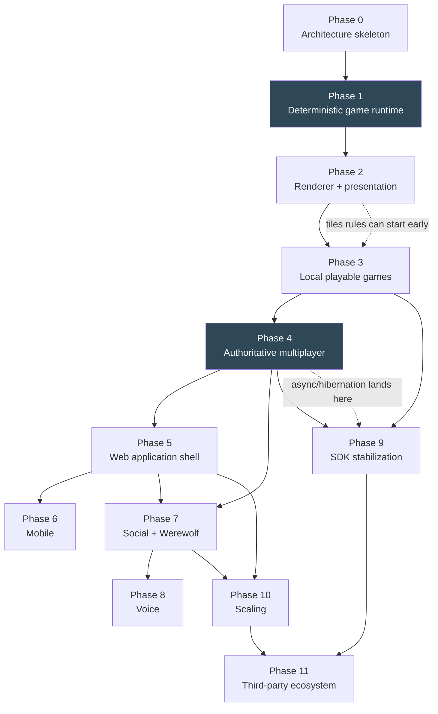

# 07 — Phases and Implementation Roadmap

> Prerequisites: [`00`](./00-architecture-principles.md), plus the document named in each phase.
> **Phases are ordered by dependency, not by date.** No phase is complete until its exit criteria
> pass. No phase is only refactoring — every phase ends with something a person can look at.

---

## 0. How to use this document

A coding agent given *"implement Phase N"* should read:

```text
00-architecture-principles.md          (always)
07-phases-and-implementation-roadmap.md → the phase section
+ the documents listed in that phase's "Read first"
```

and should not need to invent architecture. If it must, that is a gap in these documents and the
gap should be filled in the same PR.

### 0.1 Dependency graph



Two phases are marked because they are the load-bearing ones: **Phase 1 defines the product's core
invariant** and **Phase 4 is where correctness under concurrency is either achieved or lost.** Both
deserve disproportionate care.

### 0.2 Sequencing rationale

- **Rules before rendering** (1 → 2): a game that is deterministic and testable without a screen is
  a game that can be replayed, bot-played, and server-validated. Doing rendering first tempts
  presentation state into the domain.
- **Local play before networking** (3 → 4): four kinds of game working locally proves the game
  contract absorbs real variation. Discovering a contract flaw after building the server means
  changing the protocol too.
- **Networking before the web shell** (4 → 5): the shell's job is to *get you into a match*; that
  target must exist first. The native client is the test harness for the protocol.
- **Werewolf after the shell** (5 → 7): werewolf needs rooms, invites, presence, and chat, which are
  shell-adjacent features.
- **Voice last among features** (7 → 8): it is the only part with an external dependency and the
  only part that is genuinely optional for the product to be good.
- **Scaling after real usage** (→ 10): every scaling decision needs a measurement, and measurements
  need players.

---

## Phase 0 — Architecture skeleton

**Read first:** 00, 01.

| Field | Content |
|---|---|
| **Goal** | A workspace where the invariants are *mechanically enforced* and one trivial game exists end-to-end in tests. |
| **Why now** | Enforcement added later is enforcement never added. The dependency rules and the conformance harness must exist before there is code that would violate them. |

**Deliverables**

```text
tabula/ workspace: Cargo.toml, rust-toolchain.toml, deny.toml, deps.toml, justfile, xtask
crates/tabula-core:      ids, LogicalTime, MatchSeed, DetRng (ChaCha8 + pinned shuffle),
                         Viewer, Audience, SeatRoster, SeatChange, MatchOutcome,
                         StateHash + canonical_encode/decode + state_hash, RuleError
crates/tabula-game-api:  GameRules, GameModule, Input, Outcome, Effect, Init, Ctx,
                         GameMetadata, GameCapabilities, LegalCommands, A11yDescription
crates/tabula-testkit:   conformance! macro, determinism harness, proptest strategies,
                         in-memory fakes, replay reader/writer (format v1), self-play driver
games/tictactoe:         the full worked example from doc 02 §10
xtask:                   check-deps, check-no-game-ids, check-manifests
CI:                      fmt, clippy (with rules-crate clippy.toml), nextest, deny,
                         no-default-features/all-features builds, deps matrix
docs/:                   these documents committed; ADR process live
```

| Field | Content |
|---|---|
| **Contracts introduced** | `GameRules`, `GameModule`, `Input`, `Effect`, `Ctx`, `Viewer`, `DetRng`, replay format v1, the conformance suite. **These are the ones that must be right.** |
| **Tests required** | Full conformance suite green for tictactoe; `xtask check-deps` fails on a deliberately-added forbidden dep (test the enforcement, not just the rule); determinism harness proven to catch a seeded `HashMap` iteration bug and a `SystemTime` call. |
| **Demo / acceptance** | `cargo xtask selfplay tictactoe --matches 10000` runs in seconds, all matches terminate, all determinism and projection checks pass, and a `.tbr` replay round-trips. A one-page terminal report. |
| **Risks** | (a) Over-designing `GameCapabilities` before any game needs the fields — mitigate with doc 02 §5's consumer table, and delete any field without a consumer. (b) `DetRng` API churn later — mitigate by pinning the algorithm and the shuffle now. (c) `Ctx`/`Effect` shapes proving wrong — accepted; Phase 1 and 3 are allowed to change them, Phase 4 is not. |
| **Deferred** | Everything else. No rendering, no protocol crate, no server, no database. |
| **Exit criteria** | Conformance suite green; enforcement tests prove CI catches violations; `docs/architecture/*` matches the code; a second developer can scaffold a game with `xtask new-game` and get a passing suite. |

---

## Phase 1 — Deterministic game runtime

**Read first:** 00, 02.

| Field | Content |
|---|---|
| **Goal** | Chess, fully and correctly implemented as pure rules, with clocks — plus the tooling to prove determinism at scale. |
| **Why now** | Chess is the hardest *simple* game: complete legal-move generation, clocks, draws by repetition/50-move/insufficient material, and no hidden information to hide behind. If the contract survives chess, it is real. |

**Deliverables**

```text
games/chess:  State/Command/Event/View, full legal move generation (incl. castling, en passant,
              promotion, check/checkmate/stalemate), threefold repetition via zobrist,
              50-move rule, insufficient material, clocks (Fischer + Bronstein increments),
              resign/draw offers, timeout handling via Input::Timer
games/chess bots:  Trivial (random legal) + Easy (material + piece-square, depth 2)
tabula-testkit additions:  perft harness, golden replay corpus, divergence bisector
xtask:  selfplay, replay, perft
```

| Field | Content |
|---|---|
| **Contracts introduced** | None new — Phase 1 *validates* Phase 0's contracts. Any change to `GameRules`/`Effect` must happen here, and be reflected in doc 02 in the same PR. |
| **Tests required** | `perft` positions matching published node counts to depth 5 (this is the standard proof that move generation is correct); the full conformance suite; 100k self-play matches; clock arithmetic property tests (a clock never goes negative; total time consumed + remaining == initial + increments); timeout-at-exactly-zero edge cases. |
| **Demo / acceptance** | Terminal chess: two bots play a full game printed as ASCII with clocks; a human can play via typed moves; the game is replayed from its `.tbr` and the final state hash matches. |
| **Risks** | (a) Chess rules are deceptively deep — mitigate with perft, which finds nearly all move-generation bugs. (b) Clock semantics leaking into the platform — mitigate by keeping *all* clock math inside `apply` and verifying the platform has zero clock code. (c) Scope creep into a strong engine — the bot is deliberately weak; a strong engine is a Phase 9+ optional crate. |
| **Deferred** | Any rendering. Networking. Other games. Chess variants (Xiangqi, Shogi, Go) — they are Phase 9 proof that the contract generalizes. |
| **Exit criteria** | Perft correct to depth 5; conformance green; 100k self-play matches with zero determinism failures; replay of every golden game exact; **zero clock or rules code outside `games/chess`**. |

---

## Phase 2 — Renderer and presentation

**Read first:** 00, 04 (§5–§8), 01.

| Field | Content |
|---|---|
| **Goal** | A renderer-independent presentation layer, a Macroquad backend, a headless backend, the design token pipeline — and a chess board you can play hot-seat on desktop and web. |
| **Why now** | The presentation contract must be settled before three more games are drawn, or each game invents its own drawing conventions. |

**Deliverables**

```text
crates/tabula-design:        tokens.toml + xtask gen-tokens → Rust consts + tokens.css + JSON;
                             light/dark/hc themes; per-game accent derivation at build time
crates/tabula-presentation:  RenderList + the nine RenderCmd variants; Layer scheme; Camera2D;
                             InputEvent model; hit-testing; focus graph service; animation engine
                             (springs + tokens); AudioSink/AudioCue; GamePresentation trait;
                             the ~20 shared widgets (buttons, cards, lists, dialogs, sheets)
crates/renderer-macroquad:   Renderer impl, atlas/font management, input normalization, audio
crates/renderer-headless:    RenderList recorder + tiny-skia rasterizer for golden images
apps/game-client:            native + wasm targets; scene stack; hot-seat local match driver
games/chess/src/ui.rs:       board, pieces, drag+tap interaction, clocks, move list, motion tokens
```

| Field | Content |
|---|---|
| **Contracts introduced** | `RenderList`/`RenderCmd`, `Renderer`, `InputEvent`, `GamePresentation`, `Theme`, motion tokens, `AudioCue`. **LOCK NOW** on the command set; additions require the doc 04 §5.4 rule. |
| **Tests required** | Golden `RenderList` snapshots (insta) for chess in several states; golden images via headless + tiny-skia (tolerant comparison); token contrast test (every pair ≥ 4.5:1 / 3:1); a no-raw-colors lint; input→intent unit tests for tap-tap and drag-drop; animation determinism-of-final-state test (any interruption lands on the same view). |
| **Demo / acceptance** | Hot-seat chess on desktop **and** in a browser, with clocks, legal-move highlighting, drag and tap input, capture/check/checkmate animations, sound, light/dark themes, and reduced-motion mode. Same binary, two targets. |
| **Risks** | (a) Macroquad text/layout limits appear here — this is the phase where we learn whether Miniquad is needed (doc 04 §6.3); budget a spike. (b) The command set growing to please one visual idea — enforce §5.4. (c) The animation engine turning into a framework — cap it: springs, tweens, staggers, and a "snap if stale" rule; nothing else. |
| **Deferred** | Networking. Leptos shell. Mobile-specific layouts. Board Reader regions. Voice UI. |
| **Exit criteria** | Chess playable hot-seat on desktop and web from one codebase; zero Macroquad references outside `renderer-macroquad`; golden `RenderList` and image tests green; WASM game bundle < 6 MB gzipped; 60 fps on a mid-range phone browser and a 5-year-old laptop. |

---

## Phase 3 — Local playable games

**Read first:** 00, 02 (§12), 04, 08.

| Field | Content |
|---|---|
| **Goal** | Three more games playable locally against bots: cards (Tiến Lên), tiles (Carcassonne-like), and a werewolf *rules skeleton* — proving the contract absorbs hidden information, RNG, large state, and phases. |
| **Why now** | This is the cheapest possible place to discover a contract flaw. Every flaw found here costs a crate change; found after Phase 4 it costs a protocol change and a migration. |

**Deliverables**

```text
games/cards (Tiến Lên):  hidden hands, deck shuffle from DetRng, deck commitment scheme,
                         trick resolution, finishing order → standings; hand-fan presentation
                         with deal/play/reveal motion; SecretModel; bots (Trivial + Easy)
games/tiles:             tile bag, placement validation, incremental feature graph scoring,
                         meeples; large-board presentation with camera pan/zoom/rotation;
                         legal-position hints; bots
games/werewolf (rules only): phases, role assignment, night actions, voting, redaction with
                         view_event → None, chat/voice scope Effects; NO UI yet
crates/tabula-assets:    manifest, hashing, cache, loaders, priorities; xtask pack-assets
Local play driver:       bot opponents, seat selection, "replay this match" from .tbr
```

| Field | Content |
|---|---|
| **Contracts introduced** | `SecretModel`, `AssetPack` manifest + `AssetRef`/`AssetHandle`, `Effect::SetChatScopes`/`SetVoiceScopes` (defined and exercised in tests, not yet enforced by a server), `LegalCommands::Hints`. |
| **Tests required** | Conformance for all four games; projection-leak scans on cards and werewolf (the reason this phase exists); commitment-scheme verification test; snapshot size measurement per game feeding `StateSizeClass`; asset integrity tests; 100k self-play per game; performance test that `apply` stays inside budget for tiles' incremental scoring. |
| **Demo / acceptance** | One app, four games in a local menu: play chess, Tiến Lên, and tiles against bots; run the werewolf rules headlessly with a text visualizer showing per-viewer projections side by side (**this side-by-side projection viewer is the demo that proves the security model**). |
| **Risks** | (a) Werewolf's redaction is the hardest projection work in the product — do it now, headless, where it is inspectable. (b) Tiles' state size may push snapshot policy — measure and record. (c) Cards' commitment scheme may prove not worth the complexity — it is an EXPERIMENT and may be dropped with a note. |
| **Deferred** | Werewolf UI (Phase 7). Networking. Voice. Async turns. |
| **Exit criteria** | Four games pass conformance; projection scans green; the side-by-side projection viewer shows correct information asymmetry for cards and werewolf; **no change required to `tabula-core`/`tabula-game-api` in the final two weeks of the phase** (the contract has stopped moving). |

---

## Phase 4 — Authoritative multiplayer

**Read first:** 00, 03, 05, 02 (§8).

| Field | Content |
|---|---|
| **Goal** | Real networked play: server, protocol, match actors, event log, snapshots, reconnect, spectators — chess and cards playable between two devices over the internet. |
| **Why now** | The contract is stable (Phase 3 exit criterion). Building the server on a moving contract is how protocols get corrupted. |

**Deliverables**

```text
crates/tabula-protocol:   envelopes, ProtocolVersion, dual codec (postcard + json),
                          subprotocol negotiation, error codes, golden vectors
crates/tabula-registry:   register! macro, ErasedGame/ErasedMatch/GameAdapter, codec bridging,
                          version resolution, per-game cargo features, rollout filtering
crates/tabula-match:      MatchActor + mailbox + the doc 03 §7 pipeline; state_version;
                          idempotency cache; TimerSet; snapshot policy; reconnect/resume;
                          spectator attach with viewer-group fan-out; effect execution;
                          ports (EventLog, SnapshotStore, MatchRepo, Clock, BotRunner, Broadcast);
                          supervisor with catch_unwind + drain
crates/tabula-storage:    sqlx repositories, migrations (doc 03 §9.4), event batcher,
                          snapshot encode/zstd, pending_effects, durable_timers
crates/tabula-net-client: connect/handshake, seq, pending commands, resume with backoff+jitter,
                          two transports (tokio / web-sys)
services/tabula-server:   axum HTTP (doc 03 §2 minus matchmaking), WS gateway, session layer,
                          room router, auth (password + one OAuth provider), table chat,
                          admin inspect/cancel, tracing + metrics + OTLP
apps/game-client:         online mode, lobby-less direct join by code, spectate by link,
                          connection-state UI
tests/integration:        multi-client scenarios against real Postgres
tests/load:               L1, L4, L7 scenarios
deploy:                   compose (dev), systemd + Caddy (Stage 0 prod), backup + restore script
```

| Field | Content |
|---|---|
| **Contracts introduced** | The **wire protocol** (`ClientEnvelope`/`ServerEnvelope`, `PROTOCOL_VERSION` 1.0), `ErasedGame`/`ErasedMatch`, all storage ports, the database schema, `MatchHandle`/`Envelope`. Everything here is expensive to change afterwards — hence Phase 3's exit criterion. |
| **Tests required** | Golden wire vectors; protocol fuzzing (`cargo-fuzz` on both decoders); integration: two clients play a full chess game; idempotency (replay the same `client_seq` → one application, two identical acks); reconnect mid-game with `ResumeOk` and with forced `Resync`; hard-kill the server mid-match and verify rehydration with correct state hash; spectator sees only projected data (asserted against `SecretModel` for cards); rate-limit and slow-consumer behavior; drain with zero lost matches (L7); `no_state_type_on_the_wire`; the nightly replay-verification job wired up. |
| **Demo / acceptance** | Two phones (or two browsers on different networks) play a full game of chess with clocks; one of them kills the app mid-game, reopens, and resumes in the correct position with the correct clock; a third device spectates; a fourth plays Tiến Lên with three bots and, at the end, verifies the deck commitment. The server is redeployed **during** the chess game and nobody notices. |
| **Risks** | (a) **The highest-risk phase.** Ordering/idempotency bugs are subtle and appear under load — mitigate with the integration matrix above plus L4/L7 from day one, not at the end. (b) Ack-latency disappointment if Postgres is remote — measure early and set `Durability` per game accordingly. (c) Protocol churn — every change goes through `xtask gen-protocol-vectors --bump`, which makes churn visible. (d) Temptation to add matchmaking/lobby here — resist; join-by-code is enough to demo. |
| **Deferred** | Matchmaking, rooms/invites, presence, web shell, voice, hibernation/async turns, delayed spectators, Redis, multi-process. |
| **Exit criteria** | The demo above passes repeatedly; L1 sustains 500 CCU at p95 ack < 60 ms; L7 shows zero lost matches; nightly replay verification green for a week; integrity counters at zero; restore-from-backup rehearsed. |

---

## Phase 5 — Web application shell

**Read first:** 04 (§2–§4, §10), 03 (§14–§15).

| Field | Content |
|---|---|
| **Goal** | The product becomes usable by a stranger: sign up, browse games, create or join a room, get matched, play, see results and history. |
| **Why now** | Everything before this required a developer to start a match. This is the phase that turns a working engine into a product. |

**Deliverables**

```text
apps/web (Leptos CSR):  all routes in doc 04 §2.1; tokens.css consumption; component library;
                        lobby WS subscription; handoff to /play/:id with prefetch;
                        settings (theme, motion, contrast, audio, language)
crates/tabula-lobby:    rooms, invitations, seat reservation, ready state, matchmaking (doc 03
                        §15.1), presence with coalesced fan-out, rematch
server additions:       room + queue + presence endpoints and events; ratings job (Elo/placement)
                        consuming MatchOutcome; notifications (in-app); rollout table
apps/admin:             match inspector (Audit viewer), player lookup, game enable/disable,
                        report queue, replay download
a11y:                   Board Reader status + actions; full keyboard board navigation
i18n:                   en + vi from the start (keys everywhere, no literals)
apps/desktop (optional):  Tauri shell evaluation spike — launcher + updater + notifications
```

| Field | Content |
|---|---|
| **Contracts introduced** | HTTP API v1 (frozen shape), `LobbyTopic` subscriptions, `PlatformEvent` set, rating input contract (`MatchOutcome` → rating), rollout data model, i18n key namespace. |
| **Tests required** | Playwright: sign up → browse → create room → invite → play a full game → see the result and history; matchmaking unit tests (widening, bot fill, party-of-one); presence fan-out load test; a11y automated audit (axe) on every route plus manual screen-reader pass on the critical flow; keyboard-only completion of a chess game; i18n completeness check (no missing keys, no hardcoded strings — lint). |
| **Demo / acceptance** | A person who has never seen the project signs up on a phone browser, finds a game, waits in the queue, plays a full match against a stranger, and sees the result in their history — with no developer help and no console errors. Recorded as a video for the acceptance record. |
| **Risks** | (a) Shell scope explosion (shop, achievements, tournaments) — the route list in doc 04 §2.1 is the contract; anything else is a later phase. (b) The Leptos↔Macroquad handoff feeling janky — mitigate with prefetch and a branded loader; measure time-to-first-frame at `/play/:id` (target < 1.5 s warm, < 4 s cold on 4G). (c) Two implementations of shell UI (DOM + canvas for native) drifting — mitigate with `docs/ui/screens/` as the shared spec, and defer native shell screens to Phase 6. |
| **Deferred** | Mobile-native shell screens, voice, shop/monetization, tournaments, achievements, friend graph beyond basics, SSR. |
| **Exit criteria** | The stranger demo passes; Lighthouse performance ≥ 85 and accessibility ≥ 95 on the shell's main routes; keyboard-only play works for all three playable games; queue produces a match within 30 s at test population; admin can disable a game without a deploy. |

---

## Phase 6 — Mobile

**Read first:** 04 (§10), 01 (§7).

| Field | Content |
|---|---|
| **Goal** | Real Android and iOS apps running native Macroquad gameplay, with mobile-appropriate layout, input, and lifecycle handling. |
| **Why now** | Board games are played on phones. Doing this after the shell means the layout system and input model are already exercised on touch via the web build. |

**Deliverables**

```text
mobile/android:  cargo-ndk/cargo-apk build, Gradle wrapper, Activity lifecycle bridge
                 (pause/resume/background → connection suspend + resume), back button,
                 safe areas, keyboard/IME bridge for chat, push notifications (FCM)
mobile/ios:      Xcode wrapper around the staticlib, scene lifecycle, safe areas,
                 keyboard bridge, push notifications (APNs)
apps/game-client:  native shell screens (catalog, room, results) using tabula-presentation
                   widgets; deep links (tabula://match/:id and universal links);
                   OS keychain token storage; low-power/thermal awareness (frame cap)
layout:          compact/medium breakpoints, portrait+landscape per game manifest,
                 expanded hit rects, lifted-piece preview, thumb-reach action placement
server:          push notification service for async turns and invites
```

| Field | Content |
|---|---|
| **Contracts introduced** | `MatchContext` handoff struct (native), deep-link URL scheme, push notification payload schema, lifecycle events into `tabula-net-client` (suspend/resume). |
| **Tests required** | Smoke tests on a real device matrix (2 Android tiers, 2 iOS tiers) driven by a scripted match; background/foreground reconnect test (background for 5 min, return, resume correctly); battery/thermal measurement over a 20-minute session; touch-target audit; store-compliance checklist (privacy manifest, data disclosure, age rating). |
| **Demo / acceptance** | Install from TestFlight/internal track; play a full ranked chess game on a phone; lock the screen mid-game, unlock 3 minutes later, resume correctly; receive a push notification for an async turn and open directly into the match. |
| **Risks** | (a) iOS build/signing friction — budget real time; do a "hello triangle" spike in Phase 2 to de-risk. (b) Macroquad mobile input/lifecycle gaps — this is a plausible Miniquad trigger; keep the escape hatch in mind. (c) Store review of a "gambling-adjacent" card game — check content rating early. (d) Native shell screens doubling UI work — keep them minimal; the web shell remains the full-featured surface. |
| **Deferred** | Tauri mobile, gamepad support, tablet-specific layouts beyond `medium`, in-app purchase, Android/iOS widgets. |
| **Exit criteria** | Both apps play a full match reliably on the device matrix; suspend/resume works; battery drain < 8%/hour of active play on a mid-tier device; crash-free sessions > 99.5% in internal testing; both stores accept the build. |

---

## Phase 7 — Social and Werewolf

**Read first:** 02 (§12.3), 03 (§14, §16), 04 (§9, §11).

| Field | Content |
|---|---|
| **Goal** | Werewolf shipped: 6–20 players, phases, private roles, scoped chat, voting — plus the social features it requires (parties, bigger rooms, better presence). |
| **Why now** | Werewolf is the stress test that no other game applies: many seats, event non-existence, scoped communication, and a social loop. It validates that the platform is a *platform* and not a chess site. |

**Deliverables**

```text
games/werewolf UI:   phase banners with skippable transitions, role reveal choreography,
                     seat circle with vote markers, night action UI per role, day discussion
                     timer, scoped chat overlay, dead-player spectator mode
server:              chat scope enforcement from Effect::SetChatScopes; per-channel rate limits;
                     larger room support (20 seats); host controls (kick, ruleset, start);
                     moderation: reports, mutes, wordlist per locale, operator queue
tabula-lobby:        parties (queue as a group), party-aware seat assignment, room codes,
                     public room browser with filters
presence:            richer states (in-lobby, in-match, phase), friend activity feed
```

| Field | Content |
|---|---|
| **Contracts introduced** | `ChatScopes`/`VoiceScopes` enforcement semantics (server side), party model, host-control admin inputs, moderation record schema. |
| **Tests required** | 20-seat integration match driven by bots + scripted humans, asserting per-seat projections at every phase (this is a large golden test and it is the point of the phase); chat scope enforcement tests (a wolf message must never reach a villager socket — asserted at the socket, not the API); vote-burst load test (L2); disconnect-during-night behavior; the projection scanner at 20 seats. |
| **Demo / acceptance** | Twelve real people play a full werewolf game from a room invite, with text chat, correct information asymmetry, and at least one disconnect-and-return — recorded and reviewed for information leaks. |
| **Risks** | (a) **Information leaks are the existential risk here.** Mitigation: socket-level assertions in tests, a manual leak review of `project`/`view_event` by a second person, and a bug bounty on the closed beta. (b) Social games need moderation from day one — the report queue is not optional. (c) 20-seat fan-out cost — viewer-group grouping already handles it; verify with L2. |
| **Deferred** | Voice (Phase 8), tournaments, custom rulesets beyond a few presets, replay of werewolf for spectators (needs careful redaction — Phase 9). |
| **Exit criteria** | The twelve-person demo completes with zero information leaks found in review; L2 vote bursts within latency SLO; chat scope tests green at socket level; moderation queue operational; werewolf enabled for a closed beta audience via the rollout table. |

---

## Phase 8 — Voice

**Read first:** 03 (§17), 04 (§11).

| Field | Content |
|---|---|
| **Goal** | Optional voice chat with game-driven scoping, behind a replaceable provider interface. |
| **Why now** | Werewolf is dramatically better with voice, and werewolf now exists. Doing voice earlier would have meant building it without the one game that defines its requirements. |

**Deliverables**

```text
crates/tabula-voice:   VoiceService trait; scope model; signaling message types;
                       adapters: self-hosted LiveKit + one managed provider (feature-gated);
                       a null adapter for dev
server:                voice room lifecycle tied to match lifecycle; token minting with
                       per-participant publish/subscribe permissions; scope changes pushed on
                       phase transitions; teardown on match end; stats collection
client:                permission flow, device picker, PTT + toggle, speaking indicators on the
                       board, server-mute vs self-mute distinction, graceful WebRTC failure
infra:                 coturn deployment, SFU deployment or provider account, bandwidth/cost
                       monitoring, region selection for media
```

| Field | Content |
|---|---|
| **Contracts introduced** | `VoiceService`, `VoiceScopes` wire representation, `VoiceGrant` event, participant permission model. |
| **Tests required** | Scope enforcement test: a muted-by-phase participant's media is rejected **at the SFU**, verified by the SFU's own API, not by trusting the client; failover test (SFU unreachable → match continues with text); NAT-restricted network test through TURN; 20-participant load test with bandwidth and cost measurement; permission-revocation latency test (phase change → mute effective within 500 ms). |
| **Demo / acceptance** | A twelve-person werewolf game with voice: at night, wolves hear each other and nobody else; dead players hear everything and speak only to the dead; day discussion is open; every transition is audibly and visually unambiguous. Verified by a listener recording each participant's stream. |
| **Risks** | (a) Provider cost at scale — measure cost per participant-minute in this phase and put it in the pricing model. (b) Mobile audio session conflicts (with music, calls) — test explicitly. (c) The temptation to self-build an SFU — forbidden (ADR-016). (d) Abuse: voice moderation is hard; ship with per-user mute, host mute, and reporting, and accept that recording/automated moderation is out of scope. |
| **Deferred** | Voice recording, transcription, automated voice moderation, spatial audio, voice in non-social games beyond "optional". |
| **Exit criteria** | Scope enforcement verified at the SFU; graceful degradation verified; cost per participant-minute measured and acceptable; provider swap demonstrated by running the test suite against both adapters. |

---

## Phase 9 — Game SDK stabilization

**Read first:** 02, 05 (§8, §10), 04 (§10.4).

| Field | Content |
|---|---|
| **Goal** | Make the SDK genuinely good for someone who is not the platform author: documentation, scaffolding, generated config forms, async turns, replay viewer, full accessibility — proven by a *new* game built by someone else. |
| **Why now** | Four games exist. The friction points are known and measurable. Stabilizing before this would have been guessing; after this, the API's audience grows and changes get expensive. |

**Deliverables**

```text
SDK:              `xtask new-game` templates for three archetypes (board / cards / phased);
                  generated config forms from Config schema; a game-development guide with the
                  tictactoe walkthrough; API docs with examples on every trait method;
                  a local dev harness (`xtask play <game>` with hot-reloading presentation)
platform:         async turns + hibernation (doc 03 §11); durable timers; push notifications for
                  async; delayed spectators; replay viewer (projected replays, scrub, speed);
                  Board Reader full regions; a11y catalog labels
games:            one additional game implemented BY SOMEONE ELSE following only the docs —
                  the acceptance test for this phase; plus Go or Xiangqi to prove the
                  board archetype generalizes beyond chess
protocol:         PROTOCOL_VERSION 1.x additive changes only; deprecation of anything vestigial
docs:             docs/architecture updated to match reality; a written "what changed and why"
                  since Phase 0 for each locked contract
```

| Field | Content |
|---|---|
| **Contracts introduced** | Frozen public SDK surface (`tabula-game-api` + `tabula-presentation` public items get `#[doc]` + semver discipline), async-turn semantics, replay viewer contract, `A11yRegion` navigation. |
| **Tests required** | The external-developer test: a competent Rust developer with no prior context ships a working, conformance-passing game using only `docs/` — time-to-first-playable-match is recorded as the SDK's headline metric (target: under one day for a simple game). Async-turn integration test spanning a simulated 48 hours (clock injection). Replay viewer golden tests. Accessibility: full screen-reader play-through of one game per archetype. |
| **Demo / acceptance** | The externally-built game appears in the catalog, is playable online with bots and humans, has a replay, and is fully keyboard-and-screen-reader playable — with **zero platform code changes** to accommodate it. That last clause is the whole point of the project. |
| **Risks** | (a) Discovering the contract needs a breaking change — better here than later, but it now costs migrations; budget for one deliberate `rules_version`-wide bump if needed. (b) Documentation rot — the external-developer test is the antidote and should be repeated each year. (c) Async turns interacting badly with hibernation and timers — the 48-hour simulated test is essential. |
| **Deferred** | Loadable game packages (Phase 11), third-party sandboxing, marketplace, revenue sharing. |
| **Exit criteria** | External developer ships a game in < 1 day with no platform changes; async matches survive a week of real elapsed time including server deploys; replay viewer works for all games with correct redaction; screen-reader play-through passes for one game per archetype; SDK surface documented 100%. |

---

## Phase 10 — Scaling

**Read first:** 06.

| Field | Content |
|---|---|
| **Goal** | Whatever the measurements demand — and nothing else. |
| **Why now** | Because by now there are players, and therefore measurements. Every item below is conditional on a trigger from doc 06 §1.1 having actually fired. |

**Deliverables (conditional — implement only what triggered)**

```text
[trigger: CPU/memory/connections]  Stage 2 split: gateway | match-worker processes,
                                   internal framed-Postcard transport, placement table
[trigger: attach p95 or presence]  Redis for directory, presence, pub/sub, shared rate limits
[trigger: log size]                partition match_inputs/match_events; retention jobs
[trigger: read load]               read replica for profile/history/catalog/leaderboards
[trigger: task count / p99]        sharded match executor prototype + benchmark
[trigger: spectator count]         fan-out relay
[trigger: RTT by region]           regional deployment (doc 06 §5.5), region column already present
[always]                           capacity model updated with real numbers; runbooks;
                                   chaos drills (kill a worker, kill the DB primary, fill a disk)
```

| Field | Content |
|---|---|
| **Contracts introduced** | Internal transport protocol (versioned like the public one), ownership lease + fencing semantics, placement API. |
| **Tests required** | L1–L8 at the new target; a split-brain test (two processes both believe they own a match → the fenced one's appends must fail); lease-expiry-under-GC-pause test; chaos drills with documented outcomes; a "single-process still works" regression test, because the monolith path must remain viable for self-hosting and development. |
| **Demo / acceptance** | Sustain the measured target CCU with SLOs met, then kill a random worker process during a load test and show that affected matches rehydrate elsewhere within 5 s with correct state hashes and no lost commands. |
| **Risks** | (a) Splitting for its own sake — every item requires a fired trigger recorded in the PR description. (b) Losing the single-binary path (needed for dev and self-hosting) — keep it tested. (c) Split-brain violating I-14 — fencing tokens are mandatory, not optional. |
| **Deferred** | Kubernetes unless the team has grown and container orchestration is genuinely the constraint; message bus unless doc 06 §5.4 fired; multi-region unless RTT fired. |
| **Exit criteria** | Target CCU sustained with SLOs met; worker-kill drill passes; single-process mode still passes the full integration suite; runbooks exist for every paging alert; capacity model in doc 06 §2 replaced with measured values. |

---

## Phase 11 — Third-party game ecosystem

**Read first:** 02 (§9.3), 05 (§6).

| Field | Content |
|---|---|
| **Goal** | Games that are not ours, running safely. |
| **Why now** | Only after: the SDK is proven by an external developer (Phase 9), the platform is operationally stable (Phase 10), and there is an actual third party who wants to ship a game. **Absent that third party, this phase does not start.** |

**Deliverables (Phase B then Phase C — see doc 02 §9.3)**

```text
Phase B — loadable first-party packages
  game package format: wasm module + manifest + signed asset pack
  host ABI mirroring ErasedMatch (bytes in / bytes out — already the shape)
  wasmtime-based loader on the server; client-side presentation module loading
  independent deploy + rollback per game; version pinning per match
  determinism certification harness: same replay, multiple hosts, multiple runs

Phase C — untrusted third-party modules
  strict resource limits (fuel, memory, no host imports beyond the ABI)
  submission review + signing + revocation
  developer portal: upload, test against the conformance suite, staged rollout, telemetry
  economics: revenue share, payout, tax; content policy and enforcement
  abuse handling: a malicious module must be revocable within minutes globally
```

| Field | Content |
|---|---|
| **Contracts introduced** | The **host ABI** (the most permanent contract in the project once third parties depend on it), package format, signing/revocation model, certification requirements. |
| **Tests required** | Determinism certification across two host builds and two architectures; resource-exhaustion tests (infinite loop, memory bomb, huge event storm) each terminating the *match* and not the process; sandbox escape review (external, ideally); revocation drill (revoke a live module and verify matches end gracefully); performance comparison native vs WASM `apply` (expect 1.5–3× slower — acceptable). |
| **Demo / acceptance** | A third-party game is uploaded, certified, rolled out to 10% of users, plays correctly, and is then revoked — all without a platform deploy. |
| **Risks** | (a) Sandbox security is a genuine adversarial problem; if we cannot resource it properly, ship Phase B only and keep the catalog first-party. (b) A public ABI freezes design decisions permanently — do not start until Phase 9's contracts have been stable for a year. (c) WASM determinism has real footguns (float NaN canonicalization, SIMD) — the certification harness must cover them. |
| **Deferred** | Native dynamic loading (never — no ABI stability, no sandbox), server-side third-party *services* (a game may not call out), cross-game shared state. |
| **Exit criteria** | The demo above; a written security review of the sandbox; a revocation drill under 5 minutes; certification harness green across hosts and architectures; developer documentation complete. |

---

## Summary tables

### Crates by phase

| Phase | New crates | Modified heavily |
|---|---|---|
| 0 | `tabula-core`, `tabula-game-api`, `tabula-testkit`, `games/tictactoe`, `xtask` | — |
| 1 | `games/chess` | `tabula-testkit`, `tabula-game-api` (last chance for churn) |
| 2 | `tabula-design`, `tabula-presentation`, `renderer-macroquad`, `renderer-headless`, `apps/game-client` | `games/chess` (+ui) |
| 3 | `tabula-assets`, `games/cards`, `games/tiles`, `games/werewolf` (rules) | `tabula-presentation` |
| 4 | `tabula-protocol`, `tabula-registry`, `tabula-match`, `tabula-storage`, `tabula-net-client`, `services/tabula-server`, `tests/integration`, `tests/load` | `apps/game-client` |
| 5 | `tabula-lobby`, `apps/web`, `apps/admin`, (`apps/desktop` spike) | `services/tabula-server` |
| 6 | `mobile/android`, `mobile/ios` | `apps/game-client`, `tabula-presentation` |
| 7 | — | `games/werewolf` (+ui), `tabula-lobby`, `services/tabula-server` |
| 8 | `tabula-voice` | `services/tabula-server`, `apps/game-client`, `apps/web` |
| 9 | one new game (external), one board-archetype game | `tabula-game-api` docs, `tabula-match` (async/hibernation), `apps/web` (replay viewer) |
| 10 | `services/gateway`, `services/match-worker` (split), maybe `services/relay` | `tabula-match`, `tabula-storage` |
| 11 | `tabula-sandbox`, developer portal | `tabula-registry` |

### Contract lock timeline

| Contract | Introduced | Locked after | Cost to change later |
|---|---|---|---|
| `GameRules` / `Input` / `Effect` / `Ctx` | Phase 0 | **Phase 3** | Every game + possibly the protocol |
| `RenderList` / `Renderer` / `InputEvent` | Phase 2 | **Phase 3** | Every game's presentation + every backend |
| Design tokens (semantic names) | Phase 2 | Phase 5 | Every UI surface |
| Wire protocol envelopes | Phase 4 | **Phase 4** (additive only after) | Every client in the wild |
| Database schema | Phase 4 | Phase 4 (migrations only) | Migration + backfill |
| HTTP API v1 | Phase 5 | Phase 5 | Web + mobile clients |
| `VoiceService` | Phase 8 | Phase 8 | One adapter each |
| Public SDK surface | Phase 0–3 | **Phase 9** | External developers |
| Host ABI (WASM) | Phase 11 | Phase 11 forever | Third-party ecosystem |

### The single-sentence test for each phase

```text
Phase 0   "A game's rules can be proven deterministic without a screen or a server."
Phase 1   "Chess is correct, and its clocks live entirely inside its rules."
Phase 2   "Chess is playable and beautiful, and nothing outside one crate knows what Macroquad is."
Phase 3   "Four structurally different games work locally, and cards/werewolf keep their secrets."
Phase 4   "Two strangers play over the internet, survive a disconnect and a deploy, and the replay
           reproduces the match exactly."
Phase 5   "A stranger signs up and plays a match without help."
Phase 6   "It works on a phone, including after a screen lock."
Phase 7   "Twelve people play werewolf and no information leaks."
Phase 8   "Wolves hear only wolves, enforced by the SFU."
Phase 9   "Someone else shipped a game in a day, and we changed no platform code."
Phase 10  "We scaled exactly as far as the measurements demanded, and a worker can die."
Phase 11  "Someone else's game runs safely, and can be revoked in minutes."
```

---

**Next:** [`08-first-games-validation-plan.md`](./08-first-games-validation-plan.md)
