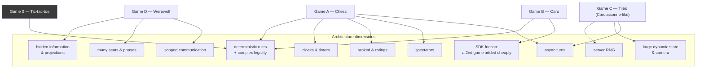

# 08 — First Games Validation Plan

> Prerequisites: [`02`](./02-game-module-and-sdk-design.md) (§12 has the contract sketches),
> [`07`](./07-phases-and-implementation-roadmap.md).

---

## 1. Why these four

The reference-game portfolio is **four product/reference games plus one internal SDK fixture**:

```text
Game A — Chess               the correctness benchmark
Game B — Caro                the simple-product / SDK-friction benchmark
Game C — Tiles (Carcassonne-like)   the dynamic-spatial-state / RNG benchmark
Game D — Werewolf            the hidden-information / social-scale benchmark
Game 0 — Tic-tac-toe         the internal SDK smoke test and new-game template — NOT a reference game
```

They are chosen as **architecture tests that happen to be fun**, not as a product catalog. Each
reference game is the cheapest game that stresses a dimension the platform claims to support.
Tic-tac-toe is deliberately excluded from that list: it exists so that "does the platform work at
all?" can be answered in seconds, not to validate any dimension beyond the most basic one.



Tic-tac-toe is the fifth crate, and it is not a product: it is the SDK's smoke test and template
(doc 02 §10). It exists so that "does the platform work?" and "does my new game work?" can be
answered in seconds. Caro is a *different* thing from tic-tac-toe even though both are simple and
have no hidden information: Caro is a real product game, independently added *after* the platform
already existed, and it is the one that answers "is adding a second game actually cheap?" —
tic-tac-toe cannot answer that question because it was built alongside the platform itself.

### 1.1 Coverage matrix

| Architecture assumption | A: Chess | B: Caro | C: Tiles | D: Werewolf |
|---|---|---|---|---|
| Rules are pure and deterministic | **primary** | yes | yes | yes |
| Complex legality (move generation) | **primary** | no (simple line detection) | **primary** (placement validity) | no |
| Timers own their meaning | **primary** (clocks) | optional turn timer — `TBD` | yes (long deadlines) | **primary** (phase timers) |
| Server-side RNG, replayable | no | no | **primary** (tile bag) | yes (role assignment) |
| Hidden information / projections | no | no | **secondary** (bag order) | **primary** (roles + night actions) |
| `view_event` degradation | no | no (nothing to degrade) | yes (drawn tile) | yes |
| `view_event` → `None` (event non-existence) | no | no | no | **primary** |
| Many seats (6–20) | no | no | no (2–5) | **primary** |
| Phases and simultaneous action | no | no | no | **primary** |
| Game-scoped chat | no | no | no | **primary** |
| Voice scoping | no | no | no | **primary** |
| Large / growing state | no | no (fixed, larger than tic-tac-toe) | **primary** | no |
| Camera: pan, zoom (rotate: see below) | no | no | **primary** | no |
| A second game added without game-specific platform behavior | no (built alongside the platform) | **primary** | yes | yes |
| Asset volume | low | low | **high** (tiles, meeples) | medium (roles, art) |
| Async turns | **primary** (correspondence) | `TBD` | **primary** | no |
| Ranked ratings | **primary** (Elo) | `TBD` | yes (placement) | no |
| Spectators | **primary** (live) | yes (live) | yes (live) | **primary** (game-controlled: the dead) |
| Bot substitution | yes | yes | yes | **forbidden — validates the policy** |
| Reconnect semantics | **primary** (clock keeps burning) | yes | trivial (async) | yes (phase continues) |
| Drag & drop precision | **primary** | yes (tap/place on a larger grid) | **primary** (rotation + placement) | no |
| Accessibility: keyboard board play | **primary** | yes (coordinate-based placement) | hard case (2D infinite grid) | **primary** (voting is list-based) |

Every cell marked **primary** is a claim in doc 00 that would otherwise be untested.

---

## 2. Game A — Chess (the correctness benchmark)

**Phase 1 (rules) → Phase 2 (presentation) → Phase 4 (multiplayer).**

### 2.1 Scope

```text
IN:  standard rules, all special moves (castling, en passant, promotion),
     check/checkmate/stalemate, threefold repetition, 50-move rule,
     insufficient material, resign, draw offer/accept/decline, claim draw,
     Fischer and Bronstein increments, flag fall, correspondence mode (24h)
OUT: variants (Chess960, three-check, atomic) — Phase 9+
OUT: opening book, analysis engine, cloud eval — separate optional crate, never in rules
OUT: FIDE tournament arbitration rules
```

### 2.2 What it validates

| Claim | How chess tests it |
|---|---|
| A game's rules can be *exhaustively verified* | `perft` node counts to depth 5 against published values. If move generation is wrong, perft says so immediately. No other game we ship has this luxury; that is precisely why chess is first. |
| Timers belong to the game, not the platform | All clock arithmetic is inside `apply`, driven by `ctx.now`. The platform contains **zero** lines of clock code. Verified by grep and by review. |
| Disconnect handling is a rules decision | Chess ignores `Input::Seat{Disconnected}` and lets the clock burn — expressed as `Ok(Outcome::empty())`. The opposite decision (pause) would be a one-line change in the game and none in the platform. |
| `legal_commands` enables free bots and UI | ~30 enumerated moves power highlighting, drag legality, and the `Trivial` bot with no extra code. |
| Determinism holds with no RNG at all | Chess is the control group: any determinism failure here is a platform bug, not an RNG bug. |
| Ranked ratings work | Elo from `MatchOutcome.standings`; side asymmetry (`symmetric = false`) forces matchmaking to alternate colors. |
| Replay is exact and useful | Every game is replayable; the replay viewer's first customer. |
| Async and live are the same rules | Correspondence chess uses identical `apply`, with a 24h `Effect::SetTimer` and hibernation. |

### 2.3 Presentation requirements

```text
board with coordinate labels, flip for black, last-move highlight, check indicator,
legal-target dots (from legal_commands), drag with lifted-piece preview + tap-tap fallback,
promotion picker, captured-material strip, move list with algebraic notation,
two clocks with tabular figures, low-time warning (visual + audio, never only color),
motion.piece-move / motion.reveal(promotion) / motion.invalid, checkmate sequence
```

### 2.4 Failure signals (what "the architecture is wrong" looks like here)

- Clock code appears in `tabula-match` → the `Effect::SetTimer`/`Input::Timer` contract is
  insufficient. **Fix the contract, not the game.**
- `legal_commands` needs to be called from `apply` for performance → `apply` is doing redundant work;
  restructure the game, do not change the contract.
- Drag-and-drop needs frame-level state in `State` → presentation boundary is being violated; the
  drag belongs in `P::Local`.

### 2.5 Acceptance

```text
[ ] perft depth 1–5 exact for the standard position + 5 published edge-case positions
[ ] all draw conditions reachable in tests
[ ] clock invariants hold under property testing
[ ] 100k bot self-play matches: zero determinism failures, zero panics, all terminate
[ ] hot-seat playable (Phase 2) and online playable (Phase 4)
[ ] replay of 1,000 sampled games byte-exact
[ ] keyboard-only game completion
[ ] Elo updates correct for win/loss/draw and never on Aborted
```

---

## 3. Game B — Caro (the simple-product / SDK-friction benchmark)

**Phase 3 (rules + presentation) → Phase 4 (multiplayer).**

Caro (a Gomoku / five-in-a-row family game) is **not tic-tac-toe renamed**. `games/tictactoe`
remains the internal SDK smoke test and new-game template (doc 02 §10) — trivial by design, and
built *alongside* the platform, so it cannot answer whether a game built *after* the platform
exists is cheap to add. Caro exists specifically to answer that question: a real, independently
playable product game, on a fixed board large enough that it is not a toy. The claim under test is
that its implementation needs no changes to `tabula-core` or `tabula-game-api`, no game-specific
platform behavior, and no changes under `services/`; only mechanically required
manifest/workspace/registry registration is allowed.

This document deliberately does **not** settle the exact rule variant (freestyle vs. a
Renju-style restriction on the first player) or the final board dimensions. Those are game-design
decisions for a future PR; see [`docs/games/caro.md`](../games/caro.md).

### 3.1 Scope

```text
IN:  a fixed board (a larger board such as 15×15 is the expected direction; exact
     dimensions TBD), alternating placement, row/column/diagonal win-line detection,
     draw on a full board, local play now, online play later (Phase 4)
OUT: the exact rule variant (freestyle vs. Renju-style restrictions) — a future
     game-design decision, not settled by this document
OUT: advanced tournament opening protocols (swap rules, restricted openings)
OUT: an AI engine beyond a trivial/easy bot
```

### 3.2 What it validates

| Claim | How Caro tests it |
|---|---|
| A second product game is cheap to add | Caro is built using only published SDK types after the platform contract already exists. Its implementation must not change `tabula-core`, `tabula-game-api`, `services/`, or platform behavior; mechanically required manifest/workspace/registry registration is explicitly allowed. |
| `legal_commands` works at a real (if still small) scale | Tic-tac-toe enumerates 9 cells; Caro enumerates up to a few hundred — still comfortably `Enumerated`, and the first test of that path before Tiles forces `Hints` instead. |
| The three-rung SDK ladder is real | tic-tac-toe (tiny example) → Caro (simple product game) → chess (complex product game) is a claim about onboarding cost; Caro is the rung that proves the middle step exists and is not just "chess but smaller". |
| Perfect-information games stay boring on the security axis | `hidden_information = false`; `View` ≈ `State` plus `legal_commands`, reusing the same pattern as tic-tac-toe and chess rather than inventing a new one. |

Caro deliberately does **not** validate hidden information, RNG, large/growing state, or many
seats — those are Werewolf's and Tiles' jobs (doc 08 §4, §5). Requiring Caro to prove any of them
would blur which reference game owns which claim.

### 3.3 Presentation requirements

```text
board with coordinate labels, last-move highlight, legal-target hints for a large grid,
win-line highlight on completion, optional turn-timer ring, motion.piece-place, motion.win-line,
draw/终局 banner (finished-state summary)
```

### 3.4 Failure signals

- Adding Caro requires a change to `tabula-core` or `tabula-game-api`, a change under `services/`,
  or game-specific behavior in a platform crate → the SDK-friction claim fails; find the missing
  generalization rather than special-casing Caro. Mechanically required manifest/workspace/registry
  registration is expected and does not fail the claim.
- Win-line detection needs more than the state already tracks → the state model is probably fine
  (board + last move); look for an accidental broadening of scope into a different variant first.
- The board size becomes a platform concern (e.g. protocol frame size) → note it, but do not let
  Caro's un-decided board size block this phase; Tiles is the game that stresses large state on
  purpose.

### 3.5 Acceptance

```text
[ ] win-line detection fully tested in all four directions, including edges and corners
[ ] draw-on-full-board detection tested
[ ] legal_commands enumeration matches apply()'s own legality decisions
[ ] 100k bot self-play: terminates, no determinism failures
[ ] implementation requires no changes to tabula-core / tabula-game-api
[ ] implementation adds no game-specific platform behavior and no changes under services/
[ ] only mechanically required manifest/workspace/registry registration changes are needed
```

---

## 4. Game C — Tiles (Carcassonne-like) (the state-and-camera benchmark)

**Phase 3 (rules + presentation) → Phase 9 (async polish).**

A Carcassonne-like tile-placement game: draw a tile, place it legally adjacent, optionally place a
follower, score completed features.

### 4.1 Scope

```text
IN:  ~72-tile bag with a fixed distribution, rotation, adjacency legality, feature graph
     (roads, cities, monasteries), follower placement and return, incremental scoring,
     end-of-game scoring, 2–5 seats, an optional per-turn deadline that works identically
     for 60 s live turns and 24 h async turns
OUT: farms/fields as a SCORABLE feature — deferred. Field stays an edge terrain for adjacency
     matching. Scoring farms needs sub-edge granularity (two field corners per tile side),
     which multiplies the graph's representation without exercising a contract that roads,
     cities, and monasteries do not already exercise.
OUT: expansions, rivers, custom boards, trading — later
```

The tile distribution is Tabula's own, in the Carcassonne family. It is not a reproduction of any
published set, and no acceptance criterion below depends on matching one.

### 4.2 What it validates

| Claim | How Tiles tests it |
|---|---|
| `&mut State` and incremental structures are supported | The feature graph is part of state and therefore part of the state hash. Confirmed — with one correction to the design's wording: it is **not** a union-find. Path compression mutates on read, and `project`/`legal_commands` are read paths, so a compressing structure would make the encoded bytes depend on query history. Tiles uses an explicit component registry merged by minimum id instead; `games/tiles/src/rules/feature.rs` records the four representations compared and why canonical-serialization safety decided it. The whole-board recompute survives as the differential oracle rather than as production code. |
| `StateSizeClass` drives real behavior | **Measured, and the estimate was wrong.** The design said ~30–120 KB and expected `Medium`; a full Tiles board encodes to ~1.7 KB, so Tiles is `Small` (`games/tiles/tests/state_size.rs`, which asserts the declared class *is* the measured one). The class is still validated as a *mechanism* — Tiles' state grows ~5× over a match where chess's does not — but no game in the portfolio occupies `Medium`, and doc 03 §9.2 now says so instead of naming Tiles there. `Welcome`-frame pressure is correspondingly not a Tiles concern. |
| `LegalCommands::Hints` is necessary | Legal (position × rotation) pairs are numerous; enumerating commands is wasteful. The hint form must be enough for UI highlighting and a bot. |
| Camera is presentation-only | Pan and zoom live entirely in `P::Local`. Two players looking at the same board from different camera positions is not a desync. **Camera rotation is not implemented and is not currently representable**: `tabula_presentation::Camera2D` carries an origin and a zoom, and nothing else. A rotating board would go through `RenderCmd::PushTransform` in the presenter, still entirely presentation-local — but no game needs it yet, so nothing was added to the camera type for it. |
| Asset volume is manageable | The largest asset pack; validates atlas packing, priority loading, and per-density variants. |
| Async turns work end to end | A match spanning days, surviving deploys, with push notifications and hibernation. Phase 9's headline test. |
| Determinism with a large hidden ordered structure | The bag order is secret and consumed over time; replay must reproduce every draw. |
| Accessibility on an unbounded 2D grid | The hardest a11y case we ship: the Board Reader must let a screen-reader user place a tile. Solution: coordinate-relative navigation ("north of the monastery at C4") plus a legal-placement list. This case defines the ambition level for `describe()`. |

### 4.3 Presentation requirements

```text
infinite scrollable board with pan (drag / two-finger), zoom (wheel / pinch, clamped),
snap-to-grid ghost tile with rotation (tap-rotate + keyboard R), legal/illegal target tinting,
follower placement targets on the placed tile's features, score track, remaining-tiles counter,
minimap or "recenter" affordance, motion.tile-place, motion.token-drop, motion.score-update,
end-of-game scoring walkthrough animation
```

### 4.4 Failure signals

- The state hash becomes expensive because it hashes the whole board every input → introduce an
  incremental hash (the contract allows overriding `state_hash`), do not weaken hashing.
- Snapshot cost dominates → adjust cadence via `StateSizeClass`, or store snapshots externally;
  both are already in the design.
- The camera needs to be shared for a feature ("show me what my opponent is looking at") → that is a
  *presentation-level* peer message, and it must not enter canonical state; if we ever want it, it
  goes through a platform side channel, explicitly marked non-authoritative.

### 4.5 Acceptance

```text
[ ] placement legality fully tested, including all rotations and edge adjacency cases
[ ] scoring correct for every implemented feature type (roads, cities, monasteries),
    including end-of-game partial scoring
[ ] state hash cost < 200 µs at full board; apply within budget
[ ] snapshot size measured and StateSizeClass SET FROM the measurement (confirming the
    design estimate is one acceptable outcome; contradicting it is another, and both are
    recorded rather than reconciled toward the estimate)
[ ] SecretModel + projection-security suite green: the remaining bag order reaches no seat
    and no spectator, in View and in ViewEvent, across a reachable trace of real draws
[ ] bag-order noninterference: permuting the remaining bag changes no unauthorized projection
[ ] Welcome frame size for a full board within the 1 MiB outbound cap (with margin)
[ ] async match survives 7 real days, 3 deploys, and 2 hibernation cycles
[ ] camera never affects state (property: identical command sequences from different camera
    positions produce identical hashes)
[ ] Board Reader allows completing a full turn with a screen reader
```

---

## 5. Game D — Werewolf (the social/scale benchmark)

**Phase 3 (rules, headless) → Phase 7 (full) → Phase 8 (voice).**

Before multiplayer and before any social presentation exists, Werewolf remains primarily a
**headless rules/security benchmark**. Its social/presentation stack is explicitly out of scope for
Phase 3 (doc 07 Phase 3, doc 09 §4).

### 5.1 Scope

```text
IN:  6–20 seats; roles: Villager, Werewolf, Seer, Doctor, Hunter, Witch (configurable preset sets
     per seat count); phases: Night → Dawn → Day discussion → Vote → Dusk; night actions;
     majority/plurality voting with configurable ties; death reveals role; win conditions
     (wolves eliminated / wolves reach parity); dead players become spectators-with-full-vision;
     chat scopes per phase; voice scopes per phase; per-phase timers; no bot substitution
OUT: moderator-run mode, advanced roles (Cupid/lovers, Jester, Alpha), custom rulesets beyond
     presets, cross-match reputation — Phase 9+
OUT (Phase 3 specifically): any UI/presentation, chat/voice transport — those are Phase 7/8
```

### 5.2 What it validates

| Claim | How Werewolf tests it |
|---|---|
| `view_event` can return `None` and hide *existence* | `NightActionSubmitted` must not be observable at all — even its timing leaks who acted. This is the only game that forces the platform to support "this event did not happen, for you". |
| `Audience::ServerOnly` works | `RolesAssigned` is in the canonical log (needed for audit and replay) and reaches no client until deaths reveal roles. |
| Phases are just timers | Five phases, each an `Effect::SetTimer` + scope update. The platform learns nothing about werewolf. |
| Chat scoping is a game rule the platform enforces | Wolves-only night chat, dead-only chat, muted day-vote periods — all via `Effect::SetChatScopes`, enforced at the socket. |
| Voice scoping works the same way | Phase 8's core test. |
| Many seats scale | 20 seats × N matches exercises viewer-group fan-out and the vote burst pattern (doc 06 §2.4). |
| `Viewer` needs a seat variant, not `Option<SeatId>` | Dead players are `Viewer::Seat(_)` with full vision; outside spectators are `Viewer::Spectator(_)` with public vision. An `Option<SeatId>` model could not express this. |
| `SubstitutionPolicy::Forbidden` is meaningful | A seat carrying secret knowledge cannot be handed over. The platform must honor the policy rather than "helpfully" filling the seat. |
| Simultaneous action model | Night is `TurnModel::Phased` with several seats acting concurrently — no "whose turn" concept applies. |
| Hidden information is a real security boundary | Werewolf is the primary benchmark for per-seat knowledge and secret event existence; Tiles is the secondary case for value secrecy in the remaining bag order. Both require `project()`/`view_event()` security coverage (doc 09 §5). |

### 5.3 Presentation requirements (Phase 7)

```text
seat circle with avatars, alive/dead state (shape + label, not color alone), role card
(own role, private), night overlay with role-specific action UI, vote markers flying to targets
with live tallies, phase banner with countdown (skippable transition), scoped chat overlay
showing WHICH channel you are in (unmissable), speaking indicators (Phase 8),
death reveal choreography, win/loss summary with full role reveal
```

### 5.4 Failure signals

- A villager's socket receives any frame derived from a night action → **critical**; the redaction
  is wrong. This is why Phase 7's tests assert at the socket, not at the API.
- Chat scope enforcement needs game knowledge in the chat module → the `ChatScopes` model is
  insufficient; extend the model, never special-case the game.
- Phase transitions need the platform to know phase names → leak of game concepts into the
  platform; the platform only sees `TimerId` and scopes.

### 5.5 Acceptance

```text
[ ] 20-seat golden integration match with per-seat projection assertions at every phase
[ ] socket-level chat scope tests (a wolf message never appears on a villager socket)
[ ] projection scan green at 6, 12, and 20 seats, for every role set
[ ] disconnect during night, during vote, and during dawn — all behave per the ruleset
[ ] vote-burst load scenario within latency SLO
[ ] twelve-human playtest with a leak review by a second engineer
[ ] dead-player vision correct; outside spectator vision correct; the two are different
[ ] voice scope enforcement verified at the SFU (Phase 8)
```

---

## 6. What these four do NOT cover

Honest gaps, with the future game that would close each. None of these justify adding a fifth
reference game now.

| Uncovered dimension | Why it matters | Closed by |
|---|---|---|
| Very large branching factor / heavy `apply` | A game whose `apply` costs milliseconds would stress the shared executor and `apply_budget` | Go (19×19, ko rules, territory scoring) — Phase 9 |
| Real-time / continuous action | The platform is explicitly not built for it (doc 00 §1.2) | Never; a party game with a timed tap phase (Phase 9) probes the edge safely |
| Simultaneous *commitment* then reveal | Rock-paper-scissors-like blind selection needs commit/reveal in the projection | A simple bidding game (Phase 9) |
| Economy / persistent progression across matches | Cross-match state is a platform concern we have deferred | A campaign/roguelike mode — post-Phase 11 |
| Team-vs-team ratings | `TeamElo` is declared but untested | A 2v2 game (Phase 9) |
| Very long matches (weeks) with many participants | Hibernation + notification at scale | Async tiles at 5 seats already probes it; a play-by-mail wargame would push it |
| Localization-heavy content | Rules text in multiple languages | Any game with substantial text content (Phase 9) — the asset pipeline needs per-locale atlases |
| Physics or continuous animation driving outcomes | Would violate determinism if it entered state | Never |
| Deep hidden-hand combination logic (trick-taking, betting) | A card game with combination validity and a betting/no-betting economy decision | A future card game, if the product roadmap wants one — not required to validate the current contract, since Werewolf already owns the hidden-information/event-nonexistence claim |

---

## 7. Order, phase mapping, and effort shape

| Game | Rules | Presentation | Online | Full | Rough effort shape |
|---|---|---|---|---|---|
| Tic-tac-toe | Phase 0 | Phase 2 (trivial) | Phase 4 | Phase 4 | hours — it is the template |
| Chess | Phase 1 | Phase 2 | Phase 4 | Phase 4 | rules-heavy; perft is most of the work |
| Caro | Phase 3 | Phase 3 | Phase 4 | Phase 4 | small — the SDK-friction measurement is the point |
| Tiles (Carcassonne-like) | Phase 3 | Phase 3 | Phase 4 | Phase 9 | data-structure- and asset-heavy |
| Werewolf | Phase 3 (headless) | Phase 7 | Phase 7 | Phase 8 | redaction- and UI-heavy; the social loop is the long pole |

### 7.1 The per-game definition of done

Applies to every game, reference or future (this is doc 02 §14's checklist, restated as an
acceptance gate):

```text
[ ] conformance suite green (doc 02 §11.1)
[ ] SecretModel + projection scan green (if hidden information)
[ ] ≥3 golden replays committed (normal, edge case, timeout)
[ ] 100k bot self-play: no failures, all terminate
[ ] apply within declared budget; state hash cost measured
[ ] manifest matches code; capabilities all consumed correctly
[ ] docs/games/<slug>.md with rules summary AND information model
[ ] presentation: RenderList only, motion tokens used, no raw colors
[ ] asset pack built, hashed, priority-tagged
[ ] a11y: describe() implemented; keyboard play possible; screen-reader pass
[ ] i18n: no hardcoded strings
[ ] one human playtest session with written notes
```

---

**Next:** [`09-synthesis-and-decision-register.md`](./09-synthesis-and-decision-register.md)
