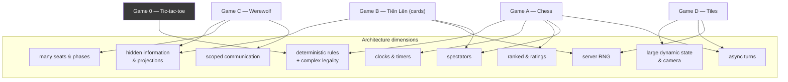

# 08 — First Games Validation Plan

> Prerequisites: [`02`](./02-game-module-and-sdk-design.md) (§12 has the contract sketches),
> [`07`](./07-phases-and-implementation-roadmap.md).

---

## 1. Why these four

The reference games are chosen as **architecture tests that happen to be fun**, not as a product
catalog. Each one is the cheapest game that stresses a dimension the platform claims to support.



Tic-tac-toe is the fifth, and it is not a product: it is the SDK's smoke test and template
(doc 02 §10). It exists so that "does the platform work?" and "does my new game work?" can be
answered in seconds.

### 1.1 Coverage matrix

| Architecture assumption | A: Chess | B: Cards | C: Werewolf | D: Tiles |
|---|---|---|---|---|
| Rules are pure and deterministic | **primary** | yes | yes | yes |
| Complex legality (move generation) | **primary** | yes (combination validity) | no | **primary** (placement validity) |
| Timers own their meaning | **primary** (clocks) | yes (turn timer) | **primary** (phase timers) | yes (long deadlines) |
| Server-side RNG, replayable | no | **primary** (shuffle) | yes (role assignment) | **primary** (tile bag) |
| Hidden information / projections | no | **primary** (hands) | **primary** (roles + night actions) | partial (bag order) |
| `view_event` degradation | no | **primary** (card backs) | yes | yes (drawn tile) |
| `view_event` → `None` (event non-existence) | no | no | **primary** | no |
| Many seats (6–20) | no | no | **primary** | no (2–5) |
| Phases and simultaneous action | no | no | **primary** | no |
| Game-scoped chat | no | no | **primary** | no |
| Voice scoping | no | no | **primary** | no |
| Large / growing state | no | no | no | **primary** |
| Camera: pan, zoom, rotate | no | no | no | **primary** |
| Asset volume | low | medium (52+ cards) | medium (roles, art) | **high** (tiles, meeples) |
| Async turns | **primary** (correspondence) | no | no | **primary** |
| Ranked ratings | **primary** (Elo) | yes (placement) | no | yes (placement) |
| Spectators | **primary** (live) | yes (delayed) | **primary** (game-controlled: the dead) | yes (live) |
| Bot substitution | yes | yes | **forbidden — validates the policy** | yes |
| Reconnect semantics | **primary** (clock keeps burning) | yes (secrecy on resume) | yes (phase continues) | trivial (async) |
| Drag & drop precision | **primary** | yes (fan selection) | no | **primary** (rotation + placement) |
| Accessibility: keyboard board play | **primary** | yes (list-based hand) | **primary** (voting is list-based) | hard case (2D infinite grid) |

Every cell marked **primary** is a claim in doc 00 that would otherwise be untested.

---

## 2. Game A — Chess (the correctness benchmark)

**Phase 1 (rules) → Phase 2 (presentation) → Phase 4 (multiplayer).**

### 2.1 Scope

```text
IN:  standard rules, all special moves (castling, en passant, promotion),
     check/checkmate/stalemate, threefold repetition, 50-move rule,
     insufficient material, resign, draw offer/accept/decline, claim draw,
     Fischer and Bronstein increments, flag fall, correspondence mode (24h)
OUT: variants (Chess960, three-check, atomic) — Phase 9+
OUT: opening book, analysis engine, cloud eval — separate optional crate, never in rules
OUT: FIDE tournament arbitration rules
```

### 2.2 What it validates

| Claim | How chess tests it |
|---|---|
| A game's rules can be *exhaustively verified* | `perft` node counts to depth 5 against published values. If move generation is wrong, perft says so immediately. No other game we ship has this luxury; that is precisely why chess is first. |
| Timers belong to the game, not the platform | All clock arithmetic is inside `apply`, driven by `ctx.now`. The platform contains **zero** lines of clock code. Verified by grep and by review. |
| Disconnect handling is a rules decision | Chess ignores `Input::Seat{Disconnected}` and lets the clock burn — expressed as `Ok(Outcome::empty())`. The opposite decision (pause) would be a one-line change in the game and none in the platform. |
| `legal_commands` enables free bots and UI | ~30 enumerated moves power highlighting, drag legality, and the `Trivial` bot with no extra code. |
| Determinism holds with no RNG at all | Chess is the control group: any determinism failure here is a platform bug, not an RNG bug. |
| Ranked ratings work | Elo from `MatchOutcome.standings`; side asymmetry (`symmetric = false`) forces matchmaking to alternate colors. |
| Replay is exact and useful | Every game is replayable; the replay viewer's first customer. |
| Async and live are the same rules | Correspondence chess uses identical `apply`, with a 24h `Effect::SetTimer` and hibernation. |

### 2.3 Presentation requirements

```text
board with coordinate labels, flip for black, last-move highlight, check indicator,
legal-target dots (from legal_commands), drag with lifted-piece preview + tap-tap fallback,
promotion picker, captured-material strip, move list with algebraic notation,
two clocks with tabular figures, low-time warning (visual + audio, never only color),
motion.piece-move / motion.reveal(promotion) / motion.invalid, checkmate sequence
```

### 2.4 Failure signals (what "the architecture is wrong" looks like here)

- Clock code appears in `tabula-match` → the `Effect::SetTimer`/`Input::Timer` contract is
  insufficient. **Fix the contract, not the game.**
- `legal_commands` needs to be called from `apply` for performance → `apply` is doing redundant work;
  restructure the game, do not change the contract.
- Drag-and-drop needs frame-level state in `State` → presentation boundary is being violated; the
  drag belongs in `P::Local`.

### 2.5 Acceptance

```text
[ ] perft depth 1–5 exact for the standard position + 5 published edge-case positions
[ ] all draw conditions reachable in tests
[ ] clock invariants hold under property testing
[ ] 100k bot self-play matches: zero determinism failures, zero panics, all terminate
[ ] hot-seat playable (Phase 2) and online playable (Phase 4)
[ ] replay of 1,000 sampled games byte-exact
[ ] keyboard-only game completion
[ ] Elo updates correct for win/loss/draw and never on Aborted
```

---

## 3. Game B — Tiến Lên (the hidden-information benchmark)

**Phase 3 (rules + presentation) → Phase 4 (multiplayer).**

Tiến Lên (Vietnamese thirteen / Southern-style shedding game) is chosen over poker deliberately:
four players, thirteen-card hidden hands, combination validity, no betting economy to build, and
cultural fit with the first market. Big Two, Tiến Lên Miền Bắc, and simple poker variants reuse
every primitive it establishes.

### 3.1 Scope

```text
IN:  52-card deck, deal 13 each, lowest-card start, single/pair/triple/straight/
     double-sequence combinations, beat-or-pass trick play, chop rules (2s and bombs),
     finishing order → placement scoring, 20s turn timer with auto-pass,
     deck commitment (hash at start, salt at end)
OUT: betting/wagering, currency, tournament ladders
OUT: regional rule variants beyond one configurable preset — Phase 9
```

### 3.2 What it validates

| Claim | How cards tests it |
|---|---|
| `project()` is a real security boundary | `View.your_hand` is the only hand present. There is no `Option<Vec<Card>>` anywhere to accidentally fill in. The `SecretModel` scan runs on every PR. |
| `view_event` can *degrade* instead of hide | `Dealt{seat, cards}` → `DealtToOther{seat, count}`. The card-back animation is possible without leaking. This pattern is reused by every future hidden-information game. |
| Server RNG is deterministic and replayable | `ctx.rng.stream(DOMAIN_SHUFFLE)` + pinned Fisher-Yates. The same match replays to the same deal in five years. |
| Clients cannot influence randomness | The seed exists only server-side; the client learns the deal only through its own projection. |
| Reconnect preserves secrecy | On resume, a player receives only their own hand. A reconnecting player must not be able to request an earlier state and learn more (the `Resync` is always *current*, never historical). |
| Spectator delay is enforceable | `Delayed{30s}` spectators are buffered by the actor, which also exercises "project from a past snapshot". |
| Fairness can be *proved*, not just asserted | The commitment scheme lets a suspicious player verify the shuffle after the match. **EXPERIMENT** — if it proves not worth the complexity, it is dropped with a written note, and the projection remains the security guarantee. |

### 3.3 Presentation requirements

```text
hand fan with overlap and selection lift, multi-select for combinations, validity preview
(combination legal / illegal against the table), table pile with last play prominent,
opponent hand-count indicators (card-back stacks), pass indicators, turn ring,
motion.card-deal (staggered), motion.card-play, motion.reveal, turn timer ring,
finishing-place banners
```

### 3.4 Failure signals

- The presenter needs to know a card the projection does not contain → the projection is wrong, or
  the animation is trying to be authoritative.
- The client needs the deck order to animate the deal → use `DealtToOther{count}`; the animation
  does not need identities.
- `SecretModel` cannot express a secret → the model needs extending (fine), or the state models
  knowledge badly (more likely).

### 3.5 Acceptance

```text
[ ] combination validity fully tested, including chops and edge cases
[ ] projection scan green for all four seats + live and delayed spectators
[ ] a scripted "hostile client" test: request resync repeatedly, attach as spectator while
    seated, attempt to attach to another seat — none reveal another hand
[ ] shuffle replay exactness over 10k matches
[ ] commitment verification test (and a deliberate tampering test that fails verification)
[ ] 100k bot self-play: terminates, no determinism failures
[ ] delayed spectator sees nothing newer than the delay window (asserted at the socket)
```

---

## 4. Game C — Werewolf (the social/scale benchmark)

**Phase 3 (rules, headless) → Phase 7 (full) → Phase 8 (voice).**

### 4.1 Scope

```text
IN:  6–20 seats; roles: Villager, Werewolf, Seer, Doctor, Hunter, Witch (configurable preset sets
     per seat count); phases: Night → Dawn → Day discussion → Vote → Dusk; night actions;
     majority/plurality voting with configurable ties; death reveals role; win conditions
     (wolves eliminated / wolves reach parity); dead players become spectators-with-full-vision;
     chat scopes per phase; voice scopes per phase; per-phase timers; no bot substitution
OUT: moderator-run mode, advanced roles (Cupid/lovers, Jester, Alpha), custom rulesets beyond
     presets, cross-match reputation — Phase 9+
```

### 4.2 What it validates

| Claim | How werewolf tests it |
|---|---|
| `view_event` can return `None` and hide *existence* | `NightActionSubmitted` must not be observable at all — even its timing leaks who acted. This is the only game that forces the platform to support "this event did not happen, for you". |
| `Audience::ServerOnly` works | `RolesAssigned` is in the canonical log (needed for audit and replay) and reaches no client until deaths reveal roles. |
| Phases are just timers | Five phases, each an `Effect::SetTimer` + scope update. The platform learns nothing about werewolf. |
| Chat scoping is a game rule the platform enforces | Wolves-only night chat, dead-only chat, muted day-vote periods — all via `Effect::SetChatScopes`, enforced at the socket. |
| Voice scoping works the same way | Phase 8's core test. |
| Many seats scale | 20 seats × N matches exercises viewer-group fan-out and the vote burst pattern (doc 06 §2.4). |
| `Viewer` needs a seat variant, not `Option<SeatId>` | Dead players are `Viewer::Seat(_)` with full vision; outside spectators are `Viewer::Spectator(_)` with public vision. An `Option<SeatId>` model could not express this. |
| `SubstitutionPolicy::Forbidden` is meaningful | A seat carrying secret knowledge cannot be handed over. The platform must honor the policy rather than "helpfully" filling the seat. |
| Simultaneous action model | Night is `TurnModel::Phased` with several seats acting concurrently — no "whose turn" concept applies. |

### 4.3 Presentation requirements

```text
seat circle with avatars, alive/dead state (shape + label, not color alone), role card
(own role, private), night overlay with role-specific action UI, vote markers flying to targets
with live tallies, phase banner with countdown (skippable transition), scoped chat overlay
showing WHICH channel you are in (unmissable), speaking indicators (Phase 8),
death reveal choreography, win/loss summary with full role reveal
```

### 4.4 Failure signals

- A villager's socket receives any frame derived from a night action → **critical**; the redaction
  is wrong. This is why Phase 7's tests assert at the socket, not at the API.
- Chat scope enforcement needs game knowledge in the chat module → the `ChatScopes` model is
  insufficient; extend the model, never special-case the game.
- Phase transitions need the platform to know phase names → leak of game concepts into the
  platform; the platform only sees `TimerId` and scopes.

### 4.5 Acceptance

```text
[ ] 20-seat golden integration match with per-seat projection assertions at every phase
[ ] socket-level chat scope tests (a wolf message never appears on a villager socket)
[ ] projection scan green at 6, 12, and 20 seats, for every role set
[ ] disconnect during night, during vote, and during dawn — all behave per the ruleset
[ ] vote-burst load scenario within latency SLO
[ ] twelve-human playtest with a leak review by a second engineer
[ ] dead-player vision correct; outside spectator vision correct; the two are different
[ ] voice scope enforcement verified at the SFU (Phase 8)
```

---

## 5. Game D — Tiles (the state-and-camera benchmark)

**Phase 3 (rules + presentation) → Phase 9 (async polish).**

A Carcassonne-like tile-placement game: draw a tile, place it legally adjacent, optionally place a
follower, score completed features.

### 5.1 Scope

```text
IN:  ~72-tile bag with a fixed distribution, rotation, adjacency legality, feature graph
     (roads, cities, fields, monasteries), follower placement and return, incremental scoring,
     end-of-game scoring, 2–5 seats, 60s live turns OR 24h async turns
OUT: expansions, rivers, custom boards, trading — later
```

### 5.2 What it validates

| Claim | How tiles tests it |
|---|---|
| `&mut State` and incremental structures are supported | The feature graph (union-find) must be part of state and part of the state hash. A naive recompute-per-turn design would be 100× slower — this game proves the contract accommodates real data-structure engineering. |
| `StateSizeClass` drives real behavior | ~30–120 KB state changes snapshot cadence and storage encoding, and makes `Welcome` frames large enough to matter (protocol frame limits, doc 03 §3.2). |
| `LegalCommands::Hints` is necessary | Legal (position × rotation) pairs are numerous; enumerating commands is wasteful. The hint form must be enough for UI highlighting and a bot. |
| Camera is presentation-only | Pan, zoom, and rotation live entirely in `P::Local`. Two players looking at the same board from different camera positions is not a desync. |
| Asset volume is manageable | The largest asset pack; validates atlas packing, priority loading, and per-density variants. |
| Async turns work end to end | A match spanning days, surviving deploys, with push notifications and hibernation. Phase 9's headline test. |
| Determinism with a large hidden ordered structure | The bag order is secret and consumed over time; replay must reproduce every draw. |
| Accessibility on an unbounded 2D grid | The hardest a11y case we ship: the Board Reader must let a screen-reader user place a tile. Solution: coordinate-relative navigation ("north of the monastery at C4") plus a legal-placement list. This case defines the ambition level for `describe()`. |

### 5.3 Presentation requirements

```text
infinite scrollable board with pan (drag / two-finger), zoom (wheel / pinch, clamped),
snap-to-grid ghost tile with rotation (tap-rotate + keyboard R), legal/illegal target tinting,
follower placement targets on the placed tile's features, score track, remaining-tiles counter,
minimap or "recenter" affordance, motion.tile-place, motion.token-drop, motion.score-update,
end-of-game scoring walkthrough animation
```

### 5.4 Failure signals

- The state hash becomes expensive because it hashes the whole board every input → introduce an
  incremental hash (the contract allows overriding `state_hash`), do not weaken hashing.
- Snapshot cost dominates → adjust cadence via `StateSizeClass`, or store snapshots externally;
  both are already in the design.
- The camera needs to be shared for a feature ("show me what my opponent is looking at") → that is a
  *presentation-level* peer message, and it must not enter canonical state; if we ever want it, it
  goes through a platform side channel, explicitly marked non-authoritative.

### 5.5 Acceptance

```text
[ ] placement legality fully tested, including all rotations and edge adjacency cases
[ ] scoring correct for every feature type, including end-of-game partial scoring
[ ] state hash cost < 200 µs at full board; apply within budget
[ ] snapshot size measured and StateSizeClass confirmed
[ ] Welcome frame size for a full board within the 1 MiB outbound cap (with margin)
[ ] async match survives 7 real days, 3 deploys, and 2 hibernation cycles
[ ] camera never affects state (property: identical command sequences from different camera
    positions produce identical hashes)
[ ] Board Reader allows completing a full turn with a screen reader
```

---

## 6. What these four do NOT cover

Honest gaps, with the future game that would close each. None of these justify adding a fifth
reference game now.

| Uncovered dimension | Why it matters | Closed by |
|---|---|---|
| Very large branching factor / heavy `apply` | A game whose `apply` costs milliseconds would stress the shared executor and `apply_budget` | Go (19×19, ko rules, territory scoring) — Phase 9 |
| Real-time / continuous action | The platform is explicitly not built for it (doc 00 §1.2) | Never; a party game with a timed tap phase (Phase 9) probes the edge safely |
| Simultaneous *commitment* then reveal | Rock-paper-scissors-like blind selection needs commit/reveal in the projection | A simple bidding game (Phase 9) |
| Economy / persistent progression across matches | Cross-match state is a platform concern we have deferred | A campaign/roguelike mode — post-Phase 11 |
| Team-vs-team ratings | `TeamElo` is declared but untested | A 2v2 card game (Phase 9) |
| Very long matches (weeks) with many participants | Hibernation + notification at scale | Async tiles at 5 seats already probes it; a play-by-mail wargame would push it |
| Localization-heavy content | Rules text and card text in multiple languages | Any card game with text-on-card (Phase 9) — the asset pipeline needs per-locale atlases |
| Physics or continuous animation driving outcomes | Would violate determinism if it entered state | Never |

---

## 7. Order, phase mapping, and effort shape

| Game | Rules | Presentation | Online | Full | Rough effort shape |
|---|---|---|---|---|---|
| Tic-tac-toe | Phase 0 | Phase 2 (trivial) | Phase 4 | Phase 4 | hours — it is the template |
| Chess | Phase 1 | Phase 2 | Phase 4 | Phase 4 | rules-heavy; perft is most of the work |
| Tiến Lên | Phase 3 | Phase 3 | Phase 4 | Phase 5 | projection-heavy; combination logic is fiddly |
| Werewolf | Phase 3 (headless) | Phase 7 | Phase 7 | Phase 8 | redaction- and UI-heavy; the social loop is the long pole |
| Tiles | Phase 3 | Phase 3 | Phase 4 | Phase 9 | data-structure- and asset-heavy |

### 7.1 The per-game definition of done

Applies to every game, reference or future (this is doc 02 §14's checklist, restated as an
acceptance gate):

```text
[ ] conformance suite green (doc 02 §11.1)
[ ] SecretModel + projection scan green (if hidden information)
[ ] ≥3 golden replays committed (normal, edge case, timeout)
[ ] 100k bot self-play: no failures, all terminate
[ ] apply within declared budget; state hash cost measured
[ ] manifest matches code; capabilities all consumed correctly
[ ] docs/games/<slug>.md with rules summary AND information model
[ ] presentation: RenderList only, motion tokens used, no raw colors
[ ] asset pack built, hashed, priority-tagged
[ ] a11y: describe() implemented; keyboard play possible; screen-reader pass
[ ] i18n: no hardcoded strings
[ ] one human playtest session with written notes
```

---

**Next:** [`09-synthesis-and-decision-register.md`](./09-synthesis-and-decision-register.md)
