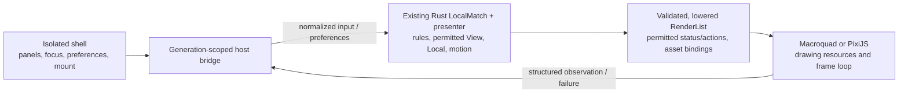

# RFC: renderer and embedding experiments for issue #60

Historical artifact notice: raw captures, generated receipts/logs and design exports
were removed from the source tree. Pinned links below use the pre-cleanup archive
[`80d9fdb9`](https://github.com/loveoverflowcom/tabula/tree/80d9fdb96f18cd59fa85c9401b533d66bf04b5d7/docs/rfcs); those artifacts describe their original
source/build and do not establish current runtime acceptance. New output belongs in
ignored `verification/` directories or GitHub Actions Artifacts.

- **Date:** 2026-10-03
- **Scope:** authorized, isolated local tooling prototype and evidence
- **Baseline:** `develop @ 2de46d27efafd078ba2d27b027a54de565e2fbe5`
- **Decision:** [ADR-0029](../adr/0029-renderer-embedding-spike.md)
- **Request:** [issue #60](https://github.com/loveoverflowcom/tabula/issues/60)

## Problem and current source

The application shell should remain visible around a board when the product needs
DOM panels, without moving game meaning into shell signals or choosing an engine
from unrelated demo artwork. There are two independent questions: which backend
draws the board, and which document owns its runtime.

At the pinned source, `apps/web/src/main.rs` implements discovery/setup routes
under ADR-0028. It still documents `/play/:match_id` as a navigation to a minimal
Macroquad gameplay document under ADR-011. Protocol, online match/session, lobby
and production gameplay routes are gated; discovery is not match authority.
`apps/game-client` has local Chess and Tiles drivers. The #59 slice supplies the
verified PNG/atlas pipeline and a real Macroquad Tiles baseline, with explicit
native/WebKit/resource-measurement residuals. Source and prior evidence are in
[the #59 ledger](../verification/issue-59/README.md).

The owner has authorized the isolated prototype requested in #60. This permits
tooling, examples, local fixtures, test hosts and evidence. It does not authorize
production route migration, implementation of the remaining Phase 4/5 runtime,
or relaxation of an invariant. Doc 00, `deps.toml`, ADR-011 and the bounded
ADR-0028 exception remain authoritative. No phase exit follows from this spike.

## Separate the two decisions

| Control | Renderer | Containment | What a comparison can establish |
|---|---|---|---|
| A | Existing Macroquad WASM | Separate minimal document | Local graphics/boot baseline; not online production handoff |
| B | The same Macroquad WASM artifact as A | Same-origin iframe inside the isolated shell | Wrapper/lifecycle/focus/resize cost with the engine held fixed |
| C | Minimal PixiJS adapter | Direct canvas inside the isolated Leptos shell | Feasibility of consuming Rust-derived presentation data, lifecycle and supported drawing subset |
| D | Existing native Macroquad | Native window | Separate native control; never evidence for DOM embedding |

A versus B isolates the wrapper only when artifact, workload, viewport, DPI,
cache class and sampling conditions match. B versus C changes both renderer and
containment and cannot establish an engine ranking. C's native fixture-process
transport is also a different boundary from A/B's in-browser Rust runtime; its
cost is reported independently. A future direct Macroquad or iframe PixiJS cell
is needed if a production decision depends on disentangling those factors.

The direct-canvas prototype uses actual isolated Leptos controls where built and
run. A plain HTML test host is a separately labelled lifecycle harness and cannot
stand in for evidence of a Leptos mount. Neither becomes a production route.

## Owners and authority

Rust rules remain the only owner of legality, canonical state transition and
replay. The existing presenter owns preview, selection, camera, hit testing,
intent creation and motion. PixiJS consumes the resulting drawing description;
it contains no second tile placement/scoring/bag model, bot or presenter.
`pixi-viewport` is unnecessary when camera semantics already come from Rust.

The fixture authority is `xtask/examples/embedding_fixture.rs`, an unconstrained
tooling example. Its loopback host talks to one local Rust process via stdin;
there is no multiplayer server and no match WebSocket. This is a local
validation/measurement adapter, not a replacement for `tabula-net-client` or
`tabula-protocol`. A future online integration retains one match-session owner
and the separate shell lobby socket defined by doc 04 §2.2/§4.1.

Only a permitted `View`, redacted `ViewEvent` or data derived from them crosses
the presentation boundary (I-5/I-6). Canonical state, remaining bag order,
match seed, audit projections and auth/join credentials are absent from browser
descriptors. The known fixture seed and checkpoint may be recorded in offline
tooling receipts; they are not an online disclosure design. A descriptor's
status/actions are derived from the same permitted view and local presentation,
not a shell reconstruction of game semantics. Camera and animation never become
canonical input (I-10), and preview never replaces authority (I-12).

The generic host dispatches backend modes and typed messages, not game IDs.
The explicit Tiles fixture is tooling, rather than a new game-specific branch
in a platform crate (I-9). Leptos does not enter the native or WASM gameplay
dependency tree (I-15). No new production crate or dependency arrow is required.

## Fixture and rendering contract

Reuse [the #59 reproduction protocol](../perf/tiles-renderer-baseline.md) and
[the editable CC0 fixture pack](../../games/tiles/assets/README.md).
The baseline is seed `[47; 32]`, three seats, no turn deadline, 24 accepted
Easy-bot commands, 13 board cells, and checkpoint
`e4ed3465b826a55c12d68d8f8bcbef5422fa5d128a251da1f4f659470060d032`.
The matching scripted workload has 20 additional accepted commands, 25 cells,
and checkpoint
`b7e81e41d5bd48f076a736858b6855b663591034127628be52b887ae1ce19a73`.
The exporter must prove these fixtures against the existing Rust authority,
rather than hand-author a plausible board. Any larger synthetic stress case is
separate and labelled synthetic.

The pack has original, editable `generate.py` and `tiles.svg`, two verified PNG
densities, 432×288 and 864×576, and explicit physical atlas regions. Use the
same `fixture.pack.toml`, file digests, resource variants and semantic tints.
No outside artwork is required. The adapter must verify length/hash before
bounded decode, check dimensions/atlas bounds and reuse renderer-owned textures;
the #59 backend's safeguards do not prove the PixiJS path has those safeguards.
Any reused baseline font needs its own provenance, digest and license receipt.
An adapter cannot replace the pack with its own visually similar art.

Rust's validated `RenderList` is lowered by tooling to schema-versioned drawing
DTOs. This does not create a new game view or alter the stable MVP command set.
The generated `render-contract.json` names schema version 1, RGBA8 colors,
logical CSS-pixel coordinates and column-major `Affine2` layout, and supplies
frame/command/input field sets consumed by JavaScript validation.
The adapter supports only the explicitly implemented subset and rejects a valid
but unsupported operation before presenting success. Record gaps in the evidence
ledger. Do not infer full `Renderer` parity from one Tiles frame.

Doc 04 §5.1.1 remains the semantic oracle: stable command/scoped ordering;
finite local logical units; parent × child affine transforms before camera;
`logical = (local - camera.origin) * camera.zoom`; logical viewport clips
independent of camera/transform; inherited primitive opacity; and DPI applied
only at rasterization. A Pixi scene graph is an adapter implementation detail,
not a new owner of layer sorting or camera behavior. Text metric/glyph differences
must be named rather than interpreted as perfect backend equivalence.

## Typed boundary and lifecycle

The Rust DTO/schema is the contract authority. JavaScript runtime validation and
compatibility checks consume that contract's generated descriptions/fixtures;
JS types alone provide no trust guarantee. A manually independent Rust/JS model
without a parity check does not meet the spike contract. Strict prototype DTOs
may reject unknown fields: this is not a change to production protocol JSON's
minor-version policy (doc 05 §9.1).

The iframe envelope is versioned independently of `tabula-protocol`:
`{ channel: "tabula-renderer-spike", protocol: 1, kind, session, generation,
revision, payload }`. Each page gets a fresh random session; mounts use its
monotonically advancing generation. Valid messages must match the exact expected origin and
`Window` source, channel/protocol, live session/generation, message kind/schema
and applicable revision. Target origin is exact, never `*`. Initialization
identity arrives by `postMessage` after load, not by a token-bearing URL.

| Operation | Required behavior |
|---|---|
| `mount/init` | Reserve identity before async work; validate inputs; create one instance owning canvas/resources/listeners/loop; commit readiness only while the same identity is live |
| `set_view` / presentation update | Validate schema, limits and revision; accept only the current session/generation; stage a complete valid frame before visible replacement |
| `resize` | Validate finite positive logical extent and bounded DPI; observe settled container size; cancel/coalesce queued resize and record actual canvas extent |
| `set_preferences` | Use generated semantic theme/motion data; latest revision wins; explicitly reject a live setting a backend cannot implement |
| `suspend/resume` | Stop or reduce drawing while hidden; clear/cancel local interactions; resume from current permitted view; never reinterpret rendering pause as authority/timer pause |
| `dispose` | Revoke command capability first; invalidate generation; cancel loop/queued work; release pointer capture, listeners, observers and owned graphics resources; remove canvas/iframe; restore initiating shell focus |
| structured failure | Visible failed state with stage/code, no secret payload or false ready receipt; cleanup partial initialization and permit a fresh mount |

Dispose is idempotent. If initialization or asset decode resolves after dispose,
destroy its newly created resources and do not install them, emit commands or
restart a loop. Rejected, duplicate, reordered and stale results are counted.
Revision handling is scoped by direction/message semantics; independent
one-way message counters must not accidentally discard a legitimate reply.
An HTTP/native authority response also belongs to the requesting generation;
stale results must not be presented after remount or view replacement.
Generation validity and state-version validity are distinct: a live instance
may still have produced an activation against an older permitted view. A
production path must preserve the input's observed revision or a resolved intent
witness, validate it when applying the command, and prove concurrent/burst input
cannot silently acquire a different meaning after a view change.

PixiJS v8 initialization is asynchronous. The prototype pins `pixi.js` 8.22.0,
uses `autoStart: false` and `sharedTicker: false`, and gives its mount one owned
animation loop. Owned textures/texture sources and stage children are disposed
explicitly; global asset-cache ownership must not obscure resource accounting.
See the official [Application guide](https://pixijs.com/8.x/guides/components/application),
[Application cleanup API](https://pixijs.download/release/docs/app.Application.html)
and [pinned upstream release](https://github.com/pixijs/pixijs/releases/tag/v8.22.0).
These are API facts, not performance evidence.

The Macroquad loader does not expose a supported same-document dispose API.
The iframe control tears down by removing its whole browsing context and
cleans the parent's bridge/listeners. This is a different lifecycle mechanism
from direct PixiJS resource destruction and must be tested separately.
Preferences supported only at Macroquad compile-time cannot masquerade as live
updates: the bridge rejects unsupported live requests or mounts an explicitly
labelled matching prebuilt variant. Report the implemented choice.

## Input, accessibility, audio and security

Keyboard events target a focused canvas/board only; shell typing and modal
controls retain DOM focus. Test Tab/Shift-Tab, Escape/cancel, focus restoration,
pointer capture/release/cancel, scroll and settled resize/DPI. A modal suspends
board interaction rather than allowing a hidden board to receive commands.
The renderer normalizes coordinates before Rust's existing input path decides
the intent; finite out-of-viewport input is distinct from invalid coordinates.

The shell may display the existing permitted Board Reader status/actions,
but full action activation and screen-reader play remain tied to #51 and
Phase 5. Record which accessibility paths execute. A canvas or a generated
description is not accessibility certification. Test all four semantic themes
and reduced motion on matching frames where the target permits it.

This prototype does not add an audio engine or voice plane. If a control has no
audio, state that plainly. Production audio later requires user-gesture unlock,
mute/volume preferences, denial handling, pause/dispose cleanup and visual cue
equivalence; it must not affect authoritative state or duplicate a match socket.

A same-origin iframe is runtime containment, not a security sandbox for
untrusted plugins. Its scripts can access same-origin parent resources. Load
only pinned trusted code and loopback fixtures. Do not put credentials in URLs,
logs, message payloads or DOM. Bound payload/string/array/texture sizes, reject
non-finite numbers and traversal/cross-origin asset paths, and validate data
at both ends. Context loss must produce a named failed/recovery state; automatic
recovery is proven only if that path is implemented and exercised. No plugin
sandbox, production CSP or third-party delivery claim follows from local tests.

## Dependencies and native consequences

PixiJS is confined to `tools/renderer-embedding-spike`; pin its exact dependency
and lock transitive packages in `package-lock.json`. Preserve upstream MIT
notices, inventory transitive licenses and record the actual audit result in
the tooling dependency ledger. MIT is permitted by current `deny.toml`, but
Cargo's check does not inspect npm dependencies. No ignore, license exception,
floating CDN script or new Cargo production dependency is implied.

PixiJS is a web backend candidate. Adopting it for web would create a second
graphics implementation while native/mobile continue Macroquad. Tauri remains
optional (ADR-019); a native window is not DOM-embeddable. WebGPU, WebGL variants,
WebView/mobile and physical high-DPI execution require their own evidence.
Bevy, Phaser and Rive stay alternatives/deferred: no additional engine is
installed for this spike. Filters and `pixi-viewport` require a demonstrated
missing capability and separately measured cost before consideration.

## Measurement protocol and acceptance

Place exact commands, logs, screenshots, receipts and limitations in
`docs/verification/issue-60/`. Preserve #59's receipts; do not relabel its
nonzero unclassified host-event scripts as controlled timing rows.

Record commit/build/source fingerprint, tool/dependency versions, host OS/device,
browser/version/backend, viewport and actual DPI, asset digests, accepted fixture
commands/checkpoints, theme/motion, visibility, sample count, warm-up and cache
conditions for every run. The first mount is cold only with respect to the
explicitly observed layer (for example a fresh renderer instance). Page reload
alone does not purge browser, HTTP, disk or driver caches.

| Metric | Definition and limitations |
|---|---|
| startup | Separate asset fetch/verify/decode, runtime init and first usable/rendered frame; capture clock origin and what readiness means |
| frames | p50/p95/mean/max of named CPU submission/adapter and frame-interval samples; no GPU completion inference |
| input | Timestamp normalized input, Rust request/response and next visible submission separately; a bridge ping is only round-trip latency |
| memory/CPU | Name actual API/process and sampling times; heap, WASM linear memory, texture estimates and process RSS are different quantities; no forced exact GC expectation |
| interop | Encoded bytes, serialization/lowering time, transport/copy/decode/validation cost and update rate; report native-loopback transport separately from future WASM FFI |
| download | Raw/gzip artifacts and included dependencies/assets; state exclusions and caching; no production network/SLA claim |
| teardown | At least 50 mount/dispose cycles where feasible; live callback/listener/resource counts, stale-command rejection and post-warm-up memory trend |

Run at least three comparable instances per controlled cell, with no recording,
builds, unplanned manual input, container resize or unclassified host events
during frame/boot timing. Prescribed scripted workloads and separately
timestamped input-latency trials are intentional measurement inputs. Classify
setup/focus/resize events before comparing full/reduced motion; do not silently
subtract events. Scripted cells require matching accepted commands/checkpoints
and completed scripts. Capture video separately.

Lifecycle/negative tests cover init/dispose races, double dispose/mount, stale
generation/session/revision, origin/source/schema/limit failures, duplicate
listeners, pointer cancel/focus/resize/DPI, asset failure and disposed command
emission. Integrity tests exercise actual fixture bytes; privacy tests forbid
canonical state/bag/credential fields and compare output with Rust's projection.
Regression checks preserve rejected-operation state and replay checkpoints.
Record mock/static/compile/runtime evidence separately.

Chromium and Safari/WebKit are separate browser cells where execution routes
exist; native Macroquad is another control. A hung automation binding does not
become a passed target: use a permitted working route or retain its specific
`BLOCKED`/`NOT_RUN` status. GPU timers, process metrics, audio, context recovery,
screen-reader action play and production handoff are required only for claims
about those properties, with missing evidence explicitly carried forward.

Focused nonempty Rust/JS suites precede `cargo xtask check` (the `just check`
implementation) and applicable feature/native/WASM/Leptos example checks.
Logs distinguish executed tests, ignored tests, compilation and actual runtime.
Review screenshots from running targets for board clarity, tint/atlas regions,
camera/clip/order, input feedback, theme/motion and shell integration.

## Executed evidence and present limits

The [issue-60 ledger](../verification/issue-60/README.md) owns exact commands,
source/build fingerprints, complete runs, screenshots and measurement tables.
The observations below are execution results, distinct from the measurement
requirements above. They preserve the original #59 receipts as historical data.

| Target / control | Executed result | Scope of that result |
|---|---|---|
| Macroquad separate document, Chrome 154.0.8037.97 | Three static runs PASS; [Historical first receipt](https://github.com/loveoverflowcom/tabula/blob/80d9fdb96f18cd59fa85c9401b533d66bf04b5d7/docs/verification/issue-60/runs/chromium-document-1.json), [Historical runtime capture](https://github.com/loveoverflowcom/tabula/blob/80d9fdb96f18cd59fa85c9401b533d66bf04b5d7/docs/verification/issue-60/screenshots/chromium-document-1.png) | Actual WASM rendering, 900×720 logical viewport, DPR1, light/full motion, 300 samples after 3-second warm-up; initial/final checkpoint matches the 24-command #59 fixture |
| The same Macroquad artifact in a Leptos-owned iframe | Three static runs PASS; [Historical first receipt](https://github.com/loveoverflowcom/tabula/blob/80d9fdb96f18cd59fa85c9401b533d66bf04b5d7/docs/verification/issue-60/runs/chromium-iframe-1.json), [Historical shell capture](https://github.com/loveoverflowcom/tabula/blob/80d9fdb96f18cd59fa85c9401b533d66bf04b5d7/docs/verification/issue-60/screenshots/chromium-iframe-shell-1.png) | Matching fixture/assets/viewport/DPR/motion and zero uncontrolled baseline input; actual isolated Leptos shell and same-origin bridge, rather than a shell mock |
| PixiJS 8.22.0 canvas in the isolated Leptos shell | Three static runs PASS; [Historical first receipt](https://github.com/loveoverflowcom/tabula/blob/80d9fdb96f18cd59fa85c9401b533d66bf04b5d7/docs/verification/issue-60/runs/chromium-pixi-1.json), [Historical shell capture](https://github.com/loveoverflowcom/tabula/blob/80d9fdb96f18cd59fa85c9401b533d66bf04b5d7/docs/verification/issue-60/screenshots/chromium-pixi-shell-1.png) | The same initial checkpoint/assets/900×720/DPR1; actual direct-canvas rendering of Rust-derived data; local native authority shim, not deployed WASM interop |
| Native Macroquad window | Three static runs PASS; [Historical first receipt](https://github.com/loveoverflowcom/tabula/blob/80d9fdb96f18cd59fa85c9401b533d66bf04b5d7/docs/verification/issue-60/runs/native-static-1.json) | Separate executed native control with renderer receipts and process observations; no DOM embedding inference |
| Native Rust fixture authority | [Historical Stdin smoke](https://github.com/loveoverflowcom/tabula/blob/80d9fdb96f18cd59fa85c9401b533d66bf04b5d7/docs/verification/issue-60/runs/native-authority-smoke.json) PASS, 12 requests | Actual local Rust process, identity/revision checks and typed input through the existing presenter/authority; no browser WASM or production networking claim |
| Fixture asset verification | [Historical Actual verifier smoke](https://github.com/loveoverflowcom/tabula/blob/80d9fdb96f18cd59fa85c9401b533d66bf04b5d7/docs/verification/issue-60/runs/asset-verifier-smoke.json) PASS | Existing BLAKE3 pack binding accepted exact fixture bytes and rejected a same-size corrupted atlas; browser SHA-256 pins are additional digests of those verified bytes |
| Safari 18.6 / alternate WebKit | [Historical Capability probe](https://github.com/loveoverflowcom/tabula/blob/80d9fdb96f18cd59fa85c9401b533d66bf04b5d7/docs/verification/issue-60/safari-probe.json) BLOCKED / NOT_INSTALLED | Safari WebDriver session creation requires the disabled remote-automation setting; that setting was unchanged. The Playwright WebKit runtime is absent; no WebKit rendering result is claimed |

Browser and native process observations exist here; their semantics still differ
from unique resident memory or GPU timing. Browser process-tree RSS sums can
double-count shared pages, and sampled CPU-time deltas include shell/GPU/utility
processes and omit already exited children. No GPU-completion measurement or
cross-browser performance ranking follows from them.

The static cells show that these containment/adapter paths can display the same
permitted fixture on this Mac. They share Rust-derived geometry and asset bytes,
not proven pixel equivalence: review observed font rasterization and disabled-fill
differences. Pixi's draw timer includes scene reconstruction
and `app.render`; Macroquad's submit/end timer excludes its final frame flush.
Their frame pacing and sample durations differ. Those values must not be treated
as equivalent engine CPU timers. Iframe ping results measure `postMessage`
round trips, not input-to-visible feedback or match latency. Renderer-instance
startup and a warm browser/context are not a cold network/device launch.

Additional lifecycle, input, theme, motion, integrity and regression coverage is
listed separately in the ledger with its actual tests/runs. The final
[Historical Chromium interaction receipt](https://github.com/loveoverflowcom/tabula/blob/80d9fdb96f18cd59fa85c9401b533d66bf04b5d7/docs/verification/issue-60/runs/chromium-interactions.json)
is PARTIAL: 11 checks PASS and one BLOCKED. Actual automatic visibility suspension
could not be reached: Chrome stayed `visible` after tab switches and window
minimization across bounded retries. Explicit suspend/resume did cancel and
restart actual RAF drawing. Synthetic visibility tests do not substitute for
that blocked runtime transition.

The host captures `observed_revision`, `observed_checkpoint` and `input_sequence`
when it admits an input. Before dispatching against the current native revision,
it compares the captured Rust checkpoint with the latest permitted frame and
drops stale inputs as `dropped_stale_checkpoint`. The interaction receipt proves
two real DOM Enter activations from the same view produce one accepted command
and one dropped stale activation after that command advances the checkpoint.
This repairs the earlier unguarded queue policy. It is a bounded local-fixture
check, not a production state-version/intent protocol or exhaustive concurrency
proof; production adoption still requires an appropriate typed guard and tests.

[Historical Pixi's 50 cycles](https://github.com/loveoverflowcom/tabula/blob/80d9fdb96f18cd59fa85c9401b533d66bf04b5d7/docs/verification/issue-60/runs/chromium-pixi-cycles.json) and
[Historical the iframe's 50 cycles](https://github.com/loveoverflowcom/tabula/blob/80d9fdb96f18cd59fa85c9401b533d66bf04b5d7/docs/verification/issue-60/runs/chromium-iframe-cycles.json)
both PASS after rendering and disposal. Per-mount listeners/observers/timers,
canvases/iframes, bridge listeners and reported Pixi RAF/font/texture-source handles
reach zero. The two permanent harness document handlers remain constant. The
iframe RAF receipt is a lower bound on completed frames. Observed process RSS
rises during these short campaigns; exact heap/GPU reclamation and absence of
all memory leaks remain unproven.

Audio playback is unimplemented. Graphics context loss has a named failed state
and tested explicit remount, rather than automatic transparent recovery.
Navigation/back/deep-link and online join-token/reconnect handoff remain untested;
the tested modal/focus paths do not establish them. Script checks step the Rust
timeline and do not establish a paired realtime motion/input benchmark. A labelled
stress benchmark, physical higher-DPI device execution, mobile/WebView and full
Board Reader action play still need their own evidence. The final
[Historical source/build manifest](https://github.com/loveoverflowcom/tabula/blob/80d9fdb96f18cd59fa85c9401b533d66bf04b5d7/docs/verification/issue-60/source-manifest.json) binds the
refreshed static controls to their measured inputs; numerical tables stay in the ledger.

These limitations support ADR-0029's defer of production engine and containment
selection. The existing rules, replay, production routes and phase gates retain
their owners; the local shim is not promoted to a shipping network/client path.

## Decision gate and rollback

ADR-0029 records the tooling decision and defers a production replacement.
To select iframe or direct canvas for production, require a concrete DOM-heavy
product need, the comparable controls above, validated lifecycle and projection
boundary, target coverage appropriate to shipping platforms, quantified costs
and explicit residual acceptance. To replace ADR-011, write a superseding ADR
and update doc 00/01/04/07/09, implementation and enforcement together where
affected. Production migration is a subsequent scope.

Rollback is to stop serving the isolated host/examples and remove tooling files;
production continues the ADR-011 path throughout. There is no production feature
flag, data migration, replay change or backend state to roll back.
