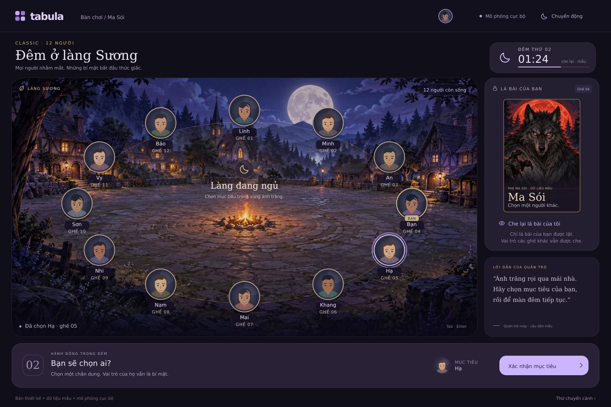
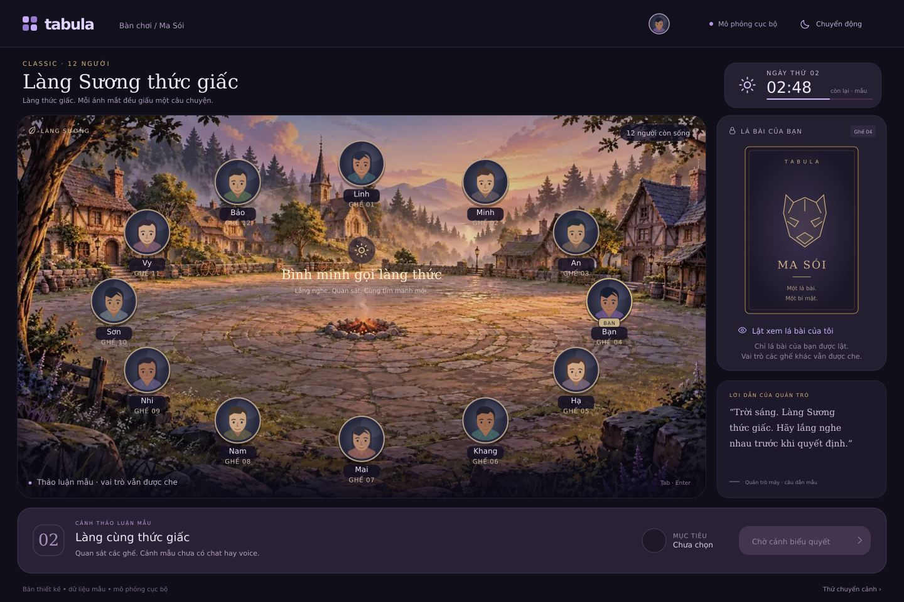
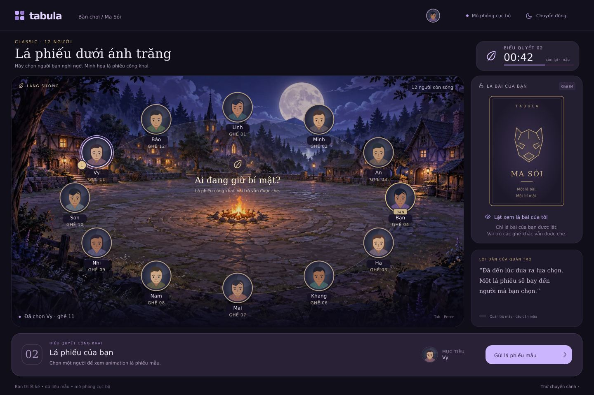
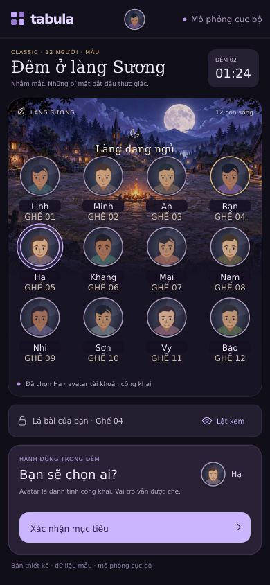
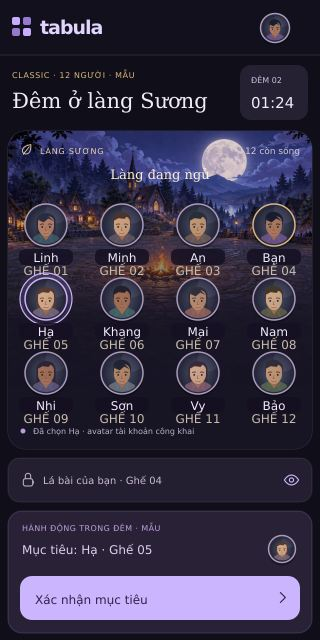
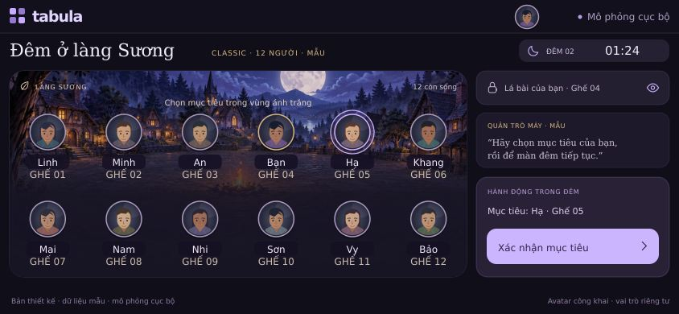
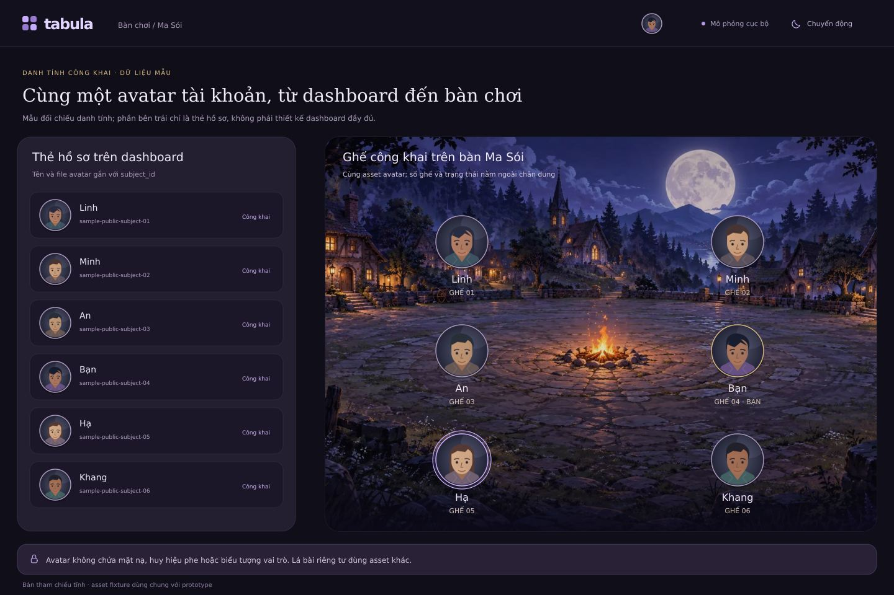

# Bản thiết kế cho [Ma sói #84](https://github.com/loveoverflowcom/tabula/issues/84)

## Mục tiêu
Redesign Ma sói trước Cờ vua theo yêu cầu chủ dự án từ [#82](https://github.com/loveoverflowcom/tabula/issues/82): **bàn làng có nhân vật và chuyển động**, hình/bài đúng chiều, nút thẳng hàng; giảm cảm giác một màn hình đầy nút số. Giữ Rust/Macroquad và primary tím của Tabula.

**Ảnh dưới đây là bản thiết kế với dữ liệu mẫu**, xuất từ SVG; không phải screenshot Macroquad. HTML/CSS/MJS có choreography mẫu để review, không chứa game rules/network. Source đối chiếu `develop@e75624ae870a74f62f0f734fbcf2f12043047dd4`, ngày 06/10/2026.

## Thiết kế mới

Bình minh, phiếu công khai và mobile responsive

- Chọn trực tiếp **chân dung quanh lửa trại**; 12 avatar tài khoản dùng cùng nguồn ảnh với dashboard/header, không mã hóa vai. Mobile dùng lưới 4×3, không thu nhỏ vòng desktop.
- Bài riêng và lời quản trò là vùng phụ; một CTA theo pha. Selected/focus có viền + nhãn, không chỉ màu.
- Nền đêm/bình minh cùng bố cục, ánh sáng chuyển mượt; artwork dịu sau chữ. Vai, tên, trạng thái và nút là typography live.
- Phiếu chỉ minh họa công khai khi được phép; hành động đêm không có ready count/effect/cue cho ghế khác. Simulator controls ở vùng phụ.
- Mobile có bố cục riêng: 390×844 ưu tiên đủ 12 ghế + CTA trong màn đầu; bài riêng thu vào drawer. Có compact 320×640 và landscape 844×390; dock/footer có slot thật và safe inset, panel phụ được cuộn.

## Bổ sung: avatar đồng bộ dashboard

- **Một tài khoản dùng một avatar** ở dashboard, header và ghế trong game. Đổi ghế/vai/pha/sống–chết giữ nguyên ảnh; status/selected/vote là marker riêng, không che mặt hoặc thay bằng role art.
- Cùng resolver, asset reference/revision, crop tròn và fallback. Loading/error/offline không đổi kích thước layout; occupant đổi phải bỏ ảnh/callback của người cũ.
- Source hiện tại chỉ có `SelfProfileResponse { version, account_id }`, chưa có avatar/name API. Đây là **yêu cầu contract mới** cho host/resource layer: map seat → public occupant display được phép, cùng nguồn với dashboard; không fetch profile trong game rules/projector hoặc tự giả định field `avatar_url`.
- Bộ design dùng `avatar-fixtures.json` và 12 SVG tài khoản **mẫu** qua `account-avatars.mjs`, cùng asset ở mini dashboard và bàn chơi. Khi triển khai, dùng avatar tài khoản thực từ nguồn được phép; thiếu dữ liệu dùng shared neutral fallback/initials, không suy từ seat/role.

## Responsive bổ sung

| Khung tham chiếu | Thiết kế |
| --- | --- |
| 390×844 | Header/pha gọn, avatar 4×3; 12 ghế + CTA trong màn đầu; bài riêng mở drawer |
| 320×640 | Compact spacing, panel phụ cuộn; touch target ≥44 dp, CTA có slot sticky thật |
| 844×390 | Bàn trái, thông tin/hành động phải; không thu nhỏ vòng desktop hoặc phủ ghế bằng panel |

Drawer có close/Escape, focus trap/restore; blur/mất quyền phải che private art ngay. Safe inset, host/footer và dock có owner/slot riêng. Font-scale 200%, tên dài và keyboard mở dùng cuộn có kiểm soát; không giảm chữ để ép fit. [Town of Salem 2 trên Steam](https://store.steampowered.com/app/2140510/Town_of_Salem_2/) là tham khảo bầu không khí social deduction; cảnh/HUD/mobile và assets trong bộ này được thiết kế riêng cho Tabula.

## Animation bàn giao
Tham chiếu profile trong `docs/ui/tokens.json` và doc 04 §9; progress ở `GamePresentation::Local` (I-10).

| Trigger | Choreography | Duration/profile | Reduced motion |
| --- | --- | --- | --- |
| Chia bài | Mặt sau chung bay tới ghế, stagger 40 ms | card-deal 280 ms | Hiện ngay mặt sau |
| Mở bài mình | Nhấc nhẹ → thu ngang → đổi mặt được phép → mở + highlight | card-reveal 480 ms | Đổi mặt ngay |
| Chọn người | Chân dung nâng 2–4 dp, vòng selected và nhãn | 160 ms | Marker tĩnh |
| Phiếu công khai | Token tới mục tiêu, counter theo projection | vote 160 ms | Counter cập nhật ngay |
| Đêm → ngày | Crossfade hai cảnh, sun/moon và phase title ngắn | phase-change 480 ms, skippable | Pha mới hiện ngay |
| Công bố người chết | Dịu chân dung, thêm nhãn; không tự lật vai | reuse fade profile | Nhãn tĩnh |
| Kết thúc | Composition phe thắng trên bàn làng | win 800 ms, skippable | Bảng tĩnh |
| Ambient | Lửa/ember tối đa 12 hạt, fog nhẹ ngoài chữ | budget presentation | Tắt; pause khi hidden |

Mất quyền/đổi viewer/blur/phase phải **che private art ngay**, không chạy nốt flip. Animation không giữ input, ack, phase hoặc deadline; event cũ hơn 600 ms snap, queue bounded. Reduced motion và đổi cảnh phải cancel cả WAAPI/timeline còn chạy. Prototype chỉ minh họa, không chứng minh privacy/runtime.

## Sửa lỗi từ #82 trước polish
1. **Vùng clip bị lật dọc**: kiểm `crates/tabula-render-macroquad/src/draw.rs`, camera/viewport/scissor/UV với texture bất đối xứng đánh dấu 4 góc. Chưa xác nhận root cause; không xoay asset nguồn để bù renderer.
2. **Nhãn/nút lệch**: kiểm actual glyph ascent/descent/baseline trong `text.rs` và `button.rs::draw_label`, wrap tiếng Việt/icon spacing. Vị trí nghi vấn từ source, chưa phải chẩn đoán.
3. **Host đè footer ở 390×844**: phối hợp `standalone.css::.runtime-access` với `games/werewolf/src/presentation/render.rs`; mỗi vùng có owner/slot riêng.

## Source và nghiệm thu
[Tải assets + source preview Ma sói (.zip)](../werewolf-assets.zip) · [Bộ source, SVG/PNG/JPG và art](.) · [Hướng triển khai + acceptance đầy đủ](IMPLEMENTATION.md) · [HTML](index.html) · [Motion MJS](preview.mjs) · [Exporter](export_preview.py) · [Nguồn ảnh/hash](ASSETS.md)

- [ ] Cùng account có cùng avatar/fallback ở dashboard/header/game, cả khi đổi ghế/vai/pha; loading/error/offline/late-load/occupant-change không hiển thị ảnh người cũ.
- [ ] Review shared public display contract; không invent profile data/API. Game presentation dùng host-provided avatar reference, rules/projection không tải account data.
- [ ] 390×844 đủ 12 ghế + CTA trong màn đầu; 320×640 và 844×390 không overflow ngang/đè footer. Kiểm 44 dp touch target, font-scale 200%, tên dài/safe insets/keyboard và drawer focus/close/conceal.
- [ ] Sửa đảo clip/baseline/footer; ảnh Macroquad thật ở 1200×880, 1100×850, 390×844, 320×640, landscape thấp, DPR1/2. Texture/text/target cùng đúng hướng.
- [ ] Reveal/conceal, các vai hiện có, target/submit/skip, dawn/death/public ballot/terminal rõ; projection là authority, không tiết lộ private choices.
- [ ] Bốn theme, reduced motion, keyboard/focus, touch target và interruption/viewer change; đo frame pacing/memory trên platform được nghiệm thu.
- [ ] Game presentation sở hữu art/motion; renderer chỉ cơ chế, asset pack per-game. Cập nhật screen/rubric Ma sói đang mô tả presenter cũ.
- [ ] PR dùng `tabula-engineering` + `tabula-game-audit`, targeted checks rồi `just check`; source design không thay runtime golden/receipt của #82.

**Phạm vi:** thiết kế và issue; runtime/luật chưa sửa. ADR-0035 local simulator giữ scope hiện tại; online/voice/native mobile có issue/gate riêng (#81). Thứ tự: issue này trước, [Cờ vua #85](https://github.com/loveoverflowcom/tabula/issues/85) tiếp theo; #51 giữ vai trò umbrella UI.

**Bằng chứng lượt thiết kế:** đã inspect 7 ảnh tĩnh (night/day/vote, mobile/compact/landscape, avatar-sync), syntax MJS và compile exporter PASS; chưa chạy browser prototype hoặc game runtime (NOT_RUN). Không có đổi runtime, PR hay merge vào develop.
