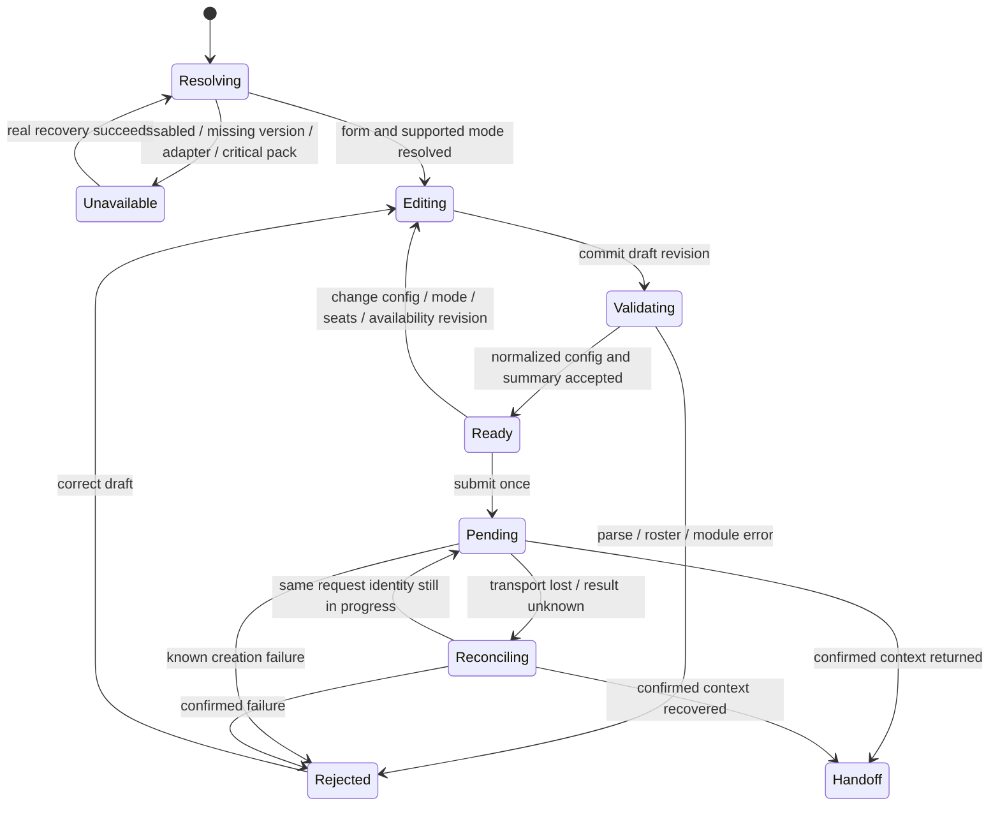

# Discovery and setup contract — screens 01–03

Stage A of [issue #50](https://github.com/loveoverflowcom/tabula/issues/50).
Source base: `develop @ cdff554de327cf8d23893c7b606fc09670371b74`, checked against
the remote branch on 2026-10-01. Design provenance is the
[02-discovery pack](https://github.com/loveoverflowcom/tabula/tree/030da25d0098e240ab2cf36dacf9892e8b320a89/docs/ui/design-02/02-discovery)
and its [foundation component mapping](https://github.com/loveoverflowcom/tabula/blob/030da25d0098e240ab2cf36dacf9892e8b320a89/docs/ui/design-02/01-foundation/shared/material-component-map.md).
The earlier issue audit at `44f6b74` is superseded by the source inventory below.

Read [foundation](foundation.md), [availability evidence](discovery-availability.md),
[01 Library](01-library.md), [02 Game detail](02-game-detail.md), and
[03 New match](03-new-match.md) together. Doc 00, doc 02 §4–§9, doc 04 §2–§4 and
§10, and doc 07 remain authoritative. This specification introduces no Rust API,
wire type, running route, game registration, or new token.
The [verification ledger](discovery-verification.md) separates this stage's
source/document checks from later runtime acceptance.

## Behavior and phase boundary

The intended flow is find a game → understand its supported modes → configure →
review the normalized configuration → request creation → enter the runtime after
success. A verified resumable match precedes browsing. Browsing and permitted
local play do not require an online account.

The shell owns navigation, fields, filters, and presentation of adapter results.
The module owns configuration meaning and validation. The registry is the only
game dispatch boundary (I-9); the shell never links a game crate or derives a
configuration from a game-id branch. Canonical state remains inside the trusted
rules driver; shell forms and resume cards receive only public facts/projections
(I-5/I-6). UI preferences stay outside game configuration/state (I-10).

At this base the registry is a Phase-4 rustdoc scaffold and the web shell is a
Phase-5 executable that exits with a gate message. Phase 3 is still missing the
complete Caro/Werewolf benchmarks; Phase 4's networked acceptance has not been
established. Stage A supplies documentation. Stage B runtime work remains
blocked by those gates and the dependencies below. A local CLI does not open the
web-shell gate. Native shell screens follow doc 07 Phase 6.

## Routes, aliases, and navigation

These are proposed shell behavior on the routes already owned by doc 04 §2.1.
No additional product path or short-slug lookup table is introduced.

| URL / entry | Screen and action | Result and history |
|---|---|---|
| `/` | Resume-first home using Library components; small featured collection only when supplied by catalog policy | Browse all opens `/games`; a verified Continue action enters its recorded match |
| `/games` | 01 full Library; search/filter toolbar and catalog | Opening an entry pushes `/games/:id`; preserve query and list scroll/focused entry for Back |
| `/games/:id` | 02 detail for a validated full `GameId`, such as `com.tabula.chess` | Resolve through registry; Configure pushes the setup query state on this same path |
| `/games/:id?setup=1` | 03 setup substate of detail | Back removes setup state and restores the Configure focus; direct entry has a labeled Back to detail fallback |
| `/play/:match_id` | Existing runtime handoff target | Real document navigation on web; native scene swap; no gameplay SVG/DOM mounted in Leptos (ADR-011) |
| `/rooms/:id`, `/queue` | Future network room/queue destinations owned by issue #55 | A network setup result can hand off here only after the real service returns an identity |

`/` and `/games` retain distinct doc-04 meanings and share one visual Library
language; neither redirects to the other. There are no new aliases. `#library`
and screen filenames in the design navigator are reference navigation only.
Validate path IDs through `GameId`; an unknown valid ID is a not-found state,
and malformed IDs are navigation errors. Never invent an ID for a planned game.

Proposed catalog query keys are `q`, `category`, `players`, `duration`,
`complexity`, and `mode`. Category/complexity/mode use adapter-defined enum values;
players and duration are positive integers (minutes for duration). The duration
filter means estimated maximum minutes ≤ the selected budget; it is not a match
timer. Seat filtering tests `seats().allowed().contains(count)`, including exact
sets with gaps. Search matches localized name/tagline and approved tags using a
documented locale-aware policy; ordering remains stable by localized title then
`GameId`. Filters combine with AND. Empty values remove the constraint. Invalid
query values produce a visible recoverable filter error; do not silently turn
them into a different selection. Typing/filter changes replace history; opening
detail/setup pushes history. Query state contains no token, player identity,
private draft payload, or canonical state.

Detail passes its explicitly selected mode into the same-game setup draft;
retain it if the adapter still confirms support. A direct setup entry without
a prior selection uses an explicit adapter default or requires a choice. Query
parameters never establish mode support. If a prior mode loses support, retain
its unavailable explanation or clear it; never replace it silently.
Back/Forward restores a draft only if its game/version and adapter revision still
match; otherwise retain safe user input for explicit review and revalidate.
Opening detail or setup never creates a match. A successful handoff replaces the
pending setup history entry to prevent Back from repeating creation.

Local implementation qualifier ([ADR-0030](../../adr/0030-local-discovery-gameplay-handoff.md)):
the opt-in two-human document handoff uses ordinary navigation and retains the
setup entry for browser Back. Restoring that entry retires Pending/Handoff to
Editing and requires explicit revalidation/start; it never repeats creation.
Reopening gameplay starts a fresh unsaved local match. The replacement/resume
contract above remains the future server-owned flow.

## Typed data mapping

Names in the “proposed boundary” column are design obligations, not implemented
types. Phase 4/5 must settle their typed protocol and client contracts before
use; a wire addition follows I-13. No prototype `src/data.mjs` array is a catalog.

| UI fact / consumer | Existing owner and source | Proposed boundary or restriction |
|---|---|---|
| Name, description, genres, tags, estimate, complexity | `GameMetadata` accessors in [metadata.rs](../../../crates/tabula-game-api/src/metadata.rs) | Catalog/detail localize `I18nKey`; missing translations show a labeled fallback, never an untranslated key as product copy |
| Package identity and rules identity | `GameId`, `GameVersion`, `RulesVersion`; `GameModule::rules_hash` | Carry the selected identity through validation and creation; resume uses the match's recorded version rather than latest |
| Icon/hero | Metadata `AssetRef`; presenter `asset_pack()` | Logical refs require actual asset resolution; a failed cover shows a neutral placeholder without changing availability |
| Seat count and teams | `GameCapabilities::seats`, `SeatCounts`, `TeamSpec` in [capabilities.rs](../../../crates/tabula-game-api/src/capabilities.rs) | Form enumerates allowed counts and module-authored seat labels; unfilled room seats are explicitly unassigned. Authority validates the complete roster, identities, and permitted occupancy before match creation. |
| Mode: local humans, local bots, network | No creation-mode field in metadata/capabilities | Proposed launch adapter exposes confirmed modes with available/unavailable(reason, recovery)/unknown states; readiness is specific to build, platform, version, and resources |
| Bot level at creation | `GameModule::declared_bot_levels()` plus gameplay-host support | Discovery/setup lists the package's immutable policy inventory without constructing factories. The host independently confirms linked factories and a bot runner before launch; `fill_with_bots` or substitution policy alone is insufficient |
| Time control, presets, other game options | Game-owned `Config`, `GameModule::validate_config` in [module.rs](../../../crates/tabula-game-api/src/module.rs) | Proposed module-authored form/preset adapter parses and summarizes typed config through registry; generic widgets render descriptors, never infer fields from `game_id` |
| Local launch / offline status | Current trusted local driver; no offline/readiness capability | Confirm local driver and required resources independently; a local mode never implies a cached offline-ready badge |
| Disabled / enabled / audience | Manifest rollout defaults; registry rollout contract | Proposed authority supplies effective rollout, not a client interpretation of `game.toml`; unavailable modes keep a visible reason |
| Version and resource readiness | Registry resolution contract; `AssetPackRef`, bound manifest/integrity APIs | Proposed resolver/loader reports exact required pack and critical-resource status; package version and pack version need not be equal |
| Accessibility and rules resources | Presenter descriptions; optional `rules_url_key`; supported platform evidence | No generic “Accessible” badge from a method's presence; missing rules URL gets an explicit unavailable state, no invented link |
| Resume card | Recorded public match identity, viewer-authorized summary, resumability result | Proposed session/resume adapter distinguishes ready, stale, ended, forbidden, and unavailable; never derives turn/clock from cached canonical state |
| Ranked/voice/async status | Existing declarative capabilities | Detail may describe declarations as such; actionable controls also require their service/feature/platform gates; no user rating or engine-ready metric exists here |

The smallest pending decisions are:

| Dependency | Named owner / consumer | Required decision before Stage B |
|---|---|---|
| Config form and normalized summary | Module authors → registry adapter → screen 03 | Choose doc 02's experimental `ConfigForm` or module-owned handwritten fallback; include parse/format, field-error mapping, presets, seat labels, defaults, and config revision |
| Mode/readiness facts | Local driver and server policy → registry/client adapter → screens 01–03 | Define typed mode evidence and reasons; do not add guessed booleans to `GameCapabilities` |
| Creation/resume transport | Protocol, authority, net-client → setup/resume | Establish identities, authorization, request deduplication, returned context, and unknown-result recovery |
| Effective availability | Registry rollout/version resolver and asset adapter → catalog/detail/setup | Define fresh/stale/unknown availability and reason/recovery data without exposing canonical state |

`validate_config(&Config, &SeatRoster) -> Result<(), ConfigError>` currently returns
no normalized value and cannot mutate its input. “Validate and normalize” in its
rustdoc/doc-02 sketch does not establish a normalizer. A form adapter must build
the normalized `Config` first, then invoke module validation once the complete
roster is resolved; authority validates again before creation. These dependency
decisions change no shared
contract in Stage A.

## Configuration and creation states

This machine describes a direct match-creation action. A network choice that
creates a room or enters a queue instead follows that destination's typed
request validation/pending/result contract, owned by issue #55. Its Ready state
means the config and seat plan are ready for that request, not that a complete
match roster exists. Screen 03 can normalize config and validate supported field
and seat-plan constraints; room/queue authority resolves participants and invokes
`GameModule::validate_config` with the complete `SeatRoster` before creating the
match. A returned room/queue identity navigates to that destination, never directly
to gameplay or a “match started” message.

Each validation result belongs to one game/version, mode, roster or seat plan, config, and
availability revision. Editing invalidates Ready immediately; discard late
results for old revisions. Editing stays available while validation runs. Pending
locks fields and duplicate submission while showing the exact submitted summary.
Known failure retains the draft, highlights the offending field, and revalidates
before retry. `ConfigError::SeatCount`, `Field`, and `Unsupported` map through
module-authored localized messages; do not expose developer detail verbatim.

Unknown creation outcome keeps the request identity and offers Check status or
return navigation with the pending operation retained by the adapter. A retry
must reconcile/deduplicate that request, not create a second match. Canceling a
request is offered only when the authority supports cancellation; leaving the
screen is never labeled successful cancellation. A late result cannot navigate
a user who left the flow without explicitly choosing to enter it.

For local creation, the trusted driver validates and returns a real session
context before the scene/document switch. For network play the authority also
checks identity, roster ownership, rollout, supported versions and creation
policy. Auth is invoked only when that selected network action requires it,
with a safe return to the same draft; local choices remain usable without login.
Successful creation is the only event that enables handoff. Network handoff uses
doc 04 §3.4's short-lived context storage and `/play/:match_id`; no credentials
are placed in the URL. Local web session identity/handoff needs the launch-adapter
decision above; Stage A does not fabricate a server match ID for local play.

## Shared empty, loading, and failure matrix

All reasons and recoveries below require stable en/vi keys at runtime. A reason
is readable text outside faded disabled controls, never a tooltip-only message.

| Condition | Scope and visible UI | Action / result |
|---|---|---|
| First catalog/detail/form fetch | Labeled skeleton in known content region; controls have no speculative defaults | Busy status; no Play until resolved |
| Catalog empty | Library says no games are available to this audience | Retry only if backed by a real adapter; no mock entries |
| Filter no result | Preserve filters and show their summary | Clear filters returns unfiltered catalog |
| Catalog fetch error / stale cache | Persistent failure/stale banner, retain last public collection if present | Retry revalidates; stale rows can be inspected but cannot prove creation readiness |
| Unknown ID / invalid route/query | Detail not-found or labeled navigation/filter error | Back to Library or reset the invalid filter; no fallback game |
| Game disabled / audience excluded | Explain new-match unavailability; do not reveal a restricted catalog record | Inspect only authorized public facts; existing match continuation separately follows authority policy |
| Mode unsupported / adapter missing | Keep supported choices usable and annotate unavailable choice | Select a supported mode; if none exist, suppress creation and show reason |
| Config parse/module rejection | Field-level error plus summary error; preserve entered values | Correct field and revalidate; stay on 03 |
| Creation pending / known rejected | Submitted summary + busy action, or persistent failure | No duplicate submit; known failure permits revalidated retry |
| Creation result unknown | Explicit “Checking whether the match was created” status | Reconcile same request; never claim failure/success without result |
| Unsupported game/rules/protocol version | Exact recorded/selected version and reason | Update compatible client or explicitly review a supported new-match version; never upgrade a running match silently (I-16) |
| Required pack unavailable / incompatible / integrity failure | Required pack identity and persistent resource error | Real retry/update/cancel; fail closed for critical assets; neutral fallback only for noncritical media |
| Offline | Persistent connection status; network actions unavailable | Local action remains enabled only with a verified local driver and required resources |
| Resume absent / stale / ended / denied | Omit empty priority card; stale session gets revalidation status; ended/denied has distinct reason | Ready resumes recorded match; ended links to result only when available; no fake continuation |

Neither an error nor an empty catalog silently selects Xiangqi or any other
game. The static pack's favorites, ratings, clocks, rules links, and replay
storage are samples where no current adapter establishes their meaning.
