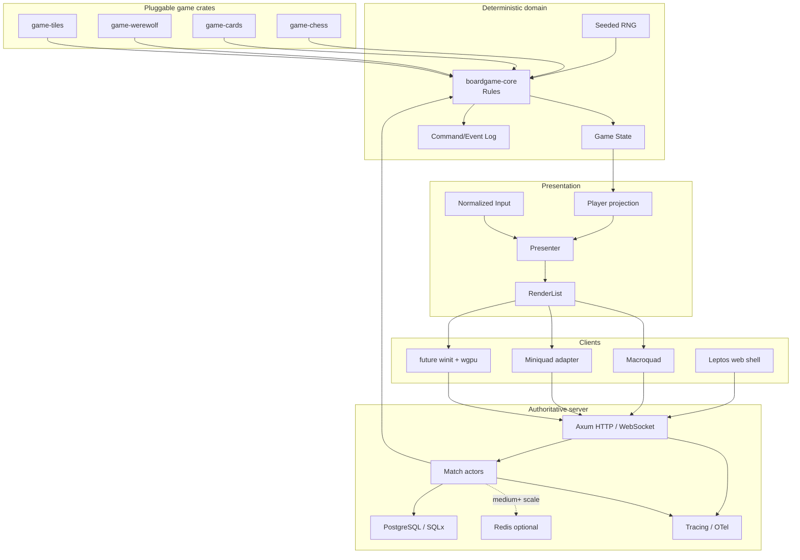
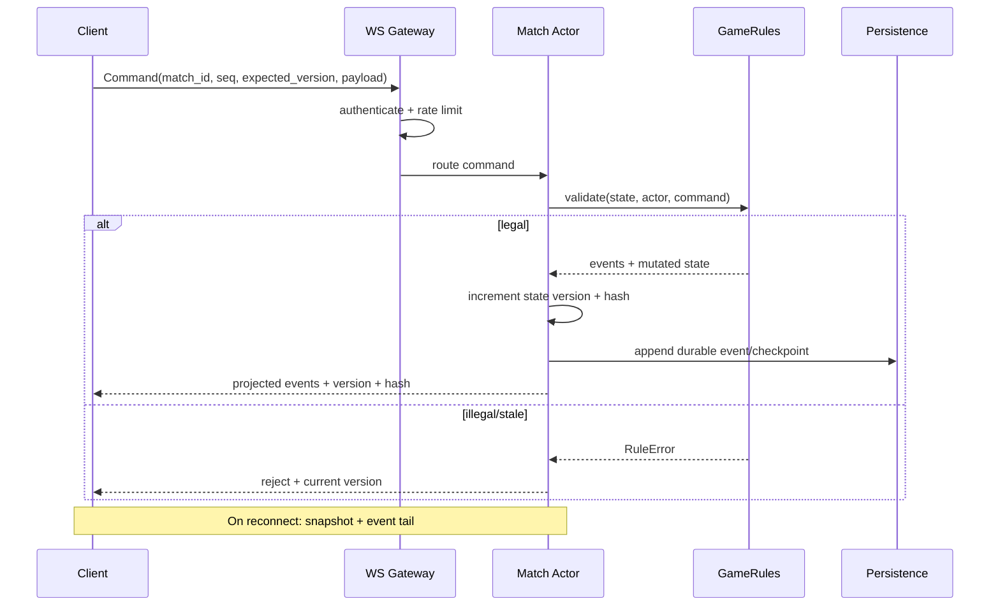
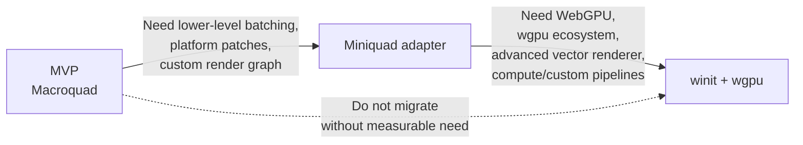
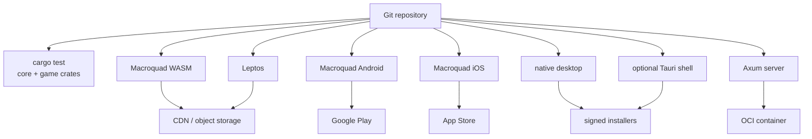
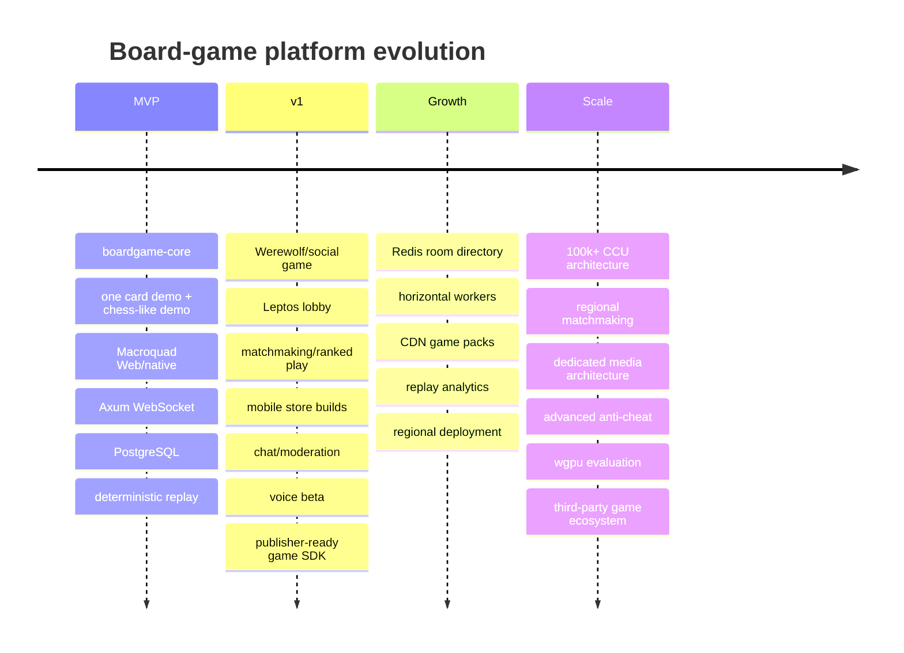

# Designing a Rust-First Cross-Platform Board-Game Platform

**Research date: August 28, 2026**

## Executive summary

For a platform whose dominant workloads are **cards, chess-like games, tile games, social-deduction games such as Werewolf, and visually rich 2D dashboards**, I would not build around a general-purpose ECS engine. I would build a **deterministic board-game runtime with rendering as an adapter**.

The recommended direction is:

```text
                    Rust workspace
                         │
              ┌──────────▼───────────┐
              │    boardgame-core    │
              │ rules/state/RNG/log  │
              │ NO renderer/network  │
              └──────────┬───────────┘
                         │
             ┌───────────┴────────────┐
             │                        │
       game modules              server runtime
   chess/cards/werewolf        Tokio + Axum
             │                 WebSocket + SQLx
             │                        │
             ▼                        │
     boardgame-presenter              │
             │                        │
       RenderList/Input               │
             │                        │
       ┌─────┴─────┐                  │
       ▼           ▼                  │
   Macroquad    Miniquad              │
    primary     fallback              │
       │                              │
 ┌─────┼─────────────┐                │
 ▼     ▼             ▼                │
WASM Android        iOS           Multiplayer
```

The choice of **Macroquad as the initial renderer is technically well aligned with this target**. Its current repository explicitly supports Windows/Linux/macOS, HTML5, Android and iOS, uses automatic geometry batching for 2D, includes a skinnable immediate-mode UI, keeps dependencies small, and builds its web version directly to `wasm32-unknown-unknown`. Its current `Cargo.toml` is version `0.4.16`, licensed `MIT OR Apache-2.0`, and pins Miniquad `0.4.11`, which confirms that Miniquad is not merely a conceptual alternative—it is literally the platform layer beneath Macroquad today. citeturn16search0turn19view1

Miniquad is an unusually good escape hatch because its explicit goals are low dependency depth, low-end-device support, hackability and forkability while supporting Windows, Linux, macOS, iOS, Android and WASM/WebGL. That makes the migration path **Macroquad → Miniquad** much less disruptive than switching between unrelated engines. citeturn16search1

I would therefore make this the strategic stack:

| Layer | Initial recommendation | Why |
|---|---|---|
| Rules/domain | **pure Rust `boardgame-core`** | deterministic, renderer-independent, server-authoritative |
| RNG | **`rand_chacha` with explicit seed/version** | deterministic replay; never rely on implicit global RNG |
| Serialization | **Serde + Postcard** | simple typed protocol and compact replay format |
| Game renderer | **Macroquad** | fastest path to Web + native mobile |
| Renderer fallback | **Miniquad** | control platform/GPU layer without replacing architecture |
| Long-term renderer | **winit + wgpu** | maximum ownership and WebGPU/Metal/Vulkan path |
| Web shell | **Leptos CSR/SSR** | lobby, account, store, chat history, settings, SEO pages |
| Desktop shell | **optional Tauri** | launcher/account/update/native integrations |
| Mobile | **native Macroquad first** | avoid putting the game unnecessarily inside a WebView |
| API/server | **Tokio + Axum** | HTTP + WebSocket; simple Rust-first operational model |
| Primary DB | **PostgreSQL + SQLx** | durable users/matches/payments/replay metadata |
| Ephemeral state | in process first, **Redis later** | presence, matchmaking, distributed room directory |
| Browser local data | **IndexedDB via Rexie** | offline preferences/cache/replay data |
| Native local data | **redb** or SQLite | local cache/settings/replays |
| Observability | `tracing` + OpenTelemetry | structured async tracing and vendor-neutral export |
| Voice | **WebRTC + Opus** | right transport/codec for interactive speech |
| TURN | **coturn initially** | mature open-source STUN/TURN server |
| Audio/SFX | Macroquad audio initially; **Kira/CPAL** when needed | separate game audio from voice capture |
| Testing | ordinary Rust tests + **proptest + nextest** | determinism/invariants are more important than graphical unit tests |

Serde provides Rust's trait-based serialization without runtime reflection; Postcard is a compact `no_std` Serde format; SQLx supports async PostgreSQL/MySQL/SQLite with connection pooling and compile-time checked query macros. `redb` is a pure-Rust, ACID embedded key-value database, while Rexie wraps browser IndexedDB for WASM. citeturn5search0turn5search22turn6search0turn6search1turn6search2

The most important architectural decision is **not Macroquad versus Miniquad**. It is this:

> **Neither renderer, the network protocol, the wall clock, nor the client owns the rules. `boardgame-core` owns the game.**

That one decision makes server validation, replay, spectators, bots, reconnects, mobile migration, anti-cheat, automated testing and eventual renderer replacement dramatically easier.

For Web UI, I recommend **Leptos as a sibling frontend rather than trying to turn Macroquad into a Leptos widget inside one WASM binary**. Leptos normally uses the `wasm-bindgen`/`web-sys` ecosystem, whereas Macroquad's documented web deployment still builds a raw WASM module loaded through its own `mq_js_bundle.js` and a `glcanvas`. Leptos can obtain an `HtmlCanvasElement` from a `NodeRef`, but that does not remove the difference in runtime/bootstrap model. citeturn19view0turn17search0turn22search5

A clean web deployment is consequently:

```text
/                     Leptos shell
/games                 Leptos catalog
/account               Leptos
/store                 Leptos

/play/<match-id>       Macroquad WASM application
                       + same Rust boardgame-core
```

Both applications share Rust **source crates and wire protocol**, not WASM linear memory.

For desktop, Tauri is useful when there is a meaningful desktop application shell—authentication, launcher, file integration, updater, notifications, store or a sophisticated dashboard. Tauri's architecture is an HTML/WebView frontend connected to Rust system code through message passing, and Tauri currently targets Linux, macOS, Windows, Android and iOS. citeturn0search22turn0search7

For **native mobile gameplay**, however, my recommendation is still direct Macroquad. Wrapping a native Macroquad renderer inside a Tauri/WebView-oriented lifecycle would create two platform/application abstractions without much value. Tauri mobile becomes interesting only if the product deliberately becomes **WebView-first** rather than native-renderer-first. This is an architectural recommendation inferred from the two projects' platform models. citeturn19view0turn0search22

## Platform architecture

The platform should follow a **functional-core / imperative-shell** model. Game rules should behave much more like an Elm/Redux reducer or deterministic state machine than an ECS.



**Canonical rules model.** A match should conceptually be:

```text
(State, Command, deterministic context)
                │
                ▼
             Rules
                │
        ┌───────┴────────┐
        ▼                ▼
   New State          Events
```

Animation is not state. A card flying from deck to hand is presentation. The canonical event might only be:

```text
CardDrawn {
    player: P2,
    card: C17,
}
```

The client decides how long the motion lasts, whether it uses a spring, whether particles appear, and whether an accessibility mode eliminates the animation.

This separation is particularly valuable for turn-based games because replay should reproduce **logical history**, not frame history.

A practical typed interface is:

```rust
use serde::{de::DeserializeOwned, Serialize};

pub trait GameRules: Send + Sync + 'static {
    type State: Clone + Serialize + DeserializeOwned + Send + Sync;
    type Command: Clone + Serialize + DeserializeOwned + Send + Sync;
    type Event: Clone + Serialize + DeserializeOwned + Send + Sync;
    type View: Clone + Serialize + DeserializeOwned + Send + Sync;
    type PlayerId: Copy + Eq + Send + Sync;

    fn initial_state(
        &self,
        setup: &GameSetup,
        rng: &mut DeterministicRng,
    ) -> Result<Self::State, RuleError>;

    fn validate(
        &self,
        state: &Self::State,
        actor: Self::PlayerId,
        command: &Self::Command,
    ) -> Result<(), RuleError>;

    fn apply(
        &self,
        state: &mut Self::State,
        actor: Self::PlayerId,
        command: Self::Command,
        ctx: &mut RuleContext<'_>,
    ) -> Result<Vec<Self::Event>, RuleError>;

    /// Security boundary: return only what this player may know.
    fn project(
        &self,
        state: &Self::State,
        viewer: Option<Self::PlayerId>,
    ) -> Self::View;
}

pub struct GameSetup {
    pub match_id: [u8; 16],
    pub protocol_version: u32,
}

pub struct RuleContext<'a> {
    pub rng: &'a mut DeterministicRng,
    /// Logical/game time supplied by the server, never wall-clock access
    /// from inside rule code.
    pub logical_time_ms: u64,
}
```

Use an **explicit, versioned deterministic RNG** such as a ChaCha generator from `rand_chacha`, seeded when the match is created. The rules crate should never call an ambient/random global source. citeturn7search0

For competitive card or tile games, store at minimum:

```text
match ID
game module ID
game module version
protocol version
initial configuration
RNG algorithm/version
RNG seed or seed commitment
ordered commands/events
periodic state hash
optional checkpoint snapshots
```

For games where revealing the shuffle seed during play would expose hidden information, retain it server-side and disclose it only after the match if a provable-fair mode is desired.

**Private information needs first-class architecture.** The authoritative state for Poker, card games or Werewolf must never simply be serialized and broadcast to every client. `project(state, viewer)` is a security boundary:

```text
Authoritative WerewolfState
        │
        ├── project(Alice) ──► AliceView
        │
        ├── project(Bob)   ──► BobView
        │
        └── project(Spec)  ──► SpectatorView
```

A malicious WASM client is easy to inspect. Therefore hiding a role with a CSS property or merely not drawing a card is not security; the secret must not reach that client at all.

**Pluggable games should initially mean compile-time Rust modules, not dynamic native libraries.** iOS and WASM impose enough packaging/runtime constraints that arbitrary dynamic library plugins create disproportionate complexity. A workspace registry is simpler:

```rust
pub trait GameDescriptor {
    fn id(&self) -> &'static str;
    fn display_name(&self) -> &'static str;
    fn protocol_version(&self) -> u32;
}

pub enum GameKind {
    Chess,
    Werewolf,
    Hearts,
    DemoDeckBuilder,
}
```

Later, a truly third-party mod ecosystem can execute untrusted game logic in a sandboxed server-side WASM runtime. That should be a separate product stage; it should not distort the MVP.

The renderer boundary should also be lower-level than `GameRules`, but higher-level than GPU calls. A **render command list** works better than leaking Macroquad's `Texture2D`, `Vec2` or `Camera2D` across the architecture:

```rust
#[derive(Clone, Copy, Debug)]
pub struct LogicalPoint {
    pub x: f32,
    pub y: f32,
}

#[derive(Clone, Copy, Debug)]
pub struct Rect {
    pub x: f32,
    pub y: f32,
    pub w: f32,
    pub h: f32,
}

pub enum DrawCommand<'a> {
    Clear {
        rgba: [f32; 4],
    },
    Sprite {
        texture: TextureId,
        src: Option<Rect>,
        dst: Rect,
        rotation: f32,
        tint: [f32; 4],
    },
    RoundedRect {
        rect: Rect,
        radius: f32,
        fill: [f32; 4],
    },
    Text {
        font: FontId,
        text: &'a str,
        position: LogicalPoint,
        size: f32,
        color: [f32; 4],
    },
    PushClip(Rect),
    PopClip,
}

pub struct RenderList<'a> {
    pub commands: Vec<DrawCommand<'a>>,
}

pub trait RenderBackend {
    type Error;

    fn resize(&mut self, viewport: Viewport);
    fn render(&mut self, list: &RenderList<'_>) -> Result<(), Self::Error>;
}
```

That abstraction makes migration:

```text
MacroquadBackend
       │
       ├──────────── later ───────────► MiniquadBackend
       │
       └──────────── much later ──────► WgpuBackend
```

instead of:

```text
Game code
   │
hundreds of direct Macroquad APIs
   │
rewrite everything
```

Input should receive the same treatment:

```rust
#[derive(Clone, Copy, Debug, PartialEq, Eq)]
pub enum PointerKind {
    Mouse,
    Touch,
    Pen,
}

#[derive(Clone, Copy, Debug, PartialEq, Eq)]
pub enum PointerPhase {
    Down,
    Move,
    Up,
    Cancel,
}

#[derive(Clone, Copy, Debug)]
pub struct PointerEvent {
    pub id: u64,
    pub kind: PointerKind,
    pub phase: PointerPhase,
    pub position: LogicalPoint,
    pub pressure: Option<f32>,
    pub timestamp_ms: u64,
}

pub trait InputSource {
    fn drain_pointer_events(&mut self, out: &mut Vec<PointerEvent>);
}
```

Macroquad already exposes touch input, and by default can simulate mouse events from touch, which is useful for getting a prototype working; however, a normalized pointer layer is preferable once gestures such as dragging cards, pinch-to-zoom and multi-touch appear. citeturn1search7

A server-client interaction should be a versioned command protocol:



The match actor processes one logical command at a time. That eliminates most rule-state races and maps naturally to board games, where a match usually has very low command frequency compared with an FPS.

The anti-cheat model then becomes structurally simple: **clients propose commands; servers decide outcomes**. Clients should not authoritatively shuffle decks, determine dice values, change clocks, assign Werewolf roles or resolve combat. A server can trust visual animation but not game state.

## Library and technology evaluation

The central distinction is between **domain technology** and **presentation technology**. A board-game platform should be willing to replace the latter without replacing the former.

| Technology | Best role here | Web/WASM | Android/iOS | Maturity / risk | License | Verdict |
|---|---|---:|---:|---|---|---|
| **Macroquad 0.4.x** | primary 2D game frontend | Excellent | Both officially listed | Established, compact API; ecosystem smaller than Bevy | MIT OR Apache-2.0 | **Start here** citeturn19view0turn19view1 |
| **Miniquad 0.4.x** | platform/GPU fallback | Excellent, WebGL | Both officially listed | Low-level; more code becomes yours | MIT OR Apache-2.0 | **Best escape hatch** citeturn16search1turn16search3 |
| **winit + wgpu** | future custom renderer | Web supported | Android/iOS supported | Large mature graphics foundation; much more engineering | permissive Rust ecosystem licenses | **Long-term option** citeturn7search2turn7search16 |
| **Leptos** | web lobby/account/store/dashboard | Excellent | Via WebView/wrapper rather than game-native renderer | Strong Rust web choice; adds separate WASM lifecycle | MIT | **Use outside game canvas** citeturn0search2turn22search18 |
| **Tauri** | desktop shell; optional mobile WebView app | Web frontend | Android/iOS supported | Mature shell, but architecture differs from Macroquad native | permissive | **Optional, not core** citeturn0search7turn0search22 |
| **egui/eframe** | debug tools/editor/native admin UI | Web | eframe documents Android; iOS less compelling | Actively developed, immediate-mode | MIT OR Apache-2.0 | Useful tooling, not primary product UI citeturn1search15 |
| **Axum + Tokio** | API/WebSocket backend | N/A | client-independent | Large Rust server ecosystem | MIT for Axum | **Recommended BE** citeturn15search3turn15search11 |
| **Serde + Postcard** | state/wire/replays | Yes | Yes | Mature Serde; compact Postcard | permissive | **Recommended** citeturn5search0turn5search22 |
| **SQLx + PostgreSQL** | durable backend data | server | server | Mature async DB approach | permissive | **Recommended** citeturn6search0 |
| **redb** | native embedded state | not browser storage | native | Pure Rust ACID KV | permissive | Good cache/replay store citeturn6search1 |
| **Rexie** | browser IndexedDB | Yes | N/A | Specialized but appropriate | permissive | Good browser store citeturn6search2 |
| **CPAL** | low-level audio I/O | WebAudio backend | native backends | Foundation-level library | permissive | Good for microphone/native audio citeturn4search4turn3search2 |
| **Rodio** | straightforward playback | where CPAL works | native | Mature high-level playback | permissive | Fine for non-complex SFX/music citeturn4search0 |
| **Kira** | game audio/mixing | backend-dependent | backend-dependent | Purpose-built game audio features | permissive | Prefer when audio grows complex citeturn3search5turn4search3 |
| **webrtc-rs** | Rust WebRTC server/native experimentation | not a replacement for browser WebRTC | requires validation per target | Promising/current, but browser boundary remains | MIT/Apache family | Server/signaling/media experimentation citeturn2search2turn2search10 |
| **proptest** | rules/property testing | core tests portable | core tests portable | mature property-testing model | MIT OR Apache-2.0 | **Highly recommended** citeturn5search15 |
| **cargo-nextest** | CI test execution | native test matrix | CI | first-class CI focus, per-test isolation | OSS | **Recommended CI tool** citeturn22search0turn22search19 |

The Macroquad/Miniquad relationship is especially valuable. Macroquad's current dependency list directly pins `miniquad = "=0.4.11"`; it additionally brings `glam`, `image`, `fontdue` and optional `quad-snd`, so you are already operating within the Miniquad family rather than committing to a completely different rendering lineage. citeturn19view1

**Migration should be driven by concrete pain, not architectural aesthetics.**



Macroquad is valuable while the abstraction is approximately:

```rust
draw_texture(...);
draw_text(...);
draw_rectangle(...);
```

Miniquad becomes attractive when you want explicit buffers, pipelines and platform ownership but still value its thin cross-platform layer. Miniquad explicitly identifies low-end support, hackability and forkability as goals. citeturn16search1

`winit + wgpu` is the end-state to consider only once the platform can justify maintaining its own 2D renderer. `wgpu` exposes Vulkan, Metal, Direct3D and OpenGL-family native backends while supporting WebGPU/WebGL paths in WASM; `winit` targets Windows, macOS, Linux, Android, iOS and Web. citeturn7search2turn7search5turn7search16

At that stage you own:

```text
sprite batching
texture atlases
glyph caching
font shaping
clip/scissor stack
render ordering
vector paths
shader pipeline
GPU resource lifecycle
surface recreation
DPI handling
device loss
WebGPU/WebGL fallback behavior
```

That is precisely why I would **not** start there.

**Asset management** should similarly begin small. Macroquad provides cross-platform file/texture/audio loading and has a helper to normalize asset paths between desktop and Android. citeturn16search2

I would add a project-level manifest:

```rust
pub struct AssetManifest {
    pub revision: String,
    pub textures: Vec<TextureAsset>,
    pub fonts: Vec<FontAsset>,
    pub audio: Vec<AudioAsset>,
}

pub struct TextureAsset {
    pub id: String,
    pub url: String,
    pub sha256: [u8; 32],
    pub width: u32,
    pub height: u32,
}
```

Small essential assets can ship with the application; game packs and high-resolution artwork can live behind a CDN/object store. Version assets independently from code so a 100 MB art update does not require replacing the WASM executable.

For **Material 3 Expressive-like design**, do not try to find a Rust crate that magically implements Google's entire system. Material's current M3 Expressive guidance emphasizes expressive color, motion, adaptive components, typography and contrasting shapes, with updated motion physics and token-driven design. citeturn14search6

Represent those concepts yourself:

```rust
pub struct Theme {
    pub colors: ColorScheme,
    pub typography: TypographyScale,
    pub shapes: ShapeScale,
    pub motion: MotionScheme,
    pub spacing: SpacingScale,
}

pub struct ShapeScale {
    pub small_radius: f32,
    pub medium_radius: f32,
    pub large_radius: f32,
    pub card_radius: f32,
}

pub struct MotionScheme {
    pub quick_ms: u32,
    pub standard_ms: u32,
    pub emphasized_ms: u32,
    pub spring: Spring,
}
```

Then have adapters:

```text
boardgame-theme
     │
     ├── theme-leptos   → CSS custom properties
     ├── theme-macroquad→ drawing/layout values
     └── theme-wgpu     → future vector renderer
```

For SVG/vector assets, `resvg` is a Rust SVG renderer designed to be small and portable, while `lyon` tessellates SVG-style paths into triangles suitable for a GPU renderer. Those are strong building blocks for icons, game symbols and future dynamic vector UI. citeturn14search0turn14search1

For Macroquad v1, however, prefer **SVG → optimized raster/atlas during the asset pipeline** for game pieces that do not need arbitrary scale. This keeps startup/runtime predictable on mobile and WASM. Retain SVG sources so Miniquad/wgpu versions can later use vector rendering directly.

Macroquad's included UI is explicitly immediate-mode, fully skinnable and configurable, which makes it suitable for debug panels, game HUDs, pause menus and simple in-game controls. citeturn14search19turn14search23

For accessibility-heavy elements such as:

```text
login
account
payments
game catalog
long chat
settings
privacy controls
publisher dashboard
```

Leptos/HTML is preferable on the web because semantic DOM controls have an accessibility model that a custom canvas renderer must otherwise rebuild.

Leptos supports both CSR and server-rendered/hydrated applications; `cargo-leptos` coordinates separate server and browser targets, and its deployment documentation supports containerized SSR deployments. citeturn22search6turn22search18turn22search3

The integration I recommend is therefore:

```text
              Browser
                 │
       ┌─────────┴──────────┐
       │                    │
 Leptos WASM/HTML      Macroquad WASM
 lobby/store/chat      actual game
       │                    │
       └─────────┬──────────┘
                 │
            shared WS/API
                 │
              Axum
```

Do not spend the first months trying to force these two WASM ecosystems into a single binary. Share **Rust crates**, not necessarily runtime instances.

## Multiplayer, audio, voice, persistence, and testing

Board-game networking is forgiving in throughput but demanding in **correctness**.

A shooter might tolerate a lost positional packet. A card game cannot tolerate:

```text
two DrawCard commands applied twice
a reconnect revealing an opponent's hand
two timer expirations
a duplicated purchase
a replay whose shuffle differs from the original
```

The wire protocol should therefore carry explicit sequence/version information:

```rust
#[derive(Serialize, Deserialize)]
pub struct ClientCommand<C> {
    pub match_id: MatchId,
    pub client_sequence: u64,
    pub expected_state_version: u64,
    pub command: C,
}

#[derive(Serialize, Deserialize)]
pub struct ServerUpdate<E, V> {
    pub state_version: u64,
    pub accepted_client_sequence: Option<u64>,
    pub events: Vec<E>,
    pub projected_state: Option<V>,
    pub state_hash: [u8; 32],
}
```

WebSocket is the right default transport because moves, presence, lobby updates and chat are naturally low-frequency bidirectional streams. Axum includes official WebSocket examples/support and fits naturally on Tokio. citeturn15search3turn15search11

Do not add UDP/QUIC merely because this is a game. For chess, cards or Werewolf, the operational simplicity of WebSocket is more valuable than shaving milliseconds from a move that occurs once every several seconds.

The server architecture can evolve without altering the game protocol:

```text
Small
Client → Axum → in-process Match Actor → PostgreSQL

Medium
Client → Gateway → Room Worker
                    │
                    ├→ PostgreSQL
                    └→ Redis room directory/presence

Large
Client → regional edge/gateway
              │
       regional matchmaker
              │
       sharded room workers
              │
       event/checkpoint storage
```

The official `redis` Rust client supports async Tokio operation, streams, clustering, reconnection and Sentinel-related interfaces, so Redis is a reasonable later component rather than something you need on day one. citeturn15search4turn15search28

At roughly **100 concurrent users**, an in-process match registry is sufficient and easier to reason about.

At roughly **5,000 concurrent users**, introduce independent room workers and a shared room/presence directory when horizontal scaling actually requires it.

At **100,000+ concurrent users**, region affinity, explicit room ownership, controlled migration/checkpointing and failure isolation matter more than picking a fashionable message broker.

Matchmaking itself is usually not computationally difficult. A useful queue key might be:

```text
(game, ruleset, region, mode, skill bucket, party size)
```

At small scale it can live in memory. At medium scale, Redis sorted sets/streams are reasonable primitives. citeturn15search4

**Voice should be a parallel media subsystem, never part of game-state networking.**

```text
                 Game traffic
Client ─────────────────────────► Axum/WebSocket
   │
   │             Voice
   └──── WebRTC / Opus ────────► Peer / SFU / TURN
```

Opus is exceptionally appropriate: RFC 6716 defines a bitrate range from 6 to 510 kbit/s, and the Opus project supports frame sizes from 2.5 to 60 ms. citeturn12search0turn12search4

For social voice, a sensible starting point is typically around **16–32 kbit/s codec bitrate**, with approximately 20 ms packets. The actual wire rate will be higher after RTP, SRTP, UDP/IP and transport overhead. A planning number around **40–60 kbit/s per delivered mono stream** is therefore safer than budgeting exactly the codec bitrate; this is an engineering estimate derived from Opus's documented operating range rather than a protocol guarantee. citeturn12search0turn12search4

For the web client:

```text
getUserMedia()
     ↓
browser WebRTC stack
     ↓
Opus
     ↓
ICE / STUN / TURN
```

Microphone access requires browser permission, while WebRTC exposes statistics that can be used to observe delay and packet-loss conditions. citeturn12search2turn12search9

For Rust servers, `webrtc-rs` is worth evaluating. Its current project provides a Rust WebRTC implementation and a Sans-I/O core, but the browser client still needs the browser's WebRTC APIs through JS/`web-sys`; `webrtc-rs` does not eliminate that boundary. citeturn2search2turn2search10

Consequently I would define a media abstraction:

```rust
#[async_trait::async_trait]
pub trait VoiceSession {
    async fn join(&mut self, room: VoiceRoomId) -> Result<(), VoiceError>;
    async fn leave(&mut self) -> Result<(), VoiceError>;
    async fn set_muted(&mut self, muted: bool) -> Result<(), VoiceError>;
    fn stats(&self) -> VoiceStats;
}
```

with platform implementations:

```text
WebVoice
  └── web_sys / browser RTCPeerConnection

NativeVoice
  ├── evaluate webrtc-rs
  └── fallback native WebRTC SDK bridge if necessary

Server
  ├── Rust signaling
  ├── coturn
  └── SFU/managed media when scale warrants it
```

For NAT traversal, TURN must be budgeted as a normal production requirement rather than an exceptional edge case. WebRTC's own documentation notes that commercial WebRTC services generally use TURN as part of ICE connectivity, and coturn is a free/open-source TURN/STUN implementation. citeturn20search7turn20search2

A game such as Werewolf may have 6–15 users in one room. Full peer-to-peer audio mesh can work at very small room sizes but increases each client's upload and connection count roughly with room size. An SFU is usually a more predictable production topology:

```text
             Alice
               │ one encoded stream
               ▼
             SFU
        ┌──────┼──────┐
        ▼      ▼      ▼
       Bob   Carol   Dan
```

You should **not write your own production SFU as part of the MVP**. Operate coturn yourself if desired, but use a proven SFU or a managed media provider once voice becomes business-critical. LiveKit, for example, supports both managed plans and self-hosting; its current pricing page lists entry plans beginning at $0, then $50/month and $500/month tiers, with media/data usage metered by time and transfer. citeturn11view0turn11view1

CPAL is a good foundation for native microphone/audio-device access and currently includes browser WebAudio support; its AudioWorklet path can target lower latency, though browser SharedArrayBuffer/atomics requirements introduce deployment-header considerations. citeturn4search4

Rodio is a higher-level playback layer over CPAL, while Kira provides more game-oriented concepts such as mixers, effects, clocks, spatial audio and tweened transitions. citeturn4search0turn3search5turn4search3

Therefore:

```text
MVP:
Macroquad/quad-snd for button clicks, card sounds, music

v1:
Kira or Rodio for richer game audio

Voice:
separate WebRTC path

Do NOT:
route voice microphone/audio packets through the game SFX engine
```

Macroquad's own audio feature is optional and based on `quad-snd`; the project's ecosystem has characterized it as a deliberately basic audio wrapper, so this is one subsystem I would expect to outgrow before the renderer. citeturn19view1turn1search8

**Persistence should use three different scopes.**

Canonical server data belongs in PostgreSQL/SQLx:

```text
users
identities
game_catalog
matches
match_players
match_checkpoints
replay_metadata
purchases/subscriptions
moderation
rankings
```

SQLx's pool and compile-time query facilities fit this conventional transactional workload. citeturn6search0turn6search8

Ephemeral distributed data—presence, matchmaking queues, session routing—can migrate to Redis once horizontal scaling requires it. citeturn15search4

Client-local storage should be abstracted:

```rust
#[async_trait::async_trait(?Send)]
pub trait LocalStore {
    async fn get(&self, key: &str) -> Result<Option<Vec<u8>>, StoreError>;
    async fn put(&self, key: &str, value: &[u8]) -> Result<(), StoreError>;
    async fn delete(&self, key: &str) -> Result<(), StoreError>;
}
```

Then:

```text
WASM       → Rexie / IndexedDB
native     → redb or SQLite
small prefs→ browser Web Storage if adequate
```

Rexie is specifically a Rust futures-oriented IndexedDB wrapper, while `redb` is a pure Rust ACID embedded database. citeturn6search2turn6search1

Testing should emphasize **mathematical invariants**, not screenshots.

For chess-like games:

```text
piece count changes only under legal capture/promotion rules
illegal moves leave state unchanged
replay(command log) == final state
```

For cards:

```text
deck + hands + discard preserves total card multiset
a card cannot exist in two zones
hidden projection never contains unauthorized card IDs
shuffle(seed) is reproducible
```

For Werewolf:

```text
one player cannot receive another player's private role view
dead players cannot perform living-player-only actions
vote counts equal accepted votes
same replay always produces same winner
```

`proptest` is a natural fit because it generates cases and shrinks failures, while `cargo-nextest` is designed as a CI-oriented Rust test runner with per-test process isolation. citeturn5search15turn22search0turn22search19

A particularly valuable CI test is:

```rust
#[test]
fn golden_replay_is_deterministic() {
    let replay = load_fixture("werewolf_001.replay");
    let final_a = run_replay(&replay);
    let final_b = run_replay(&replay);

    assert_eq!(canonical_hash(&final_a), canonical_hash(&final_b));
}
```

The rules crates should compile and test independently of Macroquad. That makes most of the test suite ordinary native Rust tests rather than browser tests.

For Leptos/browser-specific code, `wasm-bindgen-test` can execute Rust tests on the `wasm32-unknown-unknown` target, including browser-oriented testing through its runner. citeturn22search1turn22search11

## Build, deployment, DevOps, and scale

One repository can produce **different platform applications from shared crates**.



**WASM game build.** Macroquad's official flow remains pleasantly small:

```bash
rustup target add wasm32-unknown-unknown
cargo build \
  --release \
  --target wasm32-unknown-unknown \
  -p client-macroquad
```

The official web template currently uses a `<canvas id="glcanvas">`, loads `mq_js_bundle.js`, then loads the `.wasm` file. citeturn19view0

That is why the build should generate something like:

```text
dist/game/
├── index.html
├── boardgame.wasm
├── mq_js_bundle.js
└── assets/
```

and publish immutable hashed assets:

```text
/app/v1.8.3/boardgame-8a113f.wasm
/assets/cards-v42/atlas.webp
```

**Leptos web build.** For a CSR shell, Leptos documentation describes the client compiled to WASM; for full-stack SSR, `cargo-leptos` coordinates the server and hydrated browser targets. citeturn0search2turn22search6turn22search18

SSR makes sense for:

```text
marketing pages
game catalog
publisher pages
social-share previews
documentation
SEO
```

The authenticated app shell itself can remain CSR if operational simplicity matters more.

**Android.** Miniquad's documented Android workflow uses its `quad-apk` path and recommends Docker for reproducibility; Macroquad advertises single-command Android deployment on top of the same family. citeturn16search1turn16search0

CI should produce release AAB/APK artifacts from a pinned Android SDK/NDK environment rather than relying on arbitrary developer machines.

**iOS.** Macroquad documents an iOS simulator flow and links to provisioning guidance for physical devices. Real release distribution still belongs in a macOS/Xcode signing/archive pipeline. citeturn19view0

A practical CI matrix is:

| Job | Runner | Main work |
|---|---|---|
| `check` | Linux | format, clippy, unit/property tests |
| `server-test` | Linux | integration tests with PostgreSQL |
| `wasm-game` | Linux | Macroquad `wasm32-unknown-unknown` release |
| `leptos` | Linux | CSR/SSR web bundle |
| `android` | Linux | Android cross-build/package |
| `ios` | macOS | Rust target + Xcode archive/sign |
| `desktop-linux` | Linux | native client / Tauri |
| `desktop-windows` | Windows | executable/MSI/NSIS if Tauri |
| `desktop-macos` | macOS | native app/sign/notarization |

Tauri provides current documentation for Android/iOS development, Windows installers, macOS signing and CI-oriented workflows, so it is viable when a desktop/WebView shell is useful. citeturn0search3turn8search7turn8search11turn8search3

My preference remains:

```text
Web:
Leptos + Macroquad WASM

Android/iOS:
native Macroquad

Desktop casual game:
native Macroquad

Desktop "application":
Tauri shell + web UI,
possibly Macroquad WASM game route
```

Tauri's mobile plugin model can bridge Rust with Kotlin on Android and Swift on iOS, which becomes useful for purchases, notifications, platform authentication or other native APIs if you deliberately adopt Tauri's mobile shell. citeturn0search11

**Observability should exist from the MVP**, even if the collector is simple. The Rust `tracing` ecosystem provides structured, span-oriented diagnostics that are particularly appropriate to Tokio's asynchronous tasks, and `tracing-opentelemetry` connects those spans to OpenTelemetry-compatible systems. OpenTelemetry itself is vendor-neutral across traces, metrics and logs. citeturn15search2turn15search1turn15search25

Every command should be traceable via fields such as:

```text
request_id
user_id_hash
match_id
game_id
game_version
region
state_version
client_sequence
command_type
validation_result
command_latency
db_latency
websocket_session_id
```

Do **not** put private card identities, secret roles, raw voice data or chat text into generic telemetry.

At scale, the room worker is the natural unit for partitioning:

```text
hash(match_id)
      │
      ▼
room shard
```

A worker crash should lose at most the undurable tail after its latest append/checkpoint. For turn-based games, writing an event before acknowledging it is cheap enough to favor correctness over extreme throughput.

A useful operating model by scale is:

| Scale | Architecture | Persistence | Matchmaking | Ops expectation |
|---|---|---|---|---|
| **~100 CCU** | 1–2 Axum instances; room actors in memory | one PostgreSQL; R2/CDN | in process | simplest possible deployment |
| **~5k CCU** | several gateways/room workers | managed Postgres + replicas/backups | Redis directory/queues | horizontal deployment, metrics/SLOs |
| **100k+ CCU** | regional gateways + sharded room services | partitioned/replicated data model | regional service | multi-region failure strategy, capacity engineering |

These are architectural stages rather than hard connection limits; board-game CCU is relatively cheap because moves are low-frequency.

**Anti-cheat** should be handled through architecture before detection algorithms:

```text
server-authoritative rules
+
never send secrets
+
strict state versions
+
idempotent commands
+
server-owned clocks/RNG
+
rate limits
+
replay/audit log
+
post-match anomaly analysis
```

For ranked games, a replay log is simultaneously a debugging artifact, anti-cheat artifact and support artifact.

**Assets are an ideal CDN workload.** As of August 2026, Cloudflare R2 lists Standard storage at $0.015/GB-month, Class A operations at $4.50/million, Class B at $0.36/million, a 10 GB free storage tier, and no R2 egress charge. citeturn21search2

That makes artwork, audio packs, replay exports and immutable WASM bundles cheap relative to realtime compute.

## Licensing, IP, market demand, and economics

The market signal for online tabletop play is strong enough to justify the category without relying solely on consultancy forecasts.

Board Game Arena's owner Asmodee announced that the service passed **10 million registered users in August 2024**. Its current 2026 website advertises **more than 11 million opponents and roughly 1,347 board games**, with both real-time and turn-based play. citeturn21search1turn21search20

That is especially relevant because it validates several product assumptions in this architecture:

```text
browser-first access
large game catalog
real-time + asynchronous play
ranked competition
licensed commercial games
free users + paid membership
```

BGA's Premium model allows Premium users to create tables for Premium games while other players can join, demonstrating a useful **host-pays / friends-play** conversion mechanic. citeturn21search0turn21search3

Third-party market estimates should be treated much more cautiously. Recent research vendors place the online-board-game segment in the low-single-digit billions of U.S. dollars but disagree materially on both current size and growth rate; that makes them useful for direction rather than precise TAM valuation. citeturn9search3turn9search0

I would prioritize five monetization channels in this order:

| Model | Fit | Comments |
|---|---:|---|
| **Premium subscription** | Excellent | hosting premium tables, ranked features, advanced stats, cosmetics |
| **Licensed premium games / DLC** | Excellent | revenue share with publishers |
| **Cosmetics/themes** | Excellent | boards, card backs, avatars, emotes; does not compromise game fairness |
| **Publisher platform / white-label** | Strong B2B | digital adaptation, tournaments, analytics |
| **Advertising for free users** | Moderate | keep ads outside active turns/voice sessions |

For social games, paid private rooms, larger voice rooms or community moderation tools can also be subscription benefits.

I would avoid pay-to-win mechanics for chess/card-strategy communities. The category's trust and long-tail retention are better served by access, cosmetics, convenience and content.

Mobile storefront economics must be included in the model. Apple's current Small Business Program advertises a **15% commission** for qualifying paid apps and in-app purchases; Apple lists its developer membership at $99/year. citeturn20search0turn20search32

Google's fee structure became significantly more complicated in 2026, with rates depending on region, annual revenue, subscription/non-recurring purchase, install cohort and participation in newer programs. Current Google documentation shows rates in roughly the **10–25%** range for many of those combinations rather than a universal old “15%/30%” rule. citeturn20search5turn20search9turn20search25

Therefore a financial model should not hard-code:

```text
store_fee = 15%
```

It should use:

```text
gross revenue
- regional taxes
- payment/store fee by platform/program
- publisher royalty
- voice/infrastructure
- customer support/moderation
= contribution margin
```

**Copyright requires separating game mechanics from game expression.** In the United States, the Copyright Office states that the idea for a game, its title/name and its method of play are not themselves protected by copyright, while expressive rule text and graphic/artistic material can be protected. citeturn13search0

That does **not** mean “all board games can be cloned safely.” Names, logos and source-identifying branding can be protected by trademark, and the USPTO provides trademark registration/search mechanisms. citeturn13search27turn13search18

A safe content strategy is:

```text
Engine/runtime code
    ≠
Game implementation code
    ≠
Rulebook text
    ≠
Artwork/audio
    ≠
Game name/logo/trademark
```

Each should have explicit licensing metadata.

For classic public-domain games such as chess or Go, create original artwork, copy and branding rather than copying assets from a commercial implementation.

For modern published board games, obtain a digital license before using the title, commercial illustrations, proprietary rulebook text or branded components. BGA's catalog and Asmodee relationship demonstrate that **publisher licensing is itself a core business model** for a digital board-game platform. citeturn21search4turn21search1

For a framework you want others to adopt, a compelling licensing structure is:

```text
boardgame-core              MIT OR Apache-2.0
boardgame-render-*          MIT OR Apache-2.0
SDK/examples                MIT OR Apache-2.0

official commercial games   separate content licenses
art/audio packs             separate licenses
hosted backend              proprietary OR separately licensed
```

This also aligns with Macroquad and Miniquad, which currently use `MIT OR Apache-2.0`. citeturn19view1turn16search3

An AGPL server is an alternative if preventing closed hosted forks is strategically important; AGPL obligations can be triggered by modified software offered over a network, so that choice materially changes commercial adoption incentives. citeturn13search2

For a startup trying to attract external game developers and publishers, I would lean toward **permissive SDK/runtime licensing plus proprietary hosting/content services**, rather than AGPL'ing everything.

This is a product/engineering assessment, not jurisdiction-specific legal advice; modern licensed games should receive counsel-level IP clearance before launch.

**Operating costs are likely to be dominated by people and voice before they are dominated by board-game state traffic.**

The following are planning envelopes, not vendor quotes:

| Scenario | Game/API/DB/CDN, excluding voice | Voice impact | Likely total technical infra |
|---|---:|---:|---:|
| **100 CCU** | ~$30–150/mo | ~$0–300 | **~$30–450/mo** |
| **5k CCU** | ~$500–3k/mo | ~$500–10k depending adoption/provider | **~$1k–13k/mo** |
| **100k+ CCU** | ~$10k–60k/mo for multi-region HA/DB/observability | potentially tens of thousands+ | **~$20k–100k+/mo** |

These ranges assume low-frequency board-game commands, CDN-hosted static assets and progressively more redundancy at scale. They deliberately include large uncertainty because managed databases, regions, retention policy, DDoS protection, support requirements and voice usage can change the outcome by multiples.

Static content itself is cheap: R2's current storage and egress model makes hundreds of gigabytes of game assets comparatively inexpensive. citeturn21search2

Voice is different. As an illustrative capacity model, assume:

```text
25% of CCU currently in voice
6 users / voice room
1 active speaker at a time
~50 kbit/s delivered stream including overhead
30% speech duty cycle
```

An SFU that fans one active speaker to the other five users produces approximately:

| Total CCU | Average voice media egress under assumptions |
|---:|---:|
| 100 | ~0.10 TB/month |
| 5,000 | ~5.1 TB/month |
| 100,000 | ~101 TB/month |

This is a calculated planning model, not a measured provider bill. It illustrates why a game server can remain cheap while voice suddenly becomes a material bandwidth line item. Opus's wide operating bitrate range gives substantial room for tuning, but media fan-out still scales with recipients. citeturn12search0turn12search4

TURN adds another variable because relayed sessions send media through your relay rather than directly between peers; WebRTC's official guidance treats TURN as an expected connectivity component. citeturn20search3turn20search7

This makes a commercially sensible rollout:

```text
MVP
text chat only

         ↓

v1
small-room voice
coturn + managed/proven media

         ↓

scale
measure:
TURN ratio
voice CCU
speech duty cycle
packet loss
regional egress
cost per voice-hour

         ↓

only then decide
managed SFU vs self-hosted SFU
```

Do not optimize voice economics before measuring real adoption.

## Recommended repository and product roadmap

A workspace structured around domain ownership rather than platforms would look like:

```text
boardgame-platform/
│
├── Cargo.toml
├── rust-toolchain.toml
│
├── crates/
│   ├── boardgame-core/
│   │   ├── state.rs
│   │   ├── rules.rs
│   │   ├── command.rs
│   │   ├── event.rs
│   │   ├── rng.rs
│   │   ├── replay.rs
│   │   └── projection.rs
│   │
│   ├── boardgame-protocol/
│   │   ├── websocket.rs
│   │   ├── messages.rs
│   │   └── version.rs
│   │
│   ├── boardgame-presentation/
│   │   ├── render_list.rs
│   │   ├── input.rs
│   │   ├── gesture.rs
│   │   ├── animation.rs
│   │   └── layout.rs
│   │
│   ├── boardgame-theme/
│   │   ├── colors.rs
│   │   ├── typography.rs
│   │   ├── shape.rs
│   │   └── motion.rs
│   │
│   ├── renderer-macroquad/
│   ├── renderer-miniquad/
│   ├── renderer-wgpu/             # empty/experimental initially
│   │
│   ├── storage-api/
│   ├── storage-rexie/
│   ├── storage-redb/
│   │
│   └── voice-api/
│
├── games/
│   ├── chess/
│   │   ├── rules/
│   │   └── presentation/
│   │
│   ├── cards-demo/
│   └── werewolf/
│
├── apps/
│   ├── game-client-macroquad/
│   ├── web-leptos/
│   ├── desktop-tauri/             # optional
│   └── admin/
│
├── services/
│   ├── api/
│   ├── matchmaking/
│   └── worker/
│
├── assets/
│   ├── source-svg/
│   ├── fonts/
│   ├── audio/
│   └── manifests/
│
├── migrations/
├── tests/
│   ├── replays/
│   ├── protocol/
│   └── determinism/
│
├── deploy/
│   ├── docker/
│   ├── android/
│   ├── ios/
│   └── k8s/                       # do not use until needed
│
└── .github/
    └── workflows/
```

Notice what is deliberately absent from `boardgame-core`:

```text
macroquad
miniquad
wgpu
leptos
tauri
tokio
axum
postgres
websocket
audio
wall clock
platform APIs
```

That crate should be embarrassingly easy to test.

The roadmap should also resist infrastructure overbuilding:



An **MVP should contain at least two radically different games**.

Chess tests:

```text
grid board
drag pieces
legal moves
timers
spectators
replay
```

A card game tests:

```text
hidden information
hands/decks
shuffle RNG
animations
private projection
```

Werewolf then tests:

```text
rooms
roles
timers/phases
chat
moderation
voice
private/public communication
```

Those three together exercise nearly everything important about the platform.

Do not use a single chess implementation to validate the engine. Chess does not expose the hardest privacy and social-networking problems.

## Prioritized first eight weeks

The first two months should prove **determinism, cross-platform rendering and authoritative multiplayer** before adding a large catalog or Kubernetes.

| Week | Primary goal | Concrete output | Exit criterion |
|---|---|---|---|
| **Week 1** | Domain contract | `boardgame-core`, `GameRules`, commands/events, seeded RNG, replay format | core compiles with zero renderer/server deps |
| **Week 2** | Rendering boundary | `RenderList`, `InputSource`, Macroquad backend, theme tokens | same presenter runs desktop + WASM |
| **Week 3** | First games | mini chess + card/deck demo | property tests and golden replays pass |
| **Week 4** | Multiplayer | Axum/WebSocket server, authoritative room actor, reconnect/versioning | two browsers play one match reliably |
| **Week 5** | Mobile | Android + iOS build pipelines, touch/drag/pinch QA | same game state/rules on Web + Android + iOS |
| **Week 6** | Product shell | Leptos lobby/account/catalog, PostgreSQL/SQLx, auth boundary | lobby launches Macroquad match route |
| **Week 7** | Social game | Werewolf prototype, hidden projections, phases/chat; WebRTC spike | no private role leaks; voice feasibility measured |
| **Week 8** | Production baseline | CI matrix, telemetry, R2/CDN assets, backups, load/reconnect tests | reproducible release + 100 simulated concurrent users |

The work inside those weeks should be prioritized by risk.

**Highest priority:** prove the deterministic core and replay model. If this is wrong, every game and server feature becomes harder.

**Next:** prove that **one presentation crate** can run through Macroquad on WASM and native mobile without domain code importing Macroquad types. Macroquad currently supports all of those targets, but Android/iOS deployment must be demonstrated in your own CI—not merely assumed from the support matrix. citeturn16search0turn16search1

**Next:** prove hidden-information projection with the card demo before writing Werewolf. Security failures in board games usually come from state architecture rather than sophisticated memory exploits.

**Next:** integrate Leptos as the product shell. Leptos supports CSR, SSR and hydration, but keeping it separate from the Macroquad runtime removes a large integration risk. citeturn22search9turn22search18

**Then:** test WebRTC rather than committing to a media stack. Browser WebRTC, `webrtc-rs`, native mobile behavior, microphone permissions, TURN ratios and background/audio lifecycle need empirical validation. WebRTC expects STUN/TURN support for robust connectivity, and coturn provides the open-source relay layer needed for that experiment. citeturn20search2turn20search7

**Only after that** add Redis, distributed matchmaking or orchestration. PostgreSQL plus a few Rust processes is enough to learn almost everything the first product needs.

The CI quality gate from week eight should resemble:

```text
cargo fmt --check
        │
        ▼
cargo clippy --workspace
        │
        ▼
cargo nextest run --workspace
        │
        ├── property tests
        ├── replay determinism
        ├── protocol tests
        └── server integration
        │
        ▼
build Macroquad WASM
        │
        ▼
build Leptos
        │
        ▼
build Android
        │
        ▼
build iOS
        │
        ▼
smoke tests
        │
        ▼
signed/staged release
```

`cargo-nextest` is designed for CI-oriented Rust test execution, while WASM-specific code can use the `wasm-bindgen-test` tooling where appropriate. citeturn22search0turn22search1

The final technology stance is therefore deliberately conservative:

> **Macroquad should be the implementation choice, but it should not become the architecture.**
>
> **Miniquad should be the escape hatch, but you should not pay its low-level engineering cost until Macroquad limits you.**
>
> **winit + wgpu should be viewed as a strategic endpoint, not an MVP dependency.**
>
> **Leptos should own web application UI; Macroquad should own the game canvas.**
>
> **Tauri should be optional packaging/integration infrastructure, not a prerequisite for gameplay.**
>
> **Rust `boardgame-core` should be the product's real platform.**

That shape is particularly well matched to online board games because the valuable reusable asset is not a renderer. It is the combination of **deterministic rules, hidden-information projection, replay, multiplayer room semantics, input/presentation primitives, and a game-module SDK**. Rendering technology can then evolve from Macroquad through Miniquad to wgpu without forcing chess, cards, Werewolf, matchmaking or server validation to evolve with it.